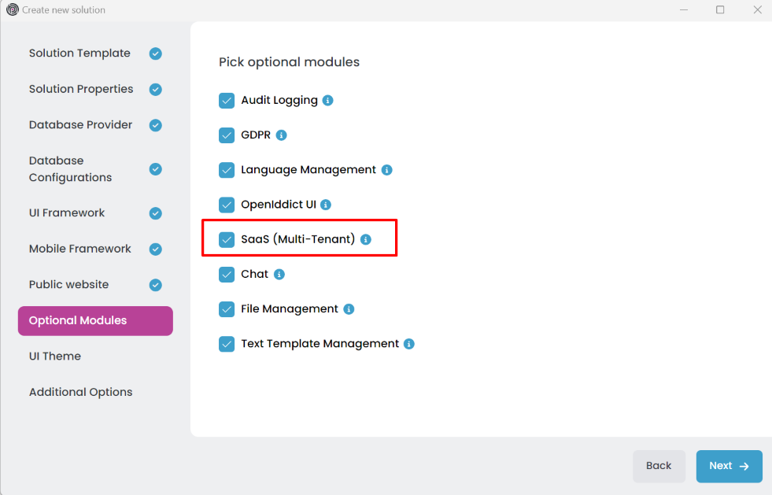

# Microservice Solution: Multi-Tenancy

````json
//[doc-nav]
{
  "Next": {
    "Name": "BLOB storing in the Microservice solution",
    "Path": "solution-templates/microservice/blob-storing"
  }
}
````

> You must have an ABP Business or a higher license to be able to create a microservice solution.

Multi-tenancy is a software architecture where a single instance(codebase) of software runs on a server and serves multiple tenants. Tenants are isolated from each other and can have their own data, configurations, and users. This document explains how the multi-tenancy mechanism works in the microservice solution template. You can learn more about multi-tenancy in the [Multi-Tenancy](../../framework/architecture/multi-tenancy/index.md), [Tenant Management](../../modules/tenant-management.md) and [SaaS](../../modules/saas.md) documents.

## Multi-Tenancy in Microservice Solutions

The microservice solution templates use the *Multi-Tenancy* architecture only if you check the SaaS (Multi-Tenant) option while creating the solution.



You can use different databases for each tenant or a shared database for all tenants. In the *SaaS* module, you can specify the database connection strings in the [Connection Strings Management Modal](../../modules/saas.md#connection-string). All cached data is isolated by tenant. Each event, background job, and other data is stored with the tenant id.

You can use the `ICurrentTenant` service to get the current tenant information in your application.

```csharp
public class MyService : ITransientDependency
{
    private readonly ICurrentTenant _currentTenant;

    public MyService(ICurrentTenant currentTenant)
    {
        _currentTenant = currentTenant;
    }

    public void MyMethod()
    {
        var tenantId = _currentTenant.Id;
        var tenantName = _currentTenant.Name;
    }
}
```

Additionally, you can use the [DataFilter](../../framework/infrastructure/data-filtering.md#idatafilter-service-enabledisable-data-filters) system to disable the tenant filter and list all data in the same database.

```csharp
    public class MyBookService : ITransientDependency
    {
        private readonly IDataFilter<IMultiTenant> _multiTenantFilter;
        private readonly IRepository<Book, Guid> _bookRepository;

        public MyBookService(
            IDataFilter<IMultiTenant> multiTenantFilter,
            IRepository<Book, Guid> bookRepository)
        {
            _multiTenantFilter = multiTenantFilter;
            _bookRepository = bookRepository;
        }

        public async Task<List<Book>> GetAllBooksIncludingDeletedAsync()
        {
            //Temporary disable the IMultiTenant filter
            using (_multiTenantFilter.Disable())
            {
                return await _bookRepository.GetListAsync();
            }
        }
    }
```