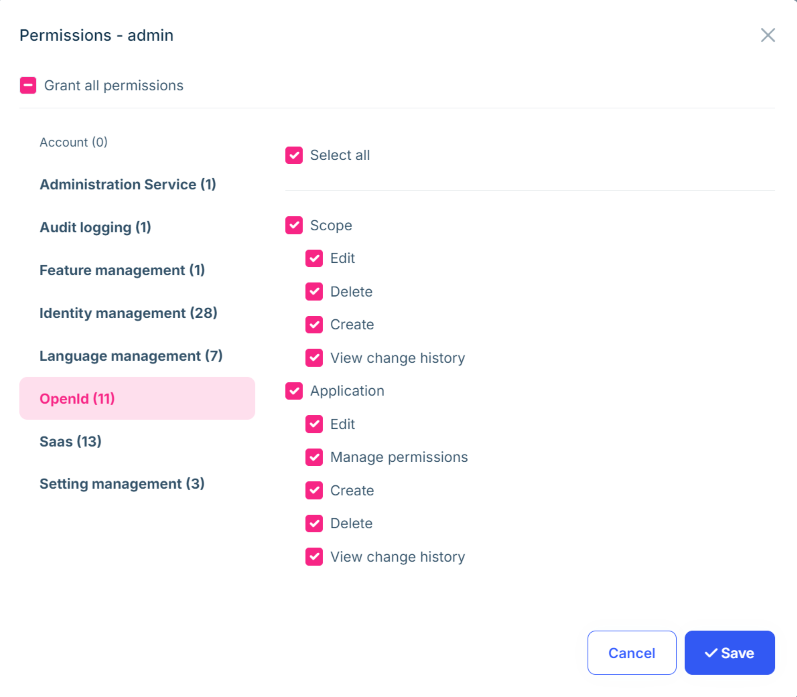

# Microservice Solution: Permission Management

````json
//[doc-nav]
{
  "Next": {
    "Name": "Feature management in the Microservice solution",
    "Path": "solution-templates/microservice/feature-management"
  }
}
````

> You must have an ABP Business or a higher license to be able to create a microservice solution.

The *Administration* microservice is responsible for managing permissions. It is used by all the services and applications in the solution. This document explains how permission management works in the microservice solution.

When we send a request to `/api/abp/application-configuration`, the gateway application forwards the request to the *Administration* microservice. The *Administration* microservice returns the application configuration, which includes the granted policies (permissions) for the current user. You can see the details of the application configuration here: [Application Configuration](../../framework/api-development/standard-apis/configuration.md). 

Since [Permission Management](../../modules/permission-management.md) is a fundamental feature module, each microservice depends on the *Volo.Abp.PermissionManagement.EntityFrameworkCore* (or *Volo.Abp.PermissionManagement.MongoDB*) package. These modules provide the necessary infrastructure (such as `IPermissionStore`) to check permissions. Additionally, the *Administration* microservice depends on the *Volo.Abp.PermissionManagement.Application*, *Volo.Abp.PermissionManagement.HttpApi*, *Volo.Abp.PermissionManagement.Domain.OpenIddict*, and *Volo.Abp.PermissionManagement.Domain.Identity* packages to manage (grant or revoke) permissions.

## Permission Management

The *Administration* microservice provides a set of APIs to manage permissions. Every microservice [defines](../../framework/fundamentals/authorization.md) its own permissions. When a microservice starts, it registers its permissions to the related permission definition tables if `SaveStaticPermissionsToDatabase` option is true for `PermissionManagementOptions`. Since the default value is true, this behavior is ensured. After that, you can see the permissions from the [Permission Management Dialog](../../modules/permission-management.md#permission-management-dialog) for related provider such as *User*, *Role* or *Client (OpenIddict Applications)*.



When you define a new permission to a microservice, you need to restart the related microservice to register the new permission to the permission definition tables. However, after the permission definition is registered, the *admin* role does not have the permission by default. This is because only the *Administration* microservice tries to seed the permissions to the *admin* role. So, new permissions are not granted to the *admin* role automatically. You need to grant the new permissions to the *admin* role manually, or when the *Administration* service is restarted, it will grant the new permissions to the *admin* role automatically.

> If you want to grant the new permissions to the *admin* role automatically, you can create a [data seeder](../../framework/infrastructure/data-seeding.md) and use the `IPermissionDataSeeder` service. For example, the *Identity* microservice uses this approach because when the first admin user logs in, they should be able to edit users and roles. You can see the details in the `IdentityServiceDataSeeder` class in the *Identity* microservice.

## Administration Service Permission Management Option

`SaveStaticPermissionsToDatabase` default value is true and it is used to save the static permissions to the database. Each microservice already adds their permission definitions to the related table. However, there is also another option `IsDynamicPermissionStoreEnabled`, which is used to enable the dynamic permission store. We need to enable this option only for the *Administration* microservice, because the *Administration* microservice is the only service that manages the permissions. All other services and applications use their own permission definitions and do not need to know others' permissions.

You can see this option in the `ConfigurePermissionManagement` method of the *Administration* microservice module:

```csharp
private void ConfigurePermissionManagement()
{
    Configure<PermissionManagementOptions>(options =>
    {
        options.IsDynamicPermissionStoreEnabled = true;
    });
}
```

## Creating a New Permission

You can define new permissions in the *MicroservicenamePermissionDefinitionProvider* in the *Contracts* project for the related microservice. For example, the *Identity* microservice has a *IdentityServicePermissionDefinitionProvider* class. You can see the details in the *Identity* microservice.

```csharp
public class IdentityServicePermissionDefinitionProvider : PermissionDefinitionProvider
{
    public override void Define(IPermissionDefinitionContext context)
    {
        //var myGroup = context.AddGroup(IdentityServicePermissions.GroupName);
    }

    private static LocalizableString L(string name)
    {
        return LocalizableString.Create<IdentityServiceResource>(name);
    }
}
```

> Since identity related permissions comes from [Identity](../../modules/identity-pro.md) module, there is no need to define new permissions. However, you can add new permissions to the *Identity* microservice if you need.