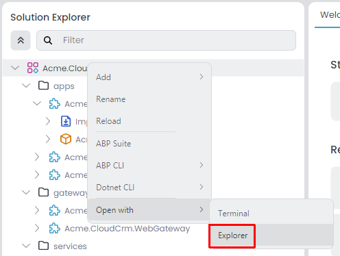
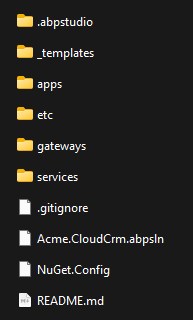

# Microservice Solution: The Structure

````json
//[doc-nav]
{
  "Next": {
    "Name": "Main Components",
    "Path": "solution-templates/microservice/main-components"
  }
}
````

> You must have an ABP Business or a higher license to be able to create a microservice solution.

This document explains the solution and folder structure of ABP Studio's [microservice solution template](index.md).

> This document assumes that you've created a new microservice solution by following the *[Quick Start: Creating a Microservice Solution with ABP Studio](../../get-started/microservice.md)* guide.

## Understanding the ABP Solution Structure

When you create a new microservice solution, you will see a tree structure similar to the one below in the *Solution Explorer* panel:


Each leaf item (e.g. `Acme.CloudCrm.IdentityService`, `Acme.CloudCrm.Web`, `Acme.CloudCrm.WebGateway`...) in the tree above is an **ABP Studio module**. An ABP Studio module can be a web application, an API gateway, a microservice, a console application or whatever .NET allows you to build. They are grouped into **folders** (`apps`, `gateways` and `services`) in that solution.

**Each ABP Studio module has a separate .NET solution**; this allows your team to develop them individually, in keeping with the nature of the microservices architecture.

> Refer to the *[Concepts](../../studio/concepts.md)* document for a full definition of ABP Studio solution, module and package terms.

## Exploring the Folder Structure

You can right-click the root item in the solution explorer (`Acme.CloudCrm` for this example) and select the *Open with* -> *Explorer* command to open the folder containing the solution in your file system:



The root folder of the solution will be similar to the following:



The folder structure basically matches to the solution in ABP Studio's *Solution Explorer*:

* `.abpstudio` folder contains your personal preferences for this solution and it is not added to your source control system (Git ignored). It is created and used by ABP Studio.
* `app` folder contains the applications that has a UI and typically used by the end users of your system.
* `etc` folder contains some additional files for the solution. It has the following sub-folders:
  * `abp-studio` folder contains settings that are managed by ABP Studio. This folder is added to your source control system and shared between developers.
  * `docker` folder contains docker-compose configuration to easily run infrastructure dependencies (e.g. RabbitMQ, Redis) of the solution on your local computer.
  * `helm` folder contains all the Helm charts and related scripts to deploy the solution to Kubernetes.
  * `k8s` folder contains some additional files to setup *Kubernetes Dashboard* on your local machine.
* `gateways` folder contains one or more API Gateways (the count depends on if you've selected mobile application or other applications if available). This solution implements the [BFF](https://learn.microsoft.com/en-us/azure/architecture/patterns/backends-for-frontends) (Backend for frontend pattern), that means it has a dedicated API Gateway for each different UI application.
* `services` folder contains the microservices. The microservice count varies based on the options you've selected during the solution creation. However, the following microservices are always included:
  * `administration` microservice is used to manage permissions, languages and other fundamental settings of the system.
  * `identity` microservice is used to manage users, roles and their permissions. It basically serves to the [Identity](../../modules/identity.md) module's UI (and [OpenIddict](../../modules/openiddict.md) module's UI, if selected).