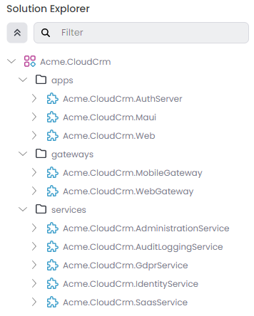
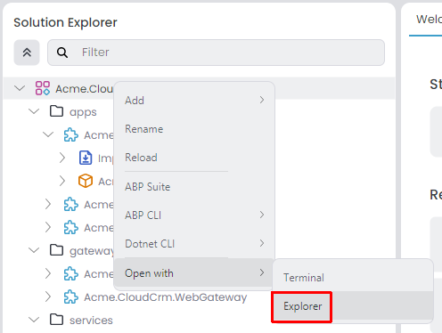
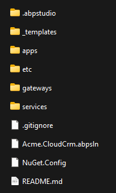

```json
//[doc-seo]
{
    "Description": "Explore the folder structure of ABP Studio's modern microservice solution template, including its React apps, gateways, and services."
}
```

# Microservice Solution: The Structure

````json
//[doc-nav]
{
  "Next": {
    "Name": "Main Components",
    "Path": "solution-templates/microservice/main-components"
  }
}
````

> You must have an ABP Business or a higher license to be able to create a microservice solution.

This document explains the solution and folder structure of ABP Studio's [microservice solution template](index.md).

> This document assumes that you've created a new microservice solution by following the *[Quick Start: Creating a Microservice Solution with ABP Studio](../../get-started/microservice.md)* guide.

The current modern template uses React-based web applications. Older MVC, Angular, Blazor, and MAUI web app layouts are not part of this structure.

## Understanding the ABP Solution Structure

When you create a new microservice solution, you will see a tree structure similar to the one below in the *Solution Explorer* panel:



Each leaf item in the tree above is an **ABP Studio module**. They are grouped into **folders** (`apps`, `gateways` and `services`) in that solution.

The .NET-based modules, such as `auth-server`, gateways, and backend services, keep their own .NET solution structure. Frontend applications such as `react`, `react-admin-console`, and `react-public-web` live in their own frontend folders.

> Refer to the *[Concepts](../../studio/concepts.md)* document for a full definition of ABP Studio solution, module and package terms.

## Exploring the Folder Structure

You can right-click the root item in the solution explorer (`Acme.CloudCrm` for this example) and select the *Open with* -> *Explorer* command to open the folder containing the solution in your file system:



The root folder of the solution will be similar to the following:



The folder structure basically matches to the solution in ABP Studio's *Solution Explorer*:

* `.abpstudio` folder contains your personal preferences for this solution and it is not added to your source control system (Git ignored). It is created and used by ABP Studio.
* `apps` folder contains the applications of the solution:
  * `auth-server` is the authentication server based on OpenIddict.
  * `react` is the main React SPA when the web UI is enabled.
  * `react-admin-console` is the dedicated administration SPA when the web UI is enabled.
  * `react-public-web` is the optional public-facing site.
  * `mobile/react-native` is the optional mobile application.
* `etc` folder contains some additional files for the solution. It has the following sub-folders:
  * `abp-studio` folder contains settings that are managed by ABP Studio. This folder is added to your source control system and shared between developers.
  * `docker` folder contains docker-compose configuration to easily run infrastructure dependencies (e.g. RabbitMQ, Redis) of the solution on your local computer.
  * `helm` folder contains all the Helm charts and related scripts to deploy the solution to Kubernetes.
  * `scripts` folder contains helper scripts for initializing and running the solution.
* `gateways` folder contains one or more API Gateways. This solution implements the [BFF](https://learn.microsoft.com/en-us/azure/architecture/patterns/backends-for-frontends) pattern, so it has a dedicated API Gateway for each different client type:
  * `web` is the gateway for `react`.
  * `public` is the gateway for `react-public-web`, when the public website is enabled.
  * `mobile` is the gateway for the React Native application, when mobile is enabled.
* `services` folder contains the microservices. The microservice count varies based on the options you've selected during the solution creation. However, the following microservices are always included:
  * `administration` microservice manages permissions, settings, features, and other operational capabilities used by the solution.
  * `identity` microservice manages users, roles, and related identity/OpenIddict endpoints used by the web applications.
