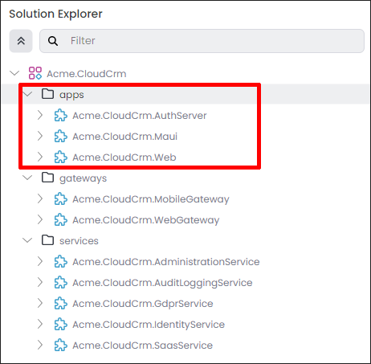
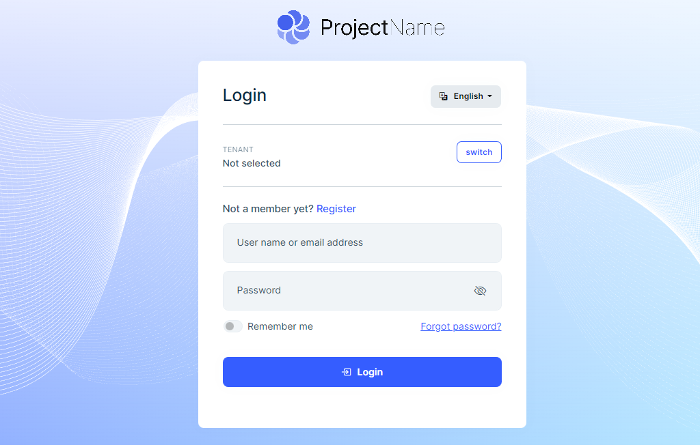
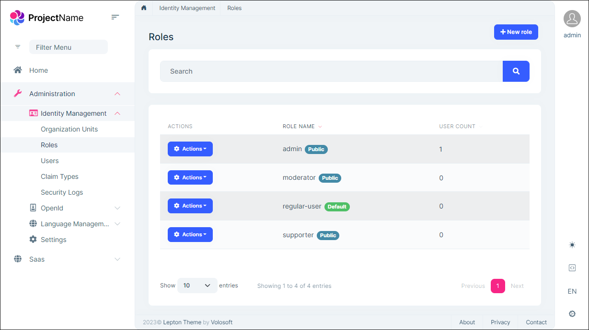

# Microservice Solution: Web Applications

````json
//[doc-nav]
{
  "Next": {
    "Name": "Mobile applications in the Microservice solution",
    "Path": "solution-templates/microservice/mobile-applications"
  }
}
````

> You must have an ABP Business or a higher license to be able to create a microservice solution.

The ABP Studio microservice solution template contains a few web applications. These applications are fully integrated to the solution, uses the [microservices](microservices.md) through the [API gateways](api-gateways.md). 

The following figure shows the application in the *[Solution Explorer](../../studio/solution-explorer.md)* pane of ABP Studio:




Count and types of the web applications depends on the options you've selected while [creating your solution](../../get-started/microservice.md). This document introduces and explains all the pre-built web applications included in the microservice solution template. 

## AuthServer

`Acme.CloudCrm.AuthServer` is the authentication server of the system. It is always included in the solution. It is a single-sign-on point, which means all the applications are using it for user login. Once users login via an application, they don't need to enter credentials (username, password) again for the other applications in the same browser, until they logout from one of the applications.

The `AuthServer` application is also used by microservices as Authority for JWT Bearer Authentication.

> You normally do not directly browse this application. It is used by the other applications to authenticate the users and applications..

The following screenshot was taken from the *Login* page of the [Account](../../modules/account.md) module in the application's UI:



That application is mainly based on the [OpenIddict](../../modules/openiddict.md), the [Identity](../../modules/identity.md), and the [Account](../../modules/account.md) modules. So, it basically has login, register, forgot password, two factor authentication and other authentication related pages.

## The Main Web Application (optional)

This is the main web application of the solution. It uses the `Acme.CloudCrm.AuthServer` application as the [API gateway](api-gateways.md). It also uses the Authentication Server application to make users login.

The following screenshot was taken from the *Role Management* page of the [Identity](../../modules/identity.md) module in the web application's UI:



The following options are provided while [creating the solution](../../get-started/microservice.md):

* MVC / Razor Pages UI
* Angular
* Blazor WebAssembly
* Blazor Server
* MAUI Blazor (Hybrid)

The following sections explain each of these UI types.

### MVC / Razor Pages Web Application

`Acme.CloudCrm.Web` module is created if you've selected the MVC / Razor Pages UI while creating the solution. It has own .NET solution that is located under the `apps/web` folder of the solution root.

### Angular Web Application

If you've selected the Angular UI while creating your solution, a folder named `angular` is included in the `apps` folder of the solution. That folder contains the main web application of the solution that is implemented using Angular.

### Blazor WebAssembly Web Application

If you've selected the Blazor WebAssembly UI while creating your solution, `Acme.CloudCrm.Blazor` project is included in the `apps` folder of the solution. That folder contains the main web application of the solution that is implemented using Blazor WebAssembly.

### Blazor Server Web Application

If you've selected the Blazor Server UI while creating your solution, `Acme.CloudCrm.Blazor` project is included in the `apps` folder of the solution. That folder contains the main web application of the solution that is implemented using Blazor Server.

### MAUI Blazor (Hybrid) Web Application

If you've selected the MAUI Blazor (Hybrid) UI while creating your solution, `Acme.CloudCrm.MauiBlazor` project is included in the `apps` folder of the solution. That folder contains the main desktop application of the solution that is implemented using MAUI Blazor (Hybrid) that uses existing Blazor UI Implementation.
