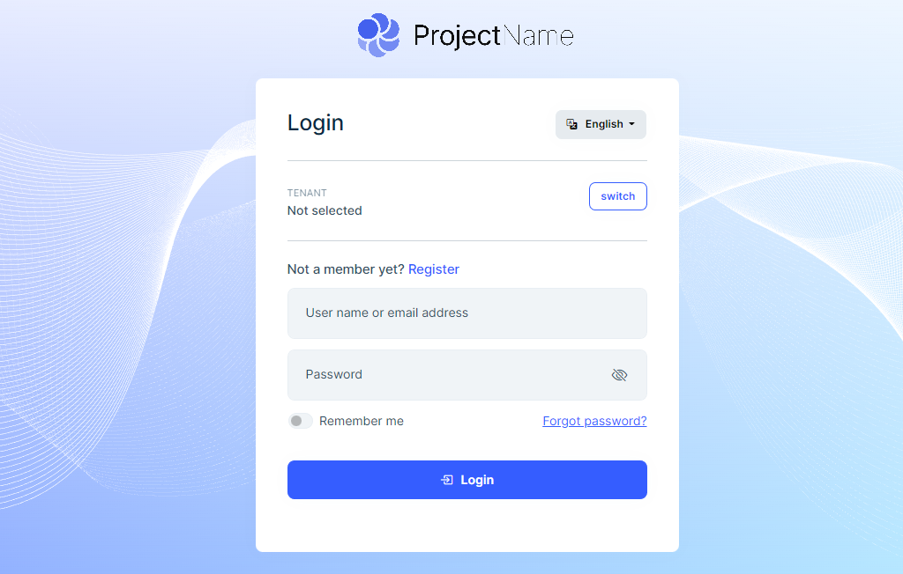

```json
//[doc-seo]
{
    "Description": "Explore the web applications in ABP Studio's modern microservice solution template, including react, react-admin-console, react-public-web, and AuthServer."
}
```

# Microservice Solution: Web Applications

````json
//[doc-nav]
{
  "Next": {
    "Name": "Mobile applications in the Microservice solution",
    "Path": "solution-templates/microservice/mobile-applications"
  }
}
````

> You must have an ABP Business or a higher license to be able to create a microservice solution.

The current ABP Studio microservice solution template uses React-based web applications. These applications are fully integrated to the solution and use the [microservices](microservices.md) through the [API gateways](api-gateways.md).

Count and type of the web applications depend on the options you've selected while [creating your solution](../../get-started/microservice.md). This document introduces the pre-built web applications included in the current modern microservice template.

## AuthServer

`Acme.CloudCrm.AuthServer` is the authentication server of the system. It is always included in the solution. It is a single-sign-on point, which means all the applications are using it for user login. Once users login via an application, they don't need to enter credentials (username, password) again for the other applications in the same browser, until they logout from one of the applications.

The `AuthServer` application is also used by microservices as Authority for JWT Bearer Authentication.

> You normally do not directly browse this application. It is used by the other applications to authenticate users and applications.

The following screenshot was taken from the *Login* page of the [Account](../../modules/account.md) module in the application's UI:



That application is mainly based on the [OpenIddict](../../modules/openiddict.md), the [Identity](../../modules/identity.md), and the [Account](../../modules/account.md) modules. So, it basically has login, register, forgot password, two factor authentication and other authentication related pages.

## `react`

`apps/react` is the main authenticated React SPA of the solution. It talks to backend services through the `web` [API gateway](api-gateways.md) and uses `AuthServer` for user login.

This application is the main user-facing web UI for the solution. In the generated route configuration, it can also deep-link users to the separate `react-admin-console` application for operational and administration tasks.

If you choose `No UI` while creating the solution, ABP Studio doesn't generate `apps/react`.

## `react-admin-console`

`apps/react-admin-console` is the dedicated administration SPA. It uses the `/admin-console/` base path and focuses on back-office and operational capabilities such as:

* account management
* users, roles, claim types, and organization units
* tenants and editions
* OpenIddict applications and scopes
* settings, audit logs, and optional module UIs

The route list is filtered by backend permissions and by which backend modules are actually available.

## `Volo.Abp.AdminConsole` Backend Role

`Volo.Abp.AdminConsole` is the backend-side companion for the admin console when you host it from an ASP.NET Core application. It is responsible for:

* serving the admin console under `/admin-console`
* exposing runtime configuration from `/admin-console/api/config`
* exposing module discovery from `/admin-console/api/modules`
* applying branding, theme, localization, and customization settings for the admin console
* optionally redirecting `/` to `/admin-console`

The standalone `react-admin-console` app follows the same `/admin-console` route and OIDC conventions, so the frontend and backend pieces stay aligned.

## `react-public-web`

When you enable the *Public Website* option, ABP Studio creates `apps/react-public-web`. This is a separate public-facing React application behind the `public` gateway.

Use this application for anonymous or customer-facing traffic. Keep authenticated operational flows in `react` and `react-admin-console`.

`react-public-web` can still participate in authentication flows when needed, but its role is different from the back-office applications: it is the public entry point, not the administration surface.
