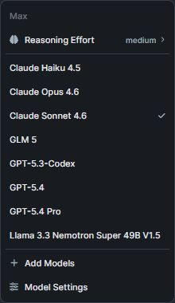
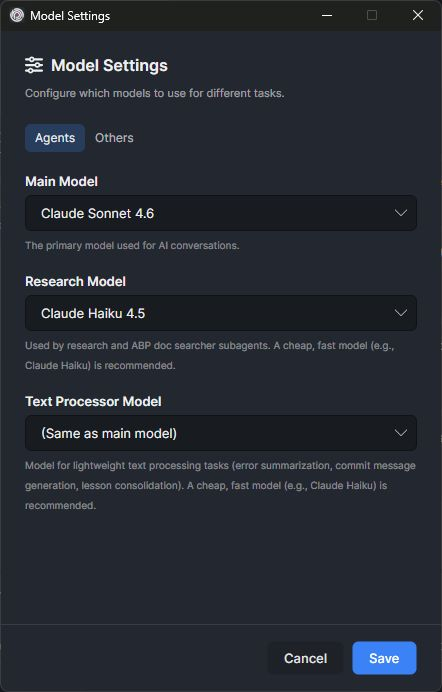
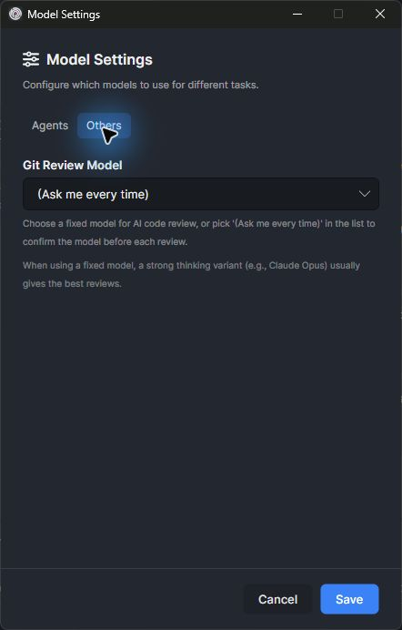
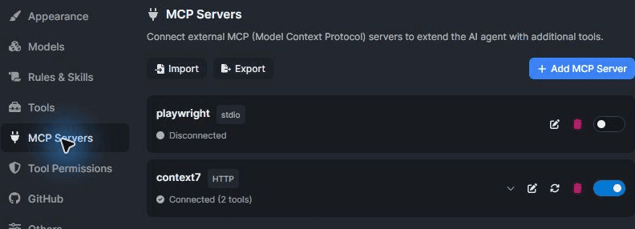

```json
//[doc-seo]
{
    "Description": "Configuration reference for ABP Studio AI Agent models, reasoning, context limits, parallel sessions, permissions, MCP tool connections, AI rules, and learned lessons."
}
```

# ABP Studio: AI Agent Configuration

````json
//[doc-nav]
{
  "Next": {
    "Name": "AI Agent Workflows",
    "Path": "studio/ai-agent-workflows"
  }
}
````

AI Agent configuration controls model selection, execution limits, enabled tools, tool permissions, MCP tool connections, AI rules, and learned lessons.

## Model Provider

ABP Studio maintains a model list with metadata such as provider, context length, maximum completion tokens, image support, reasoning support, and tool support.

The built-in default model set includes:

| Model | Default role | Context length |
| --- | --- | --- |
| Claude Sonnet 4.6 | Main agent | 1,000,000 |
| Claude Haiku 4.5 | Research and text processing | 200,000 |
| Claude Opus 4.7 | Optional high-capability model | 1,000,000 |
| GPT-5.5 | Optional main/review model | 1,050,000 |
| GLM-5.1 | Optional text/code model without image support | 200,000 |

The available model catalog can be refreshed and is cached locally for a limited period.



## Model Roles

ABP Studio separates model roles so each AI operation can use a model suited to its cost and capability profile.

| Role | Used by | Default behavior |
| --- | --- | --- |
| Main Model | Normal Agent, Plan, and Ask conversations | Uses the active model selected for the agent. |
| Research Model | Research and ABP documentation subagents | Defaults to Claude Haiku 4.5. Can be set to same as main. |
| Text Processor Model | Lightweight text processing, error summarization, commit message generation, and lesson consolidation | Defaults to Claude Haiku 4.5. Can be set to same as main. |
| Git Review Model | AI Review in the Git panel | Defaults to "Ask me every time". Can be set to same as main or a fixed model. |

The Git Review model picker does not change the main conversation model. When "Ask me every time" is selected, Studio asks for a model before each AI Review and passes that model only to the review run.





## Reasoning Effort

Reasoning effort controls the model's reasoning budget where the selected model/provider supports it. Supported values are `none`, `minimal`, `low`, `medium`, `high`, and `xhigh`. The default is `low`.

When the context limit is set to `Max`, Studio uses the maximum context behavior for the model and increases reasoning effort for the run.

## Context Limit

The context limit controls the maximum context size used for agent runs. The default option is `300K`. The `Max` option delegates to the model's maximum context behavior.

Large context settings can improve broad solution understanding, but they also increase latency and model cost. Narrow AI scopes and targeted attachments should be preferred when the task is limited to a module or package.

## Parallel Sessions

ABP Studio can run multiple agent sessions in parallel. The default maximum is 3 concurrent sessions, and the configured range is 1 to 5. Prompts beyond the limit are queued.

Each running session locks its own model settings and tool snapshot so global settings changes do not mutate an already-running session.

## Tool Enablement

ABP Studio groups Studio automation tools in settings. Disabled tools are removed from the agent tool list before a run starts.

Core Studio tools are available to Agent mode when enabled:

- Build.
- Monitor exceptions, logs, HTTP requests, and distributed events.
- Start and stop applications.
- Start and stop containers.
- Run tasks.

Extended Studio tools are loaded only when the run context enables them. These include specialized operations such as package/module builds, library installation, and proxy generation.

Tools that exist for internal Studio use can be hidden from the AI agent. Hidden tools are not exposed to the model even when they are implemented in Studio.

## Tool Permissions

Some tools require explicit permission before execution.

| Tool category | Permission behavior |
| --- | --- |
| Shell commands | Studio prompts before command execution unless the command has been allowed. |
| URL fetches | Studio prompts per domain unless the domain has been allowed. |
| File downloads | Studio always asks before downloading. |

Permission choices include allow once, allow always, and skip. "Allow always" persists in the AI Agent settings and is reused by future sessions.

## MCP Tool Connections

ABP Studio can connect to user-configured Model Context Protocol (MCP) servers and expose their tools to Agent mode. This is an MCP client integration for the AI Agent. ABP Studio AI Agent does not expose itself as an MCP server for external AI clients.

MCP server connections can be configured with:

| Transport | Configuration |
| --- | --- |
| Stdio | Command, arguments, and environment variables. |
| HTTP | URL and headers. |

Studio imports MCP server configuration from Cursor, Claude, VS Code, Windsurf, and bare MCP server JSON formats. Studio exports MCP server configuration in the standard `mcpServers` JSON shape.

Connected MCP servers show their connection status, tool count, tools, and resources. Individual MCP tools can be disabled. Disabled MCP tools are omitted from Agent mode. MCP resources can be opened from settings for inspection.

MCP tools are added only for connected and enabled servers. Plan and Ask modes do not receive MCP tools.



## `.abpignore`

The `.abpignore` file is placed in the solution root and uses `.gitignore` syntax. Files matched by `.abpignore` are inaccessible to the agent even when they are under the active AI scope.

The default exclusions protect common secret and credential files, including:

- `appsettings.secrets.json`
- `.env` files except `.env.example`
- certificate and key files such as `.pfx`, `.p12`, `.pem`, `.key`, and `.p8`
- local development Helm values
- tunnel and temporary key files

## AI Rules

AI rules are Markdown files with YAML frontmatter and the `.mdc` extension. Rules can be global or solution-specific.

| Location | Scope |
| --- | --- |
| `%USERPROFILE%/.abp/studio/rules` | Global rules available on the machine. |
| `.abpstudio/ai-rules` | Solution rules shared with the solution when committed. |

Rule frontmatter supports:

```yaml
name: Rule Name
description: Short rule description
alwaysApply: true
```

Always-apply rules are injected into the agent's system prompt. Non-always-apply rules are exposed as available skills and can be loaded by the agent with the `fetch_ai_skills` tool. When a solution skill and a global skill have the same name, the solution skill takes precedence.

## Learned Lessons

The `save_lesson` tool records verified corrections into `.abpstudio/ai-rules/ai-learned-lessons.mdc`. Learned lessons are injected as high-priority context in future sessions.

The agent is instructed to save a lesson only after a user correction is verified against source or tool output. When the learned lessons file becomes large, Studio can consolidate it with the text processor model.
