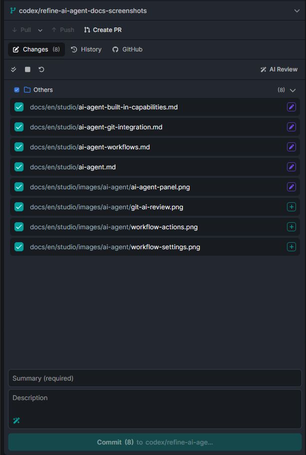

```json
//[doc-seo]
{
    "Description": "Technical reference for ABP Studio AI Agent Git integration, AI Review, changed-file prompting, commit messages, merge conflicts, and GitHub issue or pull request handoff."
}
```

# ABP Studio: AI Agent Git Integration

````json
//[doc-nav]
{
  "Next": {
    "Name": "Coding with AI Agent",
    "Path": "studio/coding-with-ai-agent"
  }
}
````

ABP Studio integrates AI Agent features into the Git and GitHub workflow. The integration uses selected files, staged or working-tree diffs, review notes, GitHub issue/PR context, and image attachments to build prompts for dedicated AI review or coding sessions.



## AI Review

AI Review runs from the Git panel against selected changed files. It is a dedicated review flow, separate from the normal Agent chat.

AI Review:

- Uses only selected files.
- Skips binary files.
- Uses staged diffs for staged files and working-tree diffs for unstaged files.
- Annotates diff lines with actual line numbers.
- Streams suggestions back to the Git panel.
- Can inspect related source files with read/search tools.
- Can ask an ABP documentation subagent to verify ABP-specific patterns.
- Applies always-apply global and solution AI rules to the review.

The review model is selected from the Git Review Model setting. When configured as "Ask me every time", Studio shows a model picker before starting the review.

## Review Scope

AI Review focuses on changed lines. Surrounding code can be used to understand context, but suggestions are attached to changed lines.

The reviewer checks for:

- Bugs and logic errors.
- Security issues.
- Performance problems.
- Code quality issues.
- ABP and DDD pattern violations.

Generated files such as migrations can be skipped by the reviewer when they are recognized as generated output.

## Suggestion Severity

AI Review suggestions have one of the following severities:

| Severity | Meaning |
| --- | --- |
| Error | A likely bug, crash, security issue, data loss risk, or other high-priority defect. |
| Warning | A potential production issue, bad practice, ABP convention violation, or maintainability problem. |
| Info | A lower-priority design or naming issue worth considering. |
| Confirmation | Positive confirmation for exceptional code. Limited to rare cases. |

## Review Notes

The Git panel can store user notes and AI suggestions against files and lines. Review content is used in two ways:

- It can block commit actions while unresolved review content exists.
- It can be sent to the AI Agent as an implementation prompt.

Blocking review content includes user notes and AI suggestions with severities other than `Info` and `Confirmation`.

## Sending Review Findings To The Agent

The Git panel can send review findings to AI Agent. Studio builds a prompt that includes:

- A request to review and apply the notes for the current Git changes.
- File paths.
- Line numbers.
- Line type and line content.
- AI suggestions.
- User notes.

Confirmation suggestions are excluded. Info suggestions are treated as optional context; warning and error suggestions are emphasized.

The prompt instructs the agent to implement the requested changes, not only explain them.

## Commit Message Generation

Commit message generation uses selected file diffs and the Text Processor Model. It skips binary files and truncates large diffs before sending them to the model.

The generator returns a concise past-tense commit message. It is intended to summarize the selected changes, not the whole repository state.

## Merge Conflict Handoff

When unresolved merge conflicts exist, the Git panel can send the conflict list to AI Agent. The generated prompt asks the agent to resolve conflicts and request clarification when the correct resolution is ambiguous.

Conflict handoff can use the current session or create a new session. It starts with analysis skipped so the prompt is centered on the conflict files.

## GitHub Issue Handoff

GitHub issue details can be sent to AI Agent from Studio when GitHub integration is connected.

The generated issue prompt includes:

- Issue number and title.
- State.
- Author.
- Labels.
- Description.
- Included comments.
- Attached images referenced by the issue body or included comments.

Comments can be excluded from the AI prompt. Images that belong to excluded comments are not attached. The prompt instructs the agent to solve the issue by making the necessary code changes.

## GitHub Pull Request Handoff

Pull request details can be sent to AI Agent when the current branch matches the PR branch.

The generated PR prompt includes:

- PR number and title.
- State.
- Author.
- Base and head branches.
- Labels.
- Included reviews.
- Included comments.
- Included requested changes.
- File path and line information for review comments when available.
- Diff hunks for review comments when available.
- Attached images from included comments and requested changes.

Reviews, comments, and requested changes can be excluded from the AI prompt. Only included items are sent.

## Image Attachments

GitHub issue and PR handoff can attach downloaded images to the agent prompt. The prompt text annotates image references with the corresponding attached file name so the model can connect the image file to the original issue, comment, or review context.

Image handling still depends on the selected model's image support. If the model does not support images, the normal attachment restrictions apply.

## GitHub URL Fetching In Agent Chat

Agent URL fetching can enrich GitHub URLs with issue or pull request information when GitHub integration is available. Pull request URL context can include review comments up to Studio's fetch limits.

This is separate from the explicit GitHub issue/PR "Send to AI Agent" actions in the Git UI.
