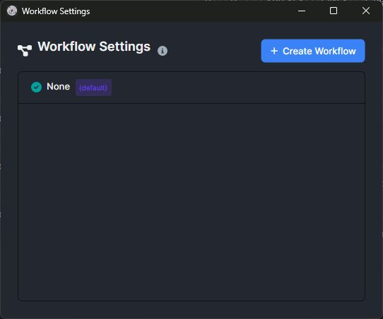
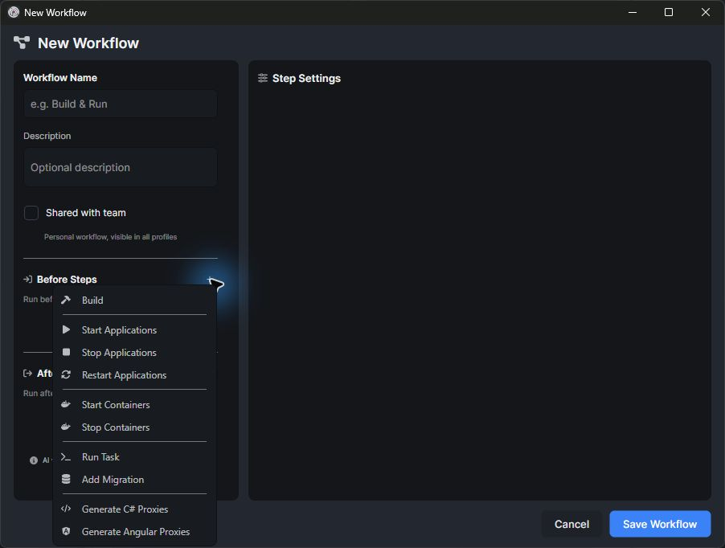

```json
//[doc-seo]
{
    "Description": "Technical reference for ABP Studio AI Agent workflows, AI scopes, automatic pre/post actions, plan files, and workflow storage."
}
```

# ABP Studio: AI Agent Workflows

````json
//[doc-nav]
{
  "Next": {
    "Name": "AI Agent Built-in Capabilities",
    "Path": "studio/ai-agent-built-in-capabilities"
  }
}
````

AI Agent workflows define repeatable actions that Studio can run before or after an agent task. Workflows are associated with run profiles and are selected before a session starts.



## Workflow Types

| Type | Storage | Sharing behavior |
| --- | --- | --- |
| Personal workflow | `.abpstudio/workflows/*.json` | Local to the solution workspace and visible in all run profiles. |
| Shared workflow | The active `.abprun.json` run profile under the `workflows` section | Stored with the run profile and intended for source control. |

The shared/personal setting is fixed when the workflow is created.

Workflow configuration includes the workflow name, description, sharing mode, before steps, and after steps.



## Supported Actions

| Action | Description |
| --- | --- |
| Build | Builds the solution, selected modules, selected packages, or all configured targets. |
| Start Application | Starts selected applications, applications in selected folders, or all runnable applications. |
| Stop Application | Stops selected applications, applications in selected folders, or all targeted applications. |
| Restart Application | Runs the configured restart application workflow action for selected targets. |
| Start Containers | Starts selected containers or all containers. |
| Stop Containers | Stops selected containers or all containers. |
| Run Task | Runs selected Studio tasks. |
| Add Migration | Adds a database migration for the configured migration project when entity changes require it. |
| Install Libs | Installs client-side library files when the task requires it. |
| Generate C# Proxies | Generates C# client proxies with configured URL, module, service type, folder, target package, and contract options. |
| Generate Angular Proxies | Generates Angular proxies with configured URL, module, service type, and working directory. |

## Before Tasks

Before tasks run automatically only in Agent mode. Before the model receives control, Studio can run solution/package analysis and then execute the workflow's before tasks through the corresponding Studio tools.

Plan and Ask modes are read-only and do not execute before tasks.

## After Tasks

After tasks are injected into the agent instructions as post-task guidance. The agent is expected to run relevant post-steps after completing the main work, but Studio treats them as contextual workflow guidance rather than unconditional execution.

The agent may skip after tasks that are not relevant to the actual changes. For example, migration, build, library installation, and proxy generation actions are used only when the completed code changes require them.

## Automatic Analysis And Build

Agent mode performs ABP-aware analysis around coding tasks:

- Before execution, Studio analyzes packages unless the run is explicitly started with analysis skipped.
- After execution, Studio checks changed packages.
- If the workflow already includes a build after task, Studio avoids duplicating that build and performs analysis of changed packages.
- If no build after task is present, Studio can build and analyze changed packages after the agent turn.

This behavior applies to Agent mode. Read-only modes do not perform build or mutation steps.

## Workflow Selection And Session Locking

The selected workflow is stored on the session at execution time. A background session keeps using its original workflow even if the foreground run profile or workflow selection changes.

Once a session has a cached system prompt, configuration that changes the prompt is locked for that session. New sessions receive the latest selected workflow.

## AI Scopes In Workflows

AI scopes and workflows are independent but complementary. The scope determines which directories agent file tools can access. The workflow determines which automation actions are available or recommended for the task.

A workflow can target applications, containers, packages, modules, and tasks from the active run profile even when the AI scope is narrowed to a smaller area. File access remains governed by the scope.

## Plan Files

Plan mode creates and updates plan files under `.abpstudio/plans`. A plan file is a technical implementation document, not a chat transcript.

Agent mode can attach to an active plan and update step state while implementing it. Plan step updates use stable step identifiers so progress can survive conversation turns.

## Applying Plans

When a plan is applied, Studio builds a prompt from the plan and sends it to the agent. The agent then works in Agent mode with the active plan context and updates plan steps as it completes work.

## Workflow Design Constraints

Workflows should contain deterministic project actions. They are not a replacement for prompts, AI rules, or review instructions.

Recommended workflow contents:

- Build steps required by the solution.
- Application/container start or stop steps required for verification.
- Proxy generation steps required after API contract changes.
- Migration steps for known database projects.
- Run tasks used by the team for validation.

Avoid putting broad or ambiguous requirements into workflows. Use AI rules for coding standards and prompts for task-specific instructions.
