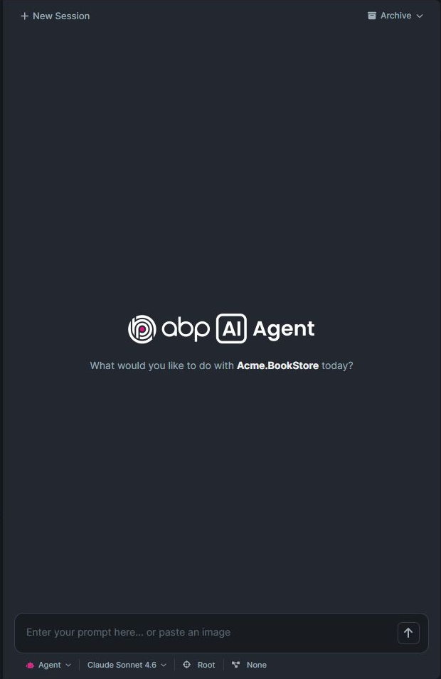

```json
//[doc-seo]
{
    "Description": "Technical reference for the ABP Studio AI Agent operating model, modes, sessions, scopes, prompts, attachments, and context handling."
}
```

# ABP Studio: AI Agent

````json
//[doc-nav]
{
  "Next": {
    "Name": "AI Agent Configuration",
    "Path": "studio/ai-agent-configuration"
  }
}
````

ABP Studio AI Agent is an integrated coding agent for ABP solutions. It combines solution metadata, run profile metadata, ABP-specific code analysis, controlled tool access, AI rules, and conversation state into agent sessions that can answer questions, create plans, and modify the solution depending on the selected mode.



The agent is solution-aware. Its system context includes the current solution, modules, packages, runnable applications, containers, tasks, run profile information, active AI scope, active workflow, enabled AI rules, and available tools for the selected mode.

## Modes

The selected mode determines the agent's effective permission boundary.

### Agent

Agent mode is used for coding and execution. It can read and write files, run shell commands, add migrations, run enabled Studio tools, call connected MCP tools, and update active plan steps.

### Plan

Plan mode is used for read-only implementation planning. It can inspect code and documentation, create or update plan files, and use read-only subagents. It cannot modify solution files or run shell/write tools.

### Ask

Ask mode is used for read-only question answering. It can inspect code, search/read ABP documentation, fetch relevant AI skills, and use read-only subagents. It cannot create plans or modify files.

Mode selection is per session. A session keeps its selected mode for subsequent prompts unless the user changes it before sending the next message.

## Sessions

An AI Agent session stores the conversation, selected model, selected mode, AI scope, workflow, context notes, queued prompts, active plan state, attachments, and context usage.

The first message of a session locks the configuration that affects the system prompt. The active AI scope and workflow are stored on the session so a background session continues with the configuration that was active when it started. Changing the foreground run profile, scope, or workflow does not rewrite the context of a running session.

ABP Studio keeps multiple sessions per solution. Sessions can run in parallel up to the configured maximum. Additional prompts are queued until an execution slot is available.

## Prompt Queue

Prompts can be queued while a session is running. Queued prompts are attached to the same session and are sent after the current agent turn completes. The queue preserves the session configuration, including mode, scope, model, workflow, and active plan state.

## Attachments

The agent supports file and image attachments for prompts. Attachments are stored under the ABP Studio agent files area and become part of the prompt context for the target session.

Attachment limits are enforced by ABP Studio:

| Limit | Value |
| --- | --- |
| Maximum files per prompt | 10 |
| Maximum size per file | 20 MB |
| Supported file extensions | `.png`, `.jpg`, `.jpeg`, `.gif`, `.bmp`, `.webp`, `.txt`, `.md`, `.cs`, `.js`, `.ts`, `.json` |

Image attachments require a selected model that supports image input. If the selected model does not support images, the agent rejects image attachments for that run.

## URL Context

URLs attached to a prompt are fetched and included as contextual material when permitted. URL fetching uses explicit domain permission. Large fetched content is cached under `.abpstudio/url-cache` instead of being injected directly into the prompt.

## AI Scopes

An AI scope restricts which directories the agent can access. A scope can include the whole solution, selected modules, selected packages, and external folders.

Scope resolution follows these rules:

- The whole-solution scope includes the solution root and all module directories.
- Selected modules include their module directories.
- Selected packages include package directories.
- Existing external folders are included; missing external folders are ignored.
- Overlapping directories are collapsed to avoid duplicate indexing.
- The solution `.abpstudio` folder is accessible so the agent can read and write its own agent state, plans, rules, and workflow files where applicable.

All file paths used by agent tools are validated against the resolved session scope. Rooted paths are accepted only when they are inside an accessible directory. Files excluded by `.abpignore` are blocked even if they are under an accessible directory.

## Context Notes

The agent maintains hidden context notes for long-running sessions. These notes preserve useful state across prompts without exposing implementation-only notes in the visible conversation.

## Active Plans

Plan files are stored under `.abpstudio/plans`. Plan mode can create and update plan files. Agent mode can execute an active plan and update step status through the plan-step tool. Active plan state is stored on the session and is cleared when all plan steps are completed.

## Run Profile Context

When a run profile is active, the system prompt includes information about runnable applications, containers, tasks, and workflow-related targets. This context allows the agent to call Studio tools by name without rediscovering the solution structure through file search.

## Privacy Boundary

The agent uses the files, prompts, Studio tool outputs, connected MCP tool outputs, attachments, and URLs supplied to a session. Sensitive files can be excluded with `.abpignore`; tool permissions restrict shell commands, domain fetches, and downloads.
