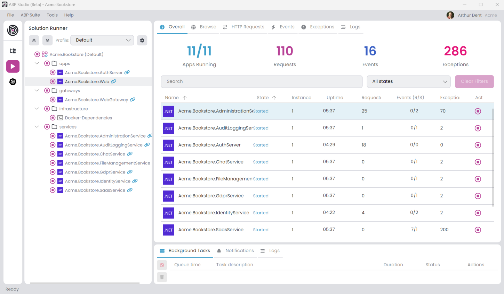

# ABP Studio

````json
//[doc-nav]
{
  "Next": {
    "Name": "Installation",
    "Path": "studio/installation"
  }
}
````

ABP Studio is a **cross-platform** desktop application for ABP and .NET developers. It aims to provide a comfortable development environment for you by automating things, providing insights about your solution, making develop, run, browse, monitor, trace and deploy your solutions much easier.



## Installation

If you haven't installed yet, please see [the installation guide](installation.md) to prepare your environment and install ABP Studio on your computer.