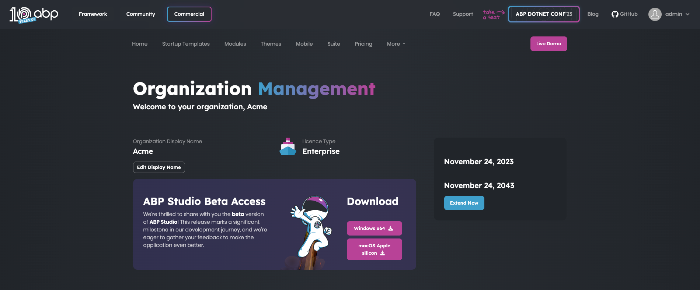

# Installing ABP Studio

> **Warning: Beta Version Information**\
> Currently, ABP Studio is in its beta phase, and access is exclusively available to invited organizations. To request access to the beta version, kindly visit [this web page](https://commercial.abp.io/studio). If you have already received an invitation, please follow the installation guide below.

## Pre-requirements

Before you begin the installation process for ABP Studio, ensure that your system meets the following pre-requirements:

### PowerShell (installed by default) *
Ensure PowerShell is installed on your system. 
ABP Studio automatically installs PowerShell, but if you want to install it manually, run the following command in your terminal:

   ```bash
   dotnet tool install --global PowerShell
   ```

### ABP CLI (installed by default) *
Ensure ABP CLI (Command Line Interface) is installed on your system. 
ABP Studio automatically installs ABP CLI, but if you want to install it manually, follow the instructions in the official [ABP CLI documentation](https://docs.abp.io/en/abp/latest/CLI). 

### ABPC CLI (installed by default) *
The ABPC CLI (Command-Line Interface) is a tool that works with ABP Studio. It doesn't need the user interface; you can run it by typing commands or including it in scripts. When you install ABP Studio, the ABPC CLI is automatically installed. This CLI tool helps automate tasks when working with CI/CD pipelines.

### Node *
Make sure Node.js is installed on your system. If you have not installed Node.js, you can download the `v16` or `v18` version from the official [Node.js website](https://nodejs.org/).

### WireGuard (Optional) 
ABP Studio needs WireGuard for Kubernetes operations. You can find the installation instructions for your specific operating system below:

**For Windows:** 
Installation instructions for your Windows operating system are on the official [WireGuard website](https://www.wireguard.com/).

**For macOS:**
To install WireGuard on macOS, run the following command in your terminal:

```bash
brew install wireguard-tools
```

### Docker (Optional) 
ABP Studio needs Docker for Kubernetes operations. Install Docker by following the guidelines on the official [Docker website](https://docs.docker.com/get-docker/).

## Installation
Now you have met the pre-requirements, follow the steps below to install ABP Studio:

1. **Download ABP Studio:** Visit [your organization page](https://commercial.abp.io/my-organizations) on the official [commercial.abp.io](https://commercial.abp.io/) website to download the latest version.




2. **Run the Installer:** Execute the installer and follow the on-screen instructions to install ABP Studio on your computer.

## Login
After you install ABP Studio, you can log in to access all the features. To log in, follow the below steps:

1. **Launch ABP Studio:** Open ABP Studio on your desktop.

2. **Login Credentials:** Enter your [commercial.abp.io](https://commercial.abp.io/) login credentials when prompted.

## Changing the UI Theme
ABP Studio allows you to customize the user interface theme according to your preferences. You can change the UI theme as in the image below:


## Upgrading
ABP Studio periodically checks for updates in the background, and when a new version of ABP Studio is available, you will be notified through a modal. 
The modal will prompt you to update to the latest version as below:


When you see the "New Version Available" window, follow these steps to upgrade ABP Studio seamlessly:

1. Click the "OK" button in the modal to initiate the download of the new version.
2. A progress indicator will display the download status.
3. Once the download is complete, a new modal will appear with the "Install and Relaunch" buttons.
4. Click on the "Install and Relaunch" button to complete the installation process.
