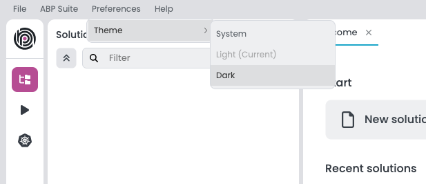
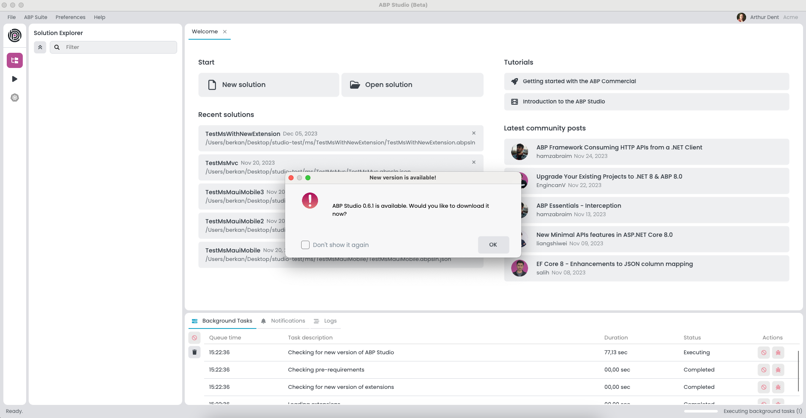

# Installing ABP Studio

> **Warning: Beta Version Information**\
> Currently, ABP Studio is in its beta phase and available for everyone. To access the beta version, kindly visit [this web page](https://abp.io/studio).

## Pre-requirements

Before you begin the installation process for ABP Studio, ensure that your system meets the following pre-requirements:

### Node
Make sure [Node.js](https://nodejs.org/en) is installed on your system. If you have not installed Node.js, you can download the `v18.19+` version from the official [Node.js website](https://nodejs.org/en/download/prebuilt-installer).

### WireGuard (Optional) 
ABP Studio needs [WireGuard](https://www.wireguard.com/) for Kubernetes operations. You can find the installation instructions for your specific operating system below:

**For Windows:** 
Installation instructions for your Windows operating system are on the official [WireGuard website](https://www.wireguard.com/install/#windows-7-81-10-11-2008r2-2012r2-2016-2019-2022).

**For macOS:**
Installation instructions for your macOS operating system are on the official [WireGuard website](https://www.wireguard.com/install/#macos-homebrew-and-macports-basic-cli-homebrew-userspace-go-homebrew-tools-macports-userspace-go-macports-tools).

### Docker (Optional) 
ABP Studio needs [Docker](https://www.docker.com/) for [Kubernetes](https://kubernetes.io/) operations. Install Docker by following the guidelines on the official [Docker website](https://docs.docker.com/get-docker/).

## Installation
Now you have met the pre-requirements, follow the steps below to install ABP Studio:

1. **Download ABP Studio:** Visit [abp.io](https://abp.io/studio) to download the latest version of ABP Studio.

2. **Run the Installer:** Execute the installer and follow the on-screen instructions to install ABP Studio on your computer.

## Login
After you install ABP Studio, you can log in to access all the features. To log in, follow the below steps:

1. **Launch ABP Studio:** Open ABP Studio on your desktop.

2. **Login Credentials:** Enter your [abp.io](https://abp.io/) login credentials when prompted.

## Changing the UI Theme
ABP Studio allows you to customize the user interface theme according to your preferences. You can change the UI theme as in the image below:

## Upgrading
ABP Studio periodically checks for updates in the background, and when a new version of ABP Studio is available, you will be notified through a modal. 
The modal will prompt you to update to the latest version as below:

When you see the "New Version Available" window, follow these steps to upgrade ABP Studio seamlessly:

1. Click the "OK" button in the modal to initiate the download of the new version.
2. A progress indicator will display the download status.
3. Once the download is complete, a new modal will appear with the "Install and Relaunch" buttons.
4. Click on the "Install and Relaunch" button to complete the installation process.
