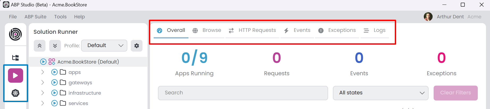
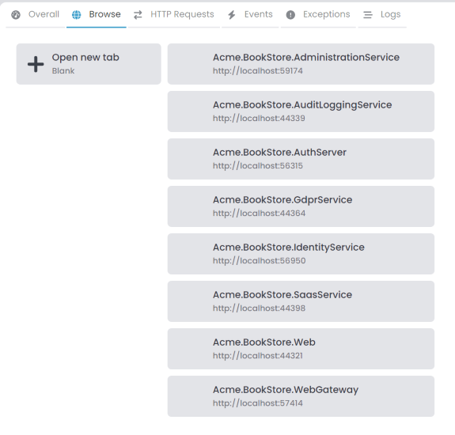
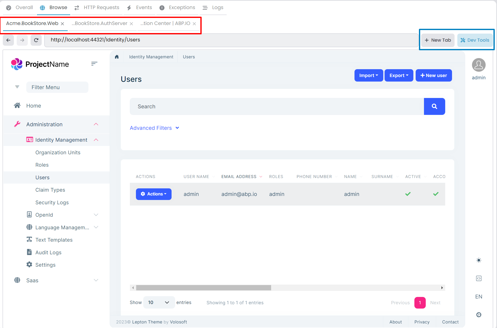
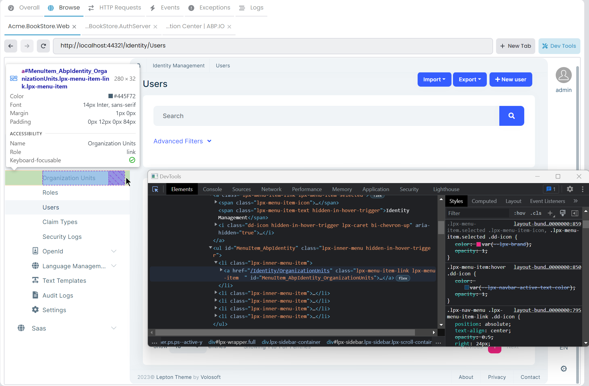
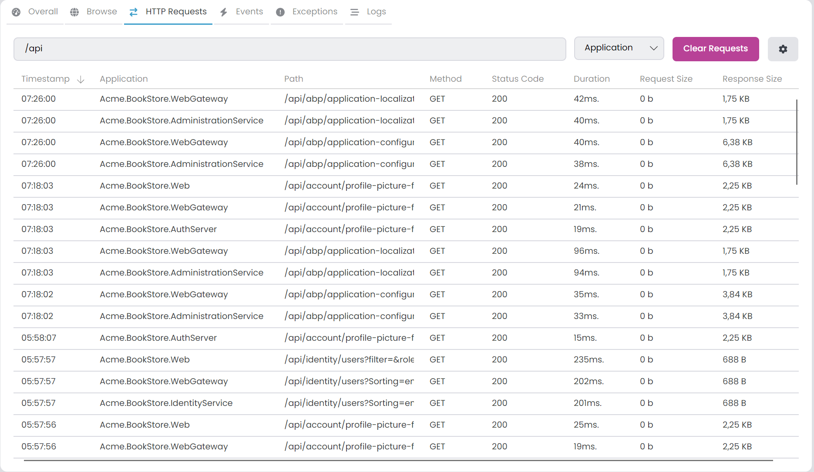
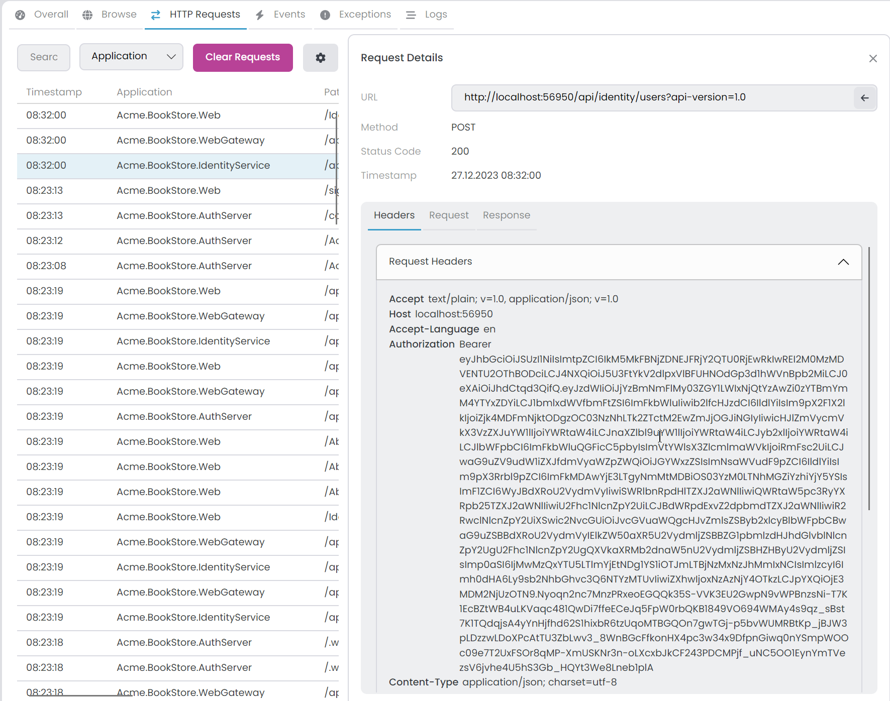
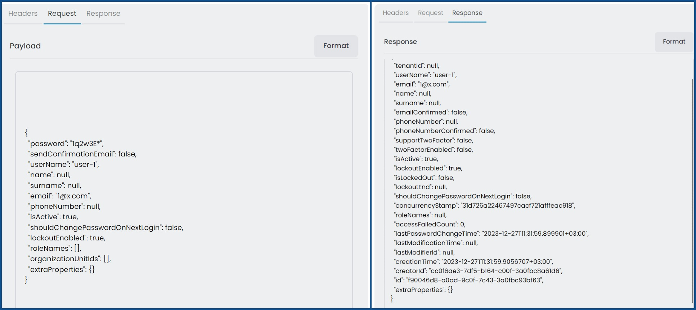
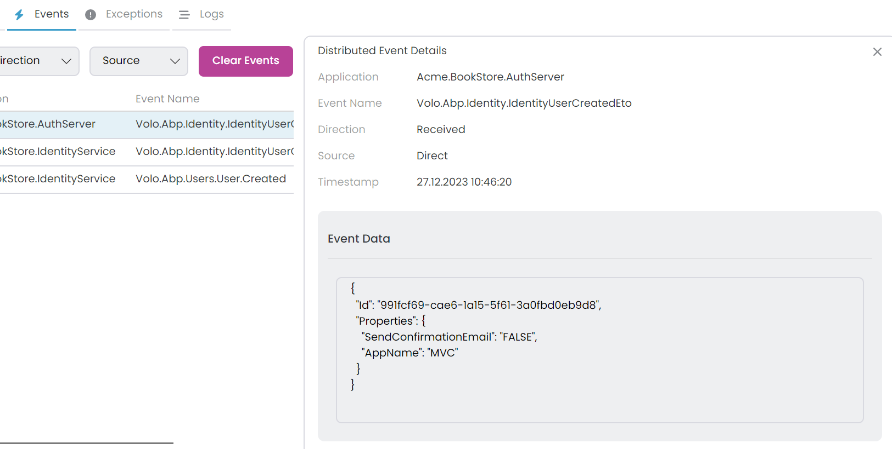
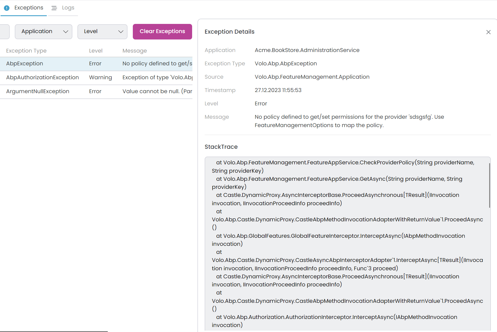
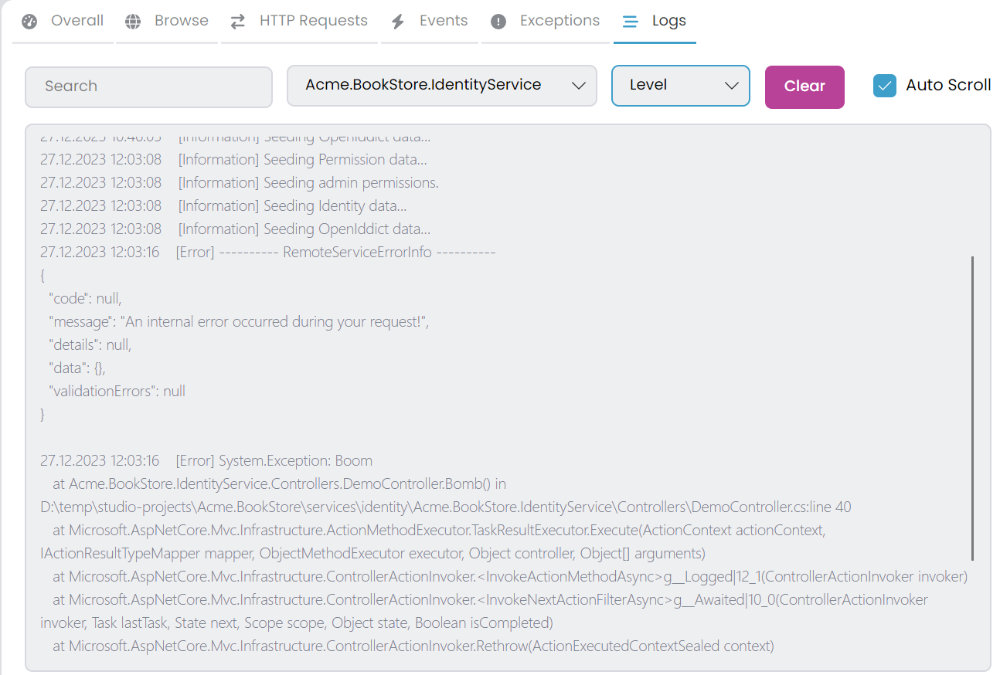

# ABP Studio: Monitoring Applications

````json
//[doc-nav]
{
  "Next": {
    "Name": "Working with Kubernetes",
    "Path": "studio/kubernetes"
  }
}
````

ABP Studio offers a comprehensive centralized monitoring solution, enabling you to oversee all applications from a single interface. To see the monitoring tabs you can select the [Solution Runner](./running-applications.md) or *Kubernetes* from the left menu, monitoring tabs are automatically opened in the center. You can start the applications for monitoring. Various monitoring options are available, including [Overall](#overall), [Browse](#browse), [HTTP Requests](#http-requests), [Events](#events), [Exceptions](#exceptions), [Logs](#logs). 



## Collecting Telemetry Information

There are two application [types](./running-applications.md#abp-studio-running-applications): C# and CLI. Only C# applications can establish a connection with ABP Studio and transmit telemetry information via the `Volo.Abp.Studio.Client.AspNetCore` package. However, we can view the *Logs* and *Browse* (if there is a *Launch URL*) for both CLI and C# application types. Upon starting C# applications, they attempt to establish a connection with ABP Studio. When connection successful, you should see a chain icon next to the application name in [Solution Runner](./running-applications.md#run-1). Applications can connect the ABP Studio with *Solution Runner* -> *C# Application* -> *Run* -> *Start* or  from an outside environment such as debugging with Visual Studio. Additionally, they can establish a connection from a Kubernetes Cluster through the ABP Studio [Kubernetes Integration: Connecting to the Cluster](../get-started/microservice.md#kubernetes-integration-connecting-to-the-cluster).

You can [configure](../framework/fundamentals/options.md) the `AbpStudioClientOptions` to disable send telemetry information. The package automatically gets the [configuration](../framework/fundamentals/configuration.md) from the `IConfiguration`. So, you can set your configuration inside the `appsettings.json`:

- `StudioUrl`: The ABP Studio URL for sending telemetry information. Mostly, you don't need to change this value. The default value is `http://localhost:38271`.
- `IsLinkEnabled`: If this value is `true`, it starts the connection to ABP Studio and transmits telemetry information. You can switch this to `false` for deactivation. In a production deployment, you should explicitly set this value to `false`. The default value is `true`.


```json
"AbpStudioClient": { 
 "StudioUrl": "http://abp-studio-proxy:38271",
 "IsLinkEnabled": false
}
```

Alternatively you can configure the standard [Options](../framework/fundamentals/options.md) pattern in the `ConfigureServices` method of the `YourApplicationModule` class.

```csharp
public override void ConfigureServices(ServiceConfigurationContext context)
{
    Configure<AbpStudioClientOptions>(options =>
    {
        options.IsLinkEnabled = false;
        //options.StudioUrl = "";
    });
}
```

## Overall

In this tab, you can view comprehensive overall information. You have the option to search by application name and filter by application state. To reset all filters, use the *Clear Filters* button. When you apply a filter header informations gonna refresh by filtered applications.

- `Apps Running`: The number of applications running. It includes CLI and C# applications. In the example two C# microservice applications and one CLI application is running.
- `Requests`: The number of HTTP requests received by all C# applications.
- `Events`: The number of [Distributed Event](../framework/infrastructure/event-bus/distributed) sent or received by all C# applications.
- `Exceptions`: The number of exceptions thrown by all C# applications.


In the data grid, details for each application are displayed. It's possible to sort rows by columns. When selecting a row, you can right-click to access the context menu, offering various actions. This menu allows for opening related tabs that are filtered by the selected application.

- `Name`: The name of the application.
- `State`: The state of the application. It can take on several values such as *Scheduled*, *Starting*, *Started*, *Stopping* and *Stopped*. In the event of an application crash during its starting, the state is mark as *Scheduled*, we can cancel the starting process at that stage.
- `Instances`: Indicates the count of running instances for the application. This value is particularly helpful when scaling the application within a Kubernetes, providing visibility into the number of currently active instances.
- `Uptime`: The time elapsed since the application started.
- `Requests`: The number of HTTP requests received by the application.
- `Events (R/S)`: The number of [Distributed Event](../framework/infrastructure/event-bus/distributed) received or sent by the application.
- `Exceptions`: The number of exceptions thrown by the application.
- `Actions`: The actions that can be performed on the application. You can start and stop the application.

> For the events system, you can exclusively view the [Distributed Events](../framework/infrastructure/event-bus/distributed). Generally, the [Local Events](../framework/infrastructure/event-bus/distributed) is not included.

## Browse

ABP Studio includes a browser tool that allows access to websites and running applications. You can open new tabs to browse different websites or view active applications. It's a convenient utility to access websites and applications without leaving ABP Studio. Clicking the *Browse* tab displays the running applications and an *Open new tab* button.



You can open the *Browse* tabs as many times as you want. It's possible to open the same application in several tabs simultaneously. To open an application, navigate through *Solution Runner* -> *C# or CLI Application* -> *Browse*. This option is only visible when there is a [Launch URL](./running-applications.md#properties). Additionally, you can access any URL by entering it into the address bar.



When you click the *Dev Tools* button it opens the [Chrome DevTools](https://developers.google.com/web/tools/chrome-devtools) for the selected tab.



## HTTP Requests

Within this tab, you can view all *HTTP Requests* received by your C# applications. You have the option to filter requests based on URLs by using the search textbox or by selecting a particular application from the combobox. The *Clear Requests* button removes all received requests. Moreover, you have the ability to sort requests by columns.



Clicking on a row enables you to view the details of each HTTP request; `URL`, `Method`, `Status Code`, `Timestamp`, `Headers (Request, Response)`, `Request (Payload)` and `Response`.



You can format the JSON content by clicking the *Format* button.



Furthermore, by clicking the gear icon in the *HTTP Requests* tab, you can access the *Solution Runner HTTP Requests Options* window. Within the *Ignored URLs* tab, you have the ability to exclude particular URLs by applying a regex pattern. Excluded URLs won't be visible in the *HTTP Requests* tab. By default, the metrics URL is already ignored. You can add or remove items as needed.


> After adding a new URL, it will only affect subsequent requests.

## Events

In this tab, you can view all [Distributed Events](../framework/infrastructure/event-bus/distributed) sent or received by your C# applications. You can filter them by [Event Name](../framework/infrastructure/event-bus/distributed#event-name) using the search textbox or by selecting a specific application. Additionally, you can choose the *Direction* (Received/Send) and *Source* (Direct/Inbox/Outbox) of events. The *Clear Events* button removes all events.


> In the *Direction* section, there are two options: *Received*, indicating events received by the application, and *Sent*, indicating events sent by the application. Within the *Source* section, three options are available, and their significance comes into play when utilizing the [Inbox/Outbox pattern](../framework/infrastructure/event-bus/distributed#outbox-inbox-for-transactional-events). *Inbox* refers to events received by the application, *Outbox* refers to events sent by the application and *Direct* signifies events sent or received by the application without involving Inbox/Outbox pattern.

Clicking on a row enables you to view the details of each event; `Application`, `Event Name`, `Direction`, `Source`, `Timestamp` and `Event Data`.



## Exceptions

This tab displays all exceptions by your C# applications. You can apply filters using the search textbox based on *Message*, *Source*, *ExceptionType*, and *StackTrace* or by choosing a specific application. Additionally, you have the option to select the [Log Level](../framework/fundamentals/exception-handling.md#log-level) for adding a filter. To clear all exceptions, use the *Clear Exceptions* button.


Click on a row to inspect the details of each exception; `Application`, `Exception Type`, `Source`, `Timestamp`, `Level`, `Message` and `StackTrace`.



## Logs

The *Logs* tab allows you to view all logs for both CLI and C# applications. To access logs, simply select an application. You can also apply filters using the search textbox by log text or by selecting a specific *Log Level*. When you select a *Log Level* it shows selected log level and higher log levels. For example, if you select *Warning* it shows *Warning*, *Error* and *Critical* logs. To clear selected application logs, use the *Clear Logs* button. If *Auto Scroll* is checked, the display automatically scrolls when new logs are received.


