# ABP Studio: Overview

````json
//[doc-nav]
{
  "Next": {
    "Name": "Solution Explorer",
    "Path": "studio/solution-explorer"
  }
}
````

## Introduction

ABP Studio, a comprehensive desktop application, offers a wide range of features and functionalities tailored to streamline the development and management of ABP-based applications. This article provides an overview of the key components of ABP Studio, including the Solution Explorer, Solution Runner, Kubernetes Integration, Application Monitoring Area, Background Tasks, Notifications and Logs. Understanding these components is essential for efficiently utilizing ABP Studio to its full potential.


## The Top Menu

The top menu is the main menu bar in ABP Studio. It offers access to various functionalities such as **File**, **ABP Suite**, **Tools**, and **Help**. In this section we will examine these functions.


### File Menu

- **Welcome Screen:** Opens the [Welcome Screen](#welcome-screen). The Welcome Screen in ABP Studio is a straightforward starting user interface that provides quick access to recent projects and options to create or open projects.
- **New Solution:** Opens the new solution creation wizard.
- **Open Solution:** Opens a Solution previously created with ABP Studio.
- **Initialize Existing Solution:** Makes the project created outside ABP Studio recognizable by ABP Studio.
- **Recent Solutions:**  Shows Recent Solutions.
- **Reload Solution:** Reloads the current solution.
- **Close Solution:** Closes the current solution.
- **Exit:** Closes ABP Studio.

### ABP Suite

[ABP Suite](https://abp.io/suite) is a complementary tool to the ABP Platform, designed to enable the rapid construction of web pages in just a few minutes. With the ABP Suite button in the Top Menu, you can access the Suite from the browser embedded in ABP Studio.

### Tools Menu

- **Options**
  - **Theme:** Allows to change UI theme.
- **Global secrets**: Allows to add global secrets.
- **Global metadata**: Allows to add global metadata.

### Help Menu

- **License Information:** Shows your organization's license information.
- **Documentation:** Opens the official [documentation](../) website in your browser.
- **Community:** Opens the official [ABP Community](https://abp.io/community) website in your browser.
- **Support:** Opens the official [Support](https://abp.io/support/questions) website in your browser.
- **My Support Questions:** Opens the page on the official Support website in your browser showing the tickets you have opened.
- **Check for updates:** Checks for new version of ABP Studio.
- **About:** Opens the about window of ABP Studio where you can get more information about it.

## Welcome Screen

The Welcome Screen is the initial user interface users encounter upon starting ABP Studio.

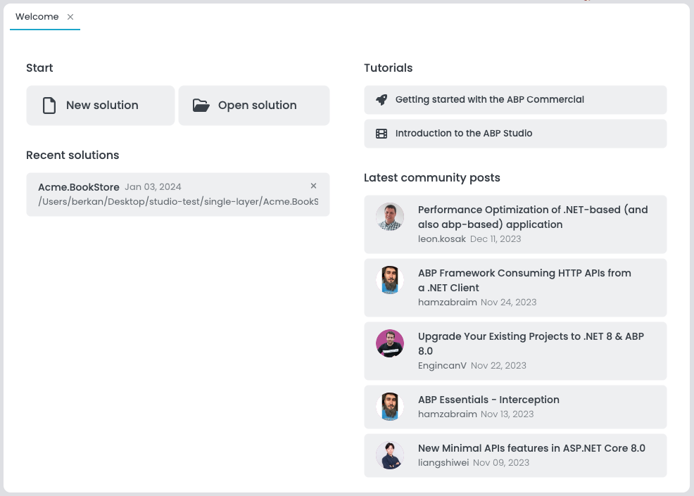

## Sidebar

Located on the left side of the interface, the Left Area is a panel that provides quick access to various functionalities like [Solution Explorer](./solution-explorer.md), [Solution Runner](./running-applications.md), and Kubernetes Integration. Now let's examine each item.

### Solution Explorer

The [Solution Explorer](./solution-explorer.md) is a feature for managing your project's structure, allowing operations such as add package reference, add new package, new module creation, and etc. within ABP Studio.

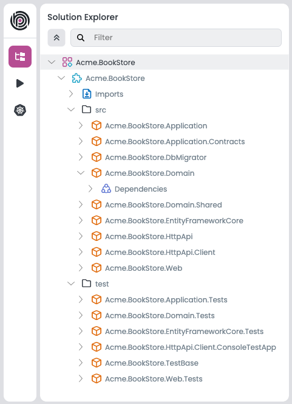

### Solution Runner

[Solution Runner](./running-applications.md) is a tool within ABP Studio that enables users to build, run, and monitor their applications directly from the user interface.

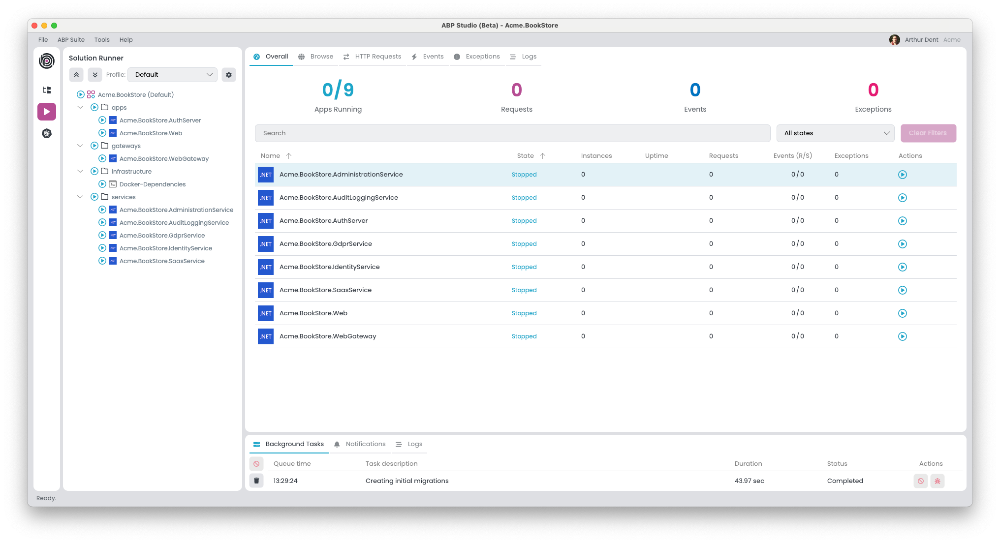

### Kubernetes Integration

Kubernetes integration in ABP Studio enables users to deploy solutions directly to Kubernetes clusters and provides tools for displaying and managing Kubernetes services. This integration features two main panes:

#### Helm

This pane is dedicated to managing [Helm](https://helm.sh/) charts, which are packages used in Kubernetes deployments. It simplifies the process of building images and installing charts.

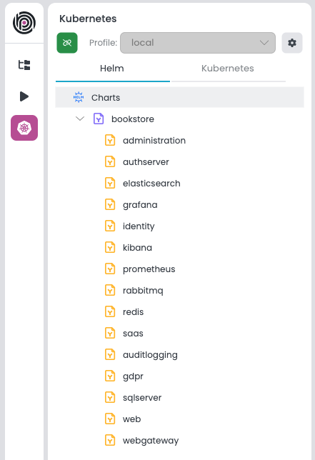

#### Kubernetes 

This pane is dedicated to managing Kubernetes services. It simplifies the process of redeploying and intercepting application service.

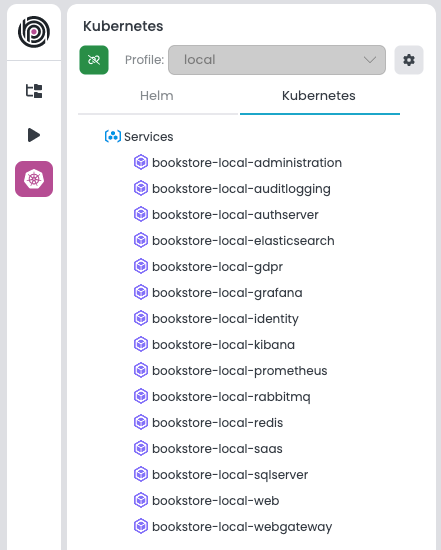

## Application Monitoring Area

The [Application Monitoring Area](./monitoring-applications.md) is a functional component within ABP Studio that displays real-time operational status and metrics for applications. It indicates the active state of applications, the count of running instances, and so on. The user interface is organized into several tabs: Overall, Browse, HTTP Requests, Events, Exceptions, and Logs. Now let's examine the **Overall** tab.

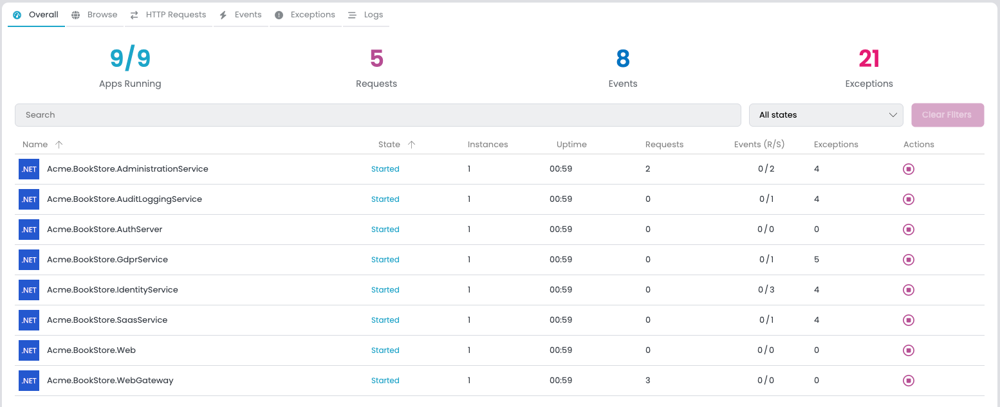

### Overall

The summary section gives a quick overview of the system's status, displaying metrics such as the number of apps running, total requests, events, and exceptions. This high-level view helps to quickly determine the health of the system.

#### Applications List

- A detailed list of individual applications presents critical information at a glance. For each application, the monitor displays:
    - **Name**: The unique identifier for the application.
    - **State**: Current status (e.g., Running, Stopped) indicating the application's operational state.
    - **Instances**: The number of active instances, reflecting the scale at which the application is currently running.
    - **Uptime**: Duration since the application was last started.
    - **Requests**: Count of HTTP requests handled by the application, useful for assessing traffic and load.
    - **Events (R/S)**: Rate of events processed per second, which can be critical for event-driven architectures.
    - **Exceptions**: Number of exceptions thrown, which is a direct indicator of potential issues within the application.
    - **Actions**: Quick actions that can be taken directly from the monitor area, such as starting, stopping the application.

Now let's examine the **Browse** tab.

### Browse

Providing a built-in browser to open and interact with running applications or websites directly within ABP Studio. Now let's continue with the **HTTP Requests** tab.

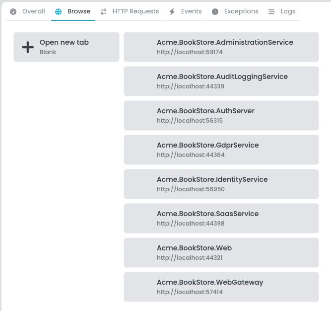

### HTTP Requests

This tab provides a log of all HTTP requests across applications, complete with timestamps, paths, methods, and status codes. It enables developers to trace each request's journey and identify any potential bottlenecks or errors. Now let's examine the next tab, the **Events** tab.

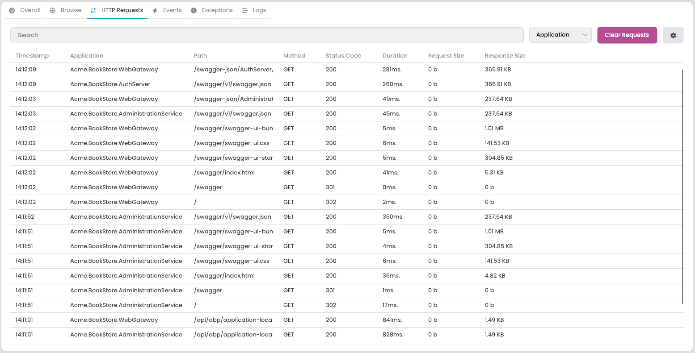

### Events

The Events tab is a centralized stream where all the [distributed events](../framework/infrastructure/event-bus/distributed/index) across applications are recorded. It allows filtering by name, application, direction, and source, providing a transparent view of the inter-service communication. So far, so good. Now let's move on to the next tab.

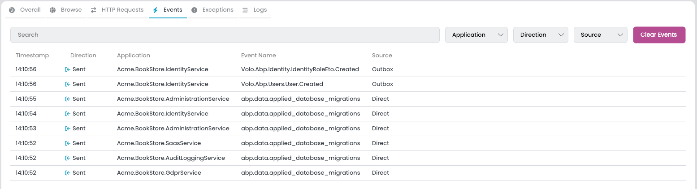

### Exceptions

The Exceptions tab is dedicated to capturing and listing all exceptions thrown by connected applications. It is essential for debugging, offering the ability to filter by content, application, and severity level. Finally, let's continue with the **Logs** tab.

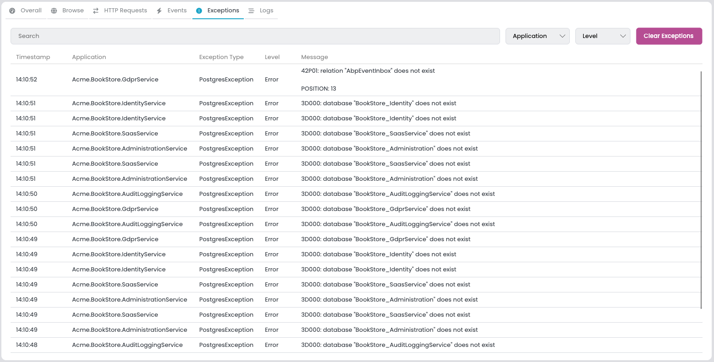

### Logs

The Logs tab in ABP Studio displays a real-time feed of log entries from applications, allowing for filtering by content, application, and severity level for targeted troubleshooting.

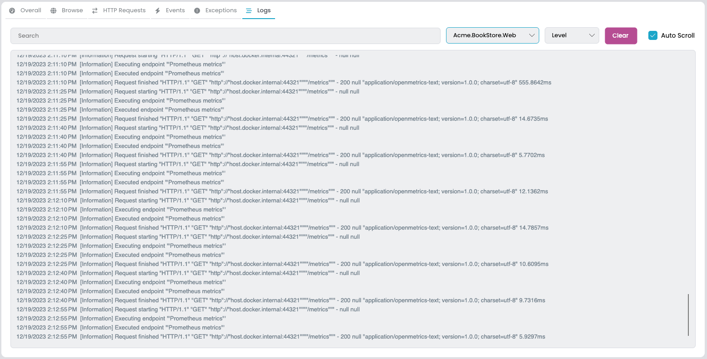

## Background Tasks

The Background Tasks section of ABP Studio provides a user interface for observing and managing asynchronous operations that occur within the studio environment. This area displays a list of tasks with their respective details:

- **Queue time**: The timestamp marking when the task entered the queue.
- **Task description**: Gives information about the latest status of the task.
- **Duration**: The time taken from the start of the task until its completion.
- **Status**: Denotes the task's current phase, with possible states being `Queued`, `Executing`, `Completed`, `Failed`, or `Canceled`.
- **Actions:** Task-specific interactions are available:
    - If the task can be canceled and its status is `Queued` state, tasks can be canceled by the user.
    - Users have the ability to view error details for tasks that have `Failed` to understand and address the causes of failure.

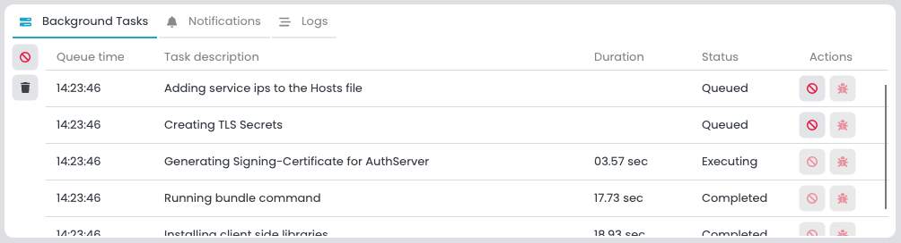

System behavior includes:

- Tasks are removed from the list three minutes after successful completion to ensure a clean workspace.
- Tasks are executed one at a time, with new tasks entering a queued state until the active task is finished.

## Notifications

ABP Studio is designed to inform users of various system events through a dedicated Notifications section in bottom area. This UI provides real-time alerts in the form of informational messages, warnings, success confirmations, and error notifications, each differentiated by distinct visual cues for immediate recognition.  

- Notifications are displayed transiently on the user interface for a brief period, typically five seconds, ensuring the user is promptly informed without causing prolonged distraction.

  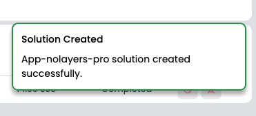

- Users can manually dismiss notifications or interact with them if additional actions are associated with the alert.

- Notifications are consolidated in a list that can be accessed through the notifications user interface, allowing users to review past alerts and perform relevant actions.

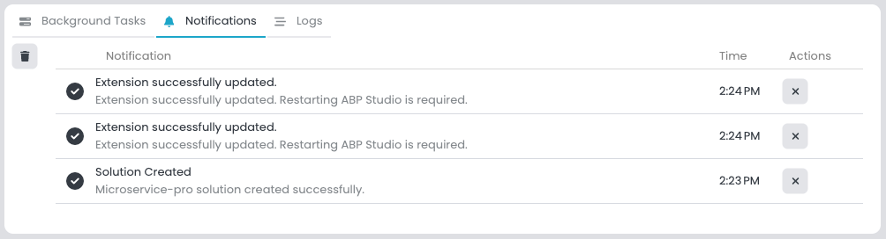

## Logs

The Logs UI in ABP Studio is designed to capture and display a stream of log entries generated by the application.

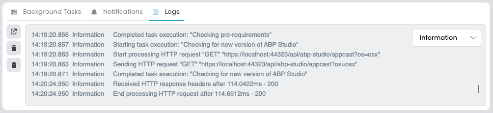

The Logs user interface include:

- **Log Levels**: A collection of severity levels that the user can select from to filter log entries. By default, the logs are filtered to show `Information` level and above.

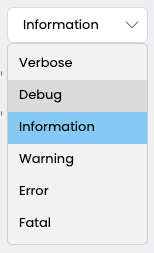

- **Open Button**: A function that enables users to open the logs folder on their system for in-depth analysis or archiving purposes.
- **Clear Button**: Provides the ability to clear the current log entries displayed within the user interface, which can be useful for focusing on new events post-clearance.
- **Copy Button**: Allows for the copying of log information to the clipboard for use in troubleshooting or documentation, although its implementation may be pending.


