# ABP Studio: Running Applications

````json
//[doc-nav]
{
  "Next": {
    "Name": "Monitoring Applications",
    "Path": "studio/monitoring-applications"
  }
}
````

Use the *Solution Runner* to easily run your application(s) and set up infrastructure. You can create different profiles to organize projects based on your needs and teams. Simply navigate to the *Solution Runner* panel in the left menu.

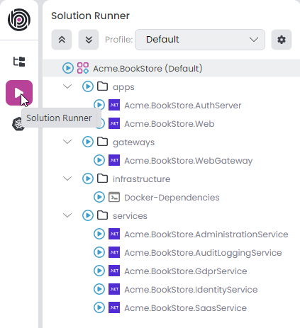

> The project structure might be different based on your selection. For example MVC microservice project, looks like the following. You can edit the tree structure as you wish.

The solution runner contains 4 different types to define tree structure.

- **Profile**: We can create different profiles to manage the tree as our needs. For example we can create 2 different profile for `team-1` and `team-2`. `team-1` want to see the only *Administration* and *Identity* service, `team-2` see the *Saas* and *AuditLogging* services. With that way each team see the only services they need to run. In this example `Default` profile *Acme.BookStore (Default)* comes out of the box when we create the project.
- **Folder**: We can organize the applications with *Folder* type. In this example for docker set up we use `Docker-Dependencies` CLI application and keep it in `infrastructure`, similarly in `services` folder for our microservice projects. We can also use nested folder if we want `apps`, `gateways`, `infrastructure` and `services` is the folders in current(`Default`) profile. 
- **C# Application**: We can add any C# application from our [Solution Explorer](./solution-explorer.md). If the application is not in our solution, we can add it externally by providing the *.csproj* file path. The .NET icon indicates that the application is a C# project. For example, `Acme.BookStore.AuthServer`, `Acme.BookStore.Web`, `Acme.BookStore.WebGateway`, etc., are C# applications.
- **CLI Application**: We can add [powershell](https://learn.microsoft.com/en-us/powershell/module/microsoft.powershell.core) commands to prepare some environments or run other application types than C# such as angular. In this example `Docker-Dependencies` is the CLI application for docker environment.

## Profile

We can create different profiles for each teams or scenarios, which is provide us to organize our tree structure as needed. With this way each profile contains their own folder and application tree structure. We can collapse or expand the entire tree using the up and down arrow icons. The *Default* profile comes with the project creation, includes all projects in the tree to manage at once. You can view all profiles in the combobox and change the current profile. To edit, click the gear icon located on the right side.

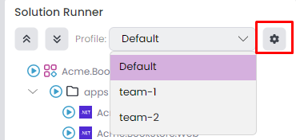

It opens the *Manage Run Profiles* window. You can edit/delete existing profiles or add a new one.

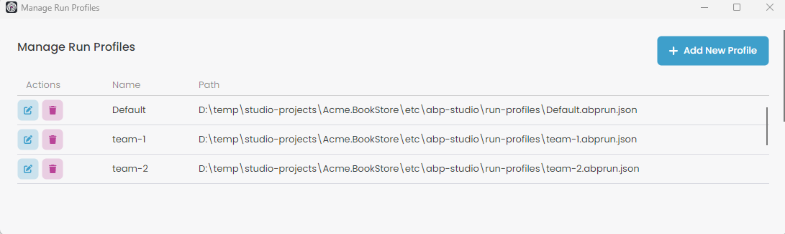

When you click *Add New Profile*, it opens the *Create New Profile* window. You can provide an arbitrary profile name, which should be unique among the profiles. Additionally, the name should only contain letters, numbers, underscores, dashes, and dots in the text. When you create a new profile, it stores the JSON file at the specified path. You can specify the path `abp-solution-path/etc/abp-studio/run-profiles` for microservice projects or `abp-solution-path/etc/run-profiles` for other project types to adhere to the standard format. You can also define *Metadata* and *Secrets* key-value pairs. Click *OK* button to save profile.

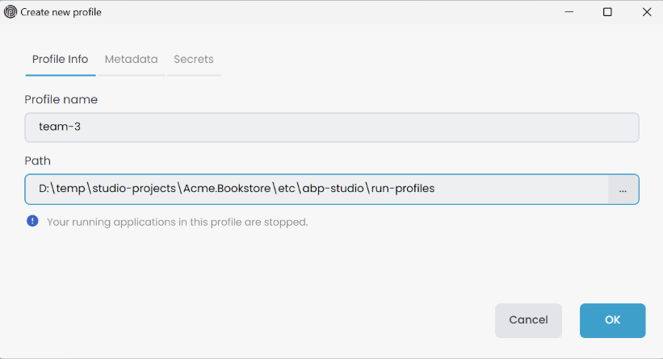

> When a profile is edited or deleted while running some applications, those applications will be stopped. However, applications running under a different profile will continue to run unaffected. Lastly, if we add a new profile, all applications running under existing profiles will be stopped.

## Using the Profile

After selecting the current profile, which is the *Default* profile that comes pre-configured, we can utilize the tree items. This allows us to execute collective commands and create various tree structures based on our specific needs. You can navigate through the root of the tree and right-click to view the context menu, which includes 3 options: `Run`, `Build` and `Add`.

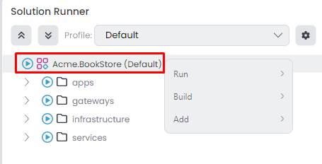

### Run

We can start/stop the applications with this option. Go to root of the tree and right-click to view the context menu, in this example *Acme.Bookstore(Default)* -> *Run*.


- `Start All`: Start all(CLI, C#) applications.
- `Stop All`: Stop all(CLI, C#) applications.
- `Build & Start All`: Builds each C# application in the [Background Tasks](./overview#background-tasks) and starts all (CLI, C#) applications after the build tasks are completed.

> `Start All` doesn't build the C# applications before running. If you're running it for the first time or if you've made changes, you should build the applications. You can simply use the `Build & Start All`.

> You can change the current profile while applications are running in the previous profile. The applications continue to run under the previous profile. For example if we start the `Acme.BookStore.AdministrationService`, `Acme.BookStore.IdentityService` applications when current profile is *team-1* and after change the current profile to *team-2* the applications continue to run under *team-1*.

### Build

We can use common [dotnet](https://learn.microsoft.com/en-us/dotnet/core/tools) commands in this option. Go to root of the tree and right-click to view the context menu, in this example *Acme.Bookstore(Default)* -> *Build*, there are 4 options available:

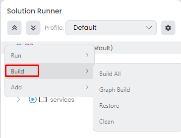

- `Build All`: Builds each C# applications.
- `Graph Build`: Builds each C# applications with [graphBuild](https://learn.microsoft.com/en-us/visualstudio/msbuild/build-process-overview?view=vs-2022#graph-option) option.
- `Restore`: Restores the dependencies for C# applications.
- `Clean`: Cleans the output of the previous build for C# applications.

> Since *Solution Runner* may contain numerous C# projects, the *Build* options uses the [Background Tasks](./overview#background-tasks), ensuring a seamless experience while using ABP Studio.

### Add

We can add 3 different item type to *Profile* for defining the tree structure. Those options are `C# Application`, `CLI Application` and `Folder`.

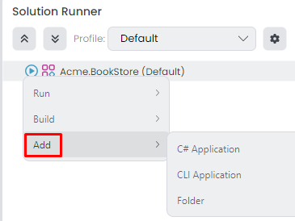

#### C# Application

When we go to root of the tree and right-click, in this example *Acme.BookStore(Default)* -> *Add* -> *C# Application* it opens the *Add Application* window. There are two methods to add applications: *This solution* and *External*. To add via the *This solution* tab, follow these steps:

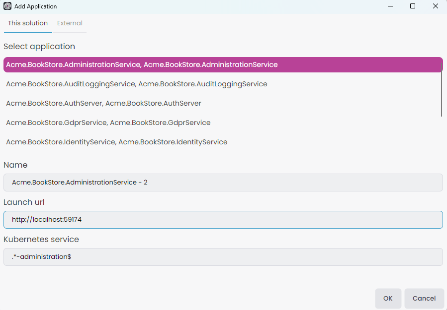

- `Select application`: First we have to select an application, you have the option to add the same application multiple times.
- `Name`: Give an arbitrary name to see in solution runner. This name should be unique for each profile even the selected application already exists.
- `Launch url`: Is the url when we want to browse.
- `Kubernetes service`: If you're not using the *Kubernetes* panel leave it empty. It's necessary for browse, when we connect the kubernetes cluster we should browse the kubernetes services instead *Launch url*. In [microservice](../get-started/microservice.md) template this option already configured and you can copy the existing regex pattern from your selected application [properties](#properties). If you create a custom helm chart you can also give the regex pattern that matches with your helm chart kubernetes service name.

You can click the `OK` button to add the C# application to the profile.

The C# project doesn't have to be within the current [Solution Explorer](./solution-explorer.md), it can even be outside. Also the project type could be anything such as [Console App](https://learn.microsoft.com/en-us/dotnet/csharp/tutorials/console-teleprompter), [ASP.NET Core Razor Pages](https://learn.microsoft.com/en-us/aspnet/core/razor-pages/), etc. To add it, click on the *External* tab in *Add Application* window.

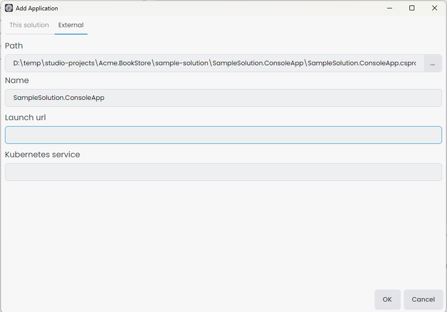


- `Path`: Provide the path to the .csproj file you wish to add. The path will be [normalized](https://learn.microsoft.com/en-us/dotnet/standard/io/file-path-formats#path-normalization), allowing the project location to be flexible, as long as it's accessible from the current [ABP Solution](./concepts.md#solution).
- `Name`: Give an arbitrary name to see in solution runner. This name should be unique for each profile.
- `Launch url`: Is the url when we want to browse. But if added project doesn't have launch url we can leave it empty.
- `Kubernetes service`: If you're not using the *Kubernetes* panel leave it empty. But if there is a helm chart for added application we should give the correct regex pattern. It's necessary for browse, when we connect the kubernetes cluster we should browse the services instead *Launch url*. Give the matching regex pattern for your helm chart kubernetes service name.

You can click the `OK` button to add the C# application to the profile.

#### CLI Application

We can add any [powershell](https://learn.microsoft.com/en-us/powershell/module/microsoft.powershell.core) file to execute from the solution runner. With this flexibility we can prepare our infrastructure environment such as `Docker-Dependencies` or run different application types like `Angular`. You can add CLI applications with root of the tree and right-click, in this example *Acme.BookStore(Default)* -> *Add* -> *CLI Application*.

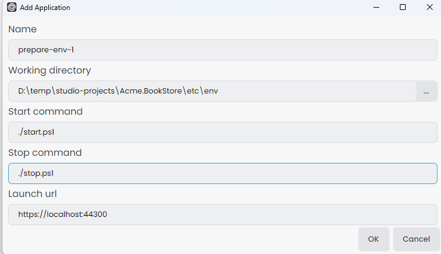

- `Name`: Give an arbitrary name to see in solution runner. This name should be unique for each profile.
- `Working directory`: Provide the start and stop commands file directory path. The path will be [normalized](https://learn.microsoft.com/en-us/dotnet/standard/io/file-path-formats#path-normalization), allowing the folder location to be flexible, as long as it's accessible from the current [ABP Solution](./concepts.md#solution).
- `Start command`: Give the poweshell file name that we wanna execute when we click the *Run* -> *Start*. We should start with local path prefix `./` if the powershell file directory in `Working directory` or if it's in nested folder we can give the path like `./sub-path/start.ps1`. Also we can give the argument like `./start.ps1 -parameter value -parameter2 value2`.
- `Stop command`: If there is a different stop command such as for docker `up.ps1` and `down.ps1` commands. We should give the stop powershell file name that we wanna execute when click the *Run* -> *Stop*. We should start with local path prefix `./` if the powershell file directory in `Working directory` or if it's in nested folder we can give the path like `./sub-path/stop.ps1`. Also we can give the argument like `./stop.ps1 -parameter value -parameter2 value2`.
- `Launch url`: If there's a launch URL at the end of this starting process, such as for angular project publishing an app at `http://localhost:4200`, to enable the browse option, we should provide the *Launch url*.

> If the stop command isn't provided, the starting process automatically ends upon the completion of the executed start command. However, if the start command keeps running, for instance, with a command like `yarn start`, it will continue to run until we manually click *Run* -> *Stop*.

You can click the `OK` button to add the CLI application to the profile.

#### Folder

When adding applications directly to the root of the tree, it can become disorganized, especially with numerous projects. Utilizing a folder structure allows us to organize applications more efficiently. This method enables executing collective commands within a specified folder. When we go to root of the tree and right-click, in this example *Acme.BookStore(Default)* -> *Add* -> *Folder* it opens *New folder* window.

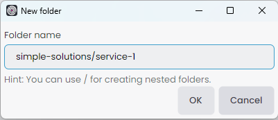

- `Folder name`: Give the folder name that we wanna see in solution runner. We can create nested folder with `/` character. This is a solution runner profile folder so, it doesn't create a real folder. Ensure each folder name is unique for each profile.

You can click the `OK` button to add the folder to the profile.

### Miscellaneous

- You can drag and drop folder and application into folder for organization purposes. Click and hold an item, then drag it into the desired folder.
- We can start all applications by clicking the *Play* icon on the left side, similar way we can stop all applications by clicking the *Stop*  icon on the left side.
- To remove an application from the tree, open the context menu by right-clicking the application and selecting *Remove*.
- To remove a folder from the tree, open the context menu by right-clicking the folder and selecting *Delete*.
- When starting applications, they continue to restart until the application starts gracefully. To stop the restarting process when attempting to restart the application, click the icon on the left. Additionally, you can review the *Logs* to understand why the application isn't starting gracefully.

## Folder

We already now why we need folder in the [previous](./running-applications.md#folder) section, we can use collective commands within this folder items. To do that go to folder and open the context menu by right-clicking, which includes 5 options `Start`, `Build`, `Add`, `Rename` and `Delete`.

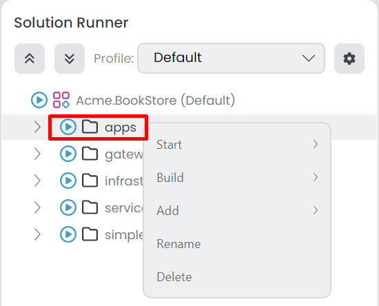

### Start

You can see the context menu by right-clicking *Folder* -> *Start*, it's [similar](#run) like *Acme.BookStore(Default)* -> *Run* options, there are 3 options available. The only difference with root of the tree and folder is gonna be execute in selected folder.

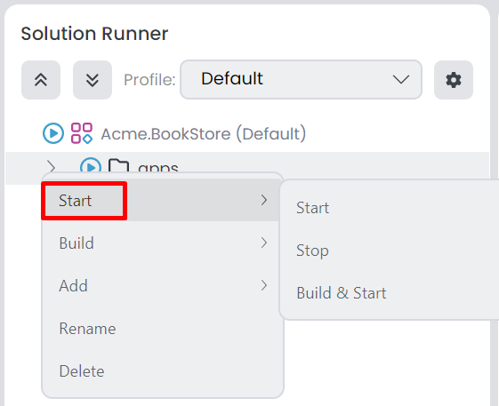

### Build

*Folder* -> *Build* context menu, it's the [similar](#build) options like *Acme.BookStore(Default)* -> *Builds* options there are 4 options available. The only difference between them it's gonna be execute in selected folder.

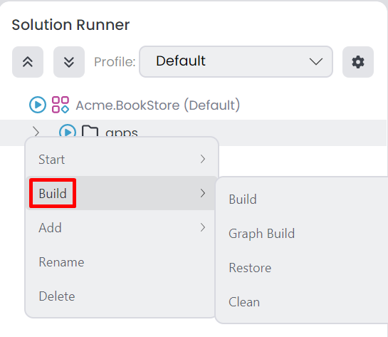

### Add

*Folder* -> *Add* context menu, it's the [same](#add) options like *Acme.BookStore(Default)* -> *Add* there are 3 options avaiable. The only difference, it's gonna add item to selected folder.

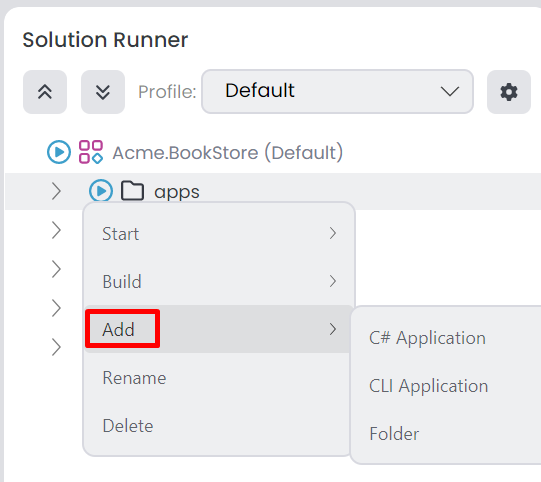

### Miscellaneous

- You can rename a folder with *Folder* -> *Rename*.
- You can delete a folder with *Folder* -> *Delete*.

## C# Application

The .NET icon indicates that the application is a C# project. After we [add](#c-application) the C# applications to root of the tree or folder, we can go to any C# application and right-click to view the context menu; `Run`, `Build`, `Browse`, `Requests`, `Exceptions`, `Logs`, `Copy URL`, `Properties`, `Remove`.

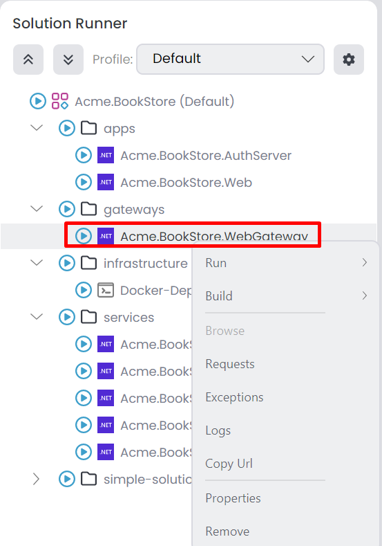

### Run

We have several options in C# applications. Those options are `Start`(If the application started this option shown as `Stop`), `Build & Start`(If the application started this option shown as `Build & Restart`), `Enable Watch`(If the watch is enabled this option shown as `Disable Watch`), `Restart`(It's only shown when the application started)

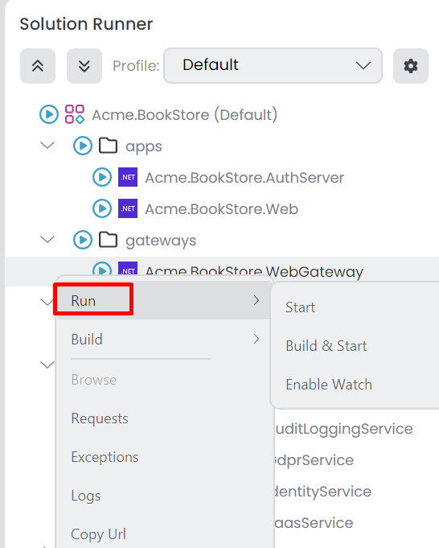

- `Start`: Starts the selected application. This option doesn't build before run. If you're running it for the first time or if you've made changes, you should build the application. If the application is started this option changed as `Stop`.
- `Build & Start`: We can simply use if we wanna build first and start. If the application is started this option changes to `Build & Restart`.
- `Enable Watch`: When this option is enabled, there's no need to perform `Build & Start` after any change. ABP Studio watches for changes, re-builds, and re-runs your application automatically upon saving. If this option is enabled it changes to `Disable Watch`.
- `Restart`: Restarts the application. This option visible only if the application started.

> When you start the C# application, you should see a *chain* icon next to the application name, that means the started application connected to ABP Studio. C# applications can connect to ABP Studio even when running from outside the ABP Studio environment, for example debugging with Visual Studio. If the application is run from outside the ABP Studio environment, it will display *(external)* information next to the chain icon.

> When *Watch* is enable you should see an *eye* icon next to the application name.

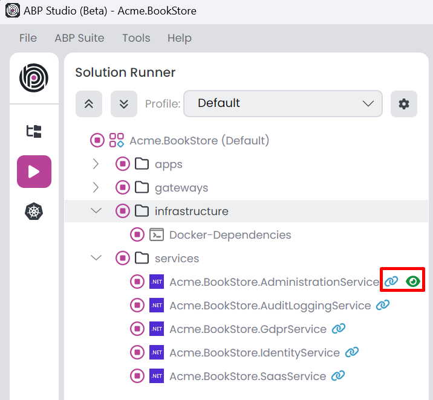

### Build

It's the [similar](#build) options like root of the tree options. The only difference between them it's gonna be execute the selected application.

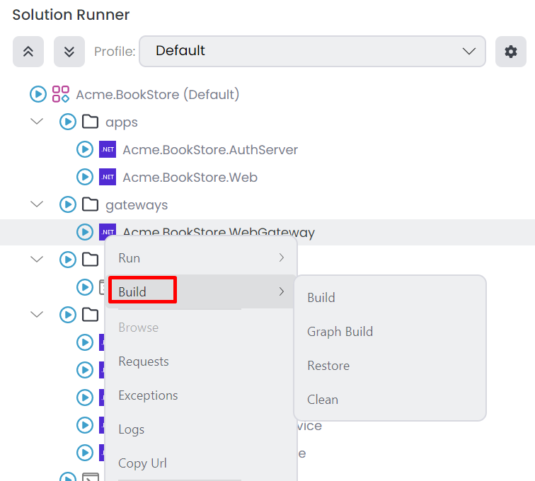

### Monitoring

When the C# application is connected to ABP Studio, it starts sending telemetry information to see in one place. We can easily click these options to see the detail; `Browse`, `Requests`, `Exceptions` and `Logs`.

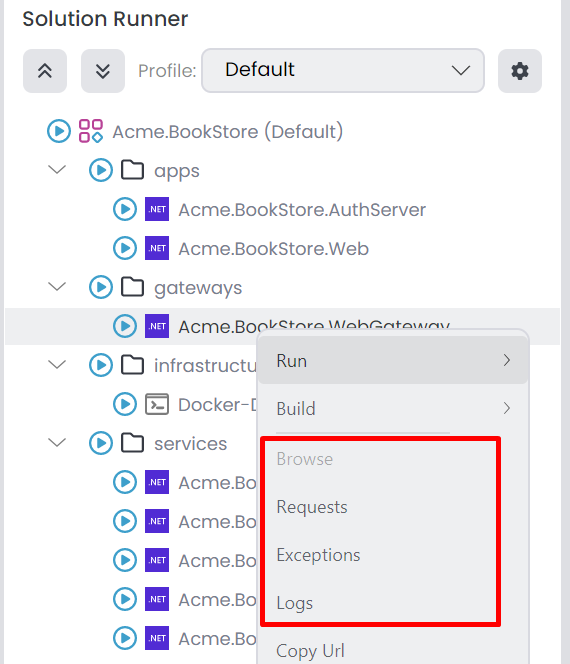

- `Browse`: ABP Studio includes a browser tool for accessing websites and running applications. You can click this option to view the application in the ABP Studio browser. However, this option is only accessible if the application is started.
- `Requests`: It opens the *HTTP Requests* tab with adding the selected application filter. You can view all *HTTP Requests* received by your applications.
- `Exceptions`: We can display all exceptions on this tab. It opens the *Exceptions* tab with selected application.
- `Logs`: Clicking this option opens the *Logs* tab with adding the selected application filter.

### Properties

We can open the *Application Properties* window to change *Launch url*, *Kubernetes service* and *run* information. To access the *Application Properties* window, navigate to a C# application, right-click to view the context menu, and select the Properties option.

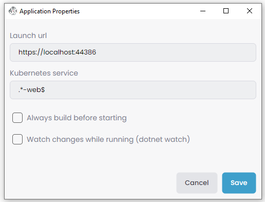

You can click the `OK` button to save the changes.

### Miscellaneous

- We can copy the selected application *Browse* URL with *Copy URL*. It copies the *Browse* URL instead *Launch URL* since we could connected to *Kubernetes* service. 
- You can change the target framework by right-click the selected application and change the *Target Framework* option. This option visible if the project has multiple target framework such as MAUI applications.
- To remove an application from the tree, open the context menu by right-clicking the application and selecting *Remove*.

## CLI Application

CLI applications uses the [powershell](https://learn.microsoft.com/en-us/powershell/module/microsoft.powershell.core) commands. With this way we can start and stop anything we want. After we add the CLI applications to root of the tree or folder, we can go to any CLI application and right-click to view the context menu.

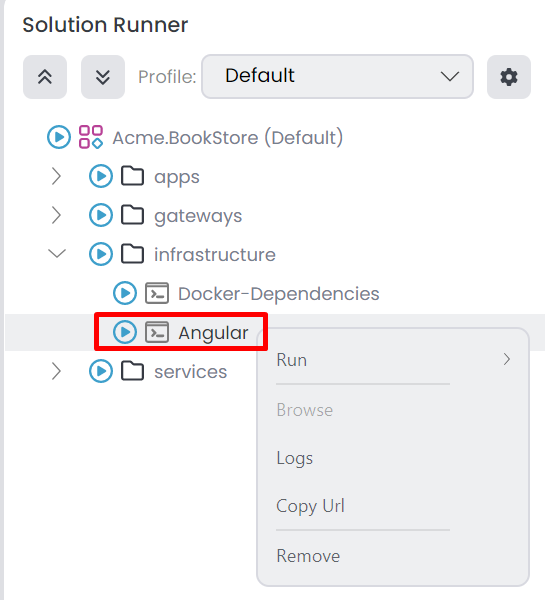

- `Run`: This option includes 3 actions: *Start*, *Stop*, and *Restart* for the CLI application.
- `Browse`: This option is available when a *Launch URL* is specified upon adding the CLI application. It opens the *Browse* tab, can be clicked while the application is running.
- `Logs`: It opens the *Logs* tab, we can see the logs for *Start* and *Stop* commands.
- `Copy URL`: This option copies the *Launch URL* of the selected application. It is visible if there is a specified *Launch URL*
- `Remove`: This option allows you to delete the selected application.

> When CLI applications start chain icon won't be visible, because only C# applications can connect the ABP Studio.
