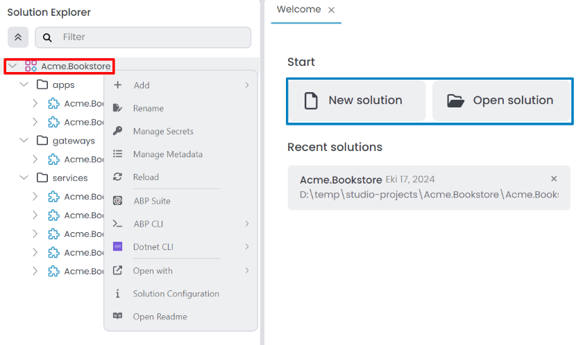
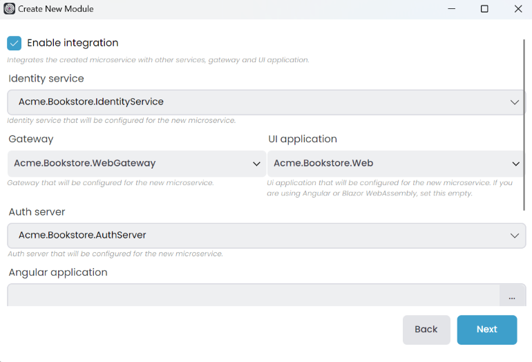

# ABP Studio: Solution Explorer

````json
//[doc-nav]
{
  "Next": {
    "Name": "Running Applications",
    "Path": "studio/running-applications"
  }
}
````

ABP Studio incorporates various [concepts](./concepts.md) and we're using them in the solution explorer. To ensure clarity, please review the [concepts](./concepts.md) documentation first. You can see the *Solution Explorer* on the left side of the ABP Studio. It displays an overview of your solution, you can manage your projects using the solution explorer. Simply navigate to the *Solution Explorer* panel in the left menu.


> The solution explorer structure might be different based on your selection. For example MVC microservice project, looks like the following. You can edit modules, packages and folders from the solution explorer.

## Solution

It is the main solution that you can open with ABP Studio, an ABP solution can contain multiple [modules](./concepts.md#module). You can create a new ABP solution using the *New solution* button on the welcome page. You can also open an existing ABP solution using the *Open solution* button on the welcome page. You can edit *Modules* and *Folders* using the root of the solution. There are 4 pre-built solution template; *Empty*, *Application (Single Layer)*, *Application (Layered)*, *Microservice*. These solution templates uses the Plug-In system and you can create custom solution templates if needed. Additionally, the solution explorer allows you to filter by *Folder*, *Module*, *Package* and *Imports*. We can collapse the entire tree using the up arrow icon.  When you right-click the root of the solution, it opens the context-menu you can see the following options;



- `Add`: You can add following options to your solution;
  - `New Folder`: Creates a new folder within the ABP Solution, allowing you to organize your modules.
  - `New Module`: Allows you to create a new module.
  - `Existing Module`: You can add existing module to your solution.
- `Rename`: Renames the solution.
- `Manage Secrets`: You can edit your solution secrets.
- `Manage Metadata`: You can edit your solution metadata.
- `Reload`: Reloads the solution.
- `ABP Suite`: It opens the *Choose Module* window and you can select a module or continue without selecting a module. If you select a module, it will open the module in the ABP Suite. If you continue without selecting a module, it will open the ABP Suite without a module.
- `ABP CLI`
  - `Install Libs`: Install NPM Packages for UI projects in your solution.
  - `Upgrade ABP Packages`: Update all the ABP related NuGet and NPM packages in your solution.
  - `Clean`: Deletes all `BIN` and `OBJ` folders in your solution.
  - `Switch to`: It is switch your solution to the selected version of the ABP.
    - `Stable`: Switches your solution to the latest stable version.
    - `Preview`: Switches your solution to the preview version.
    - `Nightly Build`: Switches your solution to the nightly version.
- `Dotnet CLI`
  - `Build`: Builds each modules.
  - `Graph Build`: Builds each modules with [graphBuild](https://learn.microsoft.com/en-us/visualstudio/msbuild/build-process-overview?view=vs-2022#graph-option) option.
  - `Clean`: Cleans the output of the previous build for modules.
  - `Restore`: Restores the dependencies for modules.
- `Open With`
  - `Terminal`: Opens the terminal in the solution directory.
  - `Explorer`: Opens the file explorer in the solution directory.
- `Solution Configuration`: You can see the project creation options in this menu. It opens the *Solution Configuration* window.
- `Open Readme`: Opens the README file in the solution if available. If there is no README file, this option will not be visible.

## Folder

When adding modules directly to the root of the solution, it can become disorganized, especially with numerous modules. Utilizing a folder structure allows us to organize modules more efficiently. This method enables executing collective commands within a specified folder. You can create a new folder using the *Add* -> *New Folder* button on the root of the solution context-menu it opens *New folder* window. You can also rename, delete, and move folders using the solution explorer.


- `Folder name`: Give the folder name that we wanna see in solution explorer. We can create nested folder with `/` character. This is a solution explorer folder so, it doesn't create a real folder. Ensure each folder name is unique.

You can click the *OK* button to add the folder to the solution. When you right-click the solution folder, it opens the context-menu you can see the following options;


- `Add`: You can add following options to your solution folder;
  - `New Folder`: Creates a new nested folder within the selected folder, allowing you to organize your modules.
  - `New Module`: Allows you to create a new module to selected folder.
  - `Existing Module`: You can add existing module to your selected folder.
- `Rename`: Renames the selected folder.
- `Delete`: Deletes the selected folder and all child items from the solution.
- `ABP CLI`
  - `Install Libs`: Install NPM Packages for UI projects in your selected folder.
  - `Upgrade ABP Packages`: Update all the ABP related NuGet and NPM packages in your selected folder.
  - `Switch to`: It switches your selected folder to the specified version of the ABP.
    - `Stable`: Switches your selected folder to the latest stable version.
    - `Preview`: Switches your selected folder to the preview version.
    - `Nightly Build`: Switches your selected folder to the nightly version.
  - `Clean`: Deletes all `BIN` and `OBJ` folders in your selected folder.
- `Dotnet CLI`
  - `Build`: Builds each modules in your selected folder.
  - `Graph Build`: Builds each modules with [graphBuild](https://learn.microsoft.com/en-us/visualstudio/msbuild/build-process-overview?view=vs-2022#graph-option) option in your selected folder.
  - `Clean`: Cleans the output of the previous build for modules in your selected folder.
  - `Restore`: Restores the dependencies for modules in your selected folder.

> You can drag and drop folders, modules and packages (within the same module) into a folder for organization purposes. Click and hold an item, then drag it into the desired folder.

## Module

A [module](./concepts.md#module) is a sub-solution that can contains zero, one or multiple [packages](./concepts.md#package). Each module is considered a .NET solution. We can create or import an existing module to the solution, with each module only able to be added once. When you right-click the module, it opens the context-menu where you can see the following options:


- `Add`: You can add following options to your module;
  - `Package`:
    - `New Package`: Creates a new package within the selected module.
    - `Existing Package`: You can add existing package to your selected module.
  - `Folder`: Creates a new folder within the selected module, allowing you to organize your packages.
- `Import Module`: This option allows you to import an existing module from *Solution*, *Local*, or *NuGet* into your selected module.
- `Rename`: Renames the selected module.
- `Remove`: Removes the selected module and all child items from the solution.
- `Reload`: Reloads the selected module.
- `ABP Suite`: It will open the selected module in the ABP Suite.
- `ABP CLI`
  - `Install Libs`: Install NPM Packages for UI projects in your selected module.
  - `Upgrade ABP Packages`: Update all the ABP related NuGet and NPM packages in your module.
  - `Switch to`: It switches your selected module to the specified version of the ABP.
    - `Stable`: Switches your selected module to the latest stable version.
    - `Preview`: Switches your selected module to the preview version.
    - `Nightly Build`: Switches your selected module to the nightly version.
  - `Clean`: Deletes all `BIN` and `OBJ` folders in your selected module.
- `Dotnet CLI`
  - `Build`: Builds your selected module.
  - `Graph Build`: Builds selected module with [graphBuild](https://learn.microsoft.com/en-us/visualstudio/msbuild/build-process-overview?view=vs-2022#graph-option) option.
  - `Clean`: Cleans the output of the previous build for selected module.
  - `Restore`: Restores the dependencies for selected module.
- `Open With`
  - `Visual Studio`: Opens the module in Visual Studio. This option is only available if you have Visual Studio installed.
  - `Visual Studio Code`: Opens the module in Visual Studio Code. This option is only available if you have Visual Studio Code installed.
  - `JetBrains Rider`: Opens the module in JetBrains Rider. This option is only available if you have JetBrains Rider installed.
  - `Terminal`: Opens the terminal in the module directory.
  - `Explorer`: Opens the file explorer in the module directory.
- `Upgrade to Pro`: This will be visible only when you purchased a license but still using the modules came with open-source (free) license. For more details, check out [Migrating from Open Source Templates](../guides/migrating-from-open-source.md) document. This is not shown in the screenshot above.

### Adding a New Empty Module

Create a new module by clicking the *Add* -> *New Module* -> *Empty Module* button at the root of the solution or in the solution folder context menu. The *Microservice* solution template also includes *Microservice*, *Gateway*, and *Web* modules. Other solution templates, such as *Application (Layered)*, can only create *Empty*, *DDD* and *Standard* modules.


If you choose the *Empty Module*, provide the *Module name* and *Output folder*, then click the *Create* button to add the empty module to the solution.


After creating the empty module, it will be added to the solution, and you should see the following structure in the solution explorer.


### Adding a New Microservice Module

Similar to creating an empty module, if you select the *Microservice* module template, provide the *Module name* and *Output folder*, then click the *Next* button. Please note that the *Module name* includes the solution name as a prefix, and the use of the dot(.) character in the *Module name* is not allowed.


You can choose the database provider for your microservice module. Select one of the following options:


When you create a microservice, you must edit some [configurations](../solution-templates/microservice/adding-new-microservices.md#configuring-the-appsettingsjson). If you select the *Enable integration* option, it automatically configures the required settings for the microservice to work with the gateway, web, and other modules.



You can uncheck the *Include Tests* option if you don't want to include test projects in your microservice module. Click the *Create* button to add the microservice module to the solution.


After creating the *Microservice (service-nolayers)* module, it will be added to the solution, and you should see the following structure in the solution explorer.


> To customize the *Microservice* module templates, navigate to the solution folder in file explorer, where you'll find a `_templates` folder. You can edit the `service_nolayers`, `gateway` and `web` templates based on your specific needs.

### Adding an Existing Module

ABP modules have their own file extension `.abpmdl`, and they are located in the specific module folder once created. Similar to creating a C# project in a solution and adding it to another solution as an existing project, you can create an ABP module in one solution and add it to another solution as an existing module. To add an existing module to your solution, use the *Add* -> *Existing Module* button at the root of the solution or in the folder context-menu. This action opens the *Select an ABP module file* window. Choose the module you want to add to the solution, then click the *Open* button.

> The added module can be located outside of the solution folder. The path will be [normalized](https://learn.microsoft.com/en-us/dotnet/standard/io/file-path-formats#path-normalization), allowing flexibility in the module's location as long as it's accessible from the current [ABP Solution](./concepts.md#solution) path.

### Difference Between ABP Module Template and ABP Studio Module Approach

In ABP, creating a module solution using the [old CLI](../cli/differences-between-old-and-new-cli.md) results in a solution with numerous projects, some of which may not be necessary for a specific use case. The ABP Studio new module approach differs from the ABP old module template, offering greater flexibility. With ABP Studio, we can create a module containing only the required projects; for example, an empty module with only the `Domain` and `Application` projects. In this approach, the term [Package](./concepts.md#package) is used for module projects.

Furthermore, it's important to mention that we can create not just DDD-principled modules. The [Modularity](../framework/architecture/modularity/basics.md) document clarifies the difference between *Framework* and *Application* modules. Basically, every C# project refers to the `Volo.Abp.Core` package and defines the *Module* class as an ABP Class Library. We have the option to develop an infrastructure module using only the *ABP Class Library* packages and provide a module reference to other modules.

## Imports

ABP [Modularity](../framework/architecture/modularity/basics.md) has a significant advantage in developing a module in a solution and adding it as a module reference to your application or another module. This approach allows each module to maintain its own solution and be used in different applications. Importing a module into another module grants access to all module features within our current module. In ABP Studio, importing one module into another is a straightforward process. You can import a module using the *Imports* section on a module in the solution explorer. You can also import a module using the *Import Module* button on the module context-menu.


### Import a Module

This action opens the *Import Module* window. We have several options to import a module from *Solution*, *Local*, or *NuGet*. In the *Solution* tab show us to the modules in the current solution. 


In the *Local* tab, we can import a module from a local folder outside of the solution. The path will be [normalized](https://learn.microsoft.com/en-us/dotnet/standard/io/file-path-formats#path-normalization), allowing flexibility in the module's location as long as it's accessible from the current [ABP Solution](./concepts.md#solution) path.


In the *NuGet* tab, we can import a module from a NuGet package. We can search for a module by name.


Click `OK` to complete the module import. After importing the module, you can view additional options by right-clicking on the imported module.


### Install a Module

When you click the *Install* button, it opens the *Install Module* window. On the left side, it displays the packages of the imported module, the middle section shows the packages of the current module, and the right side shows the packages already installed in your solution. You can select the packages you want to install and click the *OK* button to install the chosen packages.


> If the packages adhere to the DDD pattern, they will be checked by default with the information *(Recommended)*. You can uncheck the packages if you prefer not to install them.

### Modify Installation, Uninstall or Remove a Module

After we install the module, we're gonna see *Modify Installation* button instead of *Install* button. We can click the *Modify Installation* button to add or remove packages from the module. We can uninstall selected module with *Uninstall* button. After uninstalling the module, all package references in our module gonna be removed. We can remove the module with *Remove* button. This option only available if the imported module is not installed.

### Change Version

If the module has been added as a NuGet package, you have the option to change the version of the module. Click the *Change Version* button on the imported module context-menu to open the *Change Version* window. Here, you can select the *Version* for the module and click the *OK* button to change the version of the module.


### Load Details

To view module details, click the *Load Details* button for the imported modules. This will show us the analyzed module details, including *Aggregate Roots*, *Application Services*, *Domain Services*, *EF Core DB Contexts*, *Features*, *Mongo DB Contexts*, *Permissions*, *Repository Interfaces*, and *Settings*. When we click the item in the list, it will open the details in main panel as a tab where you can view methods, properties, implementations, etc.


### Replace With Source Code 

If the module has been added as a NuGet package, you have the option to replace it with the source code. Click the *Replace With Source Code* button on the imported module context-menu to open the *Source Code Replacing* window. Here, you can select the *Output folder* for the source code of the module to be downloaded and click the *OK* button to replace the module with the source code. If you check the *Add the new module to ABP Studio solution and C# solution* checkbox, it will add the module to the ABP solution, create a module folder, and include the module projects in the selected module .NET solution.


## Packages

A [package](./concepts.md#package) is a project that can be added to a module, and each package is considered a .NET project. You can create or add an existing package to the module, with each package being allowed only once per module. However, you can add the same package to different modules. Right-clicking on the package opens a context menu where you can find the following options:


- `Add Package Reference`: This option allows you to add a package reference to the selected package.
- `Reload`: Reloads the selected package.
- `Remove`: Removes the selected package from the module.
- `ABP CLI`
  - `Install Libs`: Install NPM Packages for UI projects in your selected package.
  - `Upgrade ABP Packages`: Update all the ABP related NuGet and NPM packages in your selected package.
  - `Switch to`: It switches your selected package to the specified version of the ABP.
    - `Stable`: Switches your selected package to the latest stable version.
    - `Preview`: Switches your selected package to the preview version.
    - `Nightly Build`: Switches your selected package to the nightly version.
  - `Clean`: Deletes `BIN` and `OBJ` folders in your selected package.
- `Dotnet CLI`
  - `Build`: Builds your selected package.
  - `Graph Build`: Builds selected package with [graphBuild](https://learn.microsoft.com/en-us/visualstudio/msbuild/build-process-overview?view=vs-2022#graph-option) option.
  - `Clean`: Cleans the output of the previous build for selected package.
  - `Restore`: Restores the dependencies for selected package.
- `EF Core CLI`: This option is visible only for packages that have a reference to the *Microsoft.EntityFrameworkCore.Design* or *Microsoft.EntityFrameworkCore.Tools* package.
  - `Add Migration`: Opens the *EF Core Migration Configuration* window. After entering the *Migration name*, it creates a new migration for your selected package.
  - `Remove Last Migration`: Removes the last migration for your selected package.
  - `Update Database`: Updates the database for your selected package.
- `Open With`
  - `Visual Studio`: Opens the package in Visual Studio. This option is only available if you have Visual Studio installed.
  - `Visual Studio Code`: Opens the package in Visual Studio Code. This option is only available if you have Visual Studio Code installed.
  - `JetBrains Rider`: Opens the package in JetBrains Rider. This option is only available if you have JetBrains Rider installed.
  - `Terminal`: Opens the terminal in the package directory.
  - `Explorer`: Opens the file explorer in the package directory.

### Adding a New Package

To add a new package to the module, click the *Add* -> *Package* -> *New Package* button in the module or module folder context-menu. This action opens the *Create new package* window.


Select the package template on the left side, and package details will be displayed on the right. Provide the *Package name* and additional information based on the template. Click the *Create* button to add the package to the module. The added package will also be included in the module's .NET solution.

### Adding an Existing Package

ABP packages have their own file extension `.abppkg`, and they are located in the specific package folder once created. Similar to creating a C# project in a solution and adding it to another solution as an existing project, you can create an ABP package in one module and add it to another module as an existing package. To add an existing package to your module, use the *Add* -> *Package* -> *Existing Package* button in the module or module folder context-menu. This action opens the *Select a package* window. Choose the package you want to add to the module, then click the *Open* button. The added package will also be included in the module's .NET solution.

### Dependencies

To view the dependencies of the package, open the *Dependencies* section in the package tree. It displays *Packages* from NuGet package references and *Projects* from project references. To remove a dependency, click the *Remove* button on the context-menu of the respective dependency item.

Additionally, you can add a new dependency to the package by clicking the *Add Package Reference* button on the package context-menu. This action opens the *Add Package Reference* window. You can add package reference with following options;


- *This module*: Displays only the packages in the current module.
- *Imported module*: Shows the packages in the imported modules.
- *This solution*: Lists all packages in the current ABP solution.
- *NuGet*: Allows you to search for a package by name and version.

You can filter packages by name using the *Search* field. If a package is already referenced in the selected package, it will be disabled. Simply select the desired packages and click the *OK* button to add the package reference.
