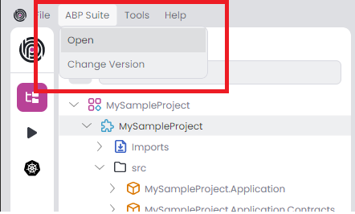
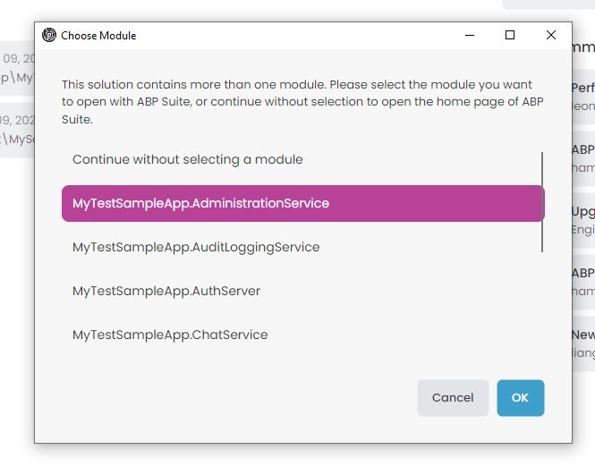
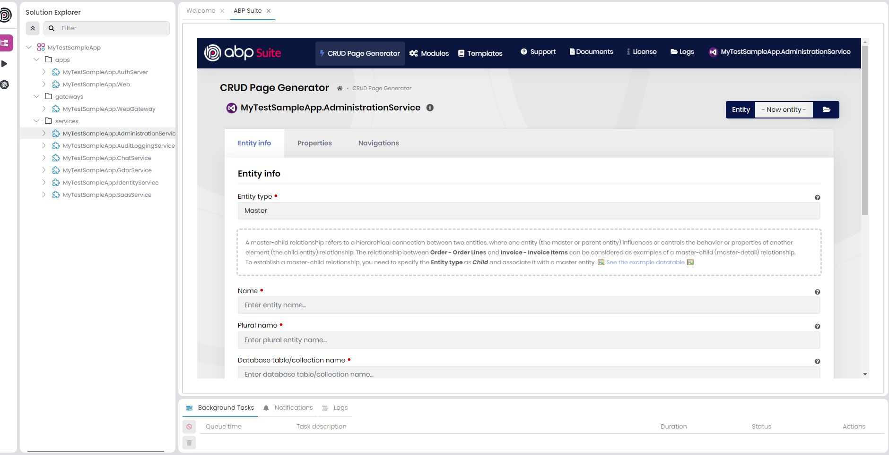
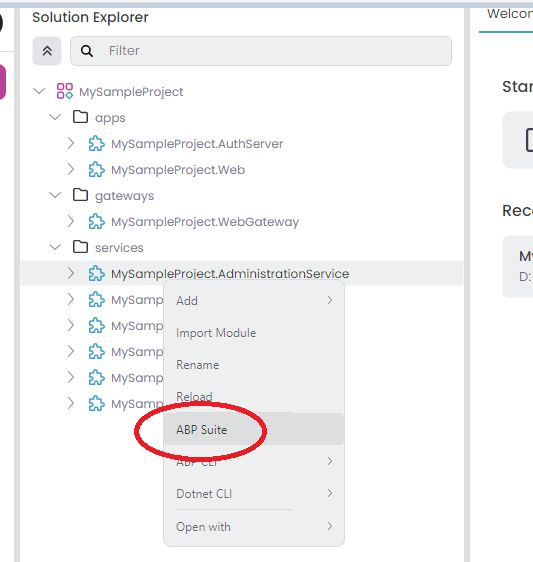
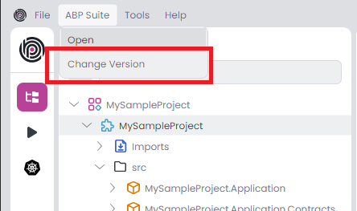
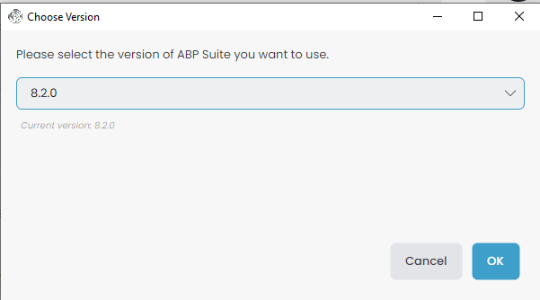

# ABP Studio: Working with ABP Suite

````json
//[doc-nav]
{
  "Next": {
    "Name": "ABP Suite",
    "Path": "suite/index"
  }
}
````

ABP Studio (Studio) has a shortcut for running [ABP Suite](../suite) (Suite) to allow using it without starting it externally and using it on a browser. Thus you can use both Studio and Suite as a united platform.

## Running Suite From Studio

### Opening from main window

The `Open` button in `ABP Suite` menu runs the Suite and opens it as a tab in the main page of Studio. It may take a few seconds to open Suite if it is not already running. The main page of Suite will be shown if there is not a module loaded in Studio. Otherwise, it will automatically open `Crud Page Generation` screen with the loaded module in Studio.




If There are more than one module which is openable via Suite, Studio will ask you to pick one of them before opening it. If you select a module, Suite will automatically open `Crud Page Generation` screen with the selected module. If you choose `Continue without selecting a module`, Suite main page will be opened.






### Opening from context menu

Alternatively, you can right click to a module in [Solution Explorer](solution-explorer.md) and click `ABP Suite` to open it with Suite. Suite will automatically open `Crud Page Generation` screen with the selected module.



## Supported Templates

Standard application solutions (`App` & `App-nolayers`)  generated by Studio are fully supported by Suite.

### Generating code on  the microservice Template

You can generate code on the services of the microservice solution. UI code generation is not supported at the moment. It is on the roadmap.

## Managing  Installed Version

You can update or downgrade the version of `ABP Suite` by `Change Version` button in `ABP Suite` menu.





## See Also

* [ABP Suite](../suite) 