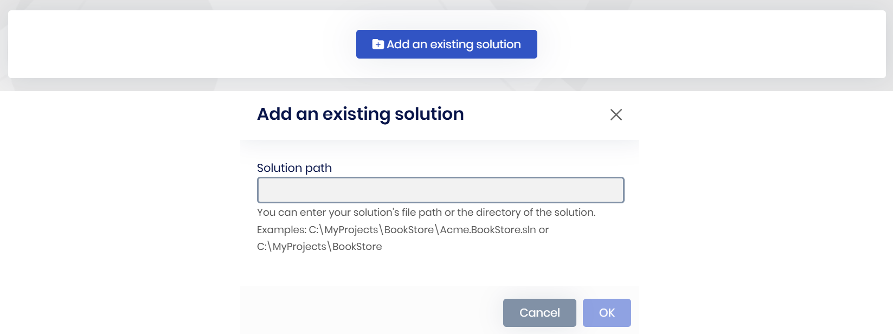

# Adding existing ABP solution

````json
//[doc-nav]
{
  "Previous": {
    "Name": "How to start ABP Suite?",
    "Path": "suite/how-to-start"
  },
  "Next": {
    "Name": "Creating a new ABP Solution",
    "Path": "suite/create-solution"
  }
}
````

ABP Suite requires an ABP solution to work on, that's why when you start it, you need an ABP Solution and it should be added in ABP Suite UI.

## Add an existing solution

Add your existing solution which was created from the [ABP Studio](../studio/index.md) or [ABP CLI](../cli/index.md). You have to enter your `YourProject.sln` file path. Also, it works if you enter the directory of the `YourProject.sln` when there's single solution inside.

