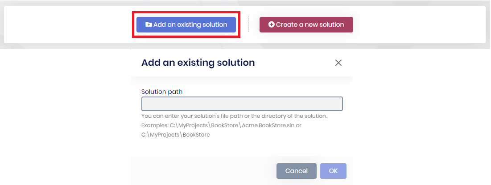

# Adding existing ABP solution

````json
//[doc-nav]
{
  "Previous": {
    "Name": "How to start ABP Suite?",
    "Path": "suite/how-to-start"
  },
  "Next": {
    "Name": "Creating a new ABP Solution",
    "Path": "suite/create-solution"
  }
}
````

ABP Suite requires an ABP solution to work on, that's why when you start it, you will see the following actions: `Add an existing solution`, `Create a new solution`.

## Add an existing solution

Adds your existing solution which was created from the [ABP CLI](../cli) or [abp.io](https://abp.io/get-started) website. You have to enter your `YourProject.sln` file path. It also works if you enter the directory of the `YourProject.sln` when there's single solution inside.

