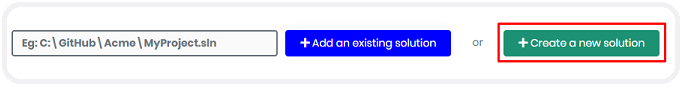
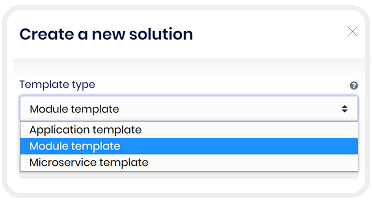
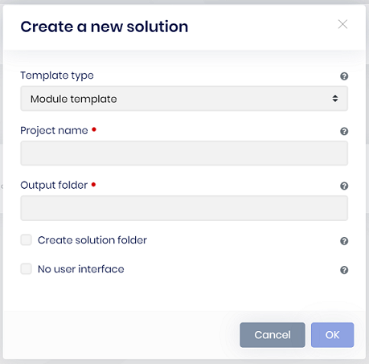
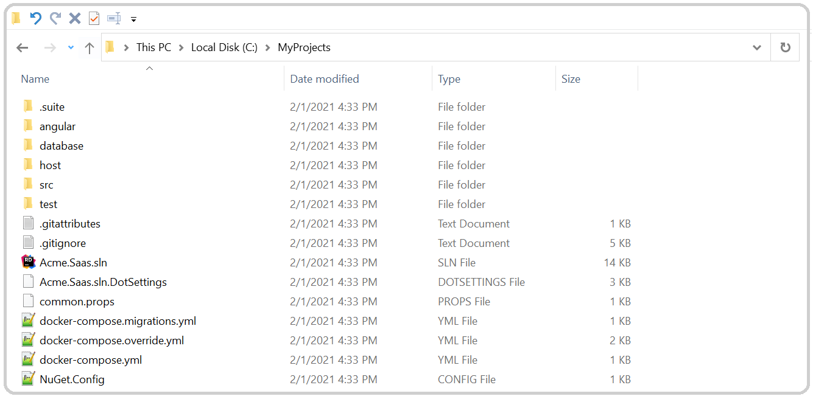
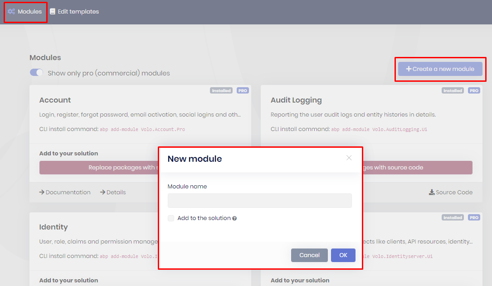

# Creating a new ABP module solution

````json
//[doc-nav]
{
  "Next": {
    "Name": "Module Startup Template Solution Structure",
    "Path": "suite/solution-structure"
  }
}
````

## Creating a new ABP module via ABP Suite

Creating a new ABP module via ABP Suite is an alternative way of creating an ABP module project rather than using [ABP CLI](../cli#new) or [abp.io](https://abp.io/get-started) website. To create a new ABP module solution, click the **Create a new solution** button. Then choose **module template** from the opening dialog.





Enter the all the required information.


- **Project name:** This is the module solution name and also the prefix for the namespace of your module solution. In this example `Acme.Saas` is the project name. The solution file will be named as `Acme.Saas.sln`. And the namespaces of `c#` classes will start with `Acme.Saas.*` prefix. 

- **Output folder:** This is the directory where the new module solution will be created in. ABP Suite automatically creates the output directory if not exists and places the module solution inside the output directory. See the below folder view for `Acme.Saas` project.

  

- **Create solution folder:** Creates a new folder in the output folder. If checked, the project will be in a new folder in the output folder, if unchecked project will be created directly in the output folder.

- **No user interface:** Specifies to not include the UI. This makes possible to create service-only modules (a.k.a. microservices - without UI).


## Adding your new ABP module to your main solution

You can create a standalone ABP module however you can also create a new  ABP module and add it to your existing ABP solution. To do this;

Open ABP Suite, click **Modules** menu item. Click the **Create a new module** on the right-top of the screen. You enter your module name and check **Add to the solution** checkbox. This will create a new ABP module without `host` folder in your active ABP solution. When you start your ABP solution, you can see this new module in your main menu. If you don't see it in your main menu, you may need to grant permission for this new module.


