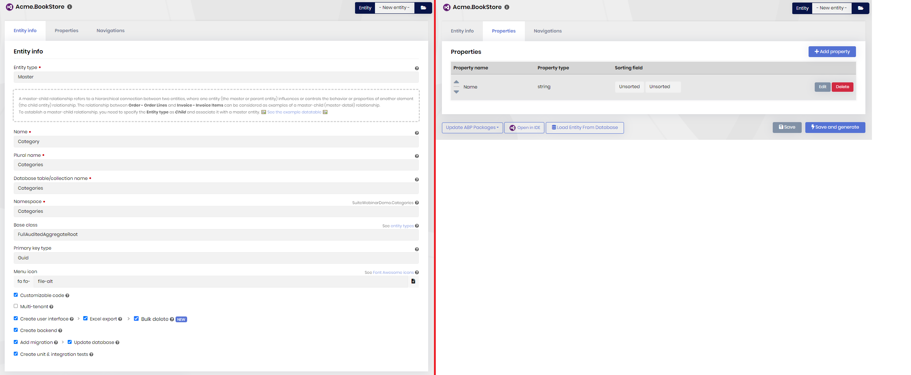
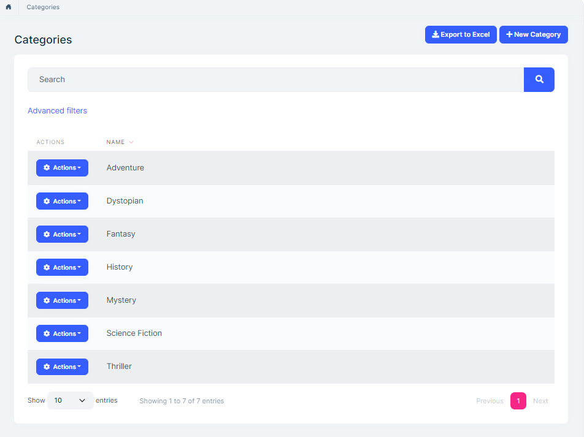
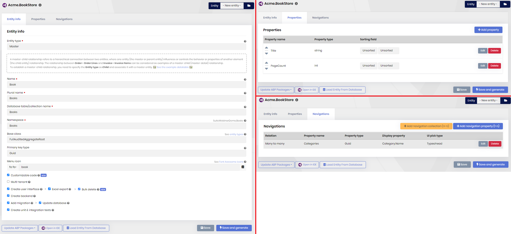
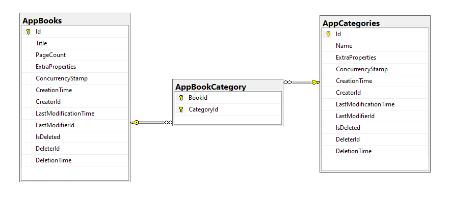
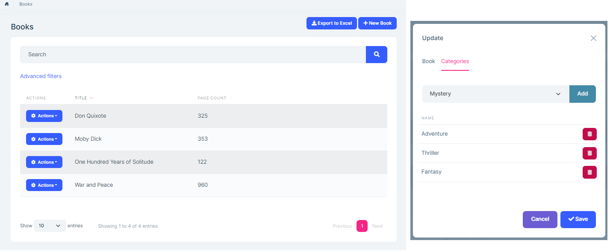

# Creating Many-To-Many Relationship

````json
//[doc-nav]
{
  "Previous": {
    "Name": "Generating a CRUD page",
    "Path": "suite/generating-crud-page"
  },
  "Next": {
    "Name": "Generating from an Existing Database",
    "Path": "suite/generating-entities-from-an-existing-database-table"
  }
}
````

ABP Suite allows you to create many-to-many relationships. You can select a foreign entity to define a **navigation collection** in the CRUD Page Generation interface.

## Navigation Collections

A **navigation collection** is a type of property on an entity that links multiple instances of a foreign entity. Unlike normal properties, these properties do not carry any data but links to other entities.

When you create a navigation collection with ABP Suite, you will get a typeahead dropdown to add a record from the dependent record list. Then you can add or remove records from the collection.

In this scenario, there are multiple records from one entity associated with multiple records from another entity. This means you will have another database table to keep these connections between entities. 

Let's see an example to understand it deeper...

### Creating a many to many relationship step by step 

We will have a `Book` entity and a `Category` entity. Each book may be in one or many category.

#### 1- Create the "Category" entity

First, we create the `Category` entity. The `Book` entity will be dependent on it. In the **Entity Info** tab, type "**Category**" in the **name** field. The rest will be automatically filled. Then click the **Properties** tab and add the property below :

- **Property name:** `Name`, **Property type:** `string`

Click the **Save and generate** button and wait for ABP Suite to create the page.



After it finishes, run the web project and go to the **Categories** page. Click the **New Category** button and add some records:




#### 2- Create the "Book" entity

Let's create the `Book` entity in ABP Suite. Click **-New entity-** in the **Entity** dropdown at the top of the page and type **"Book"** in the **Name** field. The rest will be automatically filled. Then click the **Properties** tab and add 2 properties:

1. **Property name:** `Title`, **Property type:** `string`
2. **Property name:** `PageCount`, **Property type:** `int`

Click the **Navigations** tab. Then click the **Add navigation collection** button. In the opening window, click the **Select dependent entity** textbox. A file browser will pop up. Find `Category.cs` that we've previously created in step 1.  `Category.cs`  is located in the `src\Acme.BookStore.Domain\Categories` directory. After you select the file, almost all fields will be automatically filled, except **Display Property**. Select `Name` from the **Properties** dropdown. It will write it to the **Display Property** textbox. Revise the other fields for the last check and click the **OK** button. A new navigation is added. Click the **Save and generate** button and wait for ABP Suite to create the Books page with the navigation collection.

> Notice that almost all fields are automatically filled by convention even if you don't rename the `DTO` names, `DbSet` names in the `DbContext`, navigation property names or namespaces. This tool will automatically set all the required fields. On the other hand, these textboxes are not read-only, so that you can change them according to your requirements.



##### Database structure of navigation collection

`AppBooks` and `AppCategories` tables are created. A third table (`AppBookCategory`) is created to keep the relation between those tables.



##### Final look

The below image is the final page created by ABP Suite. The **new book** dialog has a **Categories** tab which lists all categories of the book and allows add/remove categories.


