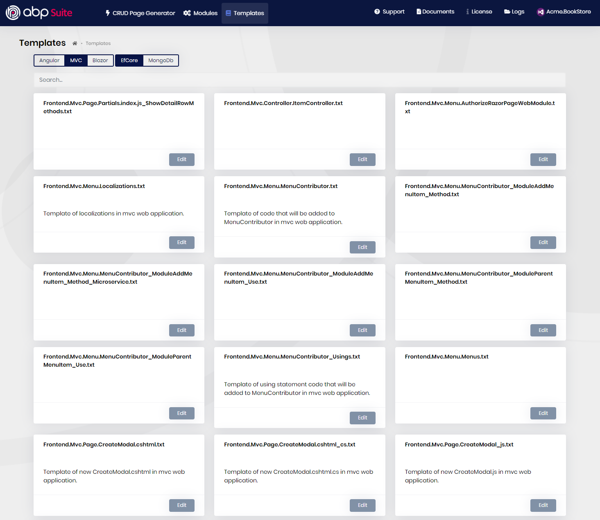
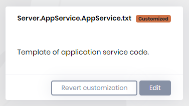

# Editing templates

ABP Suite uses templates to generate the code files. You can see the template files by clicking "Edit Templates" menu item.

The are 2 template filters:

1. **UI**:  You can switch between `Angular`, `MVC` and `Blazor` templates.
2. **Database provider:** You can switch between `EF Core` and `MongoDb` templates.

These filters are automatically selected based on your ABP solution. The selected solution is shown on the top right of the page. In the current screenshot it is "Acme.BookStore". 

ABP Suite templates are embedded resources which are stored in the `Volo.Abp.Commercial.SuiteTemplates` package. When you update your project, Suite templates are also being updated. To be able to generate the correct code for your project, the version of `Volo.Abp.Commercial.SuiteTemplates` must be the same as your Suite version.

## How do I find which template to edit ?

There's a search box on the templates page. To find the related template, pick a unique text from your generated code file and search it. The search, filters by template content.

There's a naming convention for the template files. 

* If the template name has `Server` prefix, it's used for backend code like repositories, application services, localizations, controllers, permissions, mappings, unit tests.
* If the template name has `Frontend.Angular` prefix, it's used for Angular code generation. The Angular code is being generated via [Angular Schematics](https://angular.io/guide/schematics).
* If the template name has `Frontend.Mvc`  prefix, it's used for razor pages, menus, JavaScript, CSS files.
* If the template name has `Frontend.Blazor` prefix, it's used for razor components.

## How do I edit the templates?

When you click the **Edit** button of a template card, you will see the template content and variables of the template. These variables are written in `%%my-variable%%` format. 

When you edit a template, you will see the "Customized" badge on the template card. You can revert back to the original content by clicking "Revert customization".

**Variables:**

You may need the variable list while editing a template content. These variables are populated based on the following project information;

* Solution name: **Acme.BookStore**
* Entity type: **Master**
* Entity name: **OrderLine**
* Plural name: **OrderLines**
* Database table: **OrderLines**
* Namespace: **OrderLines**
* Base class: **FullAuditedAggregateRoot**
* Primary key type: **Guid**
* Page title: **MyOrderLines**
* Menu icon: **fa fa-shopping**

| Variable name                       | Value                                                   |
| ----------------------------------- | ------------------------------------------------------- |
| %%solution-namespace%%              | Acme.BookStore                                          |
| %%solution-namespace-camelcase%%    | acme.bookStore                                          |
| %%project-name%%                    | Acme.BookStore                                          |
| %%only-project-name%%               | BookStore                                               |
| %%only-project-name-camelcase%%     | bookStore                                               |
| %%entity-namespace%%                | OrderLines                                              |
| %%entity-namespace-camelcase%%      | orderLines                                              |
| %%entity-name%%                     | OrderLine                                               |
| %%entity-name-computed%%            | OrderLine (or OrderLineWithNavigationProperties - if has navigations)                                               |
| %%entity-name-camelcase%%           | orderLine                                               |
| %%entity-name-plural%%              | OrderLines                                              |
| %%entity-name-plural-kebabcase%%    | order-lines                                             |
| %%entity-name-plural-camelcase%%    | orderLines                                              |
| %%entity-page-title%%               | MyOrderLines (page titles are localized by ABP Suite)   |
| %%menu-icon%%                       | fa-shopping                                             |
| %%primary-key%%                     | Guid                                                    |
| %%database-table-name%%             | OrderLines                                              |
| %%base-class%%                      | FullAuditedAggregateRoot                                |
| %%other-interfaces%%                | , IMultiTenant (*if multitenant*)                       |
| %%default-sorting%%                 | {0}Price asc                                            |
| %%with-navigation-properties%%      | WithNavigationProperties (*if has navigation property*) |
| %%entity-name-prefix%%              | OrderLine. (*if has navigation property*)               |
| %%entity-name-prefix-camelcase%%    | orderLine. (*if has navigation property*)               |
| %%entity-name-prefix-nullable%%     | orderLine?. (*if has navigation property*)              |
| %%module-name-slash-postfix%%       | BookStore/  (*for module template*)                     |
| %%custom-code-base%%                | Base (*if custom code support is enabled*)              |
| %%custom-code-abstract-modifier%%   | abstract  (*if custom code support is enabled*)         |
| %%custom-code-partial-modifier%%    | partial  (*if custom code support is enabled*)          |

**Variables for Master / Detail Relationship**:

If you establish a master/detail relationship, there are some variables that are used in templates for code generation. For example, for the `Order` as the master entity and `OrderLine` as the child entity of it, the following variables will be populated with the following values:

| Variable name                             | Value                                                                       |
| ----------------------------------------- | --------------------------------------------------------------------------- |
| %%child-master-entity-name%%              | Order                                                                       |
| %%child-entities-namespaces%%             | (all namespaces for the child entities of the Order master entity - line by line)          |
| %%child-entities-namespaces-razor%%       | (all namespaces for the child entities of the Order master entity - line by line - for Blazor UI)          |
| %%child-entities-appservice-injections%%  | (injects child entity application services to the razor page - e.g. `@inject IOrderLineAppService OrderLineAppService`)          |
| %%mapper-ignore-child-entities%%          | (mapping ignore statements for the child entities of the master entity - e.g. `.Ignore(x => x.OrderLines)`)       |

**Conditions:**

Conditions are if statements to render the related code-block. If the condition is true, then the inner text of the condition gets rendered. You can also use variables inside the condition blocks.

| Variable name                                                | Description                                                  |
| ------------------------------------------------------------ | ------------------------------------------------------------ |
| %%&lt;if:IMultiTenantEntity&gt;%%    %%&lt;/if:IMultiTenantEntity&gt;%% | If the entity is multi tenant.                               |
| %%&lt;if:ApplicationContractsNotExists&gt;%%    %%&lt;/if:ApplicationContractsNotExists&gt;%% | if `*.Application.Contracts` project exists                  |
| %%&lt;if:IsNonTieredArchitecture&gt;%%    %%&lt;/if:IsNonTieredArchitecture&gt;%% | if it's not a tiered application template. Means `*.HttpApi.Host` project doesn't exist |
| %%&lt;if:IsTieredArchitecture&gt;%%    %%&lt;/if:IsTieredArchitecture&gt;%% | if it's a tiered application template. Means `*.HttpApi.Host` project exists |
| %%&lt;if:IsModule&gt;%%    %%&lt;/if:IsModule&gt;%%          | if it's a module template.                                   |
| %%&lt;if:IHasConcurrencyStamp&gt;%%    %%&lt;/if:IHasConcurrencyStamp&gt;%%          | if it's implementing the `IHasConcurrencyStamp` interface or concurrency check is enabled                                   |
| %%&lt;if:PreserveCustomCodeNotEnabled&gt;%%    %%&lt;/if:PreserveCustomCodeNotEnabled&gt;%%          | if the custom code support is not enabled.                                  |
| %%&lt;if:IsChildEntity&gt;%%    %%&lt;/if:IsChildEntity&gt;%%          | if it's a child entity.                                   |
| %%&lt;if:IsMasterWithChildEntities&gt;%%    %%&lt;/if:IsMasterWithChildEntities&gt;%%          | if it's a master entity with child entities.                                   |
| %%&lt;if:HasNavigationProperties&gt;%%    %%&lt;/if:HasNavigationProperties&gt;%%          | if it has navigation properties.                                   |
| %%&lt;if:HasMasterEntityNavigationProperties&gt;%%    %%&lt;/if:HasMasterEntityNavigationProperties&gt;%%          | if it's a master entity and has navigation properties.                                   |
| %%&lt;if:HasFilterableProperties&gt;%%    %%&lt;/if:HasFilterableProperties&gt;%%          | if it has any filterable properties.                                   |
| %%&lt;if:HasAnyFilterableProperties&gt;%%    %%&lt;/if:HasAnyFilterableProperties&gt;%%    | if it has any filterable properties including navigation properties.                                   |
| %%&lt;if:BulkDeleteEnabled&gt;%%    %%&lt;/if:BulkDeleteEnabled&gt;%%          | if the bulk delete is enabled.                                   |
