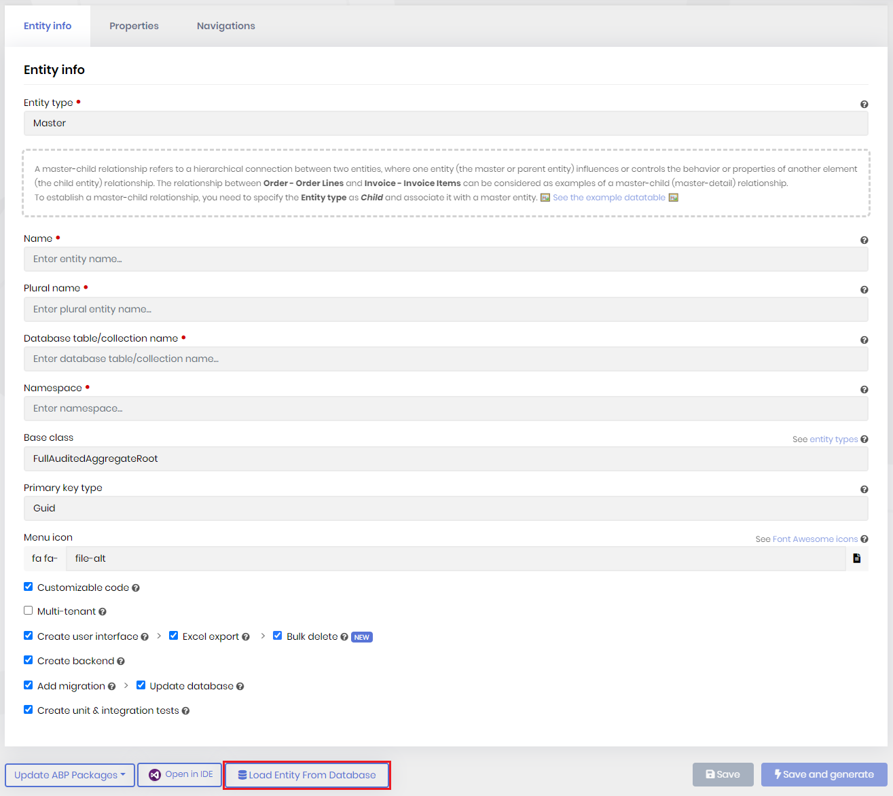
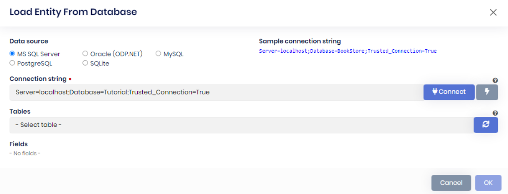
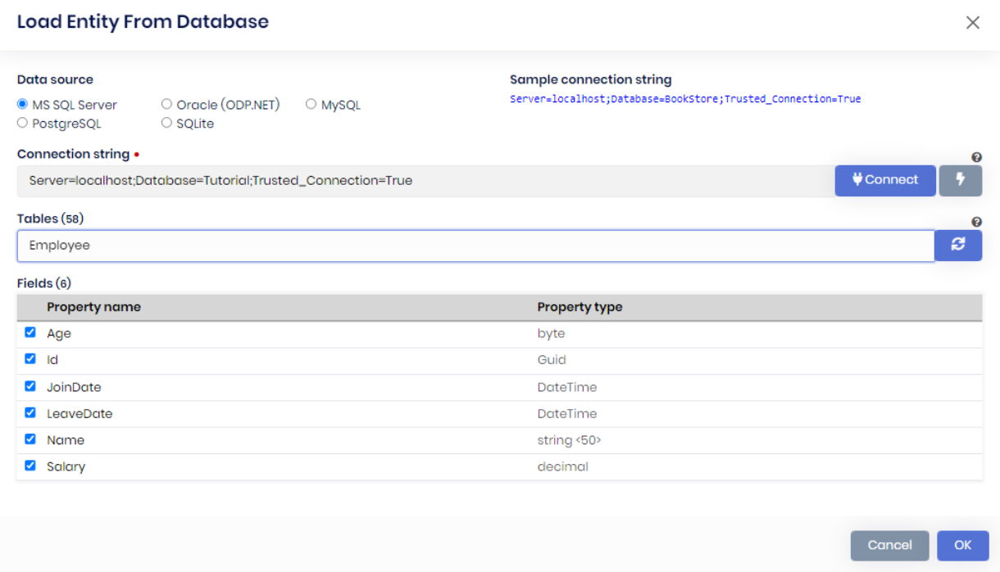
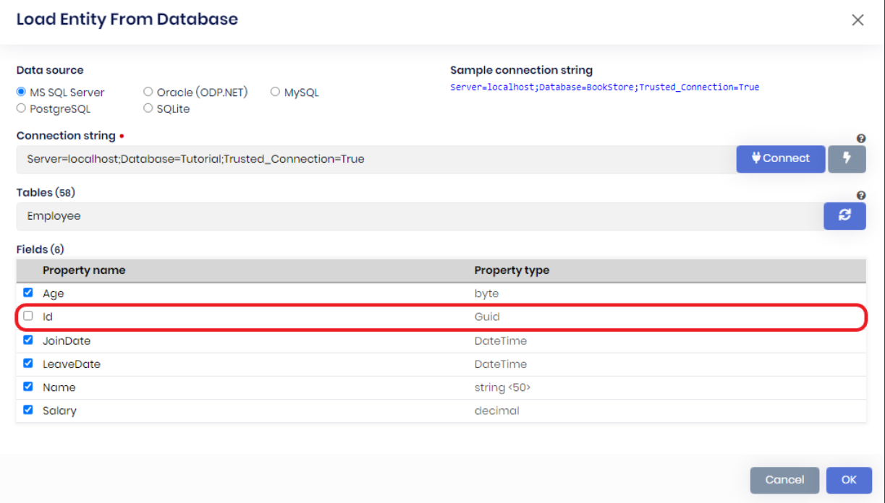
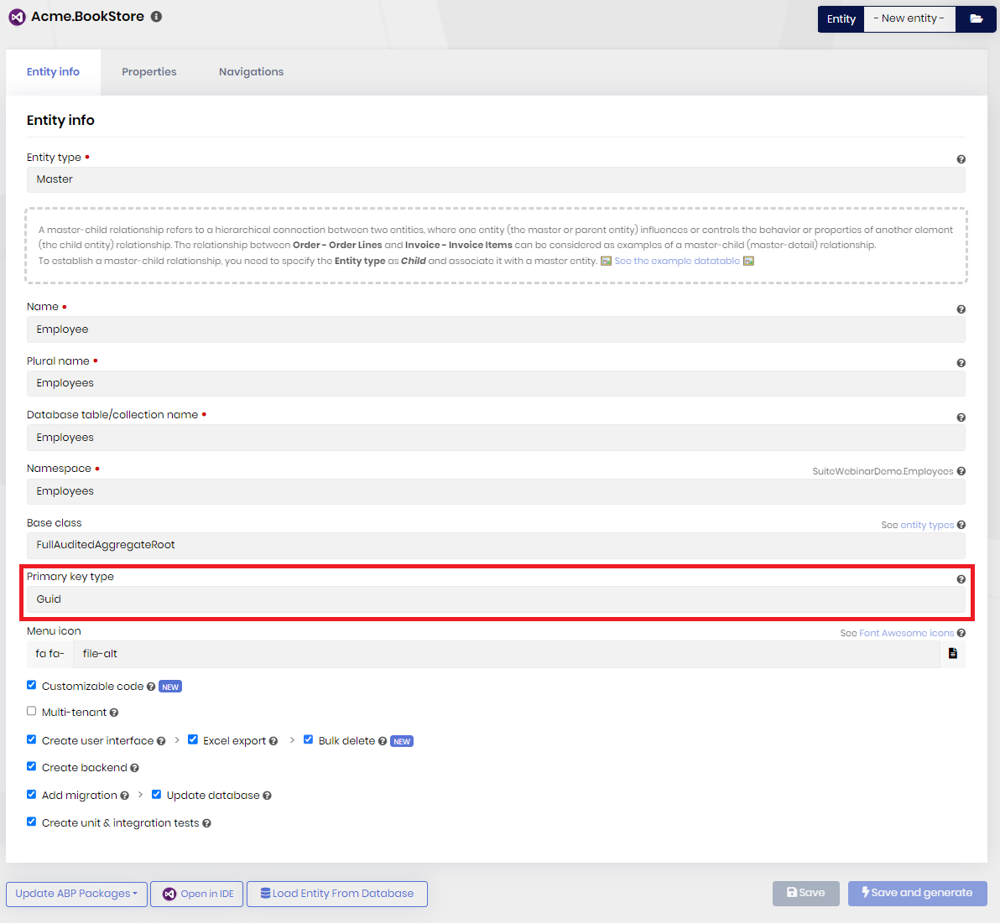

# Generating CRUD Pages From an Existing Database Table

````json
//[doc-nav]
{
  "Previous": {
    "Name": "Creating Many-To-Many Relationship",
    "Path": "suite/creating-many-to-many-relationship"
  },
  "Next": {
    "Name": "Creating master-detail (master-child) relationship",
    "Path": "suite/creating-master-detail-relationship"
  }
}
````

If you have an existing database table, you can generate the entities using ABP Suite and create a CRUD page based on those entities, let's get started.

## Create/open your project


Either create a new project or open an existing project that's based on an app or module template.

## Generate the Entities

After opening the project in ABP Suite, scroll down to the bottom and click the **Load Entity From Database** button:


This will open the window seen below, choose the data source of your database and add the connection string of your project:


Click the lightning icon to test the connection, and then connect to the database by clicking **connect**, and this should extend the window as the following window:


Uncheck the Id property since it automatically gets generated, it'll cause an error if we generate it twice, then click **OK**:


After that, make sure the primary key type is selected, then click **Save and generate**:


The following GIF is a summary of the previous steps: 

## Run the Project!

After that, run the project and watch the magic! An easy CRUD app using the entities from an existing database table!
