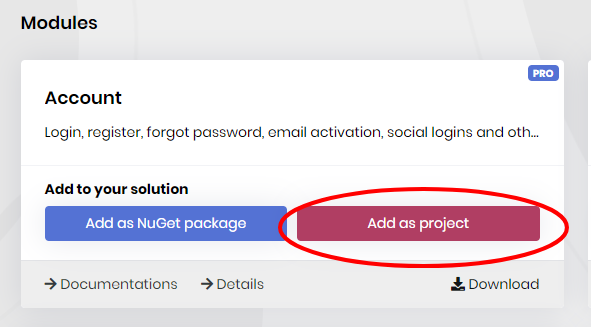
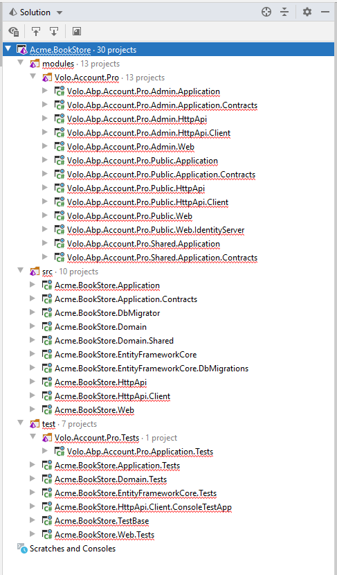
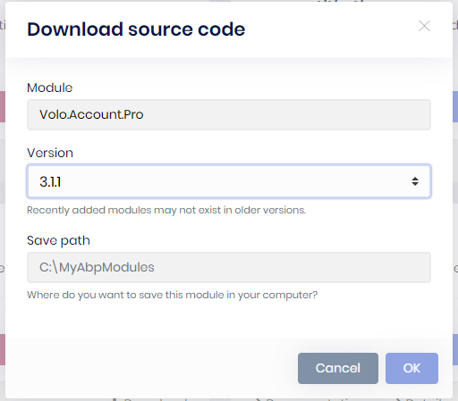

# Accessing Source Code Of Modules

**If your [license plan](https://abp.io/pricing) allows you to access the source code of [modules](https://abp.io/modules)**, you can use ABP Suite to download the source code and add downloaded source code of modules to your solution structure.

## Adding a Module With Source Code

If you want to add a module with source code or have an already added module that you want to add with source code instead of NuGet reference, you can do those with ABP Suite. 

All you have to do is opening **Modules** page and use `add as project` button on the module you want to add with source code. You can use this feature even if module is already added as NuGet reference.

The process may take awhile since it  downloads the source code from GitHub. After process ends, re-open your solution and you will see the source code of the module under modules folder in your solution structure, including test projects.

## Downloading Source Code of a Module

If you want to have the source code in your local or see the source code for inspiration, you can easily download it to your computer.

1) Go to **Modules** page in Abp Suite. You will see the download button on each of the modules.

2) You will see a **pop-up** form that you can choose a version and specify the download location.

3) Click **OK** to start the download.