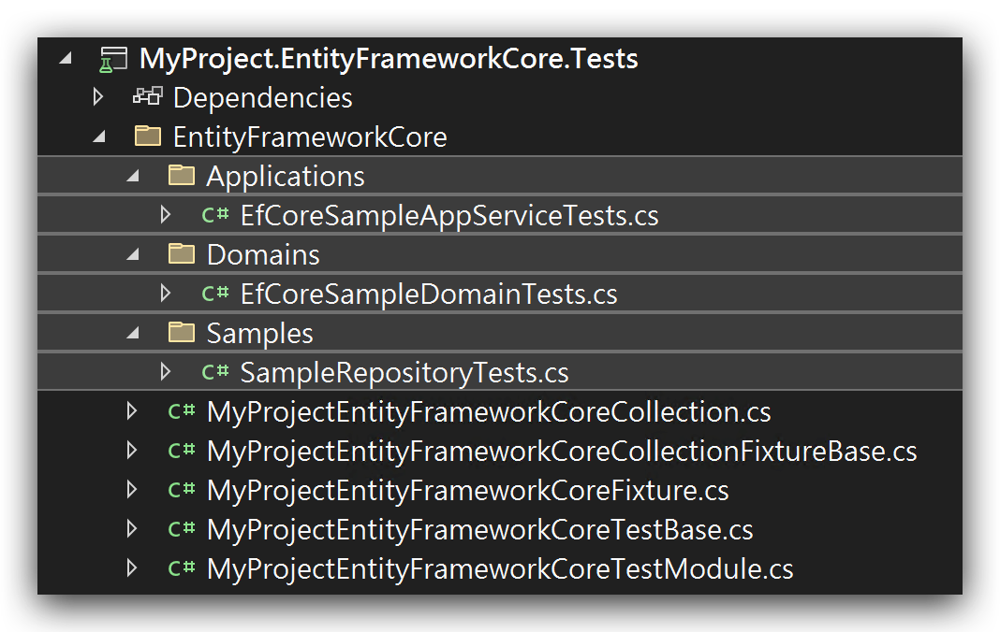

# Integration Tests

````json
//[doc-nav]
{  
  "Previous": {
    "Name": "Unit tests",
    "Path": "testing/unit-tests"
  },
  "Next": {
    "Name": "UI tests",
    "Path": "testing/ui-tests"
  }
}
````

> You can also follow the [web application development tutorial](../tutorials/book-store/part-01.md) to learn developing a full stack application, including the integration tests.

## The Integration Test Infrastructure

ABP provides a complete infrastructure to write integration tests. All the ABP infrastructure and services will perform in your tests. The application startup template comes with the necessary infrastructure pre-configured for you;

### The Database

The startup template is configured to use **in-memory SQLite** database for the EF Core (for MongoDB, it uses [EphemeralMongo](https://github.com/asimmon/ephemeral-mongo) library). So, all the configuration and queries are performed against a real database and you can even test database transactions.

Using in-memory SQLite database has two main advantages;

* It is faster compared to an external DBMS.
* It create a **new fresh database** for each test case, so tests doesn't affect each other.

> **Tip**: Do not use EF Core's In-Memory database for advanced integration tests. It is not a real DBMS and has many differences in details. For example, it doesn't support transaction and rollback scenarios, so you can't truly test the failing scenarios. On the other hand, In-Memory SQLite is a real DBMS and supports the fundamental SQL database features.

## The Seed Data

Writing tests against an empty database is not practical. In most cases, you need to some initial data in the database. For example, if you write a test class that query, update and delete the products, it would be helpful to have a few products in the database before executing the test case.

ABP's [Data Seeding](../framework/infrastructure/data-seeding.md) system is a powerful way to seed the initial data. The application startup template has a *YourProject*TestDataSeedContributor class in the `.TestBase` project. You can fill it to have an initial data that you can use for each test method.

**Example: Create some Issues as the seed data**

````csharp
using System.Threading.Tasks;
using MyProject.Issues;
using Volo.Abp.Data;
using Volo.Abp.DependencyInjection;

namespace MyProject
{
    public class MyProjectTestDataSeedContributor
        : IDataSeedContributor, ITransientDependency
    {
        private readonly IIssueRepository _issueRepository;

        public MyProjectTestDataSeedContributor(IIssueRepository issueRepository)
        {
            _issueRepository = issueRepository;
        }

        public async Task SeedAsync(DataSeedContext context)
        {
            await _issueRepository.InsertAsync(
                new Issue
                {
                    Title = "Test issue one",
                    Description = "Test issue one description",
                    AssignedUserId = TestData.User1Id
                });

            await _issueRepository.InsertAsync(
                new Issue
                {
                    Title = "Test issue two",
                    Description = "Test issue two description",
                    AssignedUserId = TestData.User1Id
                });

            await _issueRepository.InsertAsync(
                new Issue
                {
                    Title = "Test issue three",
                    Description = "Test issue three description",
                    AssignedUserId = TestData.User1Id
                });

            await _issueRepository.InsertAsync(
                new Issue
                {
                    Title = "Test issue four",
                    Description = "Test issue four description",
                    AssignedUserId = TestData.User2Id
                });
        }
    }
}
````

Also created a static class to store the User `Ids`:

````csharp
using System;

namespace MyProject
{
    public static class TestData
    {
        public static Guid User1Id = Guid.Parse("41951813-5CF9-4204-8B18-CD765DBCBC9B");
        public static Guid User2Id = Guid.Parse("2DAB4460-C21B-4925-BF41-A52750A9B999");
    }
}
````

In this way, we can use these known *Issues* and the Users' `Id`s to perform the tests.

## Example: Testing a Domain Service

`AbpIntegratedTest<T>` class (defined in the [Volo.Abp.TestBase](https://www.nuget.org/packages/Volo.Abp.TestBase) package) is used to write tests integrated to the ABP. `T` is the Type of the root module to setup and initialize the application.

The [application startup template](../solution-templates/index.md) has base classes in each test project, so you can derive from these base classes to make it easier.

See the `IssueManager` tests are re-written as integration tests:

````csharp
using System.Threading.Tasks;
using Shouldly;
using Volo.Abp;
using Xunit;

namespace MyProject.Issues
{
    public abstract class IssueManager_Integration_Tests<TStartupModule> : MyProjectDomainTestBase<TStartupModule>
        where TStartupModule : IAbpModule
    {
        private readonly IssueManager _issueManager;
        private readonly Issue _issue;

        protected IssueManager_Integration_Tests()
        {
            _issueManager = GetRequiredService<IssueManager>();
            _issue = new Issue
            {
                Title = "Test title",
                Description = "Test description"
            };
        }

        [Fact]
        public async Task Should_Not_Allow_To_Assign_Issues_Over_The_Limit()
        {
            // Act & Assert
            await Assert.ThrowsAsync<BusinessException>(async () =>
            {
                await _issueManager.AssignToUserAsync(_issue, TestData.User1Id);
            });

            _issue.AssignedUserId.ShouldBeNull();
        }
        
        [Fact]
        public async Task Should_Assign_An_Issue_To_A_User()
        {
            // Act
            await _issueManager.AssignToUserAsync(_issue, TestData.User2Id);

            //Assert
            _issue.AssignedUserId.ShouldBe(TestData.User2Id);
        }
    }
}
````

> The `IssueManager_Integration_Tests` class is an abstract class, and tests in this class are not seen on the tests explorer, see the **Implementing unit tests in EF Core and MongoDB** section below to learn how to list tests in the test explorer and run them.

* First test method assigns the issue to the User 1, which has already assigned to 3 issues in the Data Seed code. So, it throws a `BusinessException`.
* Second test method assigns the issue to User 2, which has only 1 issue assigned. So, the method succeeds.

This class typically locates in the `.Domain.Tests` project since it tests a class located in the `.Domain` project. It is derived from the `MyProjectDomainTestBase` which is already configured to properly run the tests.

Writing such an integration test class is very straightforward. Another benefit is that you won't need to change the test class later when you add another dependency to the `IssueManager` class.

## Example: Testing an Application Service

Testing an [Application Service](../framework/architecture/domain-driven-design/application-services.md) is not so different. Assume that you've created an `IssueAppService` as defined below:

````csharp
using System.Collections.Generic;
using System.Threading.Tasks;
using Volo.Abp.Application.Services;

namespace MyProject.Issues
{
    public class IssueAppService : ApplicationService, IIssueAppService
    {
        private readonly IIssueRepository _issueRepository;

        public IssueAppService(IIssueRepository issueRepository)
        {
            _issueRepository = issueRepository;
        }

        public async Task<List<IssueDto>> GetListAsync()
        {
            var issues = await _issueRepository.GetListAsync();

            return ObjectMapper.Map<List<Issue>, List<IssueDto>>(issues);
        }
    }
}
````

> *(assuming you've also defined the `IIssueAppService` and `IssueDto` and created the [object mapping](../framework/infrastructure/object-to-object-mapping.md) between `Issue` and the `IssueDto`)*

Now, you can write a test class inside the `.Application.Tests` project:

````csharp
using System.Threading.Tasks;
using Shouldly;
using Xunit;

namespace MyProject.Issues
{
    public abstract class IssueAppService_Tests<TStartupModule> : MyProjectApplicationTestBase<TStartupModule>
        where TStartupModule : IAbpModule
    {
        private readonly IIssueAppService _issueAppService;

        protected IssueAppService_Tests()
        {
            _issueAppService = GetRequiredService<IIssueAppService>();
        }

        [Fact]
        public async Task Should_Get_All_Issues()
        {
            //Act
            var issueDtos = await _issueAppService.GetListAsync();

            //Assert
            issueDtos.Count.ShouldBeGreaterThan(0);
        }
    }
}
````

> The `IssueAppService_Tests` class is an abstract, and tests in this class are not seen on the tests explorer, see the **Implementing unit tests in EF Core and MongoDB** section below to learn how to list tests in the test explorer and run them.

It's that simple. This test method tests everything, including the application service, EF Core mapping, object to object mapping and the repository implementation. In this way, you can fully test the Application Layer and the Domain Layer of your solution.

## Dealing with Unit of Work in Integration Tests

ABP's [Unit of Work](../framework/architecture/domain-driven-design/unit-of-work.md) system controls the database connection and transaction management in your application. It seamlessly works while you writing your application code, so you may not aware of it.

In the ABP, all the database operations must be performed inside a unit of work scope. When you test an [application service](../framework/architecture/domain-driven-design/application-services.md) method, the unit of work scope will be the scope of your application service method. If you are testing a [repository](../framework/architecture/domain-driven-design/repositories.md) method, the unit of work scope will be the scope of your repository method.

In some cases, you may need to manually control the unit of work scope. Consider the following test method:

````csharp
public abstract class IssueRepository_Tests<TStartupModule> : MyProjectDomainTestBase<TStartupModule>
    where TStartupModule : IAbpModule
{
    private readonly IRepository<Issue, Guid> _issueRepository;

    protected IssueRepository_Tests()
    {
        _issueRepository = GetRequiredService<IRepository<Issue, Guid>>();
    }

    public async Task Should_Query_By_Title()
    {
        IQueryable<Issue> queryable = await _issueRepository.GetQueryableAsync();
        var issue = queryable.FirstOrDefaultAsync(i => i.Title == "My issue title");
        issue.ShouldNotBeNull();
    }
}
````

> The `IssueRepository_Tests` class is an abstract, and tests in this class are not seen on the tests explorer, see the **Implementing unit tests in EF Core and MongoDB** section below to learn how to list tests in the test explorer and run them.

We are using `_issueRepository.GetQueryableAsync` to obtain an `IQueryable<Issue>` object. Then, we are using the `FirstOrDefaultAsync` method to query an issue by its title. The database query is executed at this point, and you get an exception indicating that there is no active unit of work.

To make that test properly working, you should manually start a unit of work scope as shown in the following example:

````csharp
public abstract class IssueRepository_Tests<TStartupModule> : MyProjectDomainTestBase<TStartupModule>
    where TStartupModule : IAbpModule
{
    private readonly IRepository<Issue, Guid> _issueRepository;
    private readonly IUnitOfWorkManager _unitOfWorkManager;

    protected IssueRepository_Tests()
    {
        _issueRepository = GetRequiredService<IRepository<Issue, Guid>>();
        _unitOfWorkManager = GetRequiredService<IUnitOfWorkManager>();
    }

    public async Task Should_Query_By_Title()
    {
        using (var uow = _unitOfWorkManager.Begin())
        {
            IQueryable<Issue> queryable = await _issueRepository.GetQueryableAsync();
            var issue = queryable.FirstOrDefaultAsync(i => i.Title == "My issue title");
            issue.ShouldNotBeNull();
            await uow.CompleteAsync();
        }
    }
}
````

We've used the `IUnitOfWorkManager` service to create a unit of work scope, then called the `FirstOrDefaultAsync` method inside that scope, so we don't have the problem anymore.

> Note that we've tested the `FirstOrDefaultAsync` to demonstrate the unit of work problem. Normally, as a good principle, you should write tests only your own code.

You could also use `WithUnitOfWorkAsync` to achieve the same functionality instead of writing the same using block in your tests.

Here is the same test scenario using `WithUnitOfWorkAsync`:

````csharp
public abstract class IssueRepository_Tests<TStartupModule> : MyProjectDomainTestBase<TStartupModule>
    where TStartupModule : IAbpModule
{
    private readonly IRepository<Issue, Guid> _issueRepository;
    private readonly IUnitOfWorkManager _unitOfWorkManager;

    protected IssueRepository_Tests()
    {
        _issueRepository = GetRequiredService<IRepository<Issue, Guid>>();
        _unitOfWorkManager = GetRequiredService<IUnitOfWorkManager>();
    }

    public async Task Should_Query_By_Title()
    {
        await WithUnitOfWorkAsync(() =>
        {
            IQueryable<Issue> queryable = await _issueRepository.GetQueryableAsync();
            var issue = queryable.FirstOrDefaultAsync(i => i.Title == "My issue title");
            issue.ShouldNotBeNull();
        });
    }
}
````

There are multiple overloads of the `WithUnitOfWorkAsync` method that you can use based on your specific needs.

## Working with DbContext

In some cases, you may want to directory work with the [Entity Framework's `DbContext` object](https://learn.microsoft.com/en-us/dotnet/api/system.data.entity.dbcontext) to perform database operations in your test methods. In this case, you can use `IDbContextProvider<T>`service to obtain a `DbContext` instance inside a unit of work.

The following example shows how you can create a `DbContext` object in a test method:

````csharp
public abstract class MyDbContext_Tests<TStartupModule> : MyProjectDomainTestBase<TStartupModule>
    where TStartupModule : IAbpModule
{
    private readonly IDbContextProvider<MyProjectDbContext> _dbContextProvider;
    private readonly IUnitOfWorkManager _unitOfWorkManager;

    protected IssueRepository_Tests()
    {
        _dbContextProvider = GetRequiredService<IDbContextProvider<MyProjectDbContext>>();
        _unitOfWorkManager = GetRequiredService<IUnitOfWorkManager>();
    }

    public async Task Should_Query_By_Title()
    {
        using (var uow = _unitOfWorkManager.Begin())
        {
            var dbContext = await _dbContextProvider.GetDbContextAsync();
            var issue = await dbContext.Issues.FirstOrDefaultAsync(i => i.Title == "My issue title");
            issue.ShouldNotBeNull();
            await uow.CompleteAsync();
        }
    }
}
````

> The `MyDbContext_Tests` class is an abstract, and tests in this class are not seen on the tests explorer, see the **Implementing unit tests in EF Core and MongoDB** section below to learn how to list tests in the test explorer and run them.

Just like we've done in the *Dealing with Unit of Work in Integration Tests* section, we should perform `DbContext` operations inside an active unit of work.

For [MongoDB](../framework/data/mongodb/index.md), you can use the `IMongoDbContextProvider<T>` service to obtain a `DbContext` object and directly use MongoDB APIs in your test methods.

## Implementing unit tests in EF Core and MongoDB

The unit test classes in the `.Domain.Test` and `.Application.Tests` projects are all abstract classes. Therefore, we need to implement the test classes in EF Core or MongoDB test projects to run the tests, otherwise they will be ignored.

An example implementation for the `IssueManager_Integration_Tests` class in the `.EntityFrameworkCore.Tests` project is shown below:

````csharp
namespace MyProject.EntityFrameworkCore.Applications;

public class EfCoreIssueAppService_Tests : IssueAppService_Tests<MyProjectEntityFrameworkCoreTestModule>
{

}
````

> By deriving from the related abstract classes, now we can see the all tests in the test explorers and run them.



As you can see from the folder structure, all tests are clearly placed into the related subfolders, and they will be seen in the test explorer with this separation. Thus, you can clearly see which tests are related to which layers and projects.
