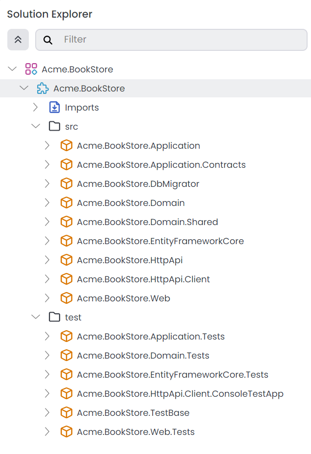

# Web Application Development (with ABP Suite) Tutorial - Part 1: Creating the Solution
````json
//[doc-params]
{
    "UI": ["MVC"],
    "DB": ["EF"]
}
````
````json
//[doc-nav]
{
  "Next": {
    "Name": "Creating the Books",
    "Path": "tutorials/book-store-with-abp-suite/part-02"
  }
}
````

Before starting the development, create a new solution named `Acme.BookStore` and run it by following the [getting started tutorial](../../get-started/layered-web-application.md)

You can use the following configurations:

* **Solution Name:** `Acme.BookStore`
* **UI Framework:** {{if UI=="MVC}} ASP.NET Core MVC / Razor Pages {{end}}
* **UI Theme:** LeptonX
* **Mobile Framwork:** None
* **Database Provider:** {{if DB=="EF"}} Entity Framework Core {{end}}

You can select the other options based on your preference.

> **Please complete the [Get Stared](../../get-started/layered-web-application.md) guide and run the web application before going further.**

The initial solution structure should be like the following in the ABP Studio's [Solution Explorer](../../studio/solution-explorer.md):

