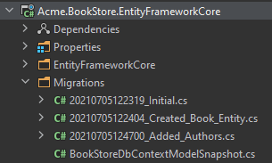

# Web Application Development Tutorial - Part 7: Authors: Database Integration
````json
//[doc-params]
{
    "UI": ["MVC","Blazor","BlazorServer","NG"],
    "DB": ["EF","Mongo"]
}
````

````json
//[doc-nav]
{
  "Next": {
    "Name": "Authors: Application Layer",
    "Path": "tutorials/book-store/part-08"
  },
  "Previous": {
    "Name": "Authors: Domain Layer",
    "Path": "tutorials/book-store/part-06"
  }
}
````

## Introduction

This part explains how to configure the database integration for the `Author` entity introduced in the previous part.

{{if DB=="EF"}}

## DB Context

Open the `BookStoreDbContext` in the `Acme.BookStore.EntityFrameworkCore` project and add the following `DbSet` property:

````csharp
public DbSet<Author> Authors { get; set; }
````

Then locate to the `OnModelCreating` method in `BookStoreDbContext` class in the same project and add the following lines to the end of the method:

````csharp
builder.Entity<Author>(b =>
{
    b.ToTable(BookStoreConsts.DbTablePrefix + "Authors",
        BookStoreConsts.DbSchema);
    
    b.ConfigureByConvention();
    
    b.Property(x => x.Name)
        .IsRequired()
        .HasMaxLength(AuthorConsts.MaxNameLength);

    b.HasIndex(x => x.Name);
});
````

This is just like done for the `Book` entity before, so no need to explain again.

## Create a new Database Migration

The startup solution is configured to use [Entity Framework Core Code First Migrations](https://docs.microsoft.com/en-us/ef/core/managing-schemas/migrations/). Since we've changed the database mapping configuration, we should create a new migration and apply changes to the database.

Open a command-line terminal in the directory of the `Acme.BookStore.EntityFrameworkCore` project and type the following command:

````bash
dotnet ef migrations add Added_Authors
````

This will add a new migration class to the project:



You can apply changes to the database using the following command, in the same command-line terminal:

````bash
dotnet ef database update
````

> If you are using Visual Studio, you may want to use the `Add-Migration Added_Authors` and `Update-Database` commands in the *Package Manager Console (PMC)*. In this case, ensure that `Acme.BookStore.EntityFrameworkCore` is the startup project in Visual Studio and `Acme.BookStore.EntityFrameworkCore` is the *Default Project* in PMC.

{{else if DB=="Mongo"}}

## DB Context

Open the `BookStoreMongoDbContext` in the `MongoDb` folder of the `Acme.BookStore.MongoDB` project and add the following property to the class:

````csharp
public IMongoCollection<Author> Authors => Collection<Author>();
````

{{end}}

## Implementing the IAuthorRepository

{{if DB=="EF"}}

Create a new class, named `EfCoreAuthorRepository` inside the `Acme.BookStore.EntityFrameworkCore` project (in the `Authors` folder) and paste the following code:

````csharp
using System;
using System.Collections.Generic;
using System.Linq;
using System.Linq.Dynamic.Core;
using System.Threading.Tasks;
using Acme.BookStore.EntityFrameworkCore;
using Microsoft.EntityFrameworkCore;
using Volo.Abp.Domain.Repositories.EntityFrameworkCore;
using Volo.Abp.EntityFrameworkCore;

namespace Acme.BookStore.Authors;

public class EfCoreAuthorRepository
    : EfCoreRepository<BookStoreDbContext, Author, Guid>,
        IAuthorRepository
{
    public EfCoreAuthorRepository(
        IDbContextProvider<BookStoreDbContext> dbContextProvider)
        : base(dbContextProvider)
    {
    }

    public async Task<Author> FindByNameAsync(string name)
    {
        var dbSet = await GetDbSetAsync();
        return await dbSet.FirstOrDefaultAsync(author => author.Name == name);
    }

    public async Task<List<Author>> GetListAsync(
        int skipCount,
        int maxResultCount,
        string sorting,
        string filter = null)
    {
        var dbSet = await GetDbSetAsync();
        return await dbSet
            .WhereIf(
                !filter.IsNullOrWhiteSpace(),
                author => author.Name.Contains(filter)
                )
            .OrderBy(sorting)
            .Skip(skipCount)
            .Take(maxResultCount)
            .ToListAsync();
    }
}
````

* Inherited from the `EfCoreRepository`, so it inherits the standard repository method implementations.
* `WhereIf` is a shortcut extension method of the ABP. It adds the `Where` condition only if the first condition meets (it filters by name, only if the filter was provided). You could do the same yourself, but these type of shortcut methods makes our life easier.
* `sorting` can be a string like `Name`, `Name ASC` or `Name DESC`. It is possible by using the [System.Linq.Dynamic.Core](https://www.nuget.org/packages/System.Linq.Dynamic.Core) NuGet package.

> See the [EF Core Integration document](../../framework/data/entity-framework-core) for more information on the EF Core based repositories.

{{else if DB=="Mongo"}}

Create a new class, named `MongoDbAuthorRepository` inside the `Acme.BookStore.MongoDB` project (in the `Authors` folder) and paste the following code:

```csharp
using System;
using System.Linq;
using System.Linq.Dynamic.Core;
using System.Collections.Generic;
using System.Threading.Tasks;
using Acme.BookStore.MongoDB;
using MongoDB.Driver;
using MongoDB.Driver.Linq;
using Volo.Abp.Domain.Repositories.MongoDB;
using Volo.Abp.MongoDB;

namespace Acme.BookStore.Authors;

public class MongoDbAuthorRepository
    : MongoDbRepository<BookStoreMongoDbContext, Author, Guid>,
    IAuthorRepository
{
    public MongoDbAuthorRepository(
        IMongoDbContextProvider<BookStoreMongoDbContext> dbContextProvider
        ) : base(dbContextProvider)
    {
    }

    public async Task<Author> FindByNameAsync(string name)
    {
        var queryable = await GetMongoQueryableAsync();
        return await queryable.FirstOrDefaultAsync(author => author.Name == name);
    }

    public async Task<List<Author>> GetListAsync(
        int skipCount,
        int maxResultCount,
        string sorting,
        string filter = null)
    {
        var queryable = await GetMongoQueryableAsync();
        return await queryable
            .WhereIf<Author, IMongoQueryable<Author>>(
                !filter.IsNullOrWhiteSpace(),
                author => author.Name.Contains(filter)
            )
            .OrderBy(sorting)
            .As<IMongoQueryable<Author>>()
            .Skip(skipCount)
            .Take(maxResultCount)
            .ToListAsync();
    }
}
```

* Inherited from the `MongoDbRepository`, so it inherits the standard repository method implementations.
* `WhereIf` is a shortcut extension method of the ABP. It adds the `Where` condition only if the first condition meets (it filters by name, only if the filter was provided). You could do the same yourself, but these type of shortcut methods makes our life easier.
* `sorting` can be a string like `Name`, `Name ASC` or `Name DESC`. It is possible by using the [System.Linq.Dynamic.Core](https://www.nuget.org/packages/System.Linq.Dynamic.Core) NuGet package.

> See the [MongoDB Integration document](../../framework/data/mongodb) for more information on the MongoDB based repositories.

{{end}}