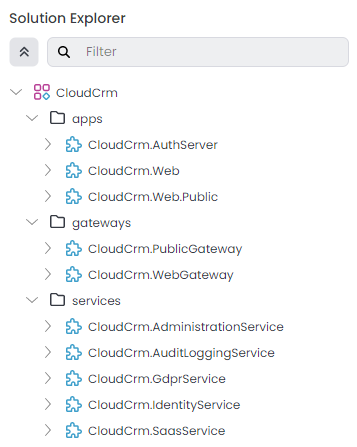

# Microservice Tutorial Part 01: Creating the Initial Solution

````json
//[doc-nav]
{
  "Next": {
    "Name": "Creating the initial Products service",
    "Path": "tutorials/microservice/part-02"
  }
}
````

Follow the *[Get Stared](../../get-started/microservice.md)* guide to create a new layered web application with the following configuration:

* **Solution name**: `CloudCrm`
* **UI Framework**: ASP.NET Core MVC / Razor Pages
* **Database Provider**: Entity Framework Core
* **Public website**: Selected

You can select the other options based on your preference.

> **Please complete the [Get Stared](../../get-started/layered-web-application.md) guide and run the web application before going further.**

The initial solution structure should be like the following in ABP Studio's *[Solution Explorer](../../studio/solution-explorer.md)*:



> ABP Studio will perform a few additional steps after creating your solution. **Please wait until all the background tasks are completed** before going further.

Initially you see three folders (`apps`, `gateways` and `services`) and ~10 ABP Studio modules (depends on your preferences while creating the solution) under the `CloudCrm` ABP Studio solution. Some of these modules represent microservices, some of them represent web applications and some others represent API gateways in our system.

> An **ABP Studio module** is typically a .NET solution and an **ABP Studio solution** is an umbrella concept for multiple .NET Solutions (see the *[Concepts](../../studio/concepts.md)* document for more).

You can see the *[Microservice Solution Template](../../solution-templates/microservice/index.md)* document later if you want to understand the initial solution structure with all its details. However, it is not needed to follow this tutorial.

## Summary

In this part, you've created the initial microservice solution which already contains a few infrastructure services. We will create our first business service in the [next part](part-02.md).