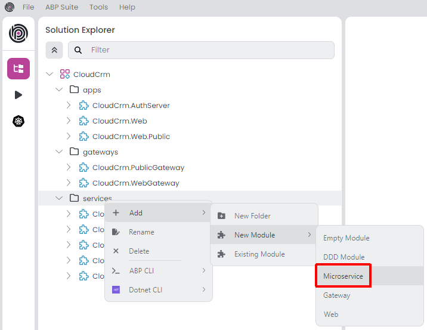
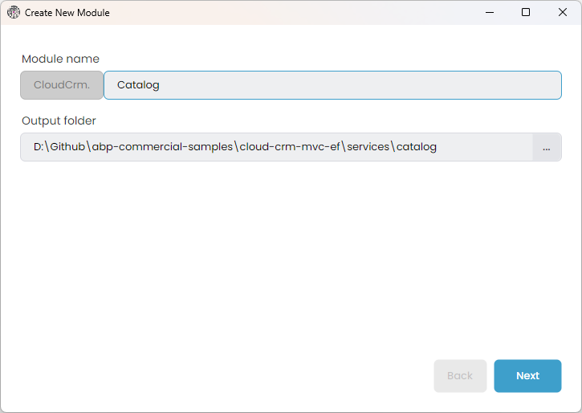
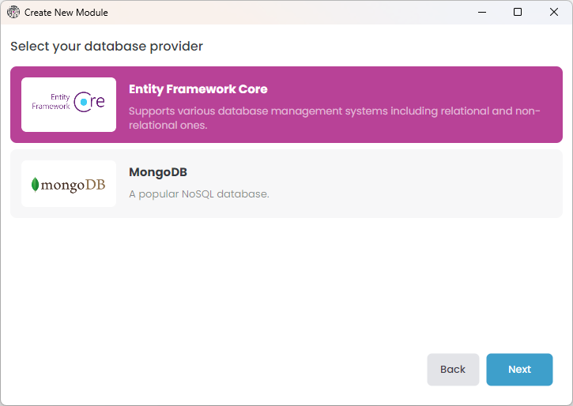
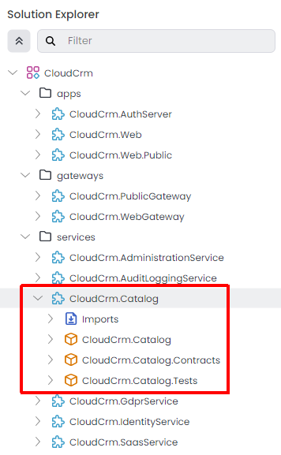
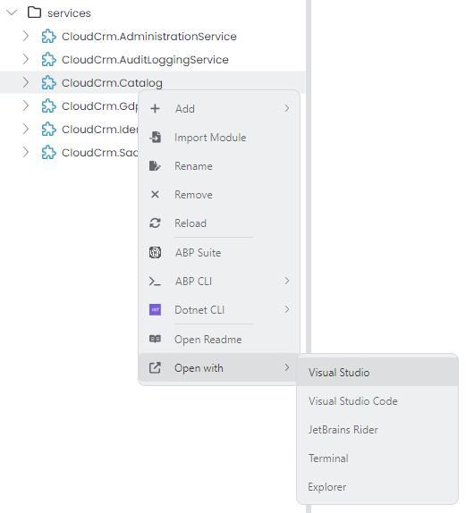
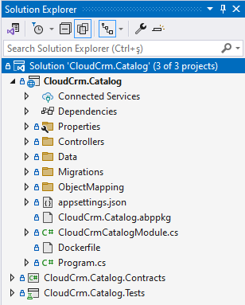
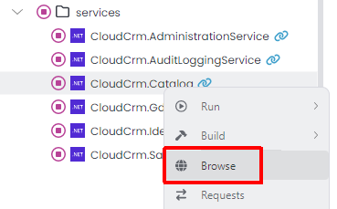
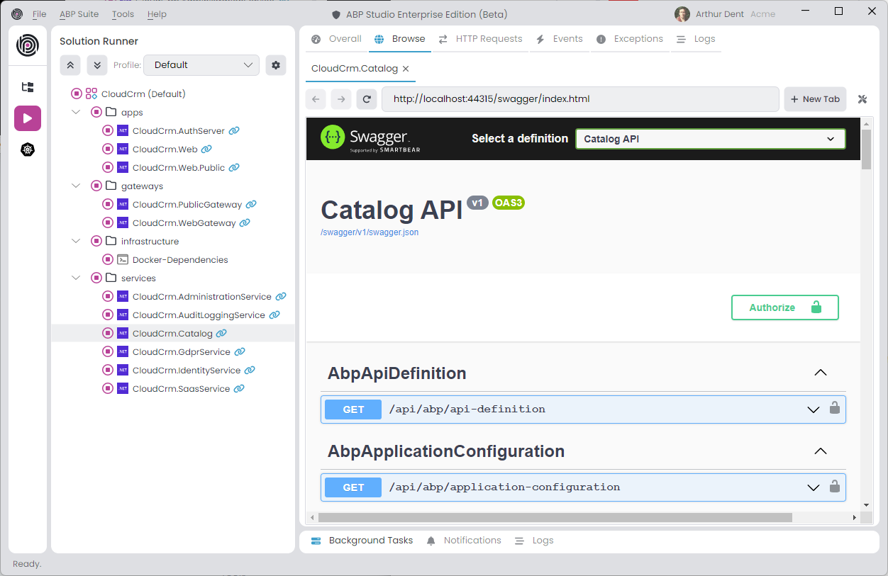
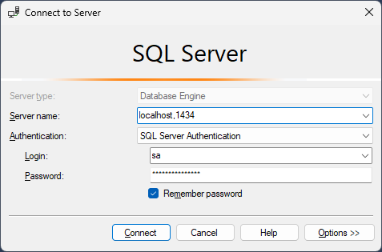
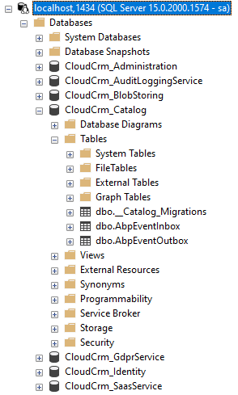

# Microservice Tutorial Part 02: Creating the initial Catalog Microservice

````json
//[doc-nav]
{
  "Previous": {
    "Name": "Creating the initial solution",
    "Path": "tutorials/microservice/part-01"
  },
  "Next": {
    "Name": "Building the Catalog service",
    "Path": "tutorials/microservice/part-03"
  }
}
````

In this tutorial, you will create a new Catalog service and integrate it to the solution.

## Creating the Catalog Service

Right-click the `services` folder in the *Solution Explorer* panel, select the *Add* -> *New Module* -> *Microservice* command:



This command opens a new dialog to define the properties of the new microservice. You can use the following values to create a new microservice named `Catalog`:



When you click the *Next* button, you are redirected to the database provider selection step.

### Selecting the Database Type

Here, you can select the database provider to be used by the new microservice:



Select *Entity Framework Core* option and proceed the *Next* step.

### Integrating to the Solution

In this step, we can select the options for integrating the new microservice to the rest of the solution components:


ABP Studio intelligently selects the right values for you, but you should still check them carefully since they directly affect what we will do in the next parts of this tutorial.

**Ensure the options are configured the same as in the preceding figure**, and click the *Create* button.

That's all, ABP Studio creates the new microservice and arranges all the integration and configuration for you.

## Exploring the New Catalog Microservice

In this section, we will investigate the new microservice in overall.

### Understanding the Packages of The Service

The new microservice is added under the `services` folder in the `CloudCrm` ABP Studio solution:



The new microservice has its own separate .NET solution that includes three packages (.NET projects):

* `CloudCrm.Catalog` is the main project that you will implement your service. It typically contains your [entities](../../framework/architecture/domain-driven-design/entities.md), [repositories](../../framework/architecture/domain-driven-design/repositories.md), [application services](../../framework/architecture/domain-driven-design/application-services.md), API controllers, etc.
* `CloudCrm.Catalog.Contracts` project can be shared with the other services and applications. It typically contains interfaces of your [application services](../../framework/architecture/domain-driven-design/application-services.md), [data transfer objects](../../framework/architecture/domain-driven-design/data-transfer-objects.md), and some other types you may want to share with the clients of this microservice.
* `CloudCrm.Catalog.Tests` is for building your unit and integration tests for this microservice.

### Opening the Service in an IDE

You can open the new microservice in your favorite IDE for development. As a shortcut, you can right-click it in ABP Studio, select the *Open with* -> *Visual Studio* command for example:



Here is the `CloudCrm.Catalog` .NET solution in Visual Studio:



### Running the New Service

You can run the solution using ABP Studio's *Solution Runner*. It will also run the new Catalog service as a part of the solution.

> Before running the solution, **ensure that all the applications are built**. If you are not sure, right-click the root item (`CloudCrm`) in the *Solution Explorer* panel and select the *Build* -> *Graph Build* command.

Click the *Play* button near to the solution root:


### Browsing the Catalog Service

Once all of the applications has started, right-click the Catalog service and select the *Browse* command:



It will open the built-in browser and you will see the Swagger UI for the Catalog service:



### Opening the Catalog Database

The new Catalog microservice has its own database. Assuming you've selected SQL Server as your DBMS, you can open the SQL Server Management Studio to see its database:



Use `localhost,1434` as the *Server name*, select the *SQL Server Authentication* as the *Authentication* type, use `sa` as the *Login* name and `myPassw@rd` as the *Password* value. You can find these values in the `appsettings.json` file in the `CloudCrm.Catalog` project of the .NET solution of the Catalog microservice.

Once you click the *Connect* button, you can see all the databases and explore their data:



The Catalog service's database has only three initial table. The first one is for Entity Framework Core's migration system, and the others are for ABP's [distributed event bus](../../solution-templates/microservice/distributed-events.md) to properly apply transactional events using the outbox and inbox patterns.

## Summary

In this part of the Microservice Development Tutorial, we added a new Catalog microservice to the solution, explored its code structure and database, and browse its APIs using the Swagger UI. In the next part, we will create functionality in that new microservice.