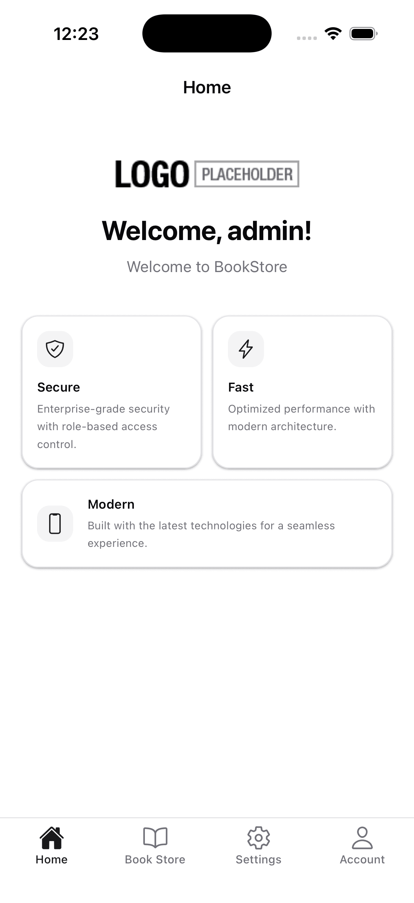
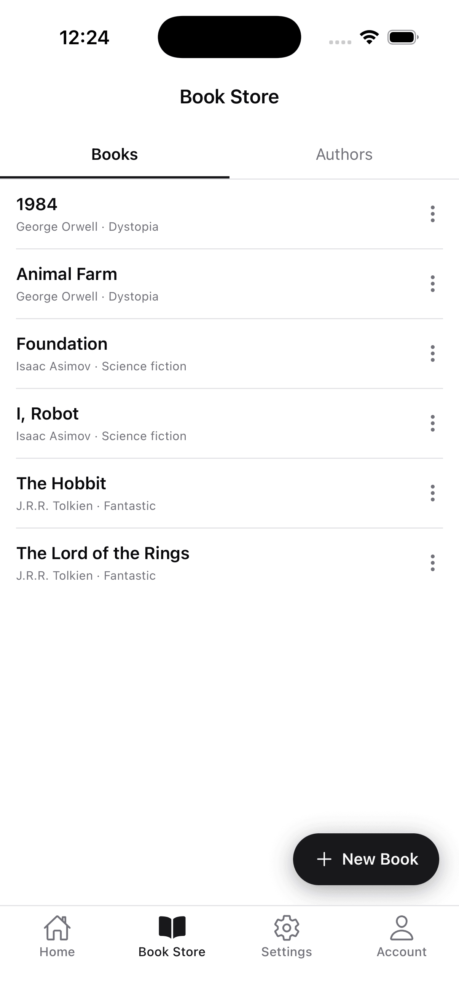
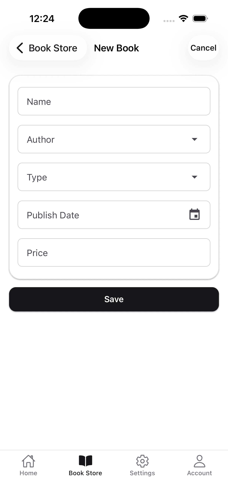
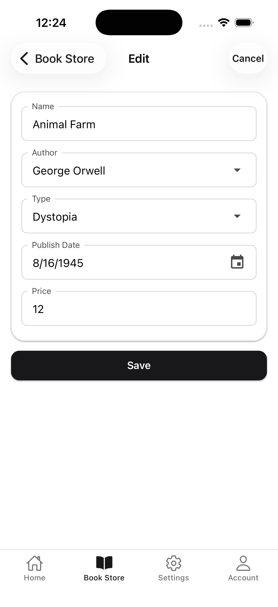
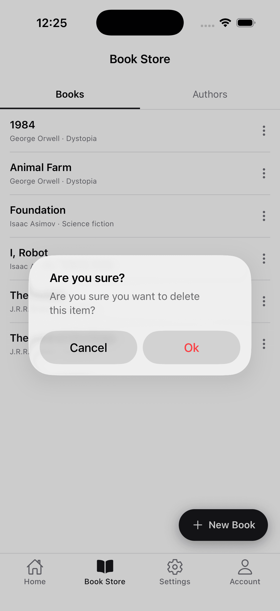
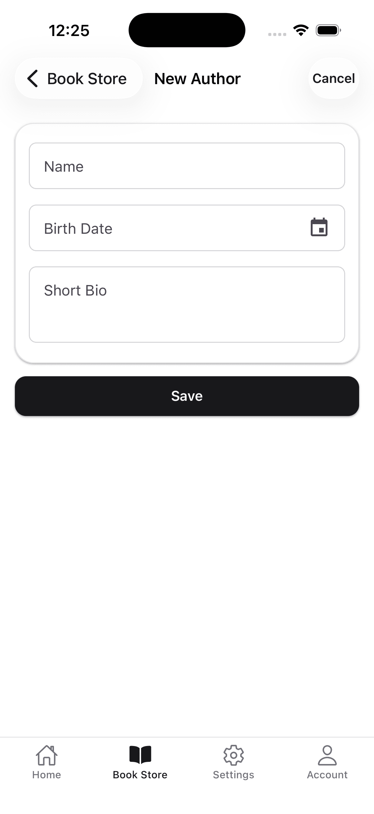
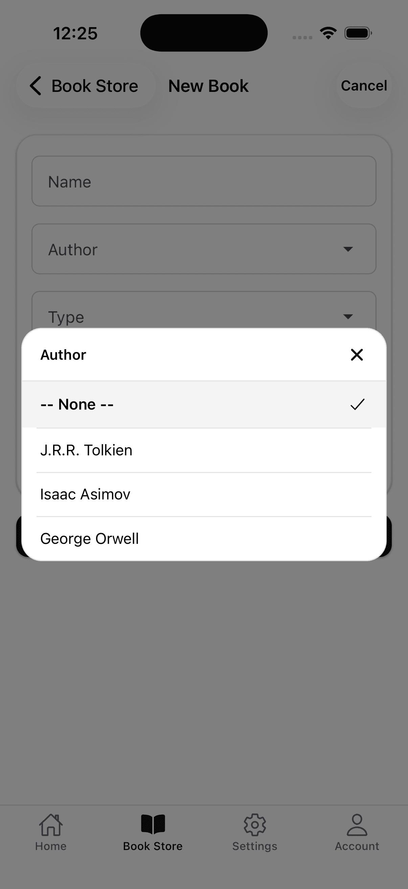

```json
//[doc-seo]
{
  "Description": "Learn how to develop a mobile application using React Native with the ABP Framework. Build the Acme.BookStore mobile UI on top of the modernized ABP React Native template (NativeWind v4 + Bottom Tab navigation)."
}
```

# Mobile Application Development Tutorial - React Native

The React Native mobile option is _available for_ **_Team_** _or higher licenses_. If you don't have a commercial license, follow this article by downloading the source code of the sample application linked below.

## About This Tutorial

> You must have an [ABP Team or a higher license](https://abp.io/pricing) to be able to create a mobile application.

- This tutorial assumes you have completed the [Web Application Development tutorial](../../book-store/part-01.md) and built an ABP based application named `Acme.BookStore` with [React Native](../../../framework/ui/react-native) as the mobile option. If you haven't completed it, you can either complete it first or download the source code below and follow this tutorial.
- This tutorial only focuses on the **React Native UI side** of the `Acme.BookStore` application. It implements the CRUD operations for `Books` and `Authors`, plus the relation between them. The backend (entities, application services, permissions, seeder) is already in place in the downloadable sample.
- The mobile template was modernized in 2026: it now uses **NativeWind v4** (Tailwind CSS for React Native) for styling, **Bottom Tab navigation** by default, and the **Redux Toolkit** store with hook-based access (`useSelector` / `useDispatch`). The `connectToRedux` HOC, the `DrawerNavigator`, and the legacy `DataList`/`AbpSelect` components from earlier versions no longer ship with the template — this tutorial walks through building the new equivalents.
- Before starting, please make sure that the [React Native Development Environment](../../../framework/ui/react-native/index.md) is ready on your machine.

If you'd like to inspect a complete implementation first, [Habitly](../../../samples/index.md#hanova--habitly) is the production-ready mobile sample that follows this modern template direction.

## Running the Application

Before implementing UI changes, run the `Acme.BookStore` mobile application and verify that login works:

1. Open the solution in **ABP Studio** and run the **Initialize Solution** task once (creates SSL certificates and other one-time setup).
2. For browser testing, follow [Running on Web](../../../framework/ui/react-native/running-on-web.md) — start the **Default** run profile; ABP Studio opens the app at **`https://localhost:8443`**.
3. For an Android emulator or iOS simulator, follow [Running on Device](../../../framework/ui/react-native/running-on-device.md). The sample is a **Pro, non-tiered Monolith** solution — switch to the **MobileEmulator** run profile, update `react-native/Environment.ts`, and start the profile (or run `yarn tunnel:api` manually). For **Tiered** or **Microservice** solutions, use the manual backend steps in that guide instead.

See the [React Native overview](../../../framework/ui/react-native/index.md) for environment setup and project creation.

## Download the Source Code

You can use the following link to download the source code of the application described in this article:

- [Acme.BookStore](https://abp.io/Account/Login?returnUrl=/api/download/samples/bookstore-react-native-mongodb)

> If you encounter the "filename too long" or "unzip" error on Windows, please see [this guide](../../../kb/windows-path-too-long-fix.md).

The downloaded sample contains:

- `src/` — ABP backend (`Acme.BookStore.*` projects). It already exposes `BookAppService` and `AuthorAppService` with the CRUD endpoints we will consume.
- `react-native/` — the React Native client. The auth, profile and settings flows ship out of the box. Throughout this tutorial we will add the `BookStore` feature to it.

## Backend Setup (Quick Reference)

The backend ships ready-to-run. The relevant pieces consumed from React Native are:

- **Endpoints**
    - `GET    /api/app/book` — paged list (returns `items` with `id`, `name`, `type`, `publishDate`, `price`, `authorName`)
    - `GET    /api/app/book/{id}` — single book
    - `POST   /api/app/book` — create
    - `PUT    /api/app/book/{id}` — update
    - `DELETE /api/app/book/{id}` — delete
    - `GET    /api/app/book/author-lookup` — `{ items: [{ id, name }] }` for the author dropdown
    - `GET    /api/app/author` — paged list (`items: [{ id, name, birthDate, shortBio }]`)
    - `GET    /api/app/author/{id}`, `POST /api/app/author`, `PUT /api/app/author/{id}`, `DELETE /api/app/author/{id}`
- **Permissions** — defined in `BookStorePermissions.cs` and returned to the mobile app as `auth.grantedPolicies` from `/api/abp/application-configuration`:

    | Policy | UI effect |
    |--------|-----------|
    | `BookStore.Books` | Books tab + list |
    | `BookStore.Books.Create` | New book FAB |
    | `BookStore.Books.Edit` | Edit in item menu |
    | `BookStore.Books.Delete` | Delete in item menu |
    | `BookStore.Authors` | Authors tab + list |
    | `BookStore.Authors.Create` | New author FAB |
    | `BookStore.Authors.Edit` | Edit in item menu |
    | `BookStore.Authors.Delete` | Delete in item menu |

To run the backend, start `Acme.BookStore.DbMigrator` once (it seeds three sample authors and six sample books), then run `Acme.BookStore.HttpApi.Host`. Grant the **Book Store** permissions to the `admin` role via **Identity → Roles → admin → Permissions** in the web UI before testing on mobile (at minimum **Books** and **Authors** so the Book Store tab appears). After changing role permissions, log in again on mobile so `fetchAppConfigAsync` reloads `grantedPolicies`.

If you want to follow the backend implementation step by step instead, read the [Web Application Development tutorial](../../book-store/part-01.md). The mobile-side code below works against the API surface listed above regardless of how you produced it.

## Adding the Book API Proxy

There is no dynamic proxy generation for the React Native application, so we create the `BookAPI` proxy manually under `./src/api`.

```ts
// ./src/api/BookAPI.ts
import api from './API';

export const getList = (params: { maxResultCount?: number; skipCount?: number; sorting?: string } = {}) =>
  api.get('/api/app/book', { params }).then(({ data }) => data);

export const get = (id: string) =>
  api.get(`/api/app/book/${id}`).then(({ data }) => data);

export const create = (input: any) =>
  api.post('/api/app/book', input).then(({ data }) => data);

export const update = (input: any, id: string) =>
  api.put(`/api/app/book/${id}`, input).then(({ data }) => data);

export const remove = (id: string) =>
  api.delete(`/api/app/book/${id}`).then(({ data }) => data);

export const getAuthorLookup = () =>
  api.get('/api/app/book/author-lookup').then(({ data }) => data);
```

We will create `./src/api/AuthorAPI.ts` later in the [Author Section](#author).

- `api` is the shared `axios` instance (`./src/api/API.ts`) that injects the access token via the request interceptor in `./src/interceptors/APIInterceptor.ts`.
- `getList` accepts a paging payload (`maxResultCount`, `skipCount`, `sorting`) so it can be plugged into the `DataList` component we build next.

## Building the DataList Component

The earlier React Native template shipped a `DataList` component on top of React Native Paper. The new template only ships the essentials (`FormButtons`, `Loading`, `ValidationMessage`), so we add a NativeWind-based equivalent under `./src/components/DataList`.

```tsx
// ./src/components/DataList/DataList.tsx
import { useCallback, useContext, useEffect, useState } from 'react';
import { View, Text, FlatList, RefreshControl, ActivityIndicator } from 'react-native';
import { LocalizationContext } from '../../contexts/LocalizationContext';
import { useThemeColors } from '../../hooks';

interface DataListProps<T> {
  fetchFn: (params: { maxResultCount: number; skipCount: number }) => Promise<{ items: T[]; totalCount: number }>;
  render: (info: { item: T; index: number }) => React.ReactElement;
  trigger?: any;
  pageSize?: number;
}

function DataList<T extends { id: string }>({
  fetchFn,
  render,
  trigger,
  pageSize = 20,
}: DataListProps<T>) {
  const { t } = useContext(LocalizationContext);
  const { accentColor } = useThemeColors();

  const [items, setItems] = useState<T[]>([]);
  const [totalCount, setTotalCount] = useState(0);
  const [skipCount, setSkipCount] = useState(0);
  const [loading, setLoading] = useState(false);
  const [refreshing, setRefreshing] = useState(false);

  const loadPage = useCallback(
    async (skip: number, append: boolean) => {
      if (loading) return;
      setLoading(true);
      try {
        const result = await fetchFn({ maxResultCount: pageSize, skipCount: skip });
        const fetched = result?.items ?? [];
        setTotalCount(result?.totalCount ?? 0);
        setItems(prev => (append ? [...prev, ...fetched] : fetched));
        setSkipCount(skip + fetched.length);
      } catch (e) {
        if (!append) setItems([]);
      } finally {
        setLoading(false);
      }
    },
    [fetchFn, pageSize, loading],
  );

  useEffect(() => {
    setSkipCount(0);
    loadPage(0, false);
  }, [trigger]);

  const onRefresh = useCallback(async () => {
    setRefreshing(true);
    await loadPage(0, false);
    setRefreshing(false);
  }, [loadPage]);

  const onEndReached = useCallback(() => {
    if (loading || refreshing) return;
    if (items.length >= totalCount) return;
    loadPage(skipCount, true);
  }, [loading, refreshing, items.length, totalCount, skipCount, loadPage]);

  return (
    <FlatList
      data={items}
      keyExtractor={(item, index) => item?.id?.toString() ?? index.toString()}
      renderItem={render}
      contentContainerStyle=
      refreshControl={<RefreshControl refreshing={refreshing} onRefresh={onRefresh} tintColor={accentColor} />}
      onEndReached={onEndReached}
      onEndReachedThreshold={0.4}
      ItemSeparatorComponent={() => (
        <View className="h-px bg-border dark:bg-border-dark mx-4" />
      )}
      ListEmptyComponent={
        loading ? null : (
          <View className="flex-1 items-center justify-center py-10">
            <Text className="text-muted-foreground dark:text-muted-dark-foreground">
              {t('AbpUi::NoData')}
            </Text>
          </View>
        )
      }
      ListFooterComponent={
        loading && items.length > 0 ? (
          <View className="py-4 items-center">
            <ActivityIndicator color={accentColor} />
          </View>
        ) : null
      }
    />
  );
}

export default DataList;
```

- `fetchFn` is any function that accepts `{ maxResultCount, skipCount }` and returns `{ items, totalCount }` — the shape of every ABP `ICrudAppService.GetListAsync` response.
- `trigger` is an arbitrary value: pass a counter that you increment (`setRefresh(r => r + 1)`) after a delete or save and the list re-fetches from page zero.
- The pull-to-refresh and the lazy "load more on end reached" behavior are built in.

## Building the AbpSelect Component

For dropdowns (book type, author selection) we build a small modal-based picker, also under `./src/components`.

```tsx
// ./src/components/AbpSelect/AbpSelect.tsx
import { useContext } from 'react';
import { Modal, View, Text, Pressable, FlatList } from 'react-native';
import { Ionicons } from '@expo/vector-icons';
import { LocalizationContext } from '../../contexts/LocalizationContext';
import { useThemeColors } from '../../hooks';

export interface AbpSelectItem {
  id: string | number;
  displayName: string;
}

interface AbpSelectProps {
  visible: boolean;
  title: string;
  items: AbpSelectItem[];
  selectedItem?: string | number;
  hasDefaultItem?: boolean;
  hideModalFn: () => void;
  setSelectedItem: (id: any) => void;
}

function AbpSelect({
  visible,
  title,
  items,
  selectedItem,
  hasDefaultItem = false,
  hideModalFn,
  setSelectedItem,
}: AbpSelectProps) {
  const { t } = useContext(LocalizationContext);
  const { accentColor } = useThemeColors();

  const data = hasDefaultItem
    ? [{ id: '', displayName: `-- ${t('AbpUi::PagerInfo:NoDataText')} --` } as AbpSelectItem, ...items]
    : items;

  return (
    <Modal visible={visible} transparent animationType="fade" onRequestClose={hideModalFn}>
      <Pressable
        onPress={hideModalFn}
        className="flex-1 bg-black/50 items-center justify-center px-6">
        <Pressable
          onPress={() => {}}
          className="w-full max-w-md bg-card dark:bg-card-dark rounded-2xl border border-card-border dark:border-card-border-dark shadow-lg overflow-hidden">
          <View className="px-5 py-4 border-b border-card-border dark:border-card-border-dark flex-row items-center justify-between">
            <Text className="text-base font-semibold text-foreground dark:text-foreground-dark">
              {title}
            </Text>
            <Pressable onPress={hideModalFn} hitSlop={8}>
              <Ionicons name="close" size={22} color={accentColor} />
            </Pressable>
          </View>

          <FlatList
            data={data}
            keyExtractor={item => String(item.id)}
            style=
            ItemSeparatorComponent={() => (
              <View className="h-px bg-border dark:bg-border-dark mx-4" />
            )}
            renderItem={({ item }) => {
              const isSelected = String(item.id) === String(selectedItem ?? '');
              return (
                <Pressable
                  onPress={() => {
                    setSelectedItem(item.id);
                    hideModalFn();
                  }}
                  className={`px-5 py-3.5 flex-row items-center justify-between ${
                    isSelected ? 'bg-secondary dark:bg-secondary-dark' : ''
                  }`}>
                  <Text
                    className={`flex-1 text-[15px] ${
                      isSelected
                        ? 'text-foreground dark:text-foreground-dark font-semibold'
                        : 'text-foreground dark:text-foreground-dark'
                    }`}>
                    {item.displayName}
                  </Text>
                  {isSelected ? <Ionicons name="checkmark" size={20} color={accentColor} /> : null}
                </Pressable>
              );
            }}
          />
        </Pressable>
      </Pressable>
    </Modal>
  );
}

export default AbpSelect;
```

Now expose the two new components from the barrel file so screens can import them with a single statement:

```ts
// ./src/components/index.ts
export { default as FormButtons } from './FormButtons/FormButtons';
export { default as ValidationMessage } from './ValidationMessage/ValidationMessage';
export { default as DataList } from './DataList/DataList';
export { default as AbpSelect } from './AbpSelect/AbpSelect';
export type { AbpSelectItem } from './AbpSelect/AbpSelect';
```

## Creating the BookStoreNavigator

The `BookStore` feature has three screens that share a stack: the list root (`BookStore`), `CreateUpdateBook`, and `CreateUpdateAuthor`. Add the route names to the typed navigator definitions first.

```ts
// ./src/navigators/types.ts (additions)
export type BookStoreStackParamList = {
  BookStore: undefined;
  CreateUpdateBook: { bookId?: string } | undefined;
  CreateUpdateAuthor: { authorId?: string } | undefined;
};

export type BookStoreScreenProps = NativeStackScreenProps<BookStoreStackParamList, 'BookStore'>;
export type CreateUpdateBookScreenProps = NativeStackScreenProps<BookStoreStackParamList, 'CreateUpdateBook'>;
export type CreateUpdateAuthorScreenProps = NativeStackScreenProps<BookStoreStackParamList, 'CreateUpdateAuthor'>;
```

Also extend `BottomTabParamList`:

```ts
export type BottomTabParamList = {
  HomeTab: undefined;
  BookStoreTab: undefined;
  SettingsTab: undefined;
  AccountTab: undefined;
};
```

Then create the stack navigator:

```tsx
// ./src/navigators/BookStoreNavigator.tsx
import { useContext } from 'react';
import { Pressable, Text } from 'react-native';
import { createNativeStackNavigator } from '@react-navigation/native-stack';

import { useThemeColors } from '../hooks';
import { LocalizationContext } from '../contexts/LocalizationContext';
import {
  BookStoreScreen,
  CreateUpdateBookScreen,
  CreateUpdateAuthorScreen,
} from '../screens';
import type { BookStoreStackParamList } from './types';

const Stack = createNativeStackNavigator<BookStoreStackParamList>();

export default function BookStoreStackNavigator() {
  const { headerBg, headerText, accentColor } = useThemeColors();
  const { t } = useContext(LocalizationContext);

  return (
    <Stack.Navigator id="BookStoreStack" initialRouteName="BookStore">
      <Stack.Screen
        name="BookStore"
        component={BookStoreScreen}
        options=
      />
      <Stack.Screen
        name="CreateUpdateBook"
        component={CreateUpdateBookScreen}
        options={({ route, navigation }) => ({
          title: t(route.params?.bookId ? 'BookStore::Edit' : 'BookStore::NewBook'),
          headerStyle: { backgroundColor: headerBg },
          headerTintColor: headerText,
          headerShadowVisible: false,
          headerRight: () => (
            <Pressable onPress={() => navigation.goBack()} hitSlop={8}>
              <Text style=>{t('AbpUi::Cancel')}</Text>
            </Pressable>
          ),
        })}
      />
      <Stack.Screen
        name="CreateUpdateAuthor"
        component={CreateUpdateAuthorScreen}
        options={({ route, navigation }) => ({
          title: t(route.params?.authorId ? 'BookStore::Edit' : 'BookStore::NewAuthor'),
          headerStyle: { backgroundColor: headerBg },
          headerTintColor: headerText,
          headerShadowVisible: false,
          headerRight: () => (
            <Pressable onPress={() => navigation.goBack()} hitSlop={8}>
              <Text style=>{t('AbpUi::Cancel')}</Text>
            </Pressable>
          ),
        })}
      />
    </Stack.Navigator>
  );
}
```

The screens referenced in the imports above will be created in the next sections.

## Permission infrastructure

The sample ships a small permission layer on top of `auth.grantedPolicies` from the application configuration. Policies are loaded on app startup and after login (`AppActions.fetchAppConfigAsync` in `AppContent.tsx` and `LoginScreen.tsx`).

### Policy constants

Create `./src/constants/BookStorePolicies.ts` so policy names stay aligned with `BookStorePermissions.cs`:

```ts
// ./src/constants/BookStorePolicies.ts
export const BookStorePolicies = {
  Books: 'BookStore.Books',
  BooksCreate: 'BookStore.Books.Create',
  BooksEdit: 'BookStore.Books.Edit',
  BooksDelete: 'BookStore.Books.Delete',
  Authors: 'BookStore.Authors',
  AuthorsCreate: 'BookStore.Authors.Create',
  AuthorsEdit: 'BookStore.Authors.Edit',
  AuthorsDelete: 'BookStore.Authors.Delete',
} as const;

/** Show Book Store tab when the user can access books or authors. */
export const BookStoreTabPolicy = `${BookStorePolicies.Books}||${BookStorePolicies.Authors}`;
```

### Selector

Add `createGrantedPolicySelector` to `./src/store/selectors/AppSelectors.ts`. It supports a single policy, OR (`||`), and AND (`&&`):

```ts
export function createGrantedPolicySelector(condition: string) {
  return createSelector([getApp], state => {
    const grantedPolicies = state?.appConfig?.auth?.grantedPolicies;
    if (!grantedPolicies) return false;

    const hasPolicy = (policy: string) => grantedPolicies[policy.trim()] === true;

    if (condition.includes('||')) {
      return condition.split('||').some(policy => hasPolicy(policy));
    }
    if (condition.includes('&&')) {
      return condition.split('&&').every(policy => hasPolicy(policy));
    }
    return hasPolicy(condition);
  });
}
```

### usePermission hook

Create `./src/hooks/UsePermission.ts` and export it from `./src/hooks/index.ts`:

```ts
import { useSelector } from 'react-redux';
import { createGrantedPolicySelector } from '../store/selectors/AppSelectors';

export function usePermission(policyKey: string): boolean {
  const selector = createGrantedPolicySelector(policyKey);
  return useSelector(selector);
}
```

### Permission HOC (optional)

`./src/hocs/PermissionHOC.tsx` provides `withPermission(Component, policyKey)` for hiding arbitrary UI. The Book Store screens use `usePermission` directly; see `./docs/permission-guide.md` for more examples.

Throughout the sections below, Book Store UI gating uses `usePermission` with `BookStorePolicies` / `BookStoreTabPolicy` instead of reading `grantedPolicies` manually.

## Adding BookStore to the BottomTabNavigator

Open `./src/navigators/BottomTabNavigator.tsx` and add a `BookStoreTab` between `HomeTab` and `SettingsTab`. The tab is shown only when the user has at least one of the BookStore permissions:

```tsx
// ./src/navigators/BottomTabNavigator.tsx
import { useContext } from 'react';
import { createBottomTabNavigator } from '@react-navigation/bottom-tabs';
import { Ionicons } from '@expo/vector-icons';

import { BookStoreTabPolicy } from '../constants/BookStorePolicies';
import { usePermission, useThemeColors } from '../hooks';
import { LocalizationContext } from '../contexts/LocalizationContext';

import HomeStackNavigator from './HomeNavigator';
import SettingsStackNavigator from './SettingsNavigator';
import AccountStackNavigator from './AccountNavigator';
import BookStoreStackNavigator from './BookStoreNavigator';

const Tab = createBottomTabNavigator();

export default function BottomTabNavigator() {
  const { headerBg, accentColor, iconColor } = useThemeColors();
  const { t } = useContext(LocalizationContext);

  const showBookStore = usePermission(BookStoreTabPolicy);

  return (
    <Tab.Navigator
      id="BottomTab"
      initialRouteName="HomeTab"
      screenOptions=>
      <Tab.Screen name="HomeTab" component={HomeStackNavigator} options={/* ... */} />

      {showBookStore ? (
        <Tab.Screen
          name="BookStoreTab"
          component={BookStoreStackNavigator}
          options=
        />
      ) : null}

      <Tab.Screen name="SettingsTab" component={SettingsStackNavigator} options={/* ... */} />
      <Tab.Screen name="AccountTab" component={AccountStackNavigator} options={/* ... */} />
    </Tab.Navigator>
  );
}
```

> Earlier versions of the template used a `DrawerNavigator`. The 2026 template defaults to `bottom-tab` instead. If your project still uses the drawer (the optional `navigation_type = "drawer"` configuration), add the same conditional `Drawer.Screen` to `DrawerNavigator.tsx` instead.



## Creating the BookStoreScreen

`BookStoreScreen` is the root of the stack. It hosts a small NativeWind-based tab header that switches between the **Books** and **Authors** lists. Each tab is rendered only if the user has the corresponding permission.

```tsx
// ./src/screens/BookStore/BookStoreScreen.tsx
import { useContext, useEffect, useMemo, useState } from 'react';
import { View, Text, Pressable } from 'react-native';

import { BookStorePolicies } from '../../constants/BookStorePolicies';
import { LocalizationContext } from '../../contexts/LocalizationContext';
import { usePermission } from '../../hooks';
import type { BookStoreScreenProps } from '../../navigators/types';

import BooksScreen from './Books/BooksScreen';
import AuthorsScreen from './Authors/AuthorsScreen';

type TabKey = 'books' | 'authors';
interface TabDef { key: TabKey; label: string; }

function BookStoreScreen({ navigation }: BookStoreScreenProps) {
  const { t } = useContext(LocalizationContext);
  const canViewBooks = usePermission(BookStorePolicies.Books);
  const canViewAuthors = usePermission(BookStorePolicies.Authors);

  const tabs = useMemo<TabDef[]>(() => {
    const list: TabDef[] = [];
    if (canViewBooks) list.push({ key: 'books', label: t('BookStore::Menu:Books') });
    if (canViewAuthors) list.push({ key: 'authors', label: t('BookStore::Menu:Authors') });
    return list;
  }, [canViewBooks, canViewAuthors, t]);

  const [activeKey, setActiveKey] = useState<TabKey | undefined>(tabs[0]?.key);

  useEffect(() => {
    if (!tabs.find(tab => tab.key === activeKey)) setActiveKey(tabs[0]?.key);
  }, [tabs, activeKey]);

  if (tabs.length === 0) {
    return (
      <View className="flex-1 bg-background dark:bg-background-dark items-center justify-center px-6">
        <Text className="text-muted-foreground dark:text-muted-dark-foreground text-center">
          {t('BookStore::NoAccess')}
        </Text>
      </View>
    );
  }

  return (
    <View className="flex-1 bg-background dark:bg-background-dark">
      <View className="flex-row bg-background dark:bg-background-dark border-b border-card-border dark:border-card-border-dark">
        {tabs.map(tab => {
          const isActive = activeKey === tab.key;
          return (
            <Pressable
              key={tab.key}
              onPress={() => setActiveKey(tab.key)}
              className={`flex-1 py-3 items-center border-b-2 ${
                isActive ? 'border-accent dark:border-accent-dark' : 'border-transparent'
              }`}>
              <Text
                className={`text-[14px] ${
                  isActive
                    ? 'text-foreground dark:text-foreground-dark font-semibold'
                    : 'text-muted-foreground dark:text-muted-dark-foreground'
                }`}>
                {tab.label}
              </Text>
            </Pressable>
          );
        })}
      </View>

      <View className="flex-1">
        {activeKey === 'books' ? <BooksScreen navigation={navigation} /> : null}
        {activeKey === 'authors' ? <AuthorsScreen navigation={navigation} /> : null}
      </View>
    </View>
  );
}

export default BookStoreScreen;
```

The previous template used `react-native-paper`'s `BottomNavigation` for this. Building the tab strip with two `Pressable`s and NativeWind classes keeps the rest of the screen consistent with the modernized look and avoids paying for an extra Paper component in the bundle.

## The Book List Page

Create `./src/screens/BookStore/Books/BooksScreen.tsx`. The list itself is a single `DataList<BookListItem>`. Each row is a `Pressable` that opens an action sheet with **Edit** and **Delete** entries — both gated by the corresponding permission. The floating "+" button at the bottom right is rendered only when the user has `BookStore.Books.Create`.

```tsx
// ./src/screens/BookStore/Books/BooksScreen.tsx
import { useContext, useState } from 'react';
import { Alert, View, Text, Pressable } from 'react-native';
import { useActionSheet } from '@expo/react-native-action-sheet';
import { Ionicons } from '@expo/vector-icons';

import { BookStorePolicies } from '../../../constants/BookStorePolicies';
import { LocalizationContext } from '../../../contexts/LocalizationContext';
import { usePermission, useThemeColors } from '../../../hooks';
import { DataList } from '../../../components';
import { getList, remove } from '../../../api/BookAPI';
import type { BookStoreScreenProps } from '../../../navigators/types';

interface BookListItem {
  id: string;
  name: string;
  authorName: string;
  type: number;
}

interface BooksScreenInnerProps { navigation: BookStoreScreenProps['navigation']; }

function BooksScreen({ navigation }: BooksScreenInnerProps) {
  const { t } = useContext(LocalizationContext);
  const { accentColor, iconColor } = useThemeColors();

  const [refresh, setRefresh] = useState(0);
  const { showActionSheetWithOptions } = useActionSheet();

  const canCreate = usePermission(BookStorePolicies.BooksCreate);
  const canEdit = usePermission(BookStorePolicies.BooksEdit);
  const canDelete = usePermission(BookStorePolicies.BooksDelete);

  const openContextMenu = (item: BookListItem) => {
    const options: string[] = [];
    if (canEdit) options.push(t('BookStore::Edit'));
    if (canDelete) options.push(t('AbpUi::Delete'));
    options.push(t('AbpUi::Cancel'));

    showActionSheetWithOptions(
      {
        options,
        cancelButtonIndex: options.length - 1,
        destructiveButtonIndex: canDelete ? options.indexOf(t('AbpUi::Delete')) : undefined,
      },
      (index?: number) => {
        if (index === undefined) return;
        const selected = options[index];
        if (selected === t('BookStore::Edit')) navigation.navigate('CreateUpdateBook', { bookId: item.id });
        else if (selected === t('AbpUi::Delete')) confirmDelete(item);
      },
    );
  };

  const confirmDelete = (item: BookListItem) => {
    Alert.alert(t('AbpUi::AreYouSure'), t('BookStore::AreYouSureToDelete'), [
      { text: t('AbpUi::Cancel'), style: 'cancel' },
      {
        text: t('AbpUi::Ok'),
        style: 'destructive',
        onPress: async () => {
          await remove(item.id);
          setRefresh(prev => prev + 1);
        },
      },
    ]);
  };

  return (
    <View className="flex-1 bg-background dark:bg-background-dark">
      <DataList<BookListItem>
        fetchFn={getList as any}
        trigger={refresh}
        render={({ item }) => (
          <Pressable
            onPress={() => (canEdit || canDelete) && openContextMenu(item)}
            className="px-4 py-3.5 active:bg-secondary dark:active:bg-secondary-dark">
            <View className="flex-row items-center">
              <View className="flex-1">
                <Text className="text-[15px] font-semibold text-foreground dark:text-foreground-dark">
                  {item.name}
                </Text>
                <Text className="text-xs text-muted-foreground dark:text-muted-dark-foreground mt-1">
                  {item.authorName} · {t(`BookStore::Enum:BookType:${item.type}`)}
                </Text>
              </View>
              {(canEdit || canDelete) ? (
                <Ionicons name="ellipsis-vertical" size={18} color={iconColor} />
              ) : null}
            </View>
          </Pressable>
        )}
      />

      {canCreate ? (
        <Pressable
          onPress={() => navigation.navigate('CreateUpdateBook')}
          className="absolute right-5 bottom-5 rounded-full px-5 py-3.5 flex-row items-center shadow-lg bg-accent dark:bg-accent-dark active:opacity-90">
          <Ionicons
            name="add"
            size={20}
            color={accentColor === '#fafafa' ? '#18181b' : '#fafafa'}
          />
          <Text className="ml-1.5 font-semibold text-[14px] text-accent-foreground dark:text-accent-dark-foreground">
            {t('BookStore::NewBook')}
          </Text>
        </Pressable>
      ) : null}
    </View>
  );
}

export default BooksScreen;
```

- Permissions come from `auth.grantedPolicies` inside `appConfig`, loaded by `AppActions.fetchAppConfigAsync`. Use the `usePermission` hook with constants from `BookStorePolicies` instead of reading `grantedPolicies` manually (see [Permission infrastructure](#permission-infrastructure)).
- `useActionSheet` is provided by `@expo/react-native-action-sheet`, already wrapped around the app in `./src/AppContent.tsx`, so we don't need to add a provider here.



## Creating a New Book

The book form needs `@react-native-community/datetimepicker` for the publish-date field. Install it:

```bash
npx expo install @react-native-community/datetimepicker
```

Then create the screen + form pair under `./src/screens/BookStore/Books/CreateUpdateBook/`.

### CreateUpdateBookScreen

This component wires Redux loading + API calls and forwards data to the form.

```tsx
// ./src/screens/BookStore/Books/CreateUpdateBook/CreateUpdateBookScreen.tsx
import { useEffect, useState } from 'react';
import { useDispatch } from 'react-redux';

import { get, create, update, getAuthorLookup } from '../../../../api/BookAPI';
import LoadingActions from '../../../../store/actions/LoadingActions';
import type { CreateUpdateBookScreenProps } from '../../../../navigators/types';
import type { AbpSelectItem } from '../../../../components';
import CreateUpdateBookForm, { type BookFormValues } from './CreateUpdateBookForm';

function CreateUpdateBookScreen({ navigation, route }: CreateUpdateBookScreenProps) {
  const { bookId } = route.params || {};
  const dispatch = useDispatch();

  const [book, setBook] = useState<any | null>(null);
  const [authors, setAuthors] = useState<AbpSelectItem[]>([]);

  useEffect(() => {
    let cancelled = false;
    (async () => {
      dispatch(LoadingActions.start({ key: 'fetchAuthorLookup' }));
      try {
        const result = await getAuthorLookup();
        if (cancelled) return;
        setAuthors((result?.items ?? []).map((a: any) => ({ id: a.id, displayName: a.name })));
      } finally {
        dispatch(LoadingActions.clear());
      }
    })();
    return () => { cancelled = true; };
  }, [dispatch]);

  useEffect(() => {
    if (!bookId) return;
    let cancelled = false;
    (async () => {
      dispatch(LoadingActions.start({ key: 'fetchBookDetail' }));
      try {
        const detail = await get(bookId);
        if (!cancelled) setBook(detail);
      } finally {
        dispatch(LoadingActions.clear());
      }
    })();
    return () => { cancelled = true; };
  }, [bookId, dispatch]);

  const submit = async (data: BookFormValues) => {
    dispatch(LoadingActions.start({ key: 'save' }));
    try {
      const payload = {
        authorId: data.authorId,
        name: data.name,
        type: Number(data.type),
        publishDate: data.publishDate ? new Date(data.publishDate).toISOString() : new Date().toISOString(),
        price: Number(data.price),
      };
      if (bookId) await update(payload, bookId);
      else await create(payload);
      navigation.goBack();
    } finally {
      dispatch(LoadingActions.clear());
    }
  };

  return <CreateUpdateBookForm submit={submit} book={book} authors={authors} />;
}

export default CreateUpdateBookScreen;
```

- `LoadingActions.start({ key })` and `LoadingActions.clear()` drive the global `<Loading />` overlay rendered in `AppContent.tsx` via the Redux loading reducer. No extra wiring is needed in this screen.
- `getAuthorLookup` lives in `BookAPI.ts` (we added it earlier). It returns `{ items: [{ id, name }] }`, which the form turns into a dropdown.

### CreateUpdateBookForm

The form is a Formik form. We keep `react-native-paper`'s `TextInput` for the input fields (the only Paper component the template still uses) and rely on our new `AbpSelect` for the type and author pickers, plus `DateTimePicker` for the publish date.

```tsx
// ./src/screens/BookStore/Books/CreateUpdateBook/CreateUpdateBookForm.tsx
import * as Yup from 'yup';
import { useContext, useMemo, useState } from 'react';
import { View, Text, ScrollView, KeyboardAvoidingView, Platform, Pressable, Modal } from 'react-native';
import { useFormik } from 'formik';
import { TextInput } from 'react-native-paper';
import DateTimePicker from '@react-native-community/datetimepicker';

import { useThemeColors } from '../../../../hooks';
import { LocalizationContext } from '../../../../contexts/LocalizationContext';
import { AbpSelect, FormButtons, ValidationMessage } from '../../../../components';
import type { AbpSelectItem } from '../../../../components';

export interface BookFormValues {
  authorId: string;
  authorName: string;
  name: string;
  type: string;
  typeDisplayName: string;
  publishDate: Date | null;
  price: string;
}

interface CreateUpdateBookFormProps {
  submit: (values: BookFormValues) => Promise<void> | void;
  book?: any | null;
  authors: AbpSelectItem[];
}

const validationSchema = Yup.object().shape({
  name: Yup.string().required('AbpValidation::ThisFieldIsRequired'),
  price: Yup.number().typeError('AbpValidation::ThisFieldIsRequired').required('AbpValidation::ThisFieldIsRequired'),
  type: Yup.string().required('AbpValidation::ThisFieldIsRequired'),
  authorId: Yup.string().required('AbpValidation::ThisFieldIsRequired'),
  publishDate: Yup.date().typeError('AbpValidation::ThisFieldIsRequired').required('AbpValidation::ThisFieldIsRequired').nullable(),
});

const formatDate = (value: Date | null) => (value ? new Date(value).toLocaleDateString() : '');

function CreateUpdateBookForm({ submit, book, authors }: CreateUpdateBookFormProps) {
  const { t } = useContext(LocalizationContext);
  const { primaryContainer, accentColor, headerBg } = useThemeColors();

  const [typeModalVisible, setTypeModalVisible] = useState(false);
  const [authorModalVisible, setAuthorModalVisible] = useState(false);
  const [dateModalVisible, setDateModalVisible] = useState(false);
  const [tempDate, setTempDate] = useState<Date>(new Date());

  const bookTypes = useMemo<AbpSelectItem[]>(
    () => Array.from({ length: 8 }, (_, i) => ({
      id: String(i + 1),
      displayName: t(`BookStore::Enum:BookType:${i + 1}`),
    })),
    [t],
  );

  const initialValues: BookFormValues = useMemo(() => {
    const typeIdStr = book?.type ? String(book.type) : '';
    return {
      authorId: book?.authorId ?? '',
      authorName: authors.find(a => String(a.id) === String(book?.authorId))?.displayName ?? '',
      name: book?.name ?? '',
      type: typeIdStr,
      typeDisplayName: typeIdStr ? t(`BookStore::Enum:BookType:${typeIdStr}`) : '',
      publishDate: book?.publishDate ? new Date(book.publishDate) : null,
      price: book?.price !== undefined ? String(book.price) : '',
    };
  }, [book, authors, t]);

  const form = useFormik<BookFormValues>({
    enableReinitialize: true,
    initialValues,
    validateOnChange: false,
    validateOnBlur: true,
    validationSchema,
    onSubmit: values => submit(values),
  });

  const showError = (field: keyof BookFormValues) =>
    (form.submitCount > 0 || !!form.touched[field]) && !!form.errors[field];

  const renderError = (field: keyof BookFormValues) =>
    showError(field) ? <ValidationMessage>{form.errors[field] as string}</ValidationMessage> : null;

  return (
    <KeyboardAvoidingView
      behavior={Platform.OS === 'ios' ? 'padding' : undefined}
      className="flex-1 bg-background dark:bg-background-dark">
      <ScrollView keyboardShouldPersistTaps="handled" contentContainerStyle=>
        <View className="bg-card dark:bg-card-dark rounded-2xl border border-card-border dark:border-card-border-dark shadow-sm p-4">
          {/* Name */}
          <View className="mb-3">
            <TextInput
              mode="outlined"
              label={t('BookStore::Name')}
              value={form.values.name}
              onChangeText={form.handleChange('name')}
              onBlur={form.handleBlur('name')}
              error={showError('name')}
              autoCapitalize="sentences"
              style=
            />
            {renderError('name')}
          </View>

          {/* Author dropdown — populated in the "Adding Author Relation to Book" section */}
          <View className="mb-3">
            <Pressable onPress={() => setAuthorModalVisible(true)}>
              <View pointerEvents="none">
                <TextInput
                  mode="outlined"
                  label={t('BookStore::Author')}
                  value={form.values.authorName}
                  editable={false}
                  error={showError('authorId')}
                  right={<TextInput.Icon icon="menu-down" />}
                  style=
                />
              </View>
            </Pressable>
            {renderError('authorId')}
          </View>

          {/* Type dropdown */}
          <View className="mb-3">
            <Pressable onPress={() => setTypeModalVisible(true)}>
              <View pointerEvents="none">
                <TextInput
                  mode="outlined"
                  label={t('BookStore::Type')}
                  value={form.values.typeDisplayName}
                  editable={false}
                  error={showError('type')}
                  right={<TextInput.Icon icon="menu-down" />}
                  style=
                />
              </View>
            </Pressable>
            {renderError('type')}
          </View>

          {/* Publish date picker */}
          <View className="mb-3">
            <Pressable
              onPress={() => {
                setTempDate(form.values.publishDate ?? new Date());
                setDateModalVisible(true);
              }}>
              <View pointerEvents="none">
                <TextInput
                  mode="outlined"
                  label={t('BookStore::PublishDate')}
                  value={formatDate(form.values.publishDate)}
                  editable={false}
                  error={showError('publishDate')}
                  right={<TextInput.Icon icon="calendar" />}
                  style=
                />
              </View>
            </Pressable>
            {renderError('publishDate')}
          </View>

          {/* Price */}
          <View className="mb-2">
            <TextInput
              mode="outlined"
              label={t('BookStore::Price')}
              value={form.values.price}
              onChangeText={form.handleChange('price')}
              onBlur={form.handleBlur('price')}
              error={showError('price')}
              keyboardType="decimal-pad"
              style=
            />
            {renderError('price')}
          </View>
        </View>

        <View className="mt-4">
          <FormButtons submit={() => form.handleSubmit()} isSubmitDisabled={form.isSubmitting} />
        </View>
      </ScrollView>

      {/* Type modal */}
      <AbpSelect
        visible={typeModalVisible}
        title={t('BookStore::Type')}
        items={bookTypes}
        hasDefaultItem
        selectedItem={form.values.type}
        hideModalFn={() => setTypeModalVisible(false)}
        setSelectedItem={(id: any) => {
          const idStr = String(id ?? '');
          form.setFieldValue('type', idStr, true);
          form.setFieldValue('typeDisplayName',
            bookTypes.find(item => item.id === idStr)?.displayName ?? '', false);
        }}
      />

      {/* Author modal */}
      <AbpSelect
        visible={authorModalVisible}
        title={t('BookStore::Author')}
        items={authors}
        hasDefaultItem
        selectedItem={form.values.authorId}
        hideModalFn={() => setAuthorModalVisible(false)}
        setSelectedItem={(id: any) => {
          const idStr = String(id ?? '');
          form.setFieldValue('authorId', idStr, true);
          form.setFieldValue('authorName',
            authors.find(item => String(item.id) === idStr)?.displayName ?? '', false);
        }}
      />


      {/* Publish date modal */}
      <Modal visible={dateModalVisible} transparent animationType="fade" onRequestClose={() => setDateModalVisible(false)}>
        <Pressable onPress={() => setDateModalVisible(false)} className="flex-1 bg-black/50 items-center justify-center px-6">
          <Pressable onPress={() => {}} className="w-full max-w-md bg-card dark:bg-card-dark rounded-2xl border border-card-border dark:border-card-border-dark shadow-lg overflow-hidden">
            <View className="px-5 py-4 border-b border-card-border dark:border-card-border-dark">
              <Text className="text-base font-semibold text-foreground dark:text-foreground-dark">
                {t('BookStore::PublishDate')}
              </Text>
            </View>
            <View style=>
              <DateTimePicker
                value={tempDate}
                mode="date"
                display={Platform.OS === 'ios' ? 'spinner' : 'default'}
                onChange={(event: any, selectedDate?: Date) => {
                  if (Platform.OS !== 'ios') {
                    setDateModalVisible(false);
                    if (event?.type !== 'dismissed' && selectedDate) {
                      form.setFieldValue('publishDate', selectedDate, true);
                    }
                  } else if (selectedDate) {
                    setTempDate(selectedDate);
                  }
                }}
                maximumDate={new Date()}
              />
            </View>
            {Platform.OS === 'ios' ? (
              <View className="flex-row justify-end px-4 py-3 border-t border-card-border dark:border-card-border-dark gap-x-2">
                <Pressable onPress={() => setDateModalVisible(false)} className="px-4 py-2 rounded-md">
                  <Text style=>{t('AbpUi::Cancel')}</Text>
                </Pressable>
                <Pressable
                  onPress={() => {
                    form.setFieldValue('publishDate', tempDate, true);
                    setDateModalVisible(false);
                  }}
                  className="px-4 py-2 rounded-md bg-accent dark:bg-accent-dark">
                  <Text className="text-accent-foreground dark:text-accent-dark-foreground font-semibold">
                    {t('AbpUi::Ok')}
                  </Text>
                </Pressable>
              </View>
            ) : null}
          </Pressable>
        </Pressable>
      </Modal>
    </KeyboardAvoidingView>
  );
}

export default CreateUpdateBookForm;
```

- The Android date picker is dismissed automatically once the user picks a date. On iOS we keep the date in `tempDate` and apply it only when the user taps **OK**, so the spinner feels natural.
- `AbpSelect` is fed both for the **Type** dropdown (8 enum entries from the localization namespace) and for the **Author** dropdown (filled from the `authors` prop forwarded by the screen).



## Updating a Book

There is no separate "edit" form. `CreateUpdateBookScreen` already accepts a `bookId` route param: when it is set, the screen calls `BookAPI.get(bookId)` and forwards the result as the `book` prop. The form picks the existing values up via `enableReinitialize: true`. The corresponding navigation call in `BooksScreen` passes the id when the user taps **Edit** in the action sheet:

```ts
navigation.navigate('CreateUpdateBook', { bookId: item.id });
```

When the form submits, the screen branches between `update(payload, bookId)` and `create(payload)` based on whether `bookId` is set.



## Deleting a Book

The action-sheet handler in `BooksScreen` already implements deletion:

```ts
const confirmDelete = (item: BookListItem) => {
  Alert.alert(t('AbpUi::AreYouSure'), t('BookStore::AreYouSureToDelete'), [
    { text: t('AbpUi::Cancel'), style: 'cancel' },
    {
      text: t('AbpUi::Ok'),
      style: 'destructive',
      onPress: async () => {
        await remove(item.id);
        setRefresh(prev => prev + 1);
      },
    },
  ]);
};
```

Incrementing `refresh` causes `DataList` to re-fetch from page zero, so the deleted row disappears as soon as the API call returns.



## Authorization

UI gating uses `usePermission` with policy keys from `BookStorePolicies` (backed by `createGrantedPolicySelector` in `AppSelectors.ts`). The API still enforces authorization server-side; these checks only hide controls the user cannot use.

| Location | Hook / constant | Effect |
|----------|-----------------|--------|
| `BottomTabNavigator.tsx` | `usePermission(BookStoreTabPolicy)` | Book Store bottom tab (`Books` **or** `Authors`) |
| `BookStoreScreen.tsx` | `BookStorePolicies.Books`, `.Authors` | Books / Authors sub-tabs |
| `BooksScreen.tsx` | `.BooksCreate`, `.BooksEdit`, `.BooksDelete` | FAB, action sheet entries |
| `AuthorsScreen.tsx` | `.AuthorsCreate`, `.AuthorsEdit`, `.AuthorsDelete` | Same pattern for authors |

If no Book Store permission is granted, `BookStoreScreen` shows `BookStore::NoAccess`. Grant permissions in the web UI (see [Backend Setup](#backend-setup-quick-reference)), then log in again on mobile to refresh `grantedPolicies`.

For OR/AND policy expressions, optional `withPermission` HOC usage, and troubleshooting, see `./docs/permission-guide.md`.

## Author Section <a name="author"></a>

### Author API Proxy

```ts
// ./src/api/AuthorAPI.ts
import api from './API';

export const getList = (params: { maxResultCount?: number; skipCount?: number; sorting?: string; filter?: string } = {}) =>
  api.get('/api/app/author', { params }).then(({ data }) => data);

export const get = (id: string) =>
  api.get(`/api/app/author/${id}`).then(({ data }) => data);

export const create = (input: any) =>
  api.post('/api/app/author', input).then(({ data }) => data);

export const update = (input: any, id: string) =>
  api.put(`/api/app/author/${id}`, input).then(({ data }) => data);

export const remove = (id: string) =>
  api.delete(`/api/app/author/${id}`).then(({ data }) => data);
```

### AuthorsScreen

The list mirrors `BooksScreen` — same `DataList` + action sheet + FAB pattern, with `usePermission(BookStorePolicies.AuthorsCreate|AuthorsEdit|AuthorsDelete)` and `CreateUpdateAuthor` as the navigation target.

```tsx
// ./src/screens/BookStore/Authors/AuthorsScreen.tsx
// (Same shape as BooksScreen — replace BookAPI with AuthorAPI, use BookStorePolicies.Authors*,
//  and route navigation to 'CreateUpdateAuthor' with { authorId } instead of { bookId }.)
```

The full source ships with the sample app under the path above.

### CreateUpdateAuthor

The screen pair is simpler than for books — there is no author lookup and no enum dropdown. Just a name field, a birth-date picker, and a multi-line short-bio field.

```tsx
// ./src/screens/BookStore/Authors/CreateUpdateAuthor/CreateUpdateAuthorScreen.tsx
import { useEffect, useState } from 'react';
import { useDispatch } from 'react-redux';

import { get, create, update } from '../../../../api/AuthorAPI';
import LoadingActions from '../../../../store/actions/LoadingActions';
import type { CreateUpdateAuthorScreenProps } from '../../../../navigators/types';
import CreateUpdateAuthorForm, { type AuthorFormValues } from './CreateUpdateAuthorForm';

function CreateUpdateAuthorScreen({ navigation, route }: CreateUpdateAuthorScreenProps) {
  const { authorId } = route.params || {};
  const dispatch = useDispatch();

  const [author, setAuthor] = useState<any | null>(null);

  useEffect(() => {
    if (!authorId) return;
    let cancelled = false;
    (async () => {
      dispatch(LoadingActions.start({ key: 'fetchAuthorDetail' }));
      try {
        const detail = await get(authorId);
        if (!cancelled) setAuthor(detail);
      } finally {
        dispatch(LoadingActions.clear());
      }
    })();
    return () => { cancelled = true; };
  }, [authorId, dispatch]);
  const submit = async (data: AuthorFormValues) => {
    dispatch(LoadingActions.start({ key: 'save' }));
    try {
      const payload = {
        name: data.name,
        birthDate: data.birthDate ? new Date(data.birthDate).toISOString() : new Date().toISOString(),
        shortBio: data.shortBio?.trim() ? data.shortBio : null,
      };
      if (authorId) await update(payload, authorId);
      else await create(payload);
      navigation.goBack();
    } finally {
      dispatch(LoadingActions.clear());
    }
  };

  return <CreateUpdateAuthorForm submit={submit} author={author} />;
}

export default CreateUpdateAuthorScreen;
```

The form (`CreateUpdateAuthorForm.tsx`) is a stripped-down version of the book form — only the name, birth-date and short-bio fields, no `AbpSelect`. Refer to the sample source for the full file; it follows the exact same NativeWind layout used in `CreateUpdateBookForm.tsx`.



## Adding the Author Relation to Books

This is the part that ties everything together: the book list shows the author name beside the book type, and the create/edit form lets the user choose the author from a dropdown filled by the `getAuthorLookup` endpoint.

Both pieces are already wired in the code we wrote earlier:

- `BooksScreen.tsx` renders `${item.authorName} · ${t('BookStore::Enum:BookType:${item.type}')}` for each row. The backend's `BookAppService.GetListAsync` joins the `Authors` collection so `authorName` is part of every item.
- `CreateUpdateBookScreen.tsx` calls `getAuthorLookup` on mount and passes the result to the form as the `authors` prop. The form's `Author` field is an `AbpSelect` that reads from that prop and writes the chosen id (and display name) back to Formik state.

If you want to verify the relation visually:

1. Start the backend (`Acme.BookStore.HttpApi.Host`).
2. Run the React Native app (`npm start` in `react-native/`).
3. Log in as `admin` / `1q2w3E*`. The seeder created three sample authors and six sample books.
4. Open the **Book Store** tab. The book list shows entries like `The Hobbit · J.R.R. Tolkien · Fantastic`.
5. Tap **+ New Book** and confirm the **Author** dropdown lists the three seeded authors.



## Where to go next

- The drawer-only template variant (`navigation_type = "drawer"`) follows the same flow — replace the `BottomTabNavigator` step with the equivalent `Drawer.Screen` in `DrawerNavigator.tsx`, still gated with `usePermission(BookStoreTabPolicy)`.
- Book Store permissions: `react-native/docs/permission-guide.md` (policy table, backend setup, `withPermission` examples).
- Localization for the `BookStore::*` namespace is in `react-native/src/locales/{en,tr}.json` and the matching backend resource in `src/Acme.BookStore.Domain.Shared/Localization/BookStore/`. Adding more languages is a matter of registering them in `LocalizationService.ts` and creating the corresponding JSON files.
- The full sample is the source of truth: any time the snippets here look incomplete, open the same path inside the downloaded `bookstore-react-native-mongodb` solution.
