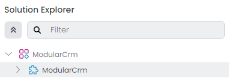
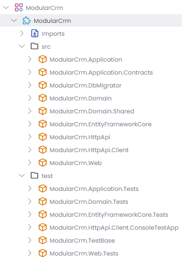

# Creating the Initial Solution

Follow the [Get Stared](../../get-started/layered-web-application.md) guide to create a new layered web application with the following configuration:

* **Solution name**: `ModularCrm`
* **UI Framework**: ASP.NET Core MVC / Razor Pages
* **Database Provider**: Entity Framework Core

You can select the other options based on your preference.

> **Please complete the [Get Stared](../../get-started/layered-web-application.md) guide and run the web application before going further.**

The initial solution structure should be like the following in ABP Studio's *Solution Explorer*:

Initially, you see a `ModularCrm` solution and a `ModularCrm` module under that solution.

> An ABP Studio module is typically a .NET solution and an ABP Studio solution is an umbrella concept for multiple .NET Solutions (see the [concepts](../../studio/concepts.md) document for more).

`ModularCrm` module is your main application, which is a layered .NET solution that consists of several packages (.NET projects). You can expand the `ModularCrm` module to see its packages:

We've created the initial layered monolith solution. In the next part, we will learn how to create an application module, build functionality inside it and install it to the main application.