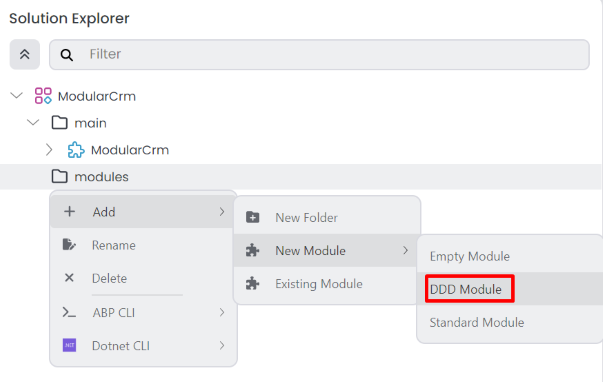
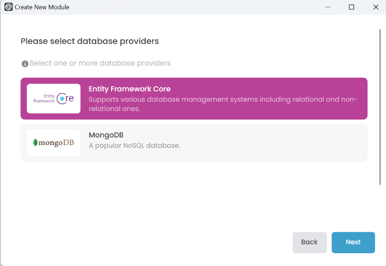

# Creating the Initial Products Module

````json
//[doc-nav]
{
  "Previous": {
    "Name": "Creating the initial solution",
    "Path": "tutorials/modular-crm/part-01"
  },
  "Next": {
    "Name": "Building the Products module",
    "Path": "tutorials/modular-crm/part-03"
  }
}
````

In this part, you will build a new product management module and install it in the main CRM application.

## Creating Solution Folders

You can create solution folders and sub-folders in *Solution Explorer* to organize your solution components better. Right-click to the solution root on the *Solution Explorer* panel, and select *Add* -> *New Folder* command:


That command opens a dialog where you can set the folder name:


Create a `main` and a `modules` folder using the *New Folder* command, then move the `ModularCrm` module into the `main` folder (simply by drag & drop). The *Solution Explorer* panel should look like the following figure now:


## Creating The Module

There are two module templates provided by ABP Studio:

* **Empty Module**: You can use that module template to build your module structure from scratch.
* **DDD Module**: A Domain Driven Design based layered module structure.

We will use the *DDD Module* template for the Product module and the *Empty Module* template later in this tutorial.

Right-click the `modules` folder on the *Solution Explorer* panel, and select the *Add* -> *New Module* -> *DDD Module* command:



This command opens a new dialog to define the properties of the new module. You can use the following values to create a new module named `ModularCrm.Products`:


When you click the *Next* button, you are redirected to the UI selection step.

### Selecting the UI Type

Here, you can select the UI type you want to support in your module:


A module;

* May not contain a UI and leaves the UI development to the final application.
* May contain a single UI implementation that is typically in the same technology as the main application.
* May contain more than one UI implementation if you want to create a reusable application module and you want to make that module usable by different applications with different UI technologies. For example, all of [pre-built ABP modules](https://abp.io/modules) support multiple UI options.

In this tutorial, we are selecting the MVC UI since we are building that module only for our `ModularCrm` solution and we are using the MVC UI in our application. So, select the MVC UI and click the *Next* button.

### Selecting the Database Provider

The next step is to select the database provider (or providers) you want to support with your module:



Since our main application is using Entity Framework Core and we will use the `ModularCrm.Products` module only for that main application, we can select the *Entity Framework Core* option and click the *Next* button.


Lastly, you can uncheck the *Include Tests* option if you don't want to include test projects in your module. Click the *Create* button to create the new module.

### Exploring the New Module

After adding the new module, the *Solution Explorer* panel should look like the following figure:


The new `ModularCrm.Products` module has been created and added to the solution. The `ModularCrm.Products` module has a separate and independent .NET solution. Right-click the `ModularCrm.Products` module and select the *Open with* -> *Explorer* command:


This command opens the solution folder in your file system:


You can open `ModularCrm.Products.sln` in your favorite IDE (e.g. Visual Studio):


As seen in the preceding figure, the `ModularCrm.Products` solution consists of several layers, each has own responsibility.

### Installing the Product Module to the Main Application

A module does not contain an executable application inside. The `Modular.Products.Web` project is just a class library project, not an executable web application. A module should be installed in an executable application to run it.

> **Ensure that the web application is not running in [Solution Runner](../../studio/running-applications.md) or in your IDE. Installing a module to a running application will produce errors.**

The product module has yet to be related to the main application. Right-click on the `ModularCrm` module (inside the `main` folder) and select the *Import Module* command:


The *Import Module* command opens a dialog as shown below:


Select the `ModularCrm.Products` module and check the *Install this module* option. If you don't check that option, it only imports the module but doesn't set project dependencies. Importing a module without installation can be used to set up your project dependencies manually. We want to make it automatically, so check the *Install this module* option.

When you click the *OK* button, ABP Studio opens the *Install Module* dialog:


This dialog simplifies installing a multi-layer module to a multi-layer application. It automatically determines which package of the `ModularCrm.Products` module should be installed to which package of the main application. For example, the `ModularCrm.Products.Domain` package is installed to the `ModularCrm.Domain` package. In that way, you can use domain objects ([entities](../../framework/architecture/domain-driven-design/entities.md), [repositories](../../framework/architecture/domain-driven-design/repositories.md), ...) of the products module from the domain layer of your main application.

The default package match is good for this tutorial, so you can click the *OK* button to proceed.

### Building the Main Application

After the installation, build the entire solution by right-clicking on the `ModularCrm` module (under the `main` folder) and selecting the *Dotnet CLI* -> *Graph Build* command:


Graph Build is a dotnet CLI command that recursively builds all the referenced dotnet projects, even if they are not part of the root solution.

> While developing multi-module solutions with ABP Studio, you may need to perform *Graph Build* on the root/main module if you change the depending modules.

### Run the Main Application

Open the *Solution Runner* panel, click the *Play* button (near to the solution root), right-click the `ModularCrm.Web` application and select the *Browse* command. It will open the web application in the built-in browser. Then you can navigate to the *Products* page on the main menu of the application to see the Products page that is coming from the `ModularCrm.Products` module:


## Summary

In this part, we've created a new module to manage products in our modular application. Then we installed the new module to the main application and run the solution to test if it has successfully installed.

In the next part, you will learn how to create entities, services and a basic user interface for the products module.
