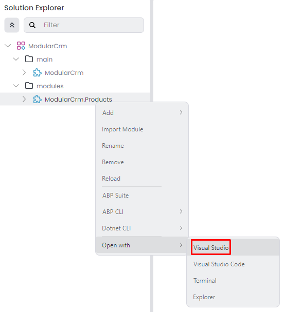
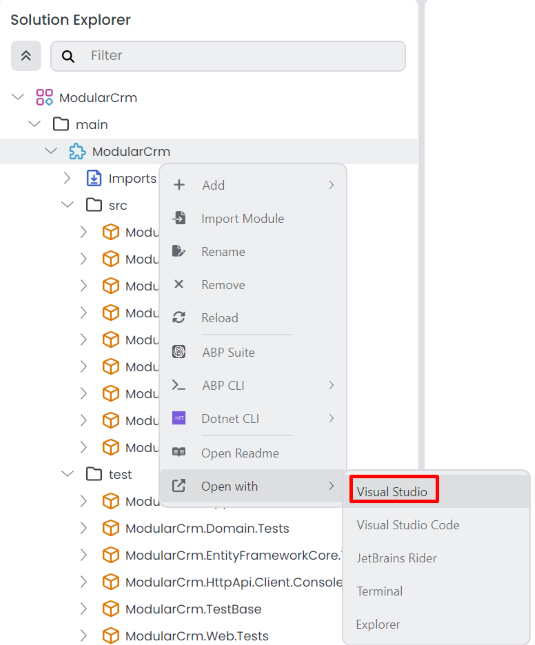
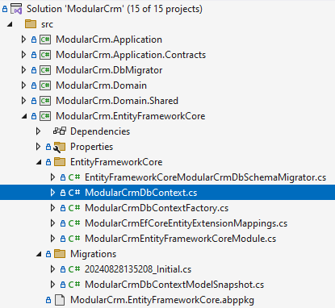
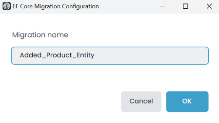
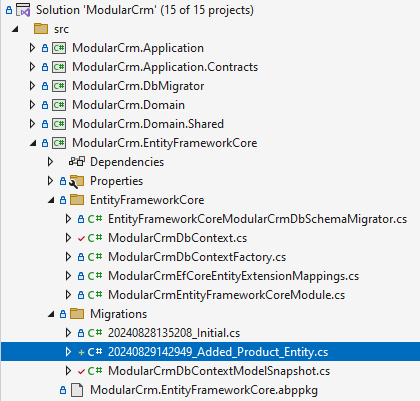
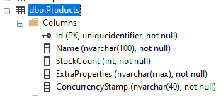

# Building the Products Module

````json
//[doc-nav]
{
  "Previous": {
    "Name": "Creating the initial products module",
    "Path": "tutorials/modular-crm/part-02"
  },
  "Next": {
    "Name": "TODO",
    "Path": "tutorials/modular-crm/part-04"
  }
}
````

In this part, you will learn how to create entities, services and a basic user interface for the products module.

> **This module's functionality will be minimal to focus on modularity.** You can follow the [Book Store tutorial](../book-store/index.md) to learn building more real-world applications with ABP.

If it is still running, please stop the web application before continuing with the tutorial.

## Creating a Product Entity

Open the `ModularCrm.Products` module in your favorite IDE. You can right-click the `ModularCrm.Products` module and select the *Open With* -> *Visual Studio* command to open the `ModularCrm.Products` module's .NET solution with Visual Studio. If you can not find your IDE in the *Open with* list, open with the *Explorer*, then open the `.sln` file with your IDE:



The `ModularCrm.Products` .NET solution should look like the following figure:


Add a new `Product` class under the `ModularCrm.Products.Domain` project (Right-click the `ModularCrm.Products.Domain` project, select *Add* -> *Class*):

````csharp
using System;
using Volo.Abp.Domain.Entities;

namespace ModularCrm.Products;

public class Product : AggregateRoot<Guid>
{
    public string Name { get; set; }
    public int StockCount { get; set; }
}
````

## Mapping Entity to Database

The next step is to configure Entity Framework Core `DbContext` class for the new entity.

### Add a DbSet Property

Open the `ProductsDbContext` in the `ModularCrm.Products.EntityFrameworkCore` project and add a new `DbSet` property for the `Product` entity. The final `Product.cs` file content should be the following:

````csharp
using Microsoft.EntityFrameworkCore;
using Volo.Abp.Data;
using Volo.Abp.EntityFrameworkCore;

namespace ModularCrm.Products.EntityFrameworkCore;

[ConnectionStringName(ProductsDbProperties.ConnectionStringName)]
public class ProductsDbContext : AbpDbContext<ProductsDbContext>, IProductsDbContext
{
    public DbSet<Product> Products { get; set; } //NEW: DBSET FOR THE PRODUCT ENTITY

    public ProductsDbContext(DbContextOptions<ProductsDbContext> options)
        : base(options)
    {

    }

    protected override void OnModelCreating(ModelBuilder builder)
    {
        base.OnModelCreating(builder);
        builder.ConfigureProducts();
    }
}
````

The `ProductsDbContext` class implements the `IProductsDbContext` interface. Add the following property to the `IProductsDbContext` interface:

````csharp
DbSet<Product> Products { get; set; }
````

The final `IProductsDbContext` interface should be the following:

````csharp
using Microsoft.EntityFrameworkCore;
using Volo.Abp.Data;
using Volo.Abp.EntityFrameworkCore;

namespace ModularCrm.Products.EntityFrameworkCore;

[ConnectionStringName(ProductsDbProperties.ConnectionStringName)]
public interface IProductsDbContext : IEfCoreDbContext
{
    DbSet<Product> Products { get; set; }
}
````

Having such an `IProductsDbContext` interface allows us to decouple our repositories (and other classes) from the concrete `ProductsDbContext` class, which provides flexibility to the final application to merge multiple `DbContext`s into a single `DbContext` to manage database migrations easier and have a database level transaction support for multi-module operations. We will see it in the *Adding a Database Migration* section.

### Configure the Table Mapping

The DDD module template has designed flexible so that your module can have a separate physical database, or store its tables inside another database, like the main database of your application. To make that possible, it configures the database mapping in an extension method (`ConfigureProducts`) that is called inside the `OnModelCreating` method above. Find that extension method (in the `ProductsDbContextModelCreatingExtensions` class) and change its content as the following code block:

````csharp
using Microsoft.EntityFrameworkCore;
using Volo.Abp;
using Volo.Abp.EntityFrameworkCore.Modeling;

namespace ModularCrm.Products.EntityFrameworkCore;

public static class ProductsDbContextModelCreatingExtensions
{
    public static void ConfigureProducts(
        this ModelBuilder builder)
    {
        Check.NotNull(builder, nameof(builder));

        builder.Entity<Product>(b =>
        {
            //Configure table & schema name
            b.ToTable(ProductsDbProperties.DbTablePrefix + "Products",
                      ProductsDbProperties.DbSchema);

            //Always call this method to setup base entity properties
            b.ConfigureByConvention();

            //Properties of the entity
            b.Property(q => q.Name).IsRequired().HasMaxLength(100);
        });
    }
}
````

As first, we are setting the database table name with the `ToTable` method. `ProductsDbProperties.DbTablePrefix` defines a constant that is added as a prefix to all database table names of this module. If you see the `ProductsDbProperties` class, `DbTablePrefix` value is `Products`. In that case, the table name for the `Product` entity will be `ProductsProducts`. We think that is unnecessary for such a simple module and we can remove that prefix. So, you can change the `ProductsDbProperties` class with the following content to set an empty string to the `DbTablePrefix` property:

````csharp
namespace ModularCrm.Products;

public static class ProductsDbProperties
{
    public static string DbTablePrefix { get; set; } = "";
    public static string? DbSchema { get; set; } = null;
    public const string ConnectionStringName = "Products";
}
````

In that point, build the `ModularCrm.Products` .NET solution in your IDE (or in ABP Studio UI). We will switch to the main application's .NET solution.

### Configuring the Main Application Database

We changed the Entity Framework Core configuration. The next step should be adding a new code-first database migration and update the database, so the new Products table is created on the database.

We are not managing the database migrations in the module. Instead, the main application decides which DBMS (Database Management System) to use and how to share physical database(s) among modules. To keep this tutorial simple, we will store all the data of all modules in a single physical database.

Open the `ModularCrm` module (which is the main application) in your IDE:



Find the `ModularCrmDbContext` class under the `ModularCrm.EntityFrameworkCore` project:



We will merge module's database configuration into `ModularCrmDbContext`.

#### Replace the `IProductsDbContext` Service

Follow the 3 steps below;

**(1)** Add the following attribute on top of the `ModularCrmDbContext` class:

````csharp
[ReplaceDbContext(typeof(IProductsDbContext))]
````

`ReplaceDbContext` attribute makes it possible to use the `ModularCrmDbContext` class in the services in the Products module.

**(2)** Implement the `IProductsDbContext` by the `ModularCrmDbContext` class:

````csharp
public class ModularCrmDbContext :
    AbpDbContext<ModularCrmDbContext>,
    ITenantManagementDbContext,
    IIdentityDbContext,
    IProductsDbContext //NEW: IMPLEMENT THE INTERFACE
{
    public DbSet<Product> Products { get; set; } //NEW: ADD DBSET PROPERTY
	...
}
````

**(3)** Finally, call the `ConfigureProducts()` extension method inside the `OnModelCreating` method after other `Configure...` module calls:

````csharp
protected override void OnModelCreating(ModelBuilder builder)
{
    ...
    builder.ConfigureProducts(); //NEW: CALL THE EXTENSION METHOD
}
````

In this way, `ModularCrmDbContext` can be used by the products module over the `IProductsDbContext` interface. This part is only needed for one time for a module. Next time, you can just add a new database migration as explained in the next section.

#### Add a Database Migration

Now, we can add a new database migration. You can use Entity Framework Core's `Add-Migration` (or `dotnet ef migrations add`) terminal command, but we will use ABP Studio's shortcut UI in this tutorial.

Ensure that the solution has built. You can right-click the `ModularCrm` (under the `main` folder) on ABP Studio *Solution Runner* and select the *Dotnet CLI* -> *Graph Build* command.

Right-click the `ModularCrm.EntityFrameworkCore` package and select the *EF Core CLI* -> *Add Migration* command:


The *Add Migration* command opens a new dialog to get a migration name:



Once you click the *OK* button, a new database migration class is added into the `Migrations` folder of the `ModularCrm.EntityFrameworkCore` project:



Now, you can return to ABP Studio, right-click the `ModularCrm.EntityFrameworkCore` project and select the *EF Core CLI* -> *Update Database* command:


After the operation completes, you can check your database to see the new `Products` table has been created:



## Creating the Application Service

TODO