# Creating the Initial Ordering Module

````json
//[doc-nav]
{
  "Previous": {
    "Name": "Building the Products Module",
    "Path": "tutorials/modular-crm/part-03"
  },
  "Next": {
    "Name": "Building the Ordering module",
    "Path": "tutorials/modular-crm/part-05"
  }
}
````

In this part, you will build a new module for placing orders and install it in the main CRM application.

## Creating a Standard Module

In this part, we have used the *DDD Module* template for the Product module and will use the *Standard Module* template for the Ordering module.

Right-click the `modules` folder on the *Solution Explorer* panel, and select the *Add* -> *New Module* -> *Standard Module* command:

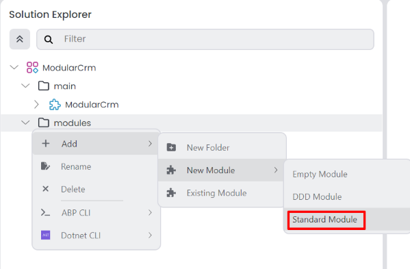

That command opens a dialog to define the properties of the new module:

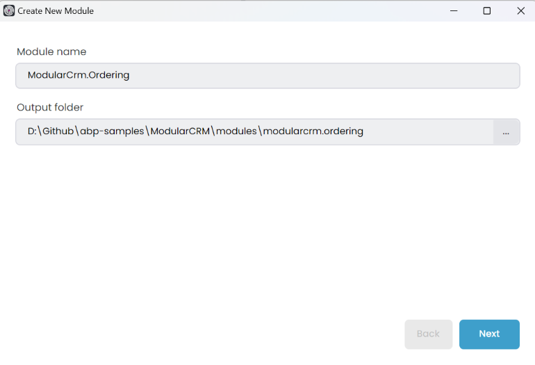

Set `ModularCrm.Ordering` as the *Module name*, leave the *Output folder* as is and click the *Next* button.

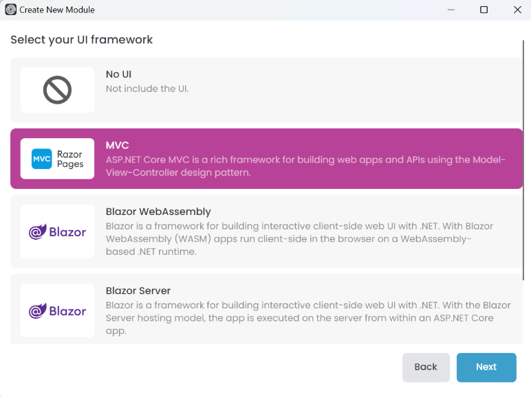

Similar to DDD module creation, you can choose the type of UI you want to support in your module or select *No UI* if you don't need a user interface. In this example, we'll select the *MVC* option and click *Next*. One difference is that, for a standard module, you can only choose one UI type.

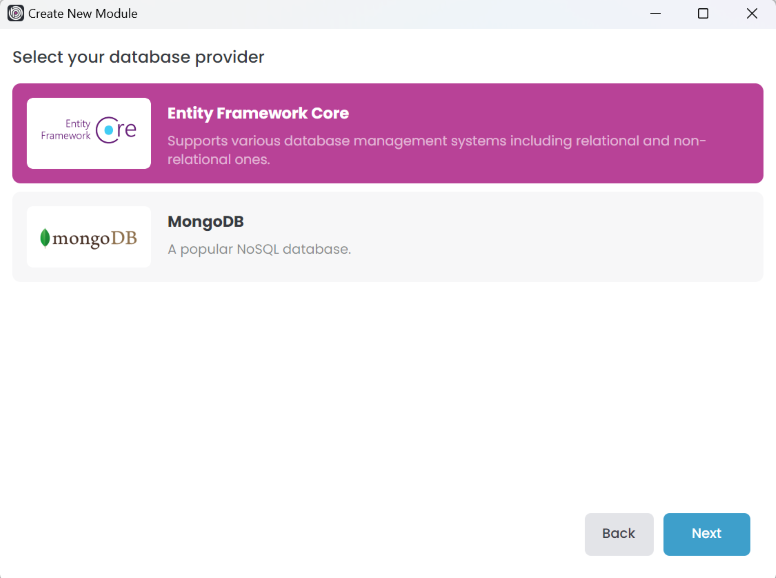

The same limitation applies to the database selection. You can only choose one database provider for a standard module. Select the *Entity Framework Core* option and click *Next*.

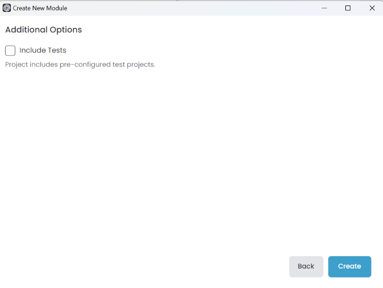

You can uncheck the *Include Tests* option to keep the module simple. Click the *Create* button to create the module.

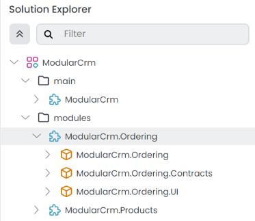

Since we've created a standard module, it doesn't have multiple layers like the DDD module. If you open the `modules/modularcrm.ordering` in your file system, you can see the initial files:

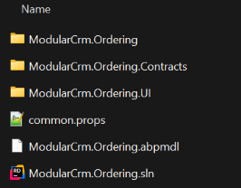

Because only a single UI package can be chosen, the UI type doesn’t matter. This is why the package name is changed to *ModularCrm.Ordering.UI*. Additionally, there are no *Domain*, *EntityFrameworkCore*, or *Http* layers like in the DDD module. We're going to use the `ModularCrm.Ordering` package for the domain business logic. You can open `ModularCrm.Ordering.sln` in your favorite IDE (e.g. Visual Studio):

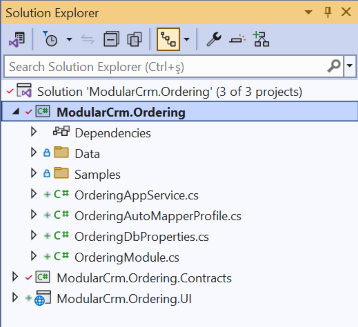

## Installing into the Main Application

In this section, we will install the `ModularCrm.Ordering` module in the main application so it can be part of the system.

> Before the installation, please ensure the web application is not running.

Right-click the `ModularCrm` module (under the `main` folder) and select the *Import Module* command:

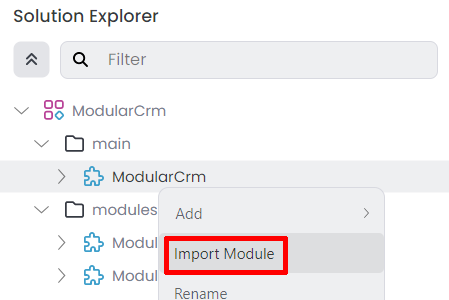

That command opens the *Import Module* dialog:

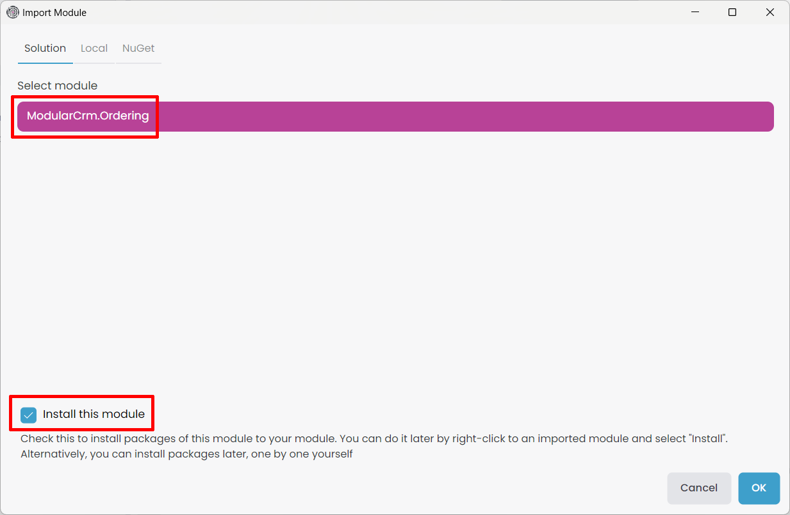

Select the `ModularCrm.Ordering` module and check the *Install this module* option as shown in the preceding figure. When you click the OK button, a new dialog is shown to select the packages to install:

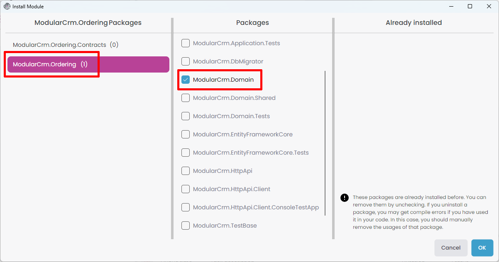

Select the `ModuleCrm.Ordering` package from the left area and the `ModularCrm.Domain` package from the middle area. Then, select the `ModularCrm.Ordering.UI` package from the left area and the `ModularCrm.Web` package from the middle area, as shown in the preceding figure. Finally, click *OK*.

> Since the Ordering module is not layered, we didn't install its packages to the layers of our main application. We are installing it only to `ModularCrm.Domain`. In this way, we can use the Ordering module from any layer of our application since `ModularCrm.Domain` is one of the core packages of our application. If you build your modules as non-layered and you don't have much code in the main application's .NET solution, you can also consider creating a non-layered main application that composes these modules.

In this part of the tutorial, we've created a standard module. This allows you to create modules or applications with a different structure. In the next part, we will add functionality to the Ordering module.
