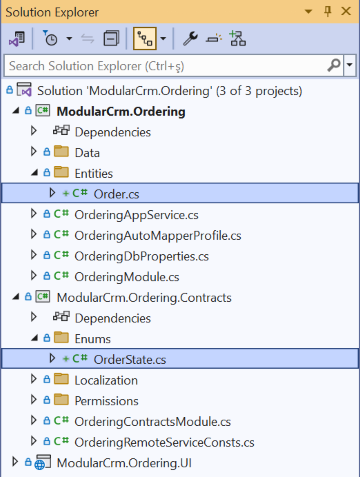

# Building the Ordering Module

````json
//[doc-nav]
{
  "Previous": {
    "Name": "Creating the Initial Ordering Module",
    "Path": "tutorials/modular-crm/part-04"
  },
  "Next": {
    "Name": "Integrating Modules: Implementing Integration Services",
    "Path": "tutorials/modular-crm/part-06"
  }
}
````

In the previous part, we created Ordering module and installed it into the main application. However, the Ordering module has no functionality now. In this part, we will create an `Order` entity and add functionality to create and list the orders.

## Creating an `Order` Entity

Open the `ModularCrm.Ordering` .NET solution in your IDE.

> Tip: You can open the folder of a module's .NET solution by right-clicking the related module in ABP Studio and selecting the *Open with* -> *Explorer* command.

### Adding an `Order` Class

Create an `Order` class to the `ModularCrm.Ordering` project (open an `Entities` folder and place the `Order.cs` into that folder):

````csharp
using System;
using ModularCrm.Ordering.Contracts.Enums;
using Volo.Abp.Domain.Entities.Auditing;

namespace ModularCrm.Ordering.Entities
{
    public class Order : CreationAuditedAggregateRoot<Guid>
    {
        public Guid ProductId { get; set; }
        public string CustomerName { get; set; }
        public OrderState State { get; set; }
    }
}
````

We allow users to place only a single product within an order. The `Order` entity would be much more complex in a real-world application. However, the complexity of the `Order` entity doesn't affect modularity, so we keep it simple to focus on modularity in this tutorial. We are inheriting from the [`CreationAuditedAggregateRoot` class](../../framework/architecture/domain-driven-design/entities.md) since I want to know when an order has been created and who has created it.

### Adding an `OrderState` Enumeration

We used an `OrderState` enumeration that has not yet been defined. Open an `Enums` folder in the `ModularCrm.Ordering.Contracts` project and create an `OrderState.cs` file inside it:

````csharp
namespace ModularCrm.Ordering.Enums;

public enum OrderState : byte
{
    Placed = 0,
    Delivered = 1,
    Canceled = 2
}
````

The final structure of the Ordering module should be similar to the following figure in your IDE:



## Configuring the Database Mapping

The `Order` entity has been created. Now, we need to configure the database mapping for that entity. We will first define the database table mapping, create a database migration and update the database.

### Defining the Database Mappings

Entity Framework Core requires defining a `DbContext` class as the main object for the database mapping. We want to use the main application's `DbContext` object. That way, we can control the database migrations at a single point, ensure database transactions on multi-module operations, and establish relations between database tables of different modules. However, the Ordering module can not use the main application's `DbContext` object because it doesn't depend on the main application, and we don't want to establish such a dependency.

As a solution, we will use `DbContext` interface in the Ordering module which is then implemented by the main module's `DbContext`.

Open your IDE, in `Data` folder under the `ModularCrm.Ordering` project, and edit `IOrderingDbContext` interface as shown:

````csharp
using Microsoft.EntityFrameworkCore;
using ModularCrm.Ordering.Entities;
using Volo.Abp.Data;
using Volo.Abp.EntityFrameworkCore;

namespace ModularCrm.Ordering.Data;

[ConnectionStringName(OrderingDbProperties.ConnectionStringName)]
public interface IOrderingDbContext : IEfCoreDbContext
{
    DbSet<Order> Orders { get; set; }
}
````

Afterwards, create *Orders* `DbSet` for the `OrderingDbContext` class in the `Data` folder under the `ModularCrm.Ordering` project.

````csharp
using Microsoft.EntityFrameworkCore;
using ModularCrm.Ordering.Entities;
using Volo.Abp.Data;
using Volo.Abp.EntityFrameworkCore;

namespace ModularCrm.Ordering.Data;

[ConnectionStringName(OrderingDbProperties.ConnectionStringName)]
public class OrderingDbContext : AbpDbContext<OrderingDbContext>, IOrderingDbContext
{
    public DbSet<Order> Orders { get; set; }

    public OrderingDbContext(DbContextOptions<OrderingDbContext> options) : base(options)
    {
        
    }

    protected override void OnModelCreating(ModelBuilder builder)
    {
        base.OnModelCreating(builder);

        builder.ConfigureOrdering();
    }
}
````


We can inject and use the `IOrderingDbContext` in the Ordering module. However, we will not usually directly use that interface. Instead, we will use ABP's [repositories](../../framework/architecture/domain-driven-design/repositories.md), which internally uses that interface.

It is best to configure the database table mapping for the `Order` entity in the Ordering module. We will use the `OrderingDbContextModelCreatingExtensions` in the same `Data` folder:

````csharp
using Microsoft.EntityFrameworkCore;
using ModularCrm.Ordering.Entities;
using Volo.Abp;
using Volo.Abp.EntityFrameworkCore.Modeling;

namespace ModularCrm.Ordering.Data;

public static class OrderingDbContextModelCreatingExtensions
{
    public static void ConfigureOrdering(
        this ModelBuilder builder)
    {
        Check.NotNull(builder, nameof(builder));

        builder.Entity<Order>(b =>
        {
            //Configure table name
            b.ToTable("Orders");

            //Always call this method to set base entity properties
            b.ConfigureByConvention();

            //Properties of the entity
            b.Property(q => q.CustomerName).IsRequired().HasMaxLength(120);
        });
    }
}
````

#### Configuring the Main Application

Open the main application's solution in your IDE, find the `ModularCrmDbContext` class under the `ModularCrm.EntityFrameworkCore` project and follow the 3 steps below:

**(1)** Add the following attribute on top of the `ModularCrmDbContext` class:

````csharp
[ReplaceDbContext(typeof(IOrderingDbContext))]
````

The `ReplaceDbContext` attribute allows the use of the `ModularCrmDbContext` class in the services in the Ordering module.

**(2)** Implement the `IOrderingDbContext` by the `ModularCrmDbContext` class:

````csharp
public class ModularCrmDbContext :
    AbpDbContext<ModularCrmDbContext>,
    ITenantManagementDbContext,
    IIdentityDbContext,
    IProductsDbContext,
    IOrderingDbContext //NEW: IMPLEMENT THE INTERFACE
{
    public DbSet<Product> Products { get; set; }
    public DbSet<Order> Orders { get; set; } //NEW: ADD DBSET PROPERTY
	...
}
````

**(3)** Finally, call the `ConfigureOrdering()` extension method inside the `OnModelCreating` method after other `Configure...` module calls:

````csharp
protected override void OnModelCreating(ModelBuilder builder)
{
    ...
    builder.ConfigureOrdering(); //NEW: CALL THE EXTENSION METHOD
}
````

In this way, the Ordering module can use' ModularCrmDbContext' over the `IProductsDbContext` interface. This part is only needed once for a module. Next time, you can add a new database migration, as explained in the next section.

#### Add a Database Migration

Now, we can add a new database migration. You can use Entity Framework Core's `Add-Migration` (or `dotnet ef migrations add`) terminal command, but in this tutorial, we will use ABP Studio's shortcut UI.

Ensure that the solution has built. You can right-click the `ModularCrm` (under the `main` folder) on ABP Studio *Solution Runner* and select the *Dotnet CLI* -> *Graph Build* command.

Right-click the `ModularCrm.EntityFrameworkCore` package and select the *EF Core CLI* -> *Add Migration* command:


The *Add Migration* command opens a new dialog to get a migration name:


Once you click the *OK* button, a new database migration class is added to the `Migrations` folder of the `ModularCrm.EntityFrameworkCore` project:


Now, you can return to ABP Studio, right-click the `ModularCrm.EntityFrameworkCore` project and select the *EF Core CLI* -> *Update Database* command:


After the operation completes, you can check your database to see the new `Orders` table has been created:


## Creating the Application Service

We will create an application service to manage the `Order` entities. 

### Defining the Application Service Contract

We're gonna create the `IOrderAppService` interface under the `ModularCrm.Ordering.Contracts` project. Return to your IDE, open the `ModularCrm.Ordering` module's .NET solution and create an `IOrderAppService` interface under the `Services` folder for `ModularCrm.Ordering.Contracts` project:

````csharp
using System;
using System.ComponentModel.DataAnnotations;

namespace ModularCrm.Ordering.Services;

public class OrderCreationDto
{
    [Required]
    [StringLength(150)]
    public string CustomerName { get; set; }

    [Required]
    public Guid ProductId { get; set; }
}
````

### Defining Data Transfer Objects

The `GetListAsync` and `CreateAsync` methods will use data transfer objects (DTOs) to communicate with the client. We will create two DTO classes for that purpose.

Create a `OrderCreationDto` class under the `ModularCrm.Ordering.Contracts` project:

````csharp
using System;
using System.ComponentModel.DataAnnotations;

namespace ModularCrm.Ordering.Contracts.Services;

public class OrderCreationDto
{
    [Required]
    [StringLength(150)]
    public string CustomerName { get; set; }

    [Required]
    public Guid ProductId { get; set; }
}
````

Create a `OrderDto` class under the `ModularCrm.Ordering.Contracts` project:

````csharp
using System;
using ModularCrm.Ordering.Enums;

namespace ModularCrm.Ordering.Services;

public class OrderDto
{
    public Guid Id { get; set; }
    public string CustomerName { get; set; }
    public Guid ProductId { get; set; }
    public OrderState State { get; set; }
}
````

The new files under the `ModularCrm.Ordering.Contracts` project should be like the following figure:


### Implementing the Application Service

Now we should configure the *AutoMapper* object to map the `Order` entity to the `OrderDto` object. We will use the `OrderingAutoMapperProfile` under the `ModularCrm.Ordering` project:

````csharp
using AutoMapper;
using ModularCrm.Ordering.Entities;
using ModularCrm.Ordering.Services;

namespace ModularCrm.Ordering;

public class OrderingAutoMapperProfile : Profile
{
    public OrderingAutoMapperProfile()
    {
        CreateMap<Order, OrderDto>();
    }
}
````

Now, we can implement the `IOrderAppService` interface. Create an `OrderAppService` class under the `Services` folder of the `ModularCrm.Ordering` project:

````csharp
using System;
using System.Collections.Generic;
using System.Threading.Tasks;
using ModularCrm.Ordering.Enums;
using ModularCrm.Ordering.Entities;
using Volo.Abp.Domain.Repositories;

namespace ModularCrm.Ordering.Services;

public class OrderAppService : OrderingAppService, IOrderAppService
{
    private readonly IRepository<Order> _orderRepository;

    public OrderAppService(IRepository<Order, Guid> orderRepository)
    {
        _orderRepository = orderRepository;
    }

    public async Task<List<OrderDto>> GetListAsync()
    {
        var orders = await _orderRepository.GetListAsync();
        return ObjectMapper.Map<List<Order>, List<OrderDto>>(orders);
    }

    public async Task CreateAsync(OrderCreationDto input)
    {
        var order = new Order
        {
            CustomerName = input.CustomerName,
            ProductId = input.ProductId,
            State = OrderState.Placed
        };

        await _orderRepository.InsertAsync(order);
    }
}
````

Open the `ModularCrmWebModule` class in the main application's solution (the `ModularCrm` solution), find the `ConfigureAutoApiControllers` method and add the following lines inside that method:

````csharp
private void ConfigureAutoApiControllers()
{
    Configure<AbpAspNetCoreMvcOptions>(options =>
    {
        options.ConventionalControllers.Create(typeof(ModularCrmApplicationModule).Assembly);
        options.ConventionalControllers.Create(typeof(ProductsApplicationModule).Assembly);

        //ADD THE FOLLOWING LINE:
        options.ConventionalControllers.Create(typeof(OrderingModule).Assembly);
    });
}
````

### Creating Example Orders

This section will create a few example orders using the [Swagger UI](../../framework/api-development/swagger.md). Thus, we will have some sample orders to show on the UI.

Now, right-click the `ModularCrm` under the `main` folder in the Solution Explorer panel and select the *Dotnet CLI* -> *Graph Build* command. This will ensure that the order module and the main application are built and ready to run.

After the build process completes, open the Solution Runner panel and click the *Play* button near the solution root. Once the `ModularCrm.Web` application runs, we can right-click it and select the *Browse* command to open the user interface.

Once you see the user interface of the web application, type `/swagger` at the end of the URL to open the Swagger UI. If you scroll down, you should see the `Orders` API:


Expand the `/api/app/order` API and click the *Try it out* button. Then, create a few orders by filling in the request body and clicking the *Execute* button:


If you check the database, you should see the entities created in the *Orders* table:


## Creating the User Interface

### Creating the Orders Page

Replace the `Index.cshtml.cs` content in the `Pages/Ordering` folder of the `ModularCrm.Ordering.UI` project with the following code block:

````csharp
using System.Collections.Generic;
using System.Threading.Tasks;
using Microsoft.AspNetCore.Mvc.RazorPages;
using ModularCrm.Ordering.Services;

namespace ModularCrm.Ordering.UI.Pages.Ordering
{
    public class IndexModel : PageModel
    {
        public List<OrderDto> Orders { get; set; }

        private readonly IOrderAppService _orderAppService;

        public IndexModel(IOrderAppService orderAppService)
        {
            _orderAppService = orderAppService;
        }

        public async Task OnGetAsync()
        {
            Orders = await _orderAppService.GetListAsync();
        }
    }
}
````

Here, we are injecting `IOrderAppService` to query `Order` entities from the database to show on the page. Open the `Index.cshtml` file and replace the content with the following code block:

````html
@page
@model ModularCrm.Ordering.UI.Pages.Ordering.IndexModel

<h1>Orders</h1>

<abp-card>
    <abp-card-body>
        <abp-list-group>
            @foreach (var order in Model.Orders)
            {
                <abp-list-group-item>
                    <strong>Customer:</strong> @order.CustomerName <br />
                    <strong>Product:</strong> @order.ProductId <br />
                    <strong>State:</strong> @order.State
                </abp-list-group-item>
            }
        </abp-list-group>
    </abp-card-body>
</abp-card>
````

This page shows a list of orders on the UI. We haven't created a UI to create new orders, and we will not do it to keep this tutorial simple. If you want to learn how to create advanced UIs with ABP, please follow the [Book Store tutorial](../book-store/index.md).

### Editing the Menu Item

ABP provides a modular navigation [menu system](../../framework/ui/mvc-razor-pages/navigation-menu.md) where each module can contribute to the main menu dynamically.

Edit the `OrderingMenuContributor` class into the `ModularCrm.Ordering.UI` project:

````csharp
using System.Threading.Tasks;
using Volo.Abp.UI.Navigation;

namespace ModularCrm.Ordering.UI.Menus;

public class OrderingMenuContributor : IMenuContributor
{
    public async Task ConfigureMenuAsync(MenuConfigurationContext context)
    {
        if (context.Menu.Name == StandardMenus.Main)
        {
            await ConfigureMainMenuAsync(context);
        }
    }

    private Task ConfigureMainMenuAsync(MenuConfigurationContext context)
    {
        context.Menu.AddItem(
            new ApplicationMenuItem(
                OrderingMenus.Prefix, // Unique menu id
                "Orders", // Menu display text
                "~/Ordering", // URL
                "fa-solid fa-basket-shopping" // Icon CSS class
            )
        );

        return Task.CompletedTask;
    }
}

````

`OrderingMenuContributor` implements the `IMenuContributor` interface, which forces us to implement the `ConfigureMenuAsync` method. In that method, we can manipulate the menu items (add new menu items, remove existing menu items or change the properties of existing menu items). The `ConfigureMenuAsync` method is executed whenever the menu is rendered on the UI, so you can dynamically decide how to manipulate the menu items.

> You can check the [menu documentation](../../framework/ui/mvc-razor-pages/navigation-menu.md) to learn more about manipulating menu items.

### Building the Application

Now, we will run the application to see the result. Please stop the application if it is already running. Then open the *Solution Runner* panel, right-click the `ModularCrm.Web` application, and select the *Build* -> *Graph Build* command:


We've performed a graph build since we've made a change on a module, and more than building the main application is needed. *Graph Build* command also builds the depended modules if necessary. Alternatively, you could build the Ordering module first (on ABP Studio or your IDE), then right-click the `ModularCrm.Web` application and select the *Run* -> *Build & Start*. This approach can be faster if you have too many modules and you make a change in one of the modules. Now you can run the application by right-clicking the `ModularCrm.Web` application and selecting the *Run* -> *Start* command.


Great! We can see the list of orders. However, there is a problems:

1. We see Product's GUID ID instead of its name. This is because the Ordering module has no integration with the Products module and doesn't have access to Product module's database to perform a JOIN query.

We will solve this problem in the [next part](part-06.md).

## Summary

In this part of the *Modular CRM* tutorial, we've built the functionality inside the Ordering module we created in the [previous part](part-04.md). In the next part, we will work on establishing communication between the Orders module and the Products module.
