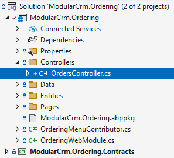

# Integrating the Modules

````json
//[doc-nav]
{
  "Previous": {
    "Name": "Building the Ordering module",
    "Path": "tutorials/modular-crm/part-05"
  }
}
````

In the previous parts, we've created two modules: The Products module to store and manage products and the Orders module to accept orders. However, these modules were completely independent from each other. Only the main application brings them together to execute in the same application, but these modules don't communicate to each other.

In this part, you will learn to implement three patterns for integrating these modules:

1. The Order module will make request to the Products module to get product information when needed.
2. The Product module will listen to events from the Orders module, so it can decrease stock count of a product when an order is placed.
3. Finally, we will execute a database query that includes product and order data together.

Let's begin from the first one...

## Implementing Integration Services

Remember from the [previous part](part-05.md), the Orders page shows products' identities instead of their names:


That is because the Orders module has no access to the product data, so it can not perform a JOIN query to get the names of products from the `Products` table. That is a natural result of the modular design. However, we also don't want to show a product's identity on the UI, which is not a good user experience.

As a solution to that problem, the Orders module may ask product names to the Product module using an [integration service](../../framework/api-development/integration-services.md). Integration service concept in ABP is designed for request/response style inter-module (in modular applications) and inter-microservice (in distributed systems) communication.

### Creating a Products Integration Service

The first step is to create an integration service in the Products module, so other modules can consume it.

We will define an interface in the `ModularCrm.Products.Application.Contracts` package and implement it in the  `ModularCrm.Products.Application` package.

#### Defining the `IProductIntegrationService` Interface

Open the `ModularCrm.Products` .NET solution in your IDE, find the `ModularCrm.Products.Application.Contracts` project, create an `Integration` folder inside inside of that project and finally create an interface named `IProductIntegrationService` into that folder. The final folder structure should be like that:


(Creating an`Integration` folder is not required, but it can be a good practice)

Open the `IProductIntegrationService.cs` file and replace it's content with the following code block:

````csharp
using System;
using System.Collections.Generic;
using System.Threading.Tasks;
using Volo.Abp;
using Volo.Abp.Application.Services;

namespace ModularCrm.Products.Integration
{
    [IntegrationService]
    public interface IProductIntegrationService : IApplicationService
    {
        Task<List<ProductDto>> GetProductsByIdsAsync(List<Guid> ids);
    }
}
````

`IProductIntegrationService` is very similar to a typical [application service](../../framework/architecture/domain-driven-design/application-services.md). The only difference is that it has an `[IntegrationService]` attribute on top of the interface definition. In that way, ABP can recognize and behave differently for them (for example, ABP doesn't expose [integration services](../../framework/api-development/integration-services.md) as HTTP APIs by default if you've configured the *[Auto API Controllers](../../framework/api-development/auto-controllers.md)* feature)

`IProductIntegrationService`  has a single method that gets a list of product Ids and returns a list of `ProductDto` objects for these Ids. Any other module can use that method to get details of products when it only has some product Ids. This is exactly what we need in the Ordering module.

> **Design Tip**
>
> You may think if we can use the existing application services (like `IProductAppService`) from other modules instead of creating specific integration services. Technically you can use, ABP has no restriction. However, from good design and best practice points, we don't suggest it. Because, application services are designed to be consumed specifically by the presentation layer. They will have different authorization and validation logic, they will need different DTO input and output properties, they will have different performance, optimization and caching requirements, and so on. And most importantly, all these will change by the time based on UI requirements and these changes may break your integrations later. It is best to implement specific integration APIs that is designed and optimized for that purpose.
>
> We've reused the `ProductDto` object that was actually created for `IProductAppService`. That can be reasonable from the maintenance point. But, if you think your integration service results can be different than the application service results in the future, it can be good to separate them from the first day, so you don't need to introduce breaking changes later.

#### Implementing the `ProductIntegrationService` Class

We've defined the integration service interface. Now, we can implement it in the  `ModularCrm.Products.Application` project. Create an `Integration` folder and then create a `ProductIntegrationService` class in that folder. The final folder structure should be like that:


Open the `ProductIntegrationService.cs` file and replace it's content with the following code block:

````csharp
using System;
using System.Collections.Generic;
using System.Threading.Tasks;
using Volo.Abp;
using Volo.Abp.Domain.Repositories;

namespace ModularCrm.Products.Integration
{
    [IntegrationService]
    public class ProductIntegrationService
        : ProductsAppService, IProductIntegrationService
    {
        private readonly IRepository<Product, Guid> _productRepository;

        public ProductIntegrationService(IRepository<Product, Guid> productRepository)
        {
            _productRepository = productRepository;
        }

        public async Task<List<ProductDto>> GetProductsByIdsAsync(List<Guid> ids)
        {
            var products = await _productRepository.GetListAsync(
                product => ids.Contains(product.Id)
            );

            return ObjectMapper.Map<List<Product>, List<ProductDto>>(products);
        }
    }
}
````

The implementation is pretty simple. Just using a [repository](../../framework/architecture/domain-driven-design/repositories.md) to query `Product` [entities](../../framework/architecture/domain-driven-design/entities.md).

> Here, we directly used `List<T>` classes, but instead you could wrap inputs and outputs into [DTOs](../../framework/architecture/domain-driven-design/data-transfer-objects.md). In that way, it can be possible to add new properties to these DTOs without changing the signature of your integration service method (so, without introducing breaking change for your client modules).

### Consuming the Products Integration Service

The Product Integration Service is ready to be consumed by the other modules. In this section, we will use it in the Ordering module to convert product Ids to product names.

#### Adding Reference to the Contracts Package

Open the ABP Studio UI and stop the application if it is already running. Then open the *Solution Explorer* in ABP Studio, right-click the `ModularCrm.Ordering` package and select the *Add Package Reference* command:


In the opening dialog, select the *This solution* tab, find and check the `ModularCrm.Products.Application.Contracts` package and click the OK button:


ABP Studio adds the package reference and also arranges the [module](../../framework/architecture/modularity/basics.md) dependency.

> Instead of directly adding such a package reference, it can be best to import the module first (right-click the `ModularCrm.Ordering` module, select the Import Module command and import the `ModularCrm.Products` module), then install the package reference. In that way, it would be easy to see and keep track of inter-module dependencies.

#### Using the Products Integration Service

Now, we can inject and use `IProductIntegrationService` in the Ordering module codebase.

Open the `IndexModel` class (the `IndexModel.cshtml.cs` file under the `Pages/Orders` folder of the `ModularCrm.Ordering` project of the `ModularCrm.Ordering` .NET solution) and change its content as like the following code block:

````csharp
using Microsoft.AspNetCore.Mvc.RazorPages;
using ModularCrm.Ordering.Entities;
using ModularCrm.Products.Integration;
using System;
using System.Collections.Generic;
using System.Linq;
using System.Threading.Tasks;
using Volo.Abp.Domain.Repositories;

namespace ModularCrm.Ordering.Pages.Orders
{
    public class IndexModel : PageModel
    {
        public List<Order> Orders { get; set; }
        
        // Define a dictionary for Id -> Name conversion
        public Dictionary<Guid, string> ProductNames { get; set; }

        private readonly IRepository<Order, Guid> _orderRepository;
        private readonly IProductIntegrationService _productIntegrationService;

        public IndexModel(
            IRepository<Order, Guid> orderRepository,
            IProductIntegrationService productIntegrationService)
        {
            _orderRepository = orderRepository;
            _productIntegrationService = productIntegrationService;
        }

        public async Task OnGetAsync()
        {
            // Getting the orders from this module's database
            Orders = await _orderRepository.GetListAsync();

            // Prepare a list of products we need
            var productIds = Orders.Select(o => o.ProductId).Distinct().ToList();

            // Request the related products from the product integration service
            var products = await _productIntegrationService
                .GetProductsByIdsAsync(productIds);

            // Create a dictionary to get a product name easily by its id
            ProductNames = products.ToDictionary(p => p.Id, p => p.Name);
        }
    }
}
````

Let's see what we've changed:

* Defined a `ProductNames` dictionary. We will use it on the UI to convert product ids to product names. We are filling that dictionary by getting products from the product integration service.
* Injecting `IProductIntegrationService` interface, so we can use it to request products.
* In the `OnGetAsync` method;
  * First getting the orders from the ordering module's database just like done before.
  * Next, we are preparing a unique list of product ids, since the `GetProductsByIdsAsync` methods requests it.
  * Then we are calling the `IProductIntegrationService.GetProductsByIdsAsync` method to get a `List<ProductDto>` object.
  * In the last line, we are converting the product list to a dictionary where the key is `Guid Id` and the value is `string Name`. In that way, we can easily find a product's name with it's id.

Open the `Index.cshtml` file, change the `@order.ProductId` part by `@Model.ProductNames[order.ProductId]` to write the product name instead of the product id. The final `Index.cshtml` content should be the following:

````html
@page
@model ModularCrm.Ordering.Pages.Orders.IndexModel

<h1>Orders</h1>

<abp-card>
    <abp-card-body>
        <abp-list-group>
            @foreach (var order in Model.Orders)
            {
                <abp-list-group-item>
                    <strong>Customer:</strong> @order.CustomerName <br />
                    <strong>Product:</strong> @Model.ProductNames[order.ProductId] <br />
                    <strong>State:</strong> @order.State
                </abp-list-group-item>
            }
        </abp-list-group>
    </abp-card-body>
</abp-card>
````

That's all. Now, you can graph build the main application and run in ABP Studio to see the result:


As you notice, we can see the product names instead of product ids.

In the way explained in this section, you can easily create integration services for your modules and consume these integration services in any other module.

> **Design Tip**
>
> It is suggested to keep that type of communication minimum to not couple your modules to each other. It can make your solution complicated and may also decrease your system performance. When you need to do it, think about performance and try to make some optimizations. For example, if the Ordering module frequently needs to product data, you can use a kind of [cache layer](../../framework/fundamentals/caching.md), so it doesn't make frequent requests to the Products module. Especially, if you consider to convert your system to a microservice solution in the future, too many direct integration API calls can be a performance bottleneck.

## Communication via Messages (Events)

Another common approach to communicate between modules is messaging. By publishing and handling messages, a module can perform operation when an event happens in another module.

ABP provides two types of event buses for loosely coupled communication:

* [Local Event Bus](https://abp.io/docs/latest/framework/infrastructure/event-bus/local) is suitable for in-process messaging. Since in a modular monolith, both of publisher and subscriber are in the same process, they can communicate in-process, without needing an external message broker.
* **[Distributed Event Bus](https://abp.io/docs/latest/framework/infrastructure/event-bus/distributed)** is normal for inter-process messaging, like microservices, for publishing and subscribing to distributed events. However, ABP's distributed event bus works as local (in-process) by default (actually, it uses the Local Event Bus under the hood by default), unless you configure an external message broker.

If you consider to convert your modular monolith to a microservice system later, it is best to use the Distributed Event Bus with default local/in-process implementation. It already supports database level transactional event execution and has no performance penalty. If you switch to an external provider (e.g. [RabbitMQ](../../framework/infrastructure/event-bus/distributed/rabbitmq.md) or [Kafka](../../framework/infrastructure/event-bus/distributed/kafka.md)), you don't need to change your application code.

On the other hand, if you want to publish events and always subscribe in the same module, you should use the Local Event Bus. In that way, if you switch to microservices later, you don't accidently (and unnecessarily) make a local event distributed. Both of the event bus types can be used in the same system, just understand these and use them properly.

Since we will use messaging (events) between different modules, we will use the distributed event bus.

### Publishing an Event

In the example scenario, we want to publish an event when a new order is placed. The Ordering module will publish the event since it knows when a new order is placed. The Products module will subscribe to that event and get notified when a new order is placed. It will decrease the stock count of the product that is related to the new order. The scenario is pretty simple, let's implement it.

#### Defining the Event Class

Open the `ModularCrm.Ordering` module in your IDE, find the `ModularCrm.Ordering.Contracts` project, create an `Events` folder and create an `OrderPlacedEto` class inside that folder. The final folder structure should be like that:


We've placed the `OrderPlacedEto` class inside the `ModularCrm.Ordering.Contracts` project since that project can be referenced and used by other modules without accessing internal implementation of the Ordering module. The `OrderPlacedEto` class definition should be the following:

````csharp
using System;

namespace ModularCrm.Ordering.Contracts.Events
{
    public class OrderPlacedEto
    {
        public string CustomerName { get; set; }
        public Guid ProductId { get; set; }
    }
}
````

`OrderPlacedEto` is very simple. It is a plain C# class and used to transfer data related to the event (*ETO* is an acronym for *Event Transfer Object*, a suggested naming convention, but not required). You can add more properties if it is needed. For this tutorial, it is more than enough.

#### Using the `IDistributedEventBus` Service

`IDistributedEventBus` service is used to publish events to the event bus. Until this point, the Ordering module has no functionality to create a new order.

In the Part 3, we had used ABP's Auto HTTP API Controller feature to automatically expose HTTP APIs from application services. In this section, we will create an ASP.NET Core API controller class to create a new order. In that way, you will also see that it is not different than creating a regular ASP.NET Core controller.

Open the `ModularCrm.Ordering` module's .NET solution, create a `Controllers` folder in the `ModularCrm.Ordering` project and place a controller class named `OrdersController` in that new folder. The final folder structure should be like that:



Here the full `OrdersController` class:

````csharp
using Microsoft.AspNetCore.Mvc;
using ModularCrm.Ordering.Contracts.Enums;
using ModularCrm.Ordering.Contracts.Events;
using ModularCrm.Ordering.Entities;
using System;
using System.ComponentModel.DataAnnotations;
using System.Threading.Tasks;
using Volo.Abp.AspNetCore.Mvc;
using Volo.Abp.Domain.Repositories;
using Volo.Abp.EventBus.Distributed;

namespace ModularCrm.Ordering.Controllers
{
    [Route("api/[controller]")]
    [ApiController]
    public class OrdersController : AbpControllerBase
    {
        private readonly IRepository<Order, Guid> _orderRepository;
        private readonly IDistributedEventBus _distributedEventBus;

        public OrdersController(
            IRepository<Order, Guid> orderRepository,
            IDistributedEventBus distributedEventBus)
        {
            _orderRepository = orderRepository;
            _distributedEventBus = distributedEventBus;
        }

        [HttpPost]
        public async Task CreateAsync(OrderCreationModel input)
        {
            // Create a new Order entity
            var order = new Order
            {
                CustomerName = input.CustomerName,
                ProductId = input.ProductId,
                State = OrderState.Placed
            };

            // Save it to the database
            await _orderRepository.InsertAsync(order);

            // Publish an event, so other modules can be informed
            await _distributedEventBus.PublishAsync(
                new OrderPlacedEto
                {
                    ProductId = order.ProductId,
                    CustomerName = order.CustomerName
                });
        }

        public class OrderCreationModel
        {
            public Guid ProductId { get; set; }

            [Required]
            [StringLength(120)]
            public string CustomerName { get; set; }
        }
    }
}
````

The `OrdersController.CreateAsync` method simply creates a new `Order` entity, saves it to the database and finally publishes an `OrderPlacedEto` event.

### Subscribing to an Event

s


