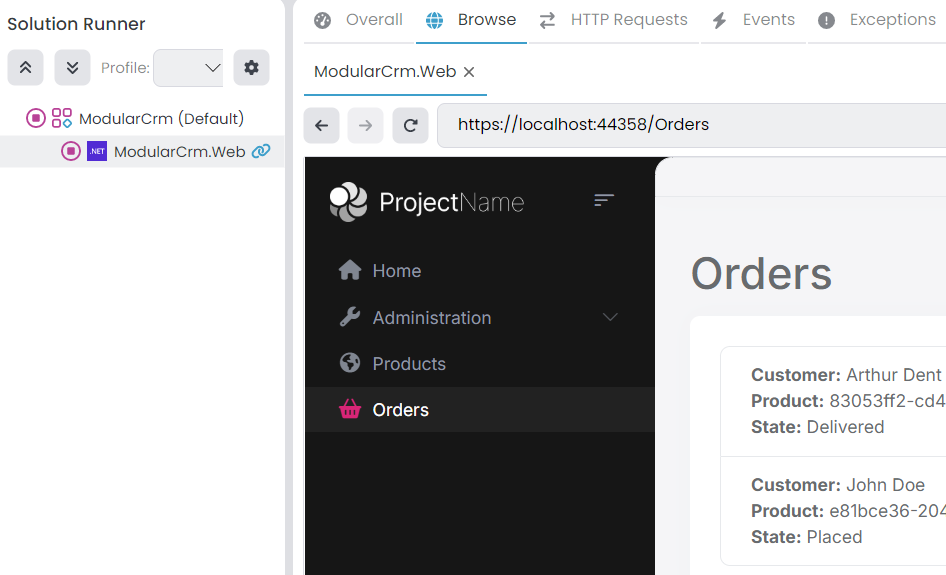
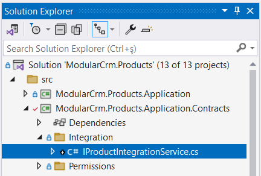
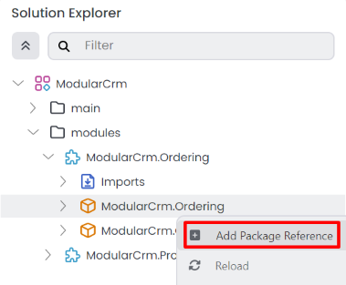
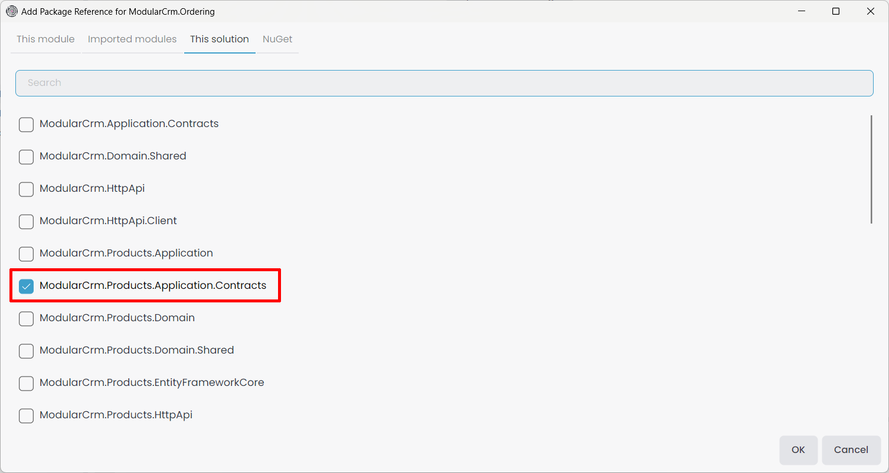
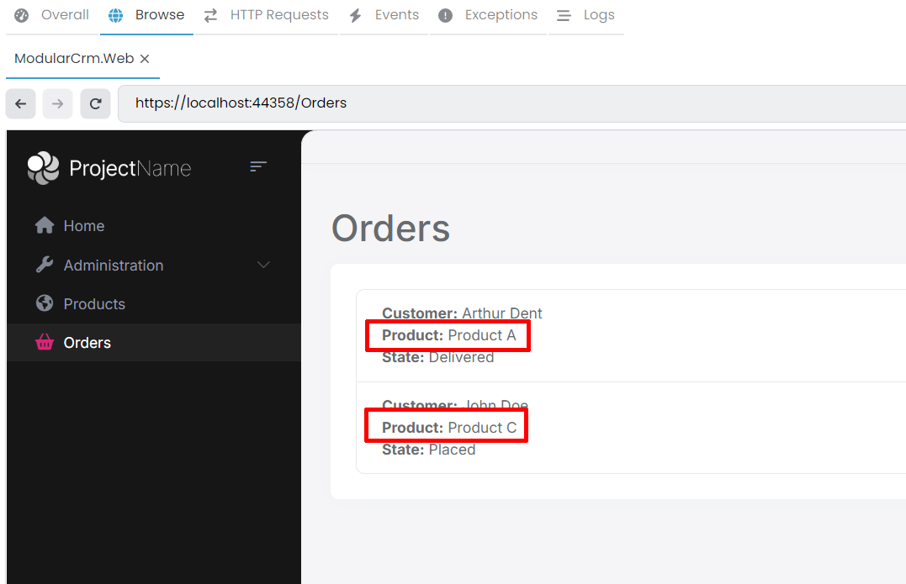

# Integrating the Modules: Implementing Integration Services

````json
//[doc-nav]
{
  "Previous": {
    "Name": "Building the Ordering module",
    "Path": "tutorials/modular-crm/part-05"
  },
  "Next": {
    "Name": "Integrating the Modules: Communication via Messages (Events)",
    "Path": "tutorials/modular-crm/part-07"
  }
}
````

In the previous parts, we created two modules: the Products module to store and manage products and the Orders module to accept orders. However, these modules were completely independent from each other. Only the main application brought them together to execute in the same application, but these modules don't communicate with each other.

In the next three parts, you will learn to implement three patterns for integrating these modules:

1. The Order module will make a request to the Products module to get product information when needed.
2. The Product module will listen to events from the Orders module, so it can decrease a product's stock count when an order is placed.
3. Finally, we will execute a database query that includes product and order data.

Let's begin from the first one: The Integration Services.

## The Need for the Integration Services

Remember from the [previous part](part-05.md), the Orders page shows product's identities instead of their names:



That is because the Orders module has no access to the product data, so it can not perform a JOIN query to get the names of products from the `Products` table. That is a natural result of the modular design. However, we also don't want to show a product's identity on the UI, which is not a good user experience.

As a solution to that problem, the Orders module may ask product names to the Product module using an [integration service](../../framework/api-development/integration-services.md). Integration service concept in ABP is designed for request/response style inter-module (in modular applications) and inter-microservice (in distributed systems) communication.

> When you implement integration services for inter-module communication, you can easily convert them to REST API calls if you convert your solution to a microservice system and convert your modules to services later.

## Creating a Products Integration Service

The first step is to create an integration service in the Products module, so other modules can consume it.

We will define an interface in the `ModularCrm.Products.Application.Contracts` package and implement it in the  `ModularCrm.Products.Application` package.

### Defining the `IProductIntegrationService` Interface

Open the `ModularCrm.Products` .NET solution in your IDE, find the `ModularCrm.Products.Application.Contracts` project, create an `Integration` folder inside inside of that project and finally create an interface named `IProductIntegrationService` into that folder. The final folder structure should be like that:



(Creating an`Integration` folder is not required, but it can be a good practice)

Open the `IProductIntegrationService.cs` file and replace it's content with the following code block:

````csharp
using System;
using System.Collections.Generic;
using System.Threading.Tasks;
using Volo.Abp;
using Volo.Abp.Application.Services;

namespace ModularCrm.Products.Integration
{
    [IntegrationService]
    public interface IProductIntegrationService : IApplicationService
    {
        Task<List<ProductDto>> GetProductsByIdsAsync(List<Guid> ids);
    }
}
````

`IProductIntegrationService` is very similar to a typical [application service](../../framework/architecture/domain-driven-design/application-services.md). The only difference is that it has an `[IntegrationService]` attribute on top of the interface definition. In that way, ABP can recognize and behave differently for them (for example, ABP doesn't expose [integration services](../../framework/api-development/integration-services.md) as HTTP APIs by default if you've configured the *[Auto API Controllers](../../framework/api-development/auto-controllers.md)* feature)

`IProductIntegrationService`  has a single method that gets a list of product Ids and returns a list of `ProductDto` objects for these Ids. Any other module can use that method to get details of products when it only has some product Ids. This is exactly what we need in the Ordering module.

> **Design Tip**
>
> You may think if we can use the existing application services (like `IProductAppService`) from other modules instead of creating specific integration services. Technically you can use, ABP has no restriction. However, from good design and best practice points, we don't suggest it. Because, application services are designed to be consumed specifically by the presentation layer. They will have different authorization and validation logic, they will need different DTO input and output properties, they will have different performance, optimization and caching requirements, and so on. And most importantly, all these will change by the time based on UI requirements and these changes may break your integrations later. It is best to implement specific integration APIs that is designed and optimized for that purpose.
>
> We've reused the `ProductDto` object created for `IProductAppService`, which can be reasonable from a maintenance point of view. But if you think your integration service results will be different from the application service results in the future, it can be good to separate them from the first day so you don't need to introduce breaking changes later.

### Implementing the `ProductIntegrationService` Class

We've defined the integration service interface. Now, we can implement it in the  `ModularCrm.Products.Application` project. Create an `Integration` folder and then create a `ProductIntegrationService` class in that folder. The final folder structure should be like this:


Open the `ProductIntegrationService.cs` file and replace its content with the following code block:

````csharp
using System;
using System.Collections.Generic;
using System.Threading.Tasks;
using Volo.Abp;
using Volo.Abp.Domain.Repositories;

namespace ModularCrm.Products.Integration
{
    [IntegrationService]
    public class ProductIntegrationService
        : ProductsAppService, IProductIntegrationService
    {
        private readonly IRepository<Product, Guid> _productRepository;

        public ProductIntegrationService(IRepository<Product, Guid> productRepository)
        {
            _productRepository = productRepository;
        }

        public async Task<List<ProductDto>> GetProductsByIdsAsync(List<Guid> ids)
        {
            var products = await _productRepository.GetListAsync(
                product => ids.Contains(product.Id)
            );

            return ObjectMapper.Map<List<Product>, List<ProductDto>>(products);
        }
    }
}
````

The implementation is pretty simple. Just using a [repository](../../framework/architecture/domain-driven-design/repositories.md) to query `Product` [entities](../../framework/architecture/domain-driven-design/entities.md).

> Here, we directly used `List<T>` classes, but instead, you could wrap inputs and outputs into [DTOs](../../framework/architecture/domain-driven-design/data-transfer-objects.md). In that way, it can be possible to add new properties to these DTOs without changing the signature of your integration service method (and without introducing breaking changes for your client modules).

## Consuming the Products Integration Service

The Product Integration Service is ready for the other modules to use. In this section, we will use it in the Ordering module to convert product IDs to product names.

### Adding a Reference to the `ModularCrm.Products.Application.Contracts` Package

Open the ABP Studio UI and stop the application if it is already running. Then open the *Solution Explorer* in ABP Studio, right-click the `ModularCrm.Ordering` package and select the *Add Package Reference* command:



In the opening dialog, select the *This solution* tab, find and check the `ModularCrm.Products.Application.Contracts` package and click the OK button:



ABP Studio adds the package reference and arranges the [module](../../framework/architecture/modularity/basics.md) dependency.

> Instead of directly adding such a package reference, it can be best to import the module first (right-click the `ModularCrm.Ordering` module, select the _Import Module_ command and import the `ModularCrm.Products` module), then install the package reference. In that way, it would be easy to see and keep track of inter-module dependencies.

### Using the Products Integration Service

Now, we can inject and use `IProductIntegrationService` in the Ordering module codebase.

Open the `OrderAppService` class (the `OrderAppService.cs` file under the `Services` folder of the `ModularCrm.Ordering` project of the `ModularCrm.Ordering` .NET solution) and change its content as like the following code block:

````csharp
using System;
using System.Collections.Generic;
using System.Linq;
using System.Threading.Tasks;
using ModularCrm.Ordering.Enums;
using ModularCrm.Ordering.Entities;
using ModularCrm.Products.Integration;
using Volo.Abp.Application.Services;
using Volo.Abp.Domain.Repositories;

namespace ModularCrm.Ordering.Services;

public class OrderAppService : ApplicationService, IOrderAppService
{
    private readonly IRepository<Order> _orderRepository;
    private readonly IProductIntegrationService _productIntegrationService;

    public OrderAppService(
        IRepository<Order, Guid> orderRepository,
        IProductIntegrationService productIntegrationService)
    {
        _orderRepository = orderRepository;
        _productIntegrationService = productIntegrationService;
    }

    public async Task<List<OrderDto>> GetListAsync()
    {
        var orders = await _orderRepository.GetListAsync();

        // Prepare a list of products we need
        var productIds = orders.Select(o => o.ProductId).Distinct().ToList();
        var products = (await _productIntegrationService
                .GetProductsByIdsAsync(productIds))
            .ToDictionary(p => p.Id, p => p.Name);

        var orderDtos = ObjectMapper.Map<List<Order>, List<OrderDto>>(orders);

        orderDtos.ForEach(orderDto =>
        {
            orderDto.ProductName = products[orderDto.ProductId];
        });

        return orderDtos;
    }

    public async Task CreateAsync(OrderCreationDto input)
    {
        var order = new Order
        {
            CustomerName = input.CustomerName,
            ProductId = input.ProductId,
            State = OrderState.Placed
        };

        await _orderRepository.InsertAsync(order);
    }
}
````

And also, open the `OrderDto` class (the `OrderDto.cs` file under the `Services` folder of the `ModularCrm.Ordering.Contracts` project of the `ModularCrm.Ordering` .NET solution) and add a `ProductName` property to it:

````csharp
using System;
using ModularCrm.Ordering.Enums;

namespace ModularCrm.Ordering.Services;

public class OrderDto
{
    public Guid Id { get; set; }
    public string CustomerName { get; set; }
    public Guid ProductId { get; set; }
    public string ProductName { get; set; } // New property
    public OrderState State { get; set; }
}
````

Lastly, open the `OrderingAutoMapperProfile` class (the `OrderingAutoMapperProfile.cs` file under the `Services` folder of the `ModularCrm.Ordering` project of the `ModularCrm.Ordering` .NET solution) and ignore the `ProductName` property in the mapping configuration:

````csharp
using AutoMapper;
using ModularCrm.Ordering.Services;
using ModularCrm.Ordering.Entities;
using Volo.Abp.AutoMapper;

namespace ModularCrm.Ordering;

public class OrderingApplicationAutoMapperProfile : Profile
{
    public OrderingApplicationAutoMapperProfile()
    {
        CreateMap<Order, OrderDto>()
            .Ignore(x => x.ProductName); // New line
    }
}
````

Let's see what we've changed:

* We've added a `ProductName` property to the `OrderDto` class to store the product name.
* Injecting the `IProductIntegrationService` interface so we can use it to request products.
* In the `GetListAsync` method;
  * First getting the orders from the ordering module's database just like done before.
  * Next, we are preparing a unique list of product IDs since the `GetProductsByIdsAsync` method requests it.
  * Then we are calling the `IProductIntegrationService.GetProductsByIdsAsync` method to get a `List<ProductDto>` object.
  * In the last line, we are converting the product list to a dictionary, where the key is `Guid Id` and the value is `string Name`. That way, we can easily find a product's name with its ID.
  * Finally, we are mapping the orders to `OrderDto` objects and setting the product name by looking up the product ID in the dictionary.

Open the `Index.cshtml` file, and change the `@order.ProductId` part by `@Model.ProductName` to write the product name instead of the product ID. The final `Index.cshtml` content should be the following:

````html
@page
@model ModularCrm.Ordering.UI.Pages.Ordering.IndexModel

<h1>Orders</h1>

<abp-card>
    <abp-card-body>
        <abp-list-group>
            @foreach (var order in Model.Orders)
            {
                <abp-list-group-item>
                    <strong>Customer:</strong> @order.CustomerName <br />
                    <strong>Product:</strong> @order.ProductName <br />
                    <strong>State:</strong> @order.State
                </abp-list-group-item>
            }
        </abp-list-group>
    </abp-card-body>
</abp-card>
````

That's all. Now, you can graph build the main application and run it in ABP Studio to see the result:



As you can see, we can see the product names instead of product IDs.

In the way explained in this section, you can easily create integration services for your modules and consume these integration services in any other module.

> **Design Tip**
>
> It is suggested that you keep that type of communication to a minimum and not couple your modules with each other. It can make your solution complicated and may also decrease your system performance. When you need to do it, think about performance and try to make some optimizations. For example, if the Ordering module frequently needs product data, you can use a kind of [cache layer](../../framework/fundamentals/caching.md), so it doesn't make frequent requests to the Products module. Especially if you consider converting your system to a microservice solution in the future, too many direct integration API calls can be a performance bottleneck.
