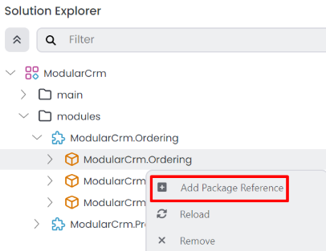
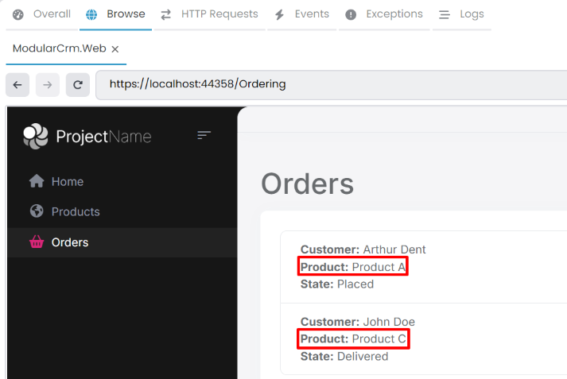
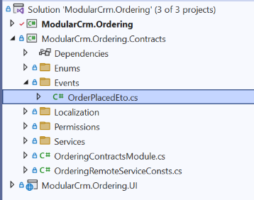

# Integrating the Modules

````json
//[doc-nav]
{
  "Previous": {
    "Name": "Building the Ordering module",
    "Path": "tutorials/modular-crm/part-05"
  }
}
````

In the previous parts, we've created two modules: The Products module to store and manage products and the Orders module to accept orders. However, these modules were completely independent from each other. Only the main application brings them together to execute in the same application, but these modules don't communicate to each other.

In this part, you will learn to implement three patterns for integrating these modules:

1. The Order module will make request to the Products module to get product information when needed.
2. The Product module will listen to events from the Orders module, so it can decrease stock count of a product when an order is placed.
3. Finally, we will execute a database query that includes product and order data together.

Let's begin from the first one...

## Implementing Integration Services

Remember from the [previous part](part-05.md), the Orders page shows products' identities instead of their names:


That is because the Orders module has no access to the product data, so it can not perform a JOIN query to get the names of products from the `Products` table. That is a natural result of the modular design. However, we also don't want to show a product's identity on the UI, which is not a good user experience.

As a solution to that problem, the Orders module may ask product names to the Product module using an [integration service](../../framework/api-development/integration-services.md). Integration service concept in ABP is designed for request/response style inter-module (in modular applications) and inter-microservice (in distributed systems) communication.

> When you implement integration services for inter-module communication, you can easily convert them to REST API calls if you convert your solution to a microservice system and convert your modules to services later.

### Creating a Products Integration Service

The first step is to create an integration service in the Products module, so other modules can consume it.

We will define an interface in the `ModularCrm.Products.Application.Contracts` package and implement it in the  `ModularCrm.Products.Application` package.

#### Defining the `IProductIntegrationService` Interface

Open the `ModularCrm.Products` .NET solution in your IDE, find the `ModularCrm.Products.Application.Contracts` project, create an `Integration` folder inside inside of that project and finally create an interface named `IProductIntegrationService` into that folder. The final folder structure should be like that:


(Creating an`Integration` folder is not required, but it can be a good practice)

Open the `IProductIntegrationService.cs` file and replace it's content with the following code block:

````csharp
using System;
using System.Collections.Generic;
using System.Threading.Tasks;
using Volo.Abp;
using Volo.Abp.Application.Services;

namespace ModularCrm.Products.Integration
{
    [IntegrationService]
    public interface IProductIntegrationService : IApplicationService
    {
        Task<List<ProductDto>> GetProductsByIdsAsync(List<Guid> ids);
    }
}
````

`IProductIntegrationService` is very similar to a typical [application service](../../framework/architecture/domain-driven-design/application-services.md). The only difference is that it has an `[IntegrationService]` attribute on top of the interface definition. In that way, ABP can recognize and behave differently for them (for example, ABP doesn't expose [integration services](../../framework/api-development/integration-services.md) as HTTP APIs by default if you've configured the *[Auto API Controllers](../../framework/api-development/auto-controllers.md)* feature)

`IProductIntegrationService`  has a single method that gets a list of product Ids and returns a list of `ProductDto` objects for these Ids. Any other module can use that method to get details of products when it only has some product Ids. This is exactly what we need in the Ordering module.

> **Design Tip**
>
> You may think if we can use the existing application services (like `IProductAppService`) from other modules instead of creating specific integration services. Technically you can use, ABP has no restriction. However, from good design and best practice points, we don't suggest it. Because, application services are designed to be consumed specifically by the presentation layer. They will have different authorization and validation logic, they will need different DTO input and output properties, they will have different performance, optimization and caching requirements, and so on. And most importantly, all these will change by the time based on UI requirements and these changes may break your integrations later. It is best to implement specific integration APIs that is designed and optimized for that purpose.
>
> We've reused the `ProductDto` object that was actually created for `IProductAppService`. That can be reasonable from the maintenance point. But, if you think your integration service results can be different than the application service results in the future, it can be good to separate them from the first day, so you don't need to introduce breaking changes later.

#### Implementing the `ProductIntegrationService` Class

We've defined the integration service interface. Now, we can implement it in the  `ModularCrm.Products.Application` project. Create an `Integration` folder and then create a `ProductIntegrationService` class in that folder. The final folder structure should be like that:


Open the `ProductIntegrationService.cs` file and replace it's content with the following code block:

````csharp
using System;
using System.Collections.Generic;
using System.Threading.Tasks;
using Volo.Abp;
using Volo.Abp.Domain.Repositories;

namespace ModularCrm.Products.Integration
{
    [IntegrationService]
    public class ProductIntegrationService
        : ProductsAppService, IProductIntegrationService
    {
        private readonly IRepository<Product, Guid> _productRepository;

        public ProductIntegrationService(IRepository<Product, Guid> productRepository)
        {
            _productRepository = productRepository;
        }

        public async Task<List<ProductDto>> GetProductsByIdsAsync(List<Guid> ids)
        {
            var products = await _productRepository.GetListAsync(
                product => ids.Contains(product.Id)
            );

            return ObjectMapper.Map<List<Product>, List<ProductDto>>(products);
        }
    }
}
````

The implementation is pretty simple. Just using a [repository](../../framework/architecture/domain-driven-design/repositories.md) to query `Product` [entities](../../framework/architecture/domain-driven-design/entities.md).

> Here, we directly used `List<T>` classes, but instead you could wrap inputs and outputs into [DTOs](../../framework/architecture/domain-driven-design/data-transfer-objects.md). In that way, it can be possible to add new properties to these DTOs without changing the signature of your integration service method (so, without introducing breaking change for your client modules).

### Consuming the Products Integration Service

The Product Integration Service is ready to be consumed by the other modules. In this section, we will use it in the Ordering module to convert product Ids to product names.

#### Adding a Reference to the `ModularCrm.Products.Application.Contracts` Package

Open the ABP Studio UI and stop the application if it is already running. Then open the *Solution Explorer* in ABP Studio, right-click the `ModularCrm.Ordering` package and select the *Add Package Reference* command:



In the opening dialog, select the *This solution* tab, find and check the `ModularCrm.Products.Application.Contracts` package and click the OK button:


ABP Studio adds the package reference and also arranges the [module](../../framework/architecture/modularity/basics.md) dependency.

> Instead of directly adding such a package reference, it can be best to import the module first (right-click the `ModularCrm.Ordering` module, select the Import Module command and import the `ModularCrm.Products` module), then install the package reference. In that way, it would be easy to see and keep track of inter-module dependencies.

#### Using the Products Integration Service

Now, we can inject and use `IProductIntegrationService` in the Ordering module codebase.

Open the `IndexModel` class (the `IndexModel.cshtml.cs` file under the `Pages/Orders` folder of the `ModularCrm.Ordering` project of the `ModularCrm.Ordering` .NET solution) and change its content as like the following code block:

````csharp
using Microsoft.AspNetCore.Mvc.RazorPages;
using ModularCrm.Ordering.Entities;
using ModularCrm.Products.Integration;
using System;
using System.Collections.Generic;
using System.Linq;
using System.Threading.Tasks;
using Volo.Abp.Domain.Repositories;

namespace ModularCrm.Ordering.Pages.Orders
{
    public class IndexModel : PageModel
    {
        public List<Order> Orders { get; set; }
        
        // Define a dictionary for Id -> Name conversion
        public Dictionary<Guid, string> ProductNames { get; set; }

        private readonly IRepository<Order, Guid> _orderRepository;
        private readonly IProductIntegrationService _productIntegrationService;

        public IndexModel(
            IRepository<Order, Guid> orderRepository,
            IProductIntegrationService productIntegrationService)
        {
            _orderRepository = orderRepository;
            _productIntegrationService = productIntegrationService;
        }

        public async Task OnGetAsync()
        {
            // Getting the orders from this module's database
            Orders = await _orderRepository.GetListAsync();

            // Prepare a list of products we need
            var productIds = Orders.Select(o => o.ProductId).Distinct().ToList();

            // Request the related products from the product integration service
            var products = await _productIntegrationService
                .GetProductsByIdsAsync(productIds);

            // Create a dictionary to get a product name easily by its id
            ProductNames = products.ToDictionary(p => p.Id, p => p.Name);
        }
    }
}
````

Let's see what we've changed:

* Defined a `ProductNames` dictionary. We will use it on the UI to convert product ids to product names. We are filling that dictionary by getting products from the product integration service.
* Injecting `IProductIntegrationService` interface, so we can use it to request products.
* In the `OnGetAsync` method;
  * First getting the orders from the ordering module's database just like done before.
  * Next, we are preparing a unique list of product ids, since the `GetProductsByIdsAsync` methods requests it.
  * Then we are calling the `IProductIntegrationService.GetProductsByIdsAsync` method to get a `List<ProductDto>` object.
  * In the last line, we are converting the product list to a dictionary where the key is `Guid Id` and the value is `string Name`. In that way, we can easily find a product's name with it's id.

Open the `Index.cshtml` file, change the `@order.ProductId` part by `@Model.ProductNames[order.ProductId]` to write the product name instead of the product id. The final `Index.cshtml` content should be the following:

````html
@page
@model ModularCrm.Ordering.Pages.Orders.IndexModel

<h1>Orders</h1>

<abp-card>
    <abp-card-body>
        <abp-list-group>
            @foreach (var order in Model.Orders)
            {
                <abp-list-group-item>
                    <strong>Customer:</strong> @order.CustomerName <br />
                    <strong>Product:</strong> @Model.ProductNames[order.ProductId] <br />
                    <strong>State:</strong> @order.State
                </abp-list-group-item>
            }
        </abp-list-group>
    </abp-card-body>
</abp-card>
````

That's all. Now, you can graph build the main application and run in ABP Studio to see the result:



As you notice, we can see the product names instead of product ids.

In the way explained in this section, you can easily create integration services for your modules and consume these integration services in any other module.

> **Design Tip**
>
> It is suggested to keep that type of communication minimum to not couple your modules to each other. It can make your solution complicated and may also decrease your system performance. When you need to do it, think about performance and try to make some optimizations. For example, if the Ordering module frequently needs to product data, you can use a kind of [cache layer](../../framework/fundamentals/caching.md), so it doesn't make frequent requests to the Products module. Especially, if you consider to convert your system to a microservice solution in the future, too many direct integration API calls can be a performance bottleneck.

## Communication via Messages (Events)

Another common approach to communicate between modules is messaging. By publishing and handling messages, a module can perform operation when an event happens in another module.

ABP provides two types of event buses for loosely coupled communication:

* [Local Event Bus](https://abp.io/docs/latest/framework/infrastructure/event-bus/local) is suitable for in-process messaging. Since in a modular monolith, both of publisher and subscriber are in the same process, they can communicate in-process, without needing an external message broker.
* **[Distributed Event Bus](https://abp.io/docs/latest/framework/infrastructure/event-bus/distributed)** is normal for inter-process messaging, like microservices, for publishing and subscribing to distributed events. However, ABP's distributed event bus works as local (in-process) by default (actually, it uses the Local Event Bus under the hood by default), unless you configure an external message broker.

If you consider to convert your modular monolith to a microservice system later, it is best to use the Distributed Event Bus with default local/in-process implementation. It already supports database level transactional event execution and has no performance penalty. If you switch to an external provider (e.g. [RabbitMQ](../../framework/infrastructure/event-bus/distributed/rabbitmq.md) or [Kafka](../../framework/infrastructure/event-bus/distributed/kafka.md)), you don't need to change your application code.

On the other hand, if you want to publish events and always subscribe in the same module, you should use the Local Event Bus. In that way, if you switch to microservices later, you don't accidently (and unnecessarily) make a local event distributed. Both of the event bus types can be used in the same system, just understand these and use them properly.

Since we will use messaging (events) between different modules, we will use the distributed event bus.

### Publishing an Event

In the example scenario, we want to publish an event when a new order is placed. The Ordering module will publish the event since it knows when a new order is placed. The Products module will subscribe to that event and get notified when a new order is placed. It will decrease the stock count of the product that is related to the new order. The scenario is pretty simple, let's implement it.

#### Defining the Event Class

Open the `ModularCrm.Ordering` module in your IDE, find the `ModularCrm.Ordering.Contracts` project, create an `Events` folder and create an `OrderPlacedEto` class inside that folder. The final folder structure should be like that:



We've placed the `OrderPlacedEto` class inside the `ModularCrm.Ordering.Contracts` project since that project can be referenced and used by other modules without accessing internal implementation of the Ordering module. The `OrderPlacedEto` class definition should be the following:

````csharp
using System;

namespace ModularCrm.Ordering.Contracts.Events
{
    public class OrderPlacedEto
    {
        public string CustomerName { get; set; }
        public Guid ProductId { get; set; }
    }
}
````

`OrderPlacedEto` is very simple. It is a plain C# class and used to transfer data related to the event (*ETO* is an acronym for *Event Transfer Object*, a suggested naming convention, but not required). You can add more properties if it is needed. For this tutorial, it is more than enough.

#### Using the `IDistributedEventBus` Service

`IDistributedEventBus` service is used to publish events to the event bus. Until this point, the Ordering module has no functionality to create a new order.

In the Part 3, we had used ABP's Auto HTTP API Controller feature to automatically expose HTTP APIs from application services. In this section, we will create an ASP.NET Core API controller class to create a new order. In that way, you will also see that it is not different than creating a regular ASP.NET Core controller.

Open the `ModularCrm.Ordering` module's .NET solution, create a `Controllers` folder in the `ModularCrm.Ordering` project and place a controller class named `OrdersController` in that new folder. The final folder structure should be like that:


Here the full `OrdersController` class:

````csharp
using Microsoft.AspNetCore.Mvc;
using ModularCrm.Ordering.Contracts.Enums;
using ModularCrm.Ordering.Contracts.Events;
using ModularCrm.Ordering.Entities;
using System;
using System.ComponentModel.DataAnnotations;
using System.Threading.Tasks;
using Volo.Abp.AspNetCore.Mvc;
using Volo.Abp.Domain.Repositories;
using Volo.Abp.EventBus.Distributed;

namespace ModularCrm.Ordering.Controllers
{
    [Route("api/orders")]
    [ApiController]
    public class OrdersController : AbpControllerBase
    {
        private readonly IRepository<Order, Guid> _orderRepository;
        private readonly IDistributedEventBus _distributedEventBus;

        public OrdersController(
            IRepository<Order, Guid> orderRepository,
            IDistributedEventBus distributedEventBus)
        {
            _orderRepository = orderRepository;
            _distributedEventBus = distributedEventBus;
        }

        [HttpPost]
        public async Task<IActionResult> CreateAsync(OrderCreationModel input)
        {
            // Create a new Order entity
            var order = new Order
            {
                CustomerName = input.CustomerName,
                ProductId = input.ProductId,
                State = OrderState.Placed
            };

            // Save it to the database
            await _orderRepository.InsertAsync(order);

            // Publish an event, so other modules can be informed
            await _distributedEventBus.PublishAsync(
                new OrderPlacedEto
                {
                    ProductId = order.ProductId,
                    CustomerName = order.CustomerName
                });

            return Created();
        }

        public class OrderCreationModel
        {
            public Guid ProductId { get; set; }

            [Required]
            [StringLength(120)]
            public string CustomerName { get; set; }
        }
    }
}
````

The `OrdersController.CreateAsync` method simply creates a new `Order` entity, saves it to the database and finally publishes an `OrderPlacedEto` event.

### Subscribing to an Event

In this section, we will subscribe to the `OrderPlacedEto` event in the Products module and decrease the related product's stock count once a new order is placed.

#### Adding a Reference to the `ModularCrm.Ordering.Contracts` Package

Since the `OrderPlacedEto` class is located inside the `ModularCrm.Ordering.Contracts` project, we need to add that package's reference to the Products module. This time, we will use the *Import Module* feature of ABP Studio (as an alternative to approach we used in the *Adding a Reference to the `ModularCrm.Products.Application.Contracts` Package* section).

Open the ABP Studio UI and stop the application if it is already running. Then open the *Solution Explorer* in ABP Studio, right-click the `ModularCrm.Products` module and select the *Import Module* command:


In the opening dialog, find and select the `ModularCrm.Ordering` module, check the *Install this module* option and click the OK button:


Once you click the OK button, the Ordering module is imported to the Products module and an installation dialog is open:


Here, select the `ModularCrm.Ordering.Contracts` package on the left side (because we want to add that package reference) and `ModularCrm.Products.Domain` package on the middle area (because we want to add the package reference to that project). We installed it to the [domain layer](../../framework/architecture/domain-driven-design/domain-layer.md) of the Products module since we will create our event handler into that layer. Click the OK button to finish the installation operation.

You can check the ABP Studio's *Solution Explorer* panel to see the module import and the project reference (dependency).


#### Handling the `OrderPlacedEto` Event

Now, it is possible to use the `OrderPlacedEto` class inside the Product module's domain layer since it has the `ModularCrm.Ordering.Contracts` package reference.

Open the Product module's .NET solution in your IDE, locate the `ModularCrm.Products.Domain` project, create a new `Orders` folder and an `OrderEventHandler` class inside that folder. The final folder structure should be like that:


Replace the `OrderEventHandler.cs` file's content with the following code block:

````csharp
using ModularCrm.Ordering.Contracts.Events;
using System;
using System.Threading.Tasks;
using Volo.Abp.DependencyInjection;
using Volo.Abp.Domain.Repositories;
using Volo.Abp.EventBus.Distributed;

namespace ModularCrm.Products.Orders
{
    public class OrderEventHandler :
        IDistributedEventHandler<OrderPlacedEto>, 
        ITransientDependency
    {
        private readonly IRepository<Product, Guid> _productRepository;

        public OrderEventHandler(IRepository<Product, Guid> productRepository)
        {
            _productRepository = productRepository;
        }

        public async Task HandleEventAsync(OrderPlacedEto eventData)
        {
            // Find the related product
            var product = await _productRepository.FindAsync(eventData.ProductId);
            if (product == null)
            {
                return;
            }

            // Decrease the stock count
            product.StockCount = product.StockCount - 1;

            // Update the entity in the database
            await _productRepository.UpdateAsync(product);
        }
    }
}
````

`OrderEventHandler` implements the `IDistributedEventHandler<OrderPlacedEto>` interface. In that way, ABP recognizes that class and subscribes to the related event automatically. Implementing `ITransientDependency` simply registers the `OrderEventHandler` class to the [dependency injection](../../framework/fundamentals/dependency-injection.md) system as a transient object.

We are injecting the product repository and updating the stock count in the event handler method (`HandleEventAsync`). That's all.

#### Testing the Order Creation

We will not create a UI for creating an order, to keep this tutorial more focused. You can easily create a form to create an order on your user interface. We will test it just using the Swagger UI in this section.

Graph build the `ModularCrm.Web` application, run it on the ABP Studio's *Solution Runner* panel and browse the application UI as demonstrated earlier.

Once the application is running and ready, manually type `/swagger` to the end of the URL and press the ENTER key. You should see the Swagger UI that is used to discover and test your HTTP APIs:


Find the *Orders* API, click the *Try it out* button, enter a sample value the the *Request body*:

````json
{
  "productId": "0fbf7dd0-d7e9-0d18-9214-3a14d9fa1b74",
  "customerName": "David"
}
````

> **IMPORTANT:** Here, you should type a valid Product Id from the Products table of your database!

Once you press the *Execute* button, a new order is created. At that point, you can check the `/Orders` page to see if the new order is shown on the UI, and check the `/Products` page to see if the related product's stock count has decreased.

Here, sample screenshots from the Products and Orders pages:


We placed a new order for Product C. As a result, Product C's stock count has decreased from 55 to 54 and a new line is added to the Orders page.

## Joining the Products and Orders data

One of the essential purposes of modularity is to create modules those hide (encapsulate) their internal data and implementation details from the other modules. They communicate each other through well-defined [integration services](../../framework/api-development/integration-services.md) and [events](framework/infrastructure/event-bus/distributed). In that way, you can independently develop and change module implementations (even modules' database structures) from each other as long as you don't break these inter-module integration points.

### The Problem

In a non-modular application, accessing the related data is easy. You could just write a LINQ expression that joins `Orders` and `Products` database tables to get the data with a single database query. It would be easier to implement and executed with a good performance.

On the other hand, it becomes harder to perform operations or get reports those requires to access data of multiple modules in a modular system. Remember the *Implementing Integration Services* section; We couldn't access the product data inside the Ordering module (`IOrderingDbContext` only defines a `DbSet<Order>`), so we needed to create an integration services just to get names of products. This approach is harder to implement and less performant (yet it is acceptable if you don't show too many orders on the UI or if you properly implement a caching layer), but it gives freedom to the Products module about its internal database or application logic changes. For example, you can decide to move product data to another physical database, or even to another database management system (DBMS) without effecting the other modules.

### A Solution Option

If you want to perform a single database query that spans database tables of multiple modules in a modular system, you have still some options. One option can be creating a reporting module that has access to all of the entities (or database tables). However, when you do that, you accept the following limitations:

* When you make changes in a module's database structure, you should also update your reporting code. That is reasonable, but you should be informed by all module developers in such a case.
* You can not change DBMS of a module easily. For example, if you decide to use MongoDB for your Products module while the Ordering module still uses SQL Server, performing such a JOIN operation would not be possible. Even moving Products module to another SQL Server database in another physical server can break your reporting logic.

If these are not problems for you, or you can handle when they become problems, you can create reporting modules or aggregator modules that works with multiple modules' data.

In the next section, we will use the main application's codebase to implement such a JOIN operation to keep the tutorial short. However, you already learned how to create new modules, so you can create a new module and develop your JOIN logic inside that new module if you want.

### The Implementation

In this section, we will create an application service in the main application's .NET solution. That application service will perform a LINQ operation on the `Product` and `Order` entities.

#### Defining the Reporting Service Interface

We will define the `IOrderReportingAppService` interface in the `ModularCrm.Application.Contracts` project of the main application's .NET solution.

##### Adding `ModularCrm.Ordering.Contracts` Package Reference

As the first step, we should to add a reference of the `ModularCrm.Ordering.Contracts` package (of the `ModularCrm.Ordering` module) since we will reuse the `OrderState` enum which is defined in that package.

Open the ABP Studio's *Solution Explorer* panel, right-click the `ModularCrm.Application.Contracts` package and select the *Add Package Reference* command:


Select the *Imported modules* tab, find and check the `ModularCrm.Ordering.Contracts` package and click the OK button:


The package reference is added and now we can use the types in the `ModularCrm.Ordering.Contracts` package.

##### Defining the `IOrderReportingAppService` Interface

Open the main `ModularCrm` .NET solution in your IDE, find the `ModularCrm.Application.Contracts` project, create an `Orders` folder and add an `IOrderReportingAppService` interface inside it. Here the definition of that interface:

````csharp
using System.Collections.Generic;
using System.Threading.Tasks;
using Volo.Abp.Application.Services;

namespace ModularCrm.Orders
{
    public interface IOrderReportingAppService : IApplicationService
    {
        Task<List<OrderReportDto>> GetLatestOrders();
    }
}
````

We have a single method, `GetLatestOrders`, that will return a list of the latest orders. We should also define the `OrderReportDto` class that is returned by that method. Create the following class in the same `Orders` folder:

````csharp
using System;
using ModularCrm.Ordering.Contracts.Enums;

namespace ModularCrm.Orders
{
    public class OrderReportDto
    {
        // Order data
        public Guid OrderId { get; set; }
        public string CustomerName { get; set; }
        public OrderState State { get; set; }

        // Product data
        public Guid ProductId { get; set; }
        public string ProductName { get; set; }
    }
}
````

`OrderReportDto` contains data from both of `Order` and  `Product` entities. We could use the `OrderState` since we have a reference to the package which defines that enum.

After adding these files, the final folder structure should be like that:


#### Implementing the `OrderReportingAppService` Class

Create an `Orders` folder inside of the `ModularCrm.Application` project and add a class named `OrderReportingAppService` inside it. The final folder structure should be like that:


Open the `OrderReportingAppService.cs` file and change its content by the following code block:

````csharp
using ModularCrm.Ordering.Entities;
using ModularCrm.Products;
using System;
using System.Collections.Generic;
using System.Linq;
using System.Threading.Tasks;
using Volo.Abp.Domain.Repositories;

namespace ModularCrm.Orders
{
    public class OrderReportingAppService :
    	ModularCrmAppService,
        IOrderReportingAppService
    {
        private readonly IRepository<Order, Guid> _orderRepository;
        private readonly IRepository<Product, Guid> _productRepository;

        public OrderReportingAppService(
            IRepository<Order, Guid> orderRepository,
            IRepository<Product, Guid> productRepository)
        {
            _orderRepository = orderRepository;
            _productRepository = productRepository;
        }

        public async Task<List<OrderReportDto>> GetLatestOrders()
        {
            var orders = await _orderRepository.GetQueryableAsync();
            var products = await _productRepository.GetQueryableAsync();

            var latestOrders = (from order in orders
                    join product in products on order.ProductId equals product.Id
                    orderby order.CreationTime descending
                    select new OrderReportDto
                    {
                        OrderId = order.Id,
                        CustomerName = order.CustomerName,
                        State = order.State,
                        ProductId = product.Id,
                        ProductName = product.Name
                    })
                .Take(10)
                .ToList();

            return latestOrders;
        }
    }
}
````

Let's explain that class;

* It inject [repository](../../framework/architecture/domain-driven-design/repositories.md) services for `Order` and `Product` entities. We can access all entities of all modules from the main application codebase.
* In the `GetLatestOrders` method, we are getting `IQueryable` objects for the entities, so we can create LINQ expressions.
* Then we are executing a LINQ expression with `join` keyword, so we can be able to execute a single query that uses multiple tables.

That's all. In that way, you can execute JOIN queries that uses multiple modules' data. However, if you write majority of your application code into the main application and perform operations on multiple modules, then your system won't be so modular. So, here we show it is technically possible. Please use at your own risk.

#### Testing the Reporting Service

We haven't created a UI to show list of the latest orders using `OrderReportingAppService`. However, we can use the Swagger UI again to test it.

Open the ABP Studio UI, stop the application if it is running, build and run it again. Once the application starts, browse it, then add `/swagger` to the end of the URL to open the Swagger UI:


Here, find the `OrderReporting` API and execute it as shown above. You should get the order objects with product names.

Alternatively, you can visit the `/api/app/order-reporting/latest-orders` URL to directly execute the HTTP API on the browser (you should write the full URL, like `https://localhost:44358/api/app/order-reporting/latest-orders` - port can be different for your case)

## Summary

In this part of the modular application development tutorial, you have learned three ways of integrating your application modules:

1. You can use the integration services to make request/response style communication between your modules.
2. You can publish events from a module and subscribe to these events from other modules.
3. You can write your code into the main application, so you can access to all entities (and related data) of all modules. Instead of writing it into the main application code, you can also create some aggregation or reporting modules that can access more than one module entities.

Now, you know the fundamental principles and mechanics to build sophisticated modular monolith application with ABP.

## See Also

See the following sections for additional resources.

### The Book Store Tutorial

In this tutorial, we intentionally kept the application logic very simple and didn't build a usable user interface for the modules. This was to keep your focus on modularity. If you want to learn how to build real-world user interfaces with ABP, you can check the [Book Store tutorial](../book-store/index.md). All the principles and approaches explained there are already possible with a modular system too.

### ABP Reusable Application Modules

ABP is designed as modular from the first day. The ABP team has created tens of production-ready and [reusable application modules](../../modules/index.md). You can investigate these modules (some of them are already [free and open source](https://github.com/abpframework/abp/tree/dev/modules)) to see real-world modules.

When you [create a new ABP solution](../../get-started/index.md), some of these modules are already comes as installed into your application (as NuGet and NPM packages). So, your initial ABP application is already a modular application from day one.

### Guide: Module Development Best Practices & Conventions

ABP team has created the [reusable application modules](../../modules/index.md) based on some strict principles and rules to make them reusable as much as possible in different scenarios, including modular monolith applications and microservice systems.

These application modules are designed so that they are generic, doesn't depend on each other, reusable in any web application, provides multiple UI and database options, etc. In a monolith modular application, you mostly don't have such requirements. But, you can still follow the [best practices guides](../../framework/architecture/best-practices/index.md) that is prepared by the ABP team that is followed while implementing these application modules.
