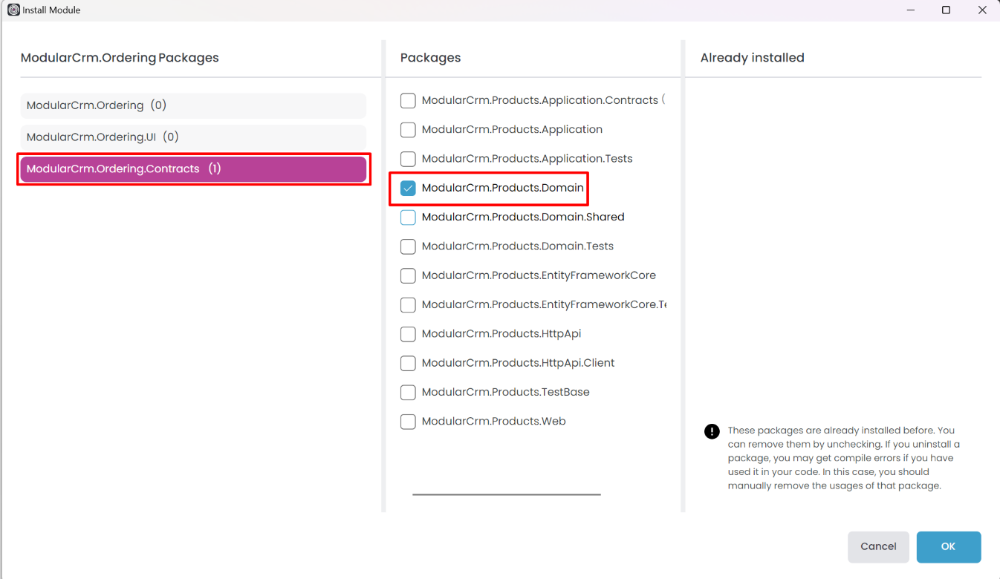

# Integrating the Modules: Communication via Messages (Events)

````json
//[doc-nav]
{
  "Previous": {
    "Name": "Integrating the Modules: Implementing Integration Services",
    "Path": "tutorials/modular-crm/part-06"
  },
  "Next": {
    "Name": "Integrating the Modules: Joining the Products and Orders Data",
    "Path": "tutorials/modular-crm/part-08"
  }
}
````

Another common approach to communicating between modules is messaging. By publishing and handling messages, a module can perform an operation when an event happens in another module.

ABP provides two types of event buses for loosely coupled communication:

* [Local Event Bus](../../framework/infrastructure/event-bus/local/index.md) is suitable for in-process messaging. Since in a modular monolith, both of publisher and subscriber are in the same process, they can communicate in-process, without needing an external message broker.
* **[Distributed Event Bus](../../framework/infrastructure/event-bus/distributed/index.md)** is normal for inter-process messaging, like microservices, for publishing and subscribing to distributed events. However, ABP's distributed event bus works as local (in-process) by default (actually, it uses the Local Event Bus under the hood by default) unless you configure an external message broker.

If you consider converting your modular monolith to a microservice system later, it is best to use the Distributed Event Bus with default local/in-process implementation. It already supports database-level transactional event execution and has no performance penalty. If you switch to an external provider ([RabbitMQ](../../framework/infrastructure/event-bus/distributed/rabbitmq.md), [Kafka](../../framework/infrastructure/event-bus/distributed/kafka.md), etc.), you don't need to change your application code.

On the other hand, if you want to publish events and always subscribe to the same module, you should use the Local Event Bus. That way, if you switch to microservices later, you don't accidentally (and unnecessarily) distribute a local event. Both event bus types can be used in the same system; just understand them and use them properly.

We will use the distributed event bus since we will use messaging (events) between different modules.

## Publishing an Event

In the example scenario, we want to publish an event when a new order is placed. The Ordering module will publish the event since it knows when a new order is placed. The Products module will subscribe to that event and get notified when a new order is placed. This will decrease the stock count of the product related to the new order. The scenario is pretty simple; let's implement it.

### Defining the Event Class

Open the `ModularCrm.Ordering` module in your IDE, find the `ModularCrm.Ordering.Contracts` project, create an `Events` folder and create an `OrderPlacedEto` class inside that folder. The final folder structure should be like this:


We've placed the `OrderPlacedEto` class inside the `ModularCrm.Ordering.Contracts` project since that project can be referenced and used by other modules without accessing the internal implementation of the Ordering module. The `OrderPlacedEto` class definition should be the following:

````csharp
using System;

namespace ModularCrm.Ordering.Contracts.Events
{
    public class OrderPlacedEto
    {
        public string CustomerName { get; set; }
        public Guid ProductId { get; set; }
    }
}
````

`OrderPlacedEto` is very simple. It is a plain C# class used to transfer data related to the event (*ETO* is an acronym for *Event Transfer Object*, a suggested naming convention but not required). You can add more properties if needed, but for this tutorial, it is more than enough.

### Using the `IDistributedEventBus` Service

The `IDistributedEventBus` service publishes events to the event bus. Until this point, the Ordering module has no functionality to create new orders. Let's change that and place an order, for that purpose open the `ModularCrm.Ordering` module's .NET solution, and update the `OrderAppService` as follows:

````csharp
using System;
using System.Collections.Generic;
using System.Linq;
using System.Threading.Tasks;
using ModularCrm.Ordering.Contracts.Enums;
using ModularCrm.Ordering.Contracts.Events;
using ModularCrm.Ordering.Contracts.Services;
using ModularCrm.Ordering.Entities;
using ModularCrm.Products.Integration;
using Volo.Abp.Application.Services;
using Volo.Abp.Domain.Repositories;
using Volo.Abp.EventBus.Distributed;

namespace ModularCrm.Ordering.Services;

public class OrderAppService : ApplicationService, IOrderAppService
{
    private readonly IRepository<Order> _orderRepository;
    private readonly IProductIntegrationService _productIntegrationService;
    private readonly IDistributedEventBus _distributedEventBus;

    public OrderAppService(
        IRepository<Order, Guid> orderRepository,
        IProductIntegrationService productIntegrationService,
        IDistributedEventBus distributedEventBus)
    {
        _orderRepository = orderRepository;
        _productIntegrationService = productIntegrationService;
        _distributedEventBus = distributedEventBus;
        ObjectMapperContext = typeof(OrderingWebModule);
    }

    public async Task<List<OrderDto>> GetListAsync()
    {
        var orders = await _orderRepository.GetListAsync();

        // Prepare a list of products we need
        var productIds = orders.Select(o => o.ProductId).Distinct().ToList();
        var products = (await _productIntegrationService
            .GetProductsByIdsAsync(productIds))
            .ToDictionary(p => p.Id, p => p.Name);

        var orderDtos = ObjectMapper.Map<List<Order>, List<OrderDto>>(orders);

        orderDtos.ForEach(orderDto =>
        {
            orderDto.ProductName = products[orderDto.ProductId];
        });

        return orderDtos;
    }

    public async Task CreateAsync(OrderCreationDto input)
    {
        // Create a new Order entity
        var order = new Order
        {
            CustomerName = input.CustomerName,
            ProductId = input.ProductId,
            State = OrderState.Placed
        };

        // Save it to the database
        await _orderRepository.InsertAsync(order);

        // Publish an event so other modules can be informed
        await _distributedEventBus.PublishAsync(
            new OrderPlacedEto
            {
                ProductId = order.ProductId,
                CustomerName = order.CustomerName
            });
    }
}
````

The `OrderAppService.CreateAsync` method creates a new `Order` entity, saves it to the database and finally publishes an `OrderPlacedEto` event.

## Subscribing to an Event

This section will subscribe to the `OrderPlacedEto` event in the Products module and decrease the related product's stock count once a new order is placed.

### Adding a Reference to the `ModularCrm.Ordering.Contracts` Package

Since the `OrderPlacedEto` class is in the `ModularCrm.Ordering.Contracts` project, we must add that package's reference to the Products module. This time, we will use the *Import Module* feature of ABP Studio (as an alternative to the approach we used in the *Adding a Reference to the `ModularCrm.Products.Application.Contracts` Package* section of the [previous part](part-06.md)).

Open the ABP Studio UI and stop the application if it is already running. Then open the *Solution Explorer* in ABP Studio, right-click the `ModularCrm.Products` module and select the *Import Module* command:


In the opening dialog, find and select the `ModularCrm.Ordering` module, check the *Install this module* option and click the OK button:


Once you click the OK button, the Ordering module is imported to the Products module, and an installation dialog is open:



Here, select the `ModularCrm.Ordering.Contracts` package on the left side (because we want to add that package reference) and `ModularCrm.Products.Domain` package on the middle area (because we want to add the package reference to that project). We installed it on the [domain layer](../../framework/architecture/domain-driven-design/domain-layer.md) of the Products module since we will create our event handler in that layer. Click the OK button to finish the installation operation.

You can check the ABP Studio's *Solution Explorer* panel to see the module import and the project reference (dependency).


### Handling the `OrderPlacedEto` Event

Now, it is possible to use the `OrderPlacedEto` class inside the Product module's domain layer since it has the `ModularCrm.Ordering.Contracts` package reference.

Open the Product module's .NET solution in your IDE, locate the `ModularCrm.Products.Domain` project, and create a new `Orders` folder and an `OrderEventHandler` class inside that folder. The final folder structure should be like this:


Replace the `OrderEventHandler.cs` file's content with the following code block:

````csharp
using ModularCrm.Ordering.Contracts.Events;
using System;
using System.Threading.Tasks;
using Volo.Abp.DependencyInjection;
using Volo.Abp.Domain.Repositories;
using Volo.Abp.EventBus.Distributed;

namespace ModularCrm.Products.Orders
{
    public class OrderEventHandler :
        IDistributedEventHandler<OrderPlacedEto>, 
        ITransientDependency
    {
        private readonly IRepository<Product, Guid> _productRepository;

        public OrderEventHandler(IRepository<Product, Guid> productRepository)
        {
            _productRepository = productRepository;
        }

        public async Task HandleEventAsync(OrderPlacedEto eventData)
        {
            // Find the related product
            var product = await _productRepository.FindAsync(eventData.ProductId);
            if (product == null)
            {
                return;
            }

            // Decrease the stock count
            product.StockCount = product.StockCount - 1;

            // Update the entity in the database
            await _productRepository.UpdateAsync(product);
        }
    }
}
````

`OrderEventHandler` implements the `IDistributedEventHandler<OrderPlacedEto>` interface. In that way, ABP recognizes that class and subscribes to the related event automatically. Implementing `ITransientDependency` registers the `OrderEventHandler` class to the [dependency injection](../../framework/fundamentals/dependency-injection.md) system as a transient object.

We inject the product repository and update the stock count in the event handler method (`HandleEventAsync`). That's it.

### Testing the Order Creation

To keep this tutorial more focused, we will not create a UI for creating an order. You can easily create a form to create an order on your user interface. In this section, we will test it just using the Swagger UI.

Graph build the `ModularCrm.Web` application, run it on the ABP Studio's *Solution Runner* panel and browse the application UI as demonstrated earlier.

Once the application is running and ready, manually type `/swagger` to the end of the URL and press the ENTER key. You should see the Swagger UI that is used to discover and test your HTTP APIs:


Find the *Orders* API, click the *Try it out* button, enter a sample value the the *Request body*:

````json
{
  "productId": "0fbf7dd0-d7e9-0d18-9214-3a14d9fa1b74",
  "customerName": "David"
}
````

> **IMPORTANT:** Here, you should type a valid Product Id from the Products table of your database!

Once you press the *Execute* button, a new order is created. At that point, you can check the `/Orders` page to see if the new order is shown on the UI, and check the `/Products` page to see if the related product's stock count has decreased.

Here are sample screenshots from the Products and Orders pages:


We placed a new order for Product C. As a result, Product C's stock count has decreased from 55 to 54 and a new line is added to the Orders page.
