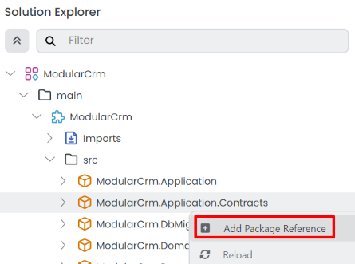
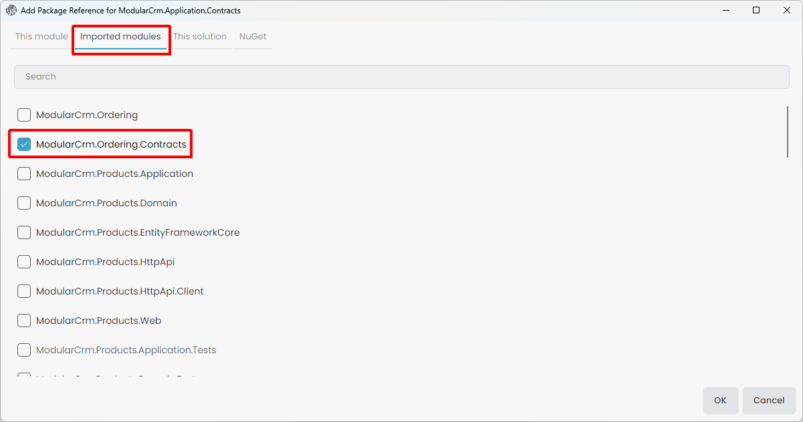
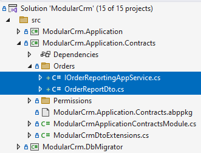
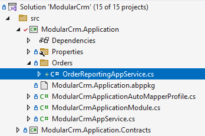
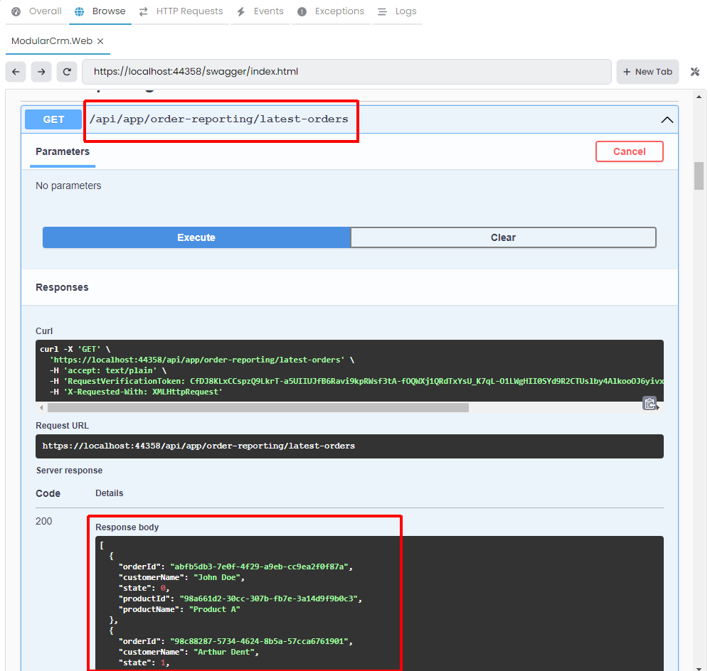

# Integrating the Modules: Joining the Products and Orders Data

````json
//[doc-nav]
{
  "Previous": {
    "Name": "Integrating the Modules: Communication via Messages (Events)",
    "Path": "tutorials/modular-crm/part-07"
  }
}
````

In this part, you will learn how to perform a database-level JOIN operation on the data of multiple modules when their data is located in the same physical database.

## The Problem

One essential purpose of modularity is to create modules that hide (encapsulate) their internal data and implementation details from the other modules. These modules communicate with each other through well-defined [integration services](../../framework/api-development/integration-services.md) and [events](framework/infrastructure/event-bus/distributed). In that way, you can independently develop and change module implementations (even modules' database structures) from each other as long as you don't break these inter-module integration points.

In a non-modular application, accessing the related data is easy. You could write a LINQ expression that joins `Orders` and `Products` database tables to get the data with a single database query. It would be easier to implement and execute with a good performance.

On the other hand, it becomes harder to perform operations or get reports requiring access to multiple modules' internal data in a modular system. Remember the *[Implementing Integration Services](part-06.md)* part; We couldn't access the product data inside the Ordering module (`IOrderingDbContext` only defines a `DbSet<Order>`), so we needed to create an integration service just to get names of products. This approach is harder to implement and less performant (yet it is acceptable if you don't show too many orders on the UI or properly implement a caching layer). Still, it gives freedom to the Products module about its internal database or application logic changes. For example, you can decide to move product data to another physical database or even to another database management system (DBMS) without affecting the other modules.

## A Solution Option

If you want to perform a single database query that spans database tables of multiple modules in a modular system, you still have some options. One option can be creating a reporting module with access to all entities (or database tables). However, when you do that, you accept the following limitations:

* When you change a module's database structure, you should also update your reporting code. That is reasonable, but all module developers should let you know in such a case.
* You can not change the DBMS of a module easily. For example, performing such a JOIN operation would be impossible if you decide to use MongoDB for your Products module while the Ordering module still uses SQL Server. Moving the Products module to another SQL Server database in another physical server can also break your reporting logic.

If these are not problems for you, or if you can handle them when they become problems, you can create reporting modules or aggregator modules that work with multiple modules' data.

In the next section, we will use the main application's codebase to implement such a JOIN operation to keep the tutorial short. However, you already learned how to create new modules, so you can create a new module and develop your JOIN logic inside that new module if you want.

## The Implementation

In this section, we will create an application service in the main application's .NET solution. That application service will perform a LINQ operation on the `Product` and `Order` entities.

### Defining the Reporting Service Interface

We will define the `IOrderReportingAppService` interface in the `ModularCrm.Application.Contracts` project of the main application's .NET solution.

#### Adding `ModularCrm.Ordering.Contracts` Package Reference

As the first step, we should reference the `ModularCrm.Ordering.Contracts` package (of the `ModularCrm.Ordering` module) since we will reuse the `OrderState` enum defined in that package.

Open the ABP Studio's *Solution Explorer* panel, right-click the `ModularCrm.Application.Contracts` package and select the *Add Package Reference* command:



Select the *Imported modules* tab, find and check the `ModularCrm.Ordering.Contracts` package and click the OK button:



The package reference has been added, and we can now use the types in the `ModularCrm.Ordering.Contracts` package.

#### Defining the `IOrderReportingAppService` Interface

Open the main `ModularCrm` .NET solution in your IDE, find the `ModularCrm.Application.Contracts` project, create an `Orders` folder and add an `IOrderReportingAppService` interface. Here is the definition of that interface:

````csharp
using System.Collections.Generic;
using System.Threading.Tasks;
using Volo.Abp.Application.Services;

namespace ModularCrm.Orders
{
    public interface IOrderReportingAppService : IApplicationService
    {
        Task<List<OrderReportDto>> GetLatestOrders();
    }
}
````

We have a single method, `GetLatestOrders`, that will return a list of the latest orders. We should also define the `OrderReportDto` class that that method returns. Create the following class in the same `Orders` folder:

````csharp
using System;
using ModularCrm.Ordering.Contracts.Enums;

namespace ModularCrm.Orders
{
    public class OrderReportDto
    {
        // Order data
        public Guid OrderId { get; set; }
        public string CustomerName { get; set; }
        public OrderState State { get; set; }

        // Product data
        public Guid ProductId { get; set; }
        public string ProductName { get; set; }
    }
}
````

`OrderReportDto` contains data from both the `Order` and  `Product` entities. We could use the `OrderState` since we have a reference to the package that defines that enum.

After adding these files, the final folder structure should be like this:



### Implementing the `OrderReportingAppService` Class

Create an `Orders` folder inside the `ModularCrm.Application` project and add a class named `OrderReportingAppService` inside it. The final folder structure should be like this:



Open the `OrderReportingAppService.cs` file and change its content by the following code block:

````csharp
using ModularCrm.Ordering.Entities;
using ModularCrm.Products;
using System;
using System.Collections.Generic;
using System.Linq;
using System.Threading.Tasks;
using Volo.Abp.Domain.Repositories;

namespace ModularCrm.Orders
{
    public class OrderReportingAppService :
    	ModularCrmAppService,
        IOrderReportingAppService
    {
        private readonly IRepository<Order, Guid> _orderRepository;
        private readonly IRepository<Product, Guid> _productRepository;

        public OrderReportingAppService(
            IRepository<Order, Guid> orderRepository,
            IRepository<Product, Guid> productRepository)
        {
            _orderRepository = orderRepository;
            _productRepository = productRepository;
        }

        public async Task<List<OrderReportDto>> GetLatestOrders()
        {
            var orders = await _orderRepository.GetQueryableAsync();
            var products = await _productRepository.GetQueryableAsync();

            var latestOrders = (from order in orders
                    join product in products on order.ProductId equals product.Id
                    orderby order.CreationTime descending
                    select new OrderReportDto
                    {
                        OrderId = order.Id,
                        CustomerName = order.CustomerName,
                        State = order.State,
                        ProductId = product.Id,
                        ProductName = product.Name
                    })
                .Take(10)
                .ToList();

            return latestOrders;
        }
    }
}
````

Let's explain that class;

* It injects [repository](../../framework/architecture/domain-driven-design/repositories.md) services for `Order` and `Product` entities. We can access all entities of all modules from the main application codebase.
* In the `GetLatestOrders` method, we get `IQueryable` objects for the entities so we can create LINQ expressions.
* Then, we execute a LINQ expression with the `join` keyword, enabling us to execute a single query that uses multiple tables.

That's all. In that way, you can execute JOIN queries that use data from multiple modules. However, if you write most of your code into the main application and perform operations on multiple modules, your system can not be so modular. Here we show it is technically possible. Please use at your own risk.

### Testing the Reporting Service

We haven't created a UI to show list of the latest orders using `OrderReportingAppService`. However, we can use the Swagger UI again to test it.

Open the ABP Studio UI, stop the application if it is running, build and run it again. Once the application starts, browse it, then add `/swagger` to the end of the URL to open the Swagger UI:



Here, find the `OrderReporting` API and execute it as shown above. You should get the order objects with product names.

Alternatively, you can visit the `/api/app/order-reporting/latest-orders` URL to directly execute the HTTP API on the browser (you should write the full URL, like `https://localhost:44358/api/app/order-reporting/latest-orders` - port can be different for your case)

## Summary

In the last three parts of this tutorial, you have learned three ways of integrating your application modules:

1. You can use the integration services to make request/response style communication between your modules.
2. You can publish events from a module and subscribe to these events from other modules.
3. You can write your code into the main application, so you can access to all entities (and related data) of all modules. Instead of writing it into the main application code, you can also create some aggregation or reporting modules that can access more than one module entities.

Now, you know the fundamental principles and mechanics of building sophisticated modular monolith applications with ABP.

## Download the Source Code

You can download the completed sample solution [here](https://github.com/abpframework/abp-samples/tree/master/ModularCRM).

## See Also

See the following sections for additional resources.

### The Book Store Tutorial

In this tutorial, we intentionally kept the application logic very simple and didn't build a usable user interface for the modules. Also, didn't implement authorization and localization for the modules. This was to keep your focus on modularity. If you want to learn how to build real-world user interfaces with ABP, you can check the [Book Store tutorial](../book-store/index.md). All the principles and approaches explained there are already possible with a modular system too.

### ABP Reusable Application Modules

ABP is designed as modular from the first day. The ABP team has created tens of production-ready and [reusable application modules](../../modules/index.md). You can investigate these modules (some of them are already [free and open source](https://github.com/abpframework/abp/tree/dev/modules)) to see real-world modules.

When you [create a new ABP solution](../../get-started/index.md), some of these modules are already comes as installed into your application (as NuGet and NPM packages). So, your initial ABP application is already a modular application from day one.

### Guide: Module Development Best Practices & Conventions

ABP team has created the [reusable application modules](../../modules/index.md) based on some strict principles and rules to make them reusable as much as possible in different scenarios, including modular monolith applications and microservice systems.

These application modules are designed so that they are generic, extensible, doesn't depend on each other, reusable in any web application, provides multiple UI and database options, etc. In a monolith modular application, you mostly don't have such requirements. But, you can still check the [best practices guides](../../framework/architecture/best-practices/index.md) that is prepared by the ABP team and followed while implementing these application modules.
