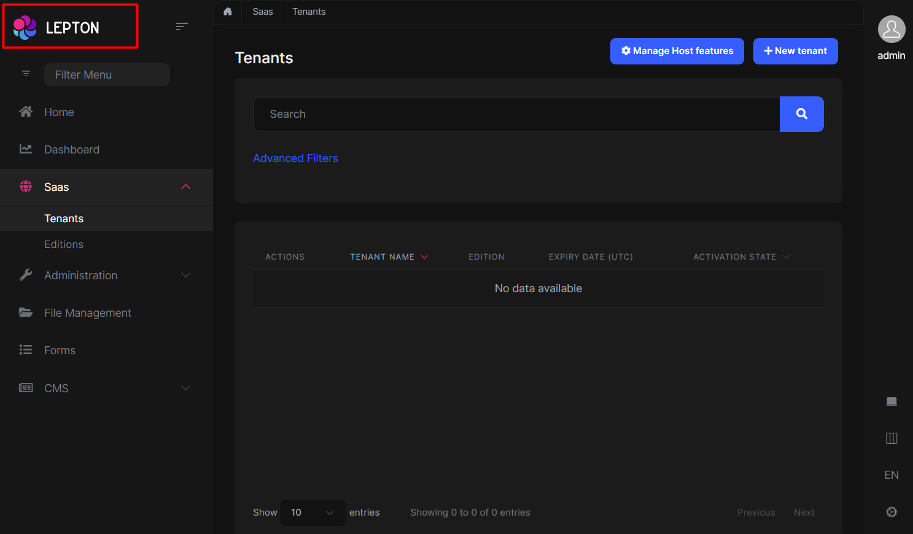
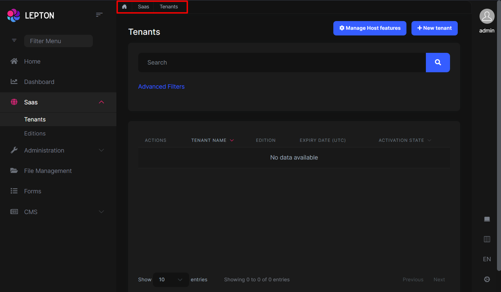
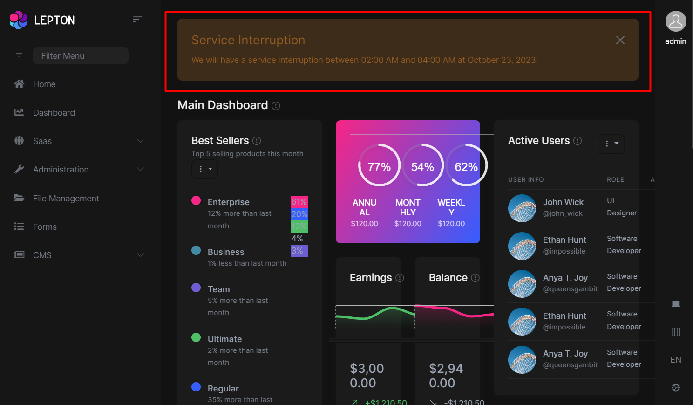
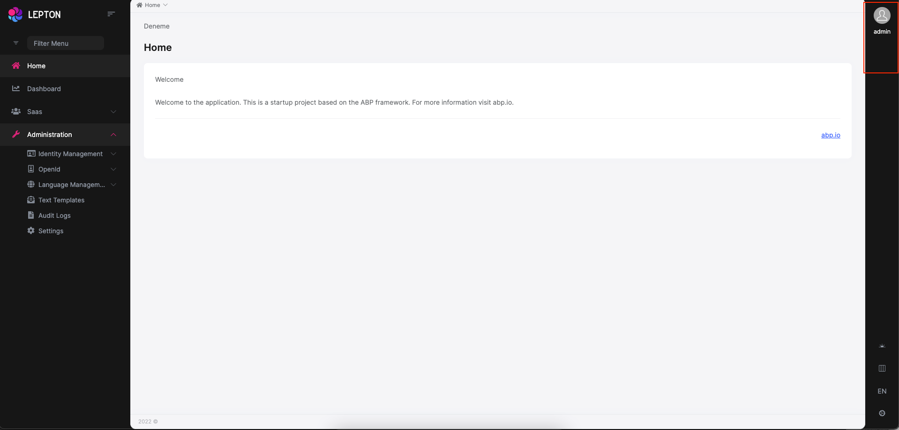
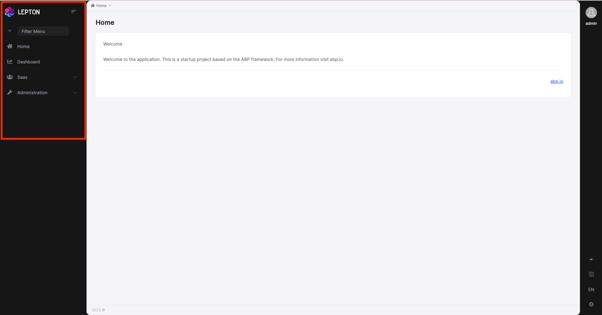
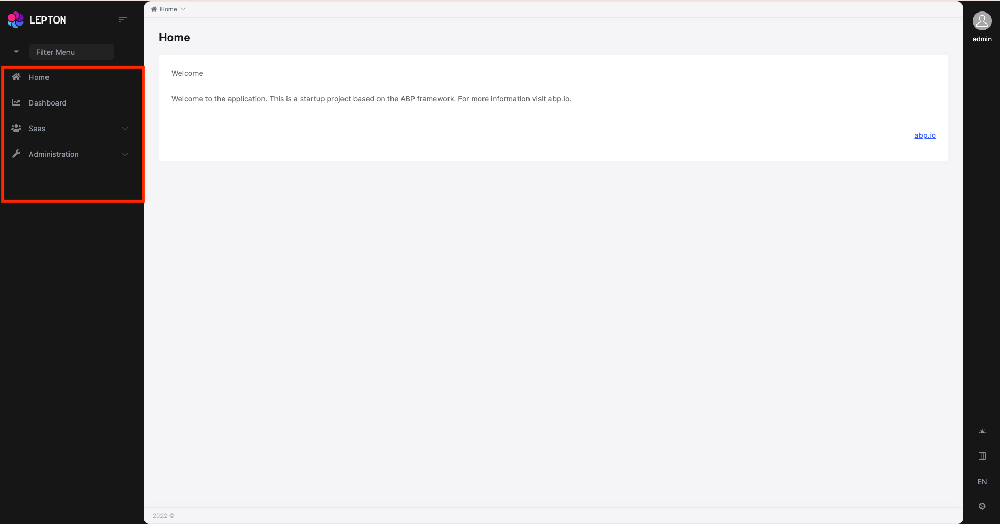
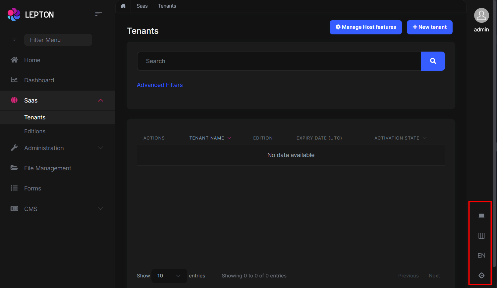
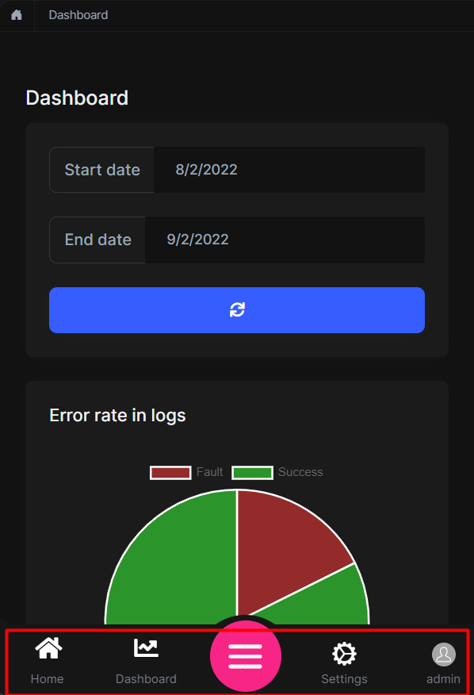
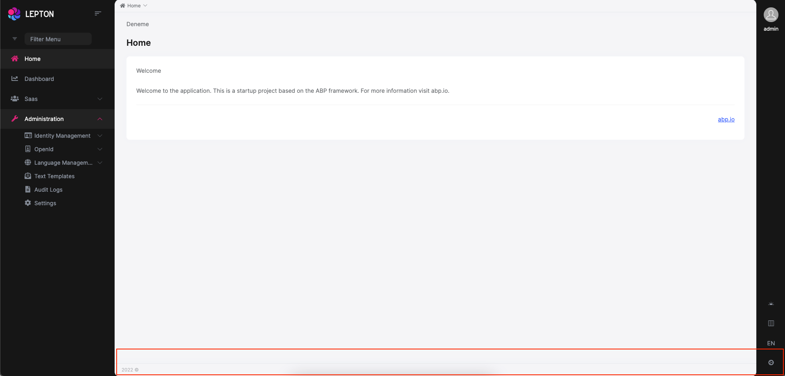

# Customization

### Layouts

The Angular version of LeptonX provides **layout components** for your **user interface** on [ABP Theming](../../framework/ui/angular/theming.md).
You can use layouts to **organize your user interface**. You can replace the **layout components** and some parts of the **layout components** with the [ABP replaceable component system](../../framework/ui/angular/component-replacement.md).

The main responsibility of a theme is to **provide** the layouts. There are **three pre-defined layouts that must be implemented by all the themes:**

- **ApplicationLayoutComponent:** The **default** layout which is used by the **main** application pages.

- **AccountLayoutComponent:** Mostly used by the **account module** for **login**, **register**, **forgot password**... pages.

- **EmptyLayoutComponent:** The **Minimal** layout that **has no layout components** at all.

The **Layout components** and all the replacable components are predefined in `eThemeLeptonXComponents` as enum.

### How to replace a component

```js
import { ReplaceableComponentsService } from '@abp/ng.core'; // imported ReplaceableComponentsService
import {eThemeLeptonXComponents} from "@volosoft/abp.ng.theme.lepton-x"; // imported eThemeLeptonXComponents enum
//...
@Component(/* component metadata */)
export class AppComponent {
  constructor(
    private replaceableComponents: ReplaceableComponentsService, // injected the service
  ) {
    this.replaceableComponents.add({
      component: YourNewApplicationLayoutComponent,
      key: eThemeLeptonXComponents.ApplicationLayout,
    });
  }
}
```

See the [Component Replacement]() documentation for more information on how to replace components.

### Brand Component

The **brand component** is a simple component that can be used to display your brand. It contains a **logo** and a **company name**.
You can change the logo with css but if you want to change logo component, the key is `eThemeLeptonXComponents.Logo`

```js
///...
this.replaceableComponents.add({
  component: YourNewLogoComponent,
  key: eThemeLeptonXComponents.Logo,
});
///...
```



## Breadcrumb Component

On websites that have a lot of pages, **breadcrumb navigation** can greatly **enhance the way users find their way** around. In terms of **usability**,
breadcrumbs reduce the number of actions a website **visitor** needs to take in order
to get to a **higher-level page**, and they **improve** the **findability** of **website sections** and **pages**.

```js
///...
this.replaceableComponents.add({
  component: YourNewBreadCrumbComponent,
  key: eThemeLeptonXComponents.Breadcrumb,
});
///...
```



## Page Alerts Component

Provides contextual **feedback messages** for typical user actions with a handful of **available** and **flexible** **alert messages**. Alerts are available for any length of text, as well as an **optional dismiss button**.



```js
///...
this.replaceableComponents.add({
  component: YourNewPageAlertContainerComponent,
  key: eThemeLeptonXComponents.PageAlertContainerComponent,
});
///...
```

## Toolbar Component

Toolbar items are used to add **extra functionality to the toolbar**. The toolbar is a **horizontal bar** that **contains** a group of **toolbar items**.



```js
///...
this.replaceableComponents.add({
  component: YourNewToolbarComponent,
  key: eThemeLeptonXComponents.Toolbar,
});
///...
```

## Navbar Component

Navbar items are used to add **extra functionality to the Sidebar**. The toolbar is a **vertical bar** that **contains** a group of **Navbar routes**.



```js
///...
this.replaceableComponents.add({
  component: YourNewNavbarComponent,
  key: eThemeLeptonXComponents.Navbar,
});
///...
```

## Routes Component

The routes component contains routes in the navbar.



```js
///...
this.replaceableComponents.add({
  component: YourNewRoutesComponent,
  key: eThemeLeptonXComponents.Routes,
});
///...
```

## General Settings

- The **general settings component** is used to change your **Appearance** , **Container width** and **Language**. At the **bottom right** is the section that contains the settings.



```js
///...
this.replaceableComponents.add({
  component: YourNewGeneralSettingsComponent,
  key: eThemeLeptonXComponents.Settings,
});
///...
```

## Mobile Navbar Component

The **mobile navbar component** is used to display the **navbar menu on mobile devices**. The mobile navbar component is a **dropdown menu** that contains language selection and user menu.



```js
///...
this.replaceableComponents.add({
  component: YourNewMobileNavbarComponent,
  key: eThemeLeptonXComponents.NavbarMobile,
});
///...
```

## Avatar Component

The **Avatar Component** is your user image that displays on the **Toolbar top right**.


```js
///...
this.replaceableComponents.add({
  component: YourNewAvatarComponent,
  key: eThemeLeptonXComponents.CurrentUserImage,
});
///...
```

## Footer Component



The Footer is the section of content at the very bottom of the site. This section of the content can be modified.
Inject **FooterLinksService** and use the **setFooterInfo** method of **FooterLinksService**
to assign path or link and description.
**descUrl** and **footerLinks** are nullable. Constant **footerLinks** are on the right side of the footer.

```js
///...
const footerLinks = [
  {
    link: "/account/manage",
    text: "Manage Your Profile",
  },
  {
    link: "/identity/security-logs",
    text: "My Security Logs",
  },
];
const footerInfo: FooterNav = {
  desc: "Home",
  descUrl: "/home",
  footerLinks: footerLinks,
};
this.footerLinksService.setFooterInfo(footerInfo);
///...
```

If you want to change the footer component, the key is `eThemeLeptonXComponents.Footer`

```js
///...
this.replaceableComponents.add({
  component: YourNewFooterComponent,
  key: eThemeLeptonXComponents.Footer,
});
///...
```

## Custom Layout

If you want to create your own layout, please refer to the [Custom layout usage with Lepton X components](./how-to-use-lepton-x-components-with-angular-custom-layout.md) documentation.

## Create a New Appearance

If you want to create your own LeptonX appearance, [see the docs](./angular/how-to-add-a-new-variation-to-lepton-x-for-angular.md)

## Change the Default Appearance

The default appearance is "system" but if you want to define another value, [see the docs](./angular/how-to-change-default-theme-option.md)
