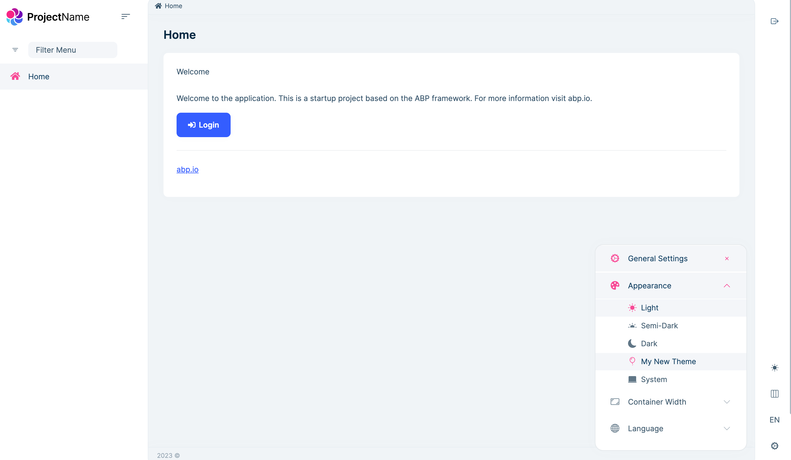

# How to Add a New Appearance to LeptonX for Angular
LeptonX has four appearances: light, dim, dark, and system. You can add a new appearance to LeptonX for Angular. In this document, we will show you how to add a new appearance to LeptonX for Angular.

### Step 1: Creating the New Theme Definition
To add a new theme appearance to LeptonX, we need to define its configuration. 
In your Angular project, open the file where you store your theme-related code (e.g., new-theme.provider.ts), and add the following code snippet:

```js
import {
  LPX_THEMES,
  LPX_THEME_STYLES_DEFAULTS,
  LpxTheme,
} from '@volosoft/ngx-lepton-x';

const myNewThemeDefinition = new LpxTheme({
  bundles: [
    {
      bundleName: "bootstrap-custom", // it is optional. You can add one or more bundles.
    },
    {
      bundleName: "custom-theme",// bundle names will be used in angular.json 
    },
  ],
  styleName: 'myNewTheme',
  label: 'My New Theme',
  icon: 'bi bi-filetype-css', // or what you want
});

export const NEW_THEME_PROVIDER = [
  {
    provide: LPX_THEMES,
    useValue: [...LPX_THEME_STYLES_DEFAULTS, myNewThemeDefinition],
  },
];
```

In this code snippet, we create a new instance of the LpxTheme class called myNewThemeDefinition. We specify the bundles that make up the theme (e.g., "bootstrap-custom" and "custom-theme"), the style name for the theme, a label to display in the UI, and an icon (using Bootstrap icons in this example).

### Step 2: Registering the New Theme Provider
Now that we have defined the new theme appearance, we need to register it as a provider in our Angular project. Open the app.module.ts file (or the module where LeptonX is configured), and add the following code:

```js
import { NEW_THEME_PROVIDER } from './new-theme.provider.ts';

@NgModule({
  imports: [
    // ...
  ],
  providers: [
    // ...
    NEW_THEME_PROVIDER,
  ],
  // ...
})
export class AppModule { }

```

By importing the `NEW_THEME_PROVIDER` from the file where we defined our theme, we can add it to the providers array of our Angular module. This makes the new theme appearance available throughout the application.

### Step 3: Adding the Styles Path to angular.json

To apply the styles for your new theme appearance, you need to add the path of your CSS file to the angular.json file of your Angular project.

Locate the angular.json file in the root directory of your project.
In the "styles" section, add a new object with the following structure:

```json
"styles": [
  // ...
  {
    "input": "src/assets/css/my-css-file.min.css",
    "inject": false,
    "bundleName": "custom-theme"
  }
  // ...
]
```

In the above code, make sure to replace the "src/assets/css/my-css-file.min.css" directory with the actual path to your CSS file. The "inject" property is set to false to prevent automatic injection of the styles into the application. The "bundleName" property should match the bundle name specified in the theme definition.

By adding this configuration, Angular will include the specified CSS file when building the application, making the styles available for your new theme appearance.



If you want to learn how to build and customize LeptonX using scss files, see [the link](../source-files).
