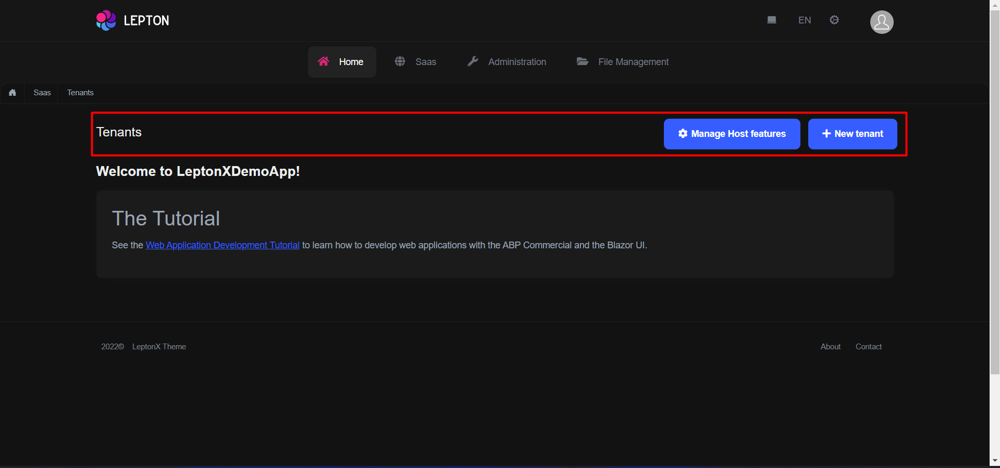
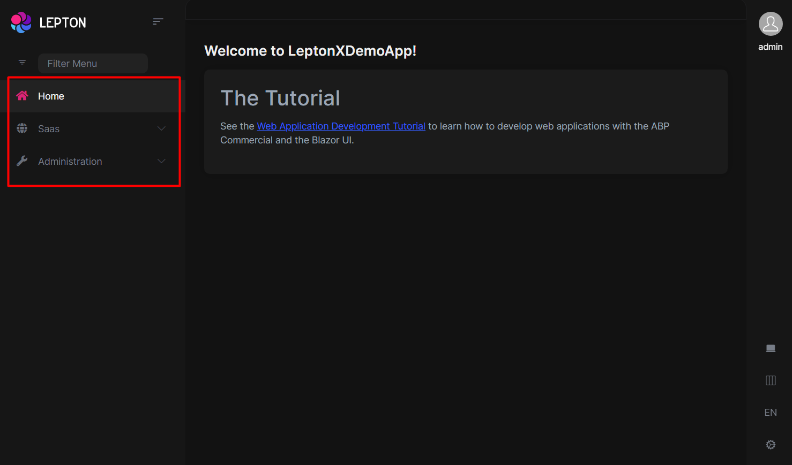
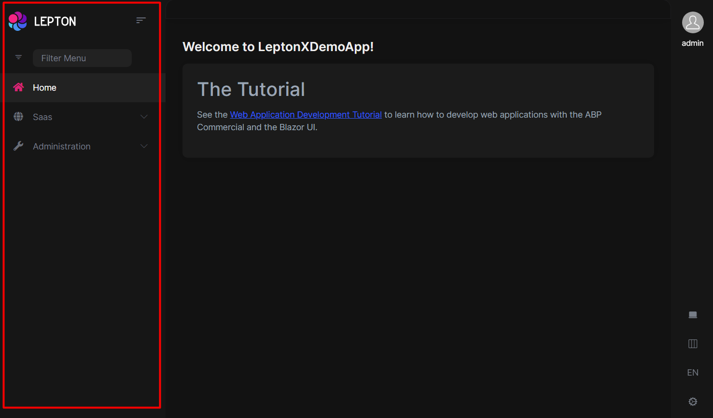
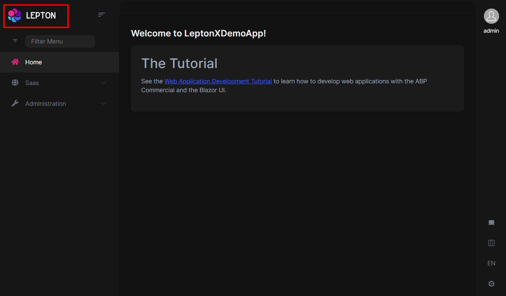
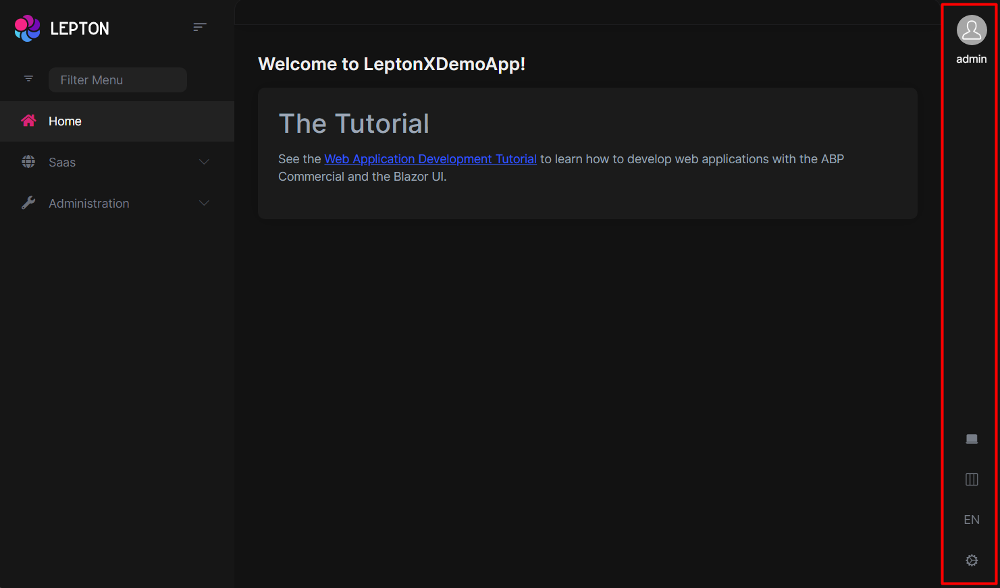
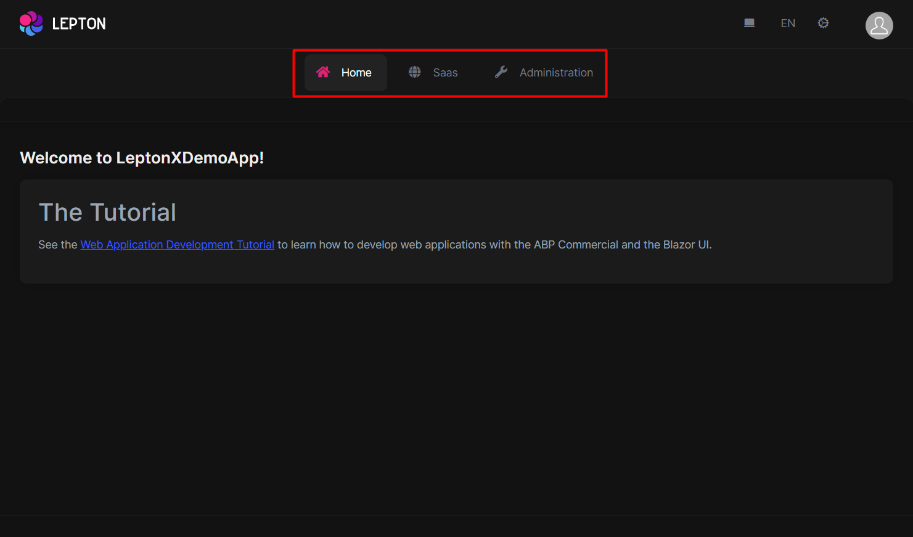
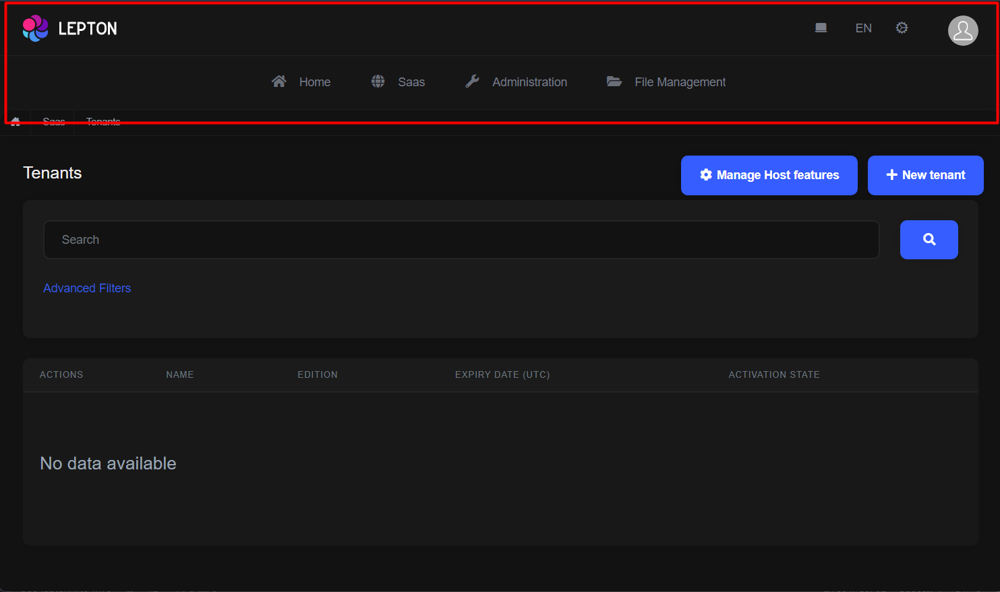
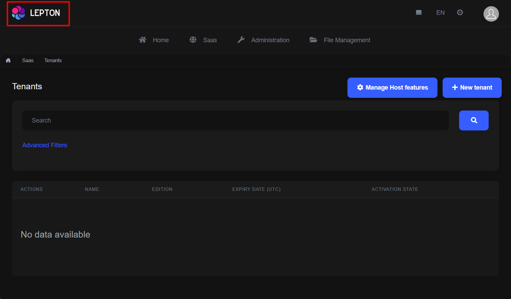
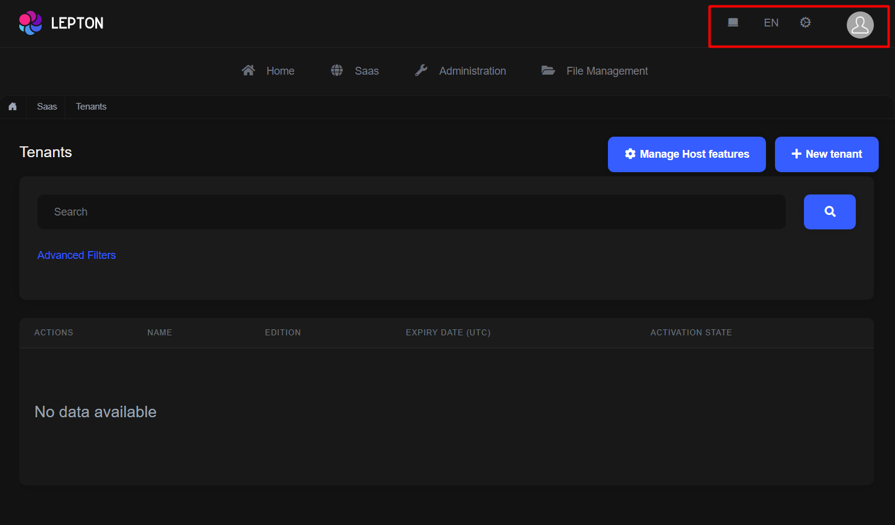

# LeptonX Blazor UI

````json
//[doc-params]
{
    "UI": ["Blazor", "BlazorServer"]
}
````

LeptonX theme is implemented and ready to use with ABP. No custom implementation is needed for Blazor Server & WebAssembly.

## Installation

{{if UI == "Blazor"}}

- Add **Volo.Abp.AspNetCore.Components.WebAssembly.LeptonXTheme** package to your **Blazor WASM** application.
  ```bash
  dotnet add package Volo.Abp.AspNetCore.Components.WebAssembly.LeptonXTheme
  ```

- Remove old theme from **DependsOn** attribute in your module class and add **AbpAspNetCoreComponentsWebAssemblyLeptonXThemeModule** type to **DependsOn** attribute.

```diff
[DependsOn(
-    typeof(LeptonThemeManagementBlazorModule),
-    typeof(AbpAspNetCoreComponentsWebAssemblyLeptonThemeModule),
+    typeof(AbpAspNetCoreComponentsWebAssemblyLeptonXThemeModule)
)]
```

- Change startup `App` component with the LeptonX one.
  - Add following using declaration and remove your old theme using declaration.
    ```csharp
    using Volo.Abp.AspNetCore.Components.Web.LeptonXTheme.Components;
    ```

  - Make sure `App` component in following block is `Volo.Abp.AspNetCore.Components.Web.LeptonXTheme.Components.App`
    ```csharp
        // Make sure the 'App' comes from 'Volo.Abp.AspNetCore.Components.Web.LeptonXTheme.Components' namespace.
        builder.RootComponents.Add<App>("#ApplicationContainer");
    ```
    - If you can't remove or not sure which one is the old theme's using statements, you can use full name of that class:
        ```csharp
        builder.RootComponents.Add<Volo.Abp.AspNetCore.Components.Web.LeptonXTheme.Components.App>("#ApplicationContainer");
        ```

{{end}}


{{if UI == "BlazorServer"}}

- Complete [MVC Installation steps](mvc.md#installation) first.

- Add **Volo.Abp.AspNetCore.Components.Server.LeptonXTheme** package to your **Blazor Server** application.
  ```bash
  dotnet add package Volo.Abp.AspNetCore.Components.Server.LeptonXTheme
  ```
- Remove old theme from **DependsOn** attribute in your module class and add **AbpAspNetCoreComponentsServerLeptonXThemeModule** type to **DependsOn** attribute.

    ```diff
    [DependsOn(
    -    typeof(LeptonThemeManagementBlazorModule),
    -    typeof(AbpAspNetCoreComponentsServerLeptonThemeModule),
    +    typeof(AbpAspNetCoreComponentsServerLeptonXThemeModule)
    )]
    ```

- Update AbpBundlingOptions
  ```diff
  options.StyleBundles.Configure(
  - BlazorLeptonThemeBundles.Styles.Global,
  + BlazorLeptonXThemeBundles.Styles.Global,
    bundle =>
    {
        bundle.AddFiles("/blazor-global-styles.css");
        //You can remove the following line if you don't use Blazor CSS isolation for components
        bundle.AddFiles("/MyProjectName.Blazor.styles.css");
    });
  ```

- Update `_Host.cshtml` file. _(located under **Pages** folder by default.)_
  - Add following usings to Locate **App** and **BlazorLeptonXThemeBundles** classes.
    ```csharp
    @using Volo.Abp.AspNetCore.Components.Web.LeptonXTheme.Components
    @using Volo.Abp.AspNetCore.Components.Server.LeptonXTheme.Bundling
    ```
  - Then replace script & style bunles as following
    ```diff
    - <abp-style-bundle name="@BlazorBasicThemeBundles.Styles.Global" />
    + <abp-style-bundle name="@BlazorLeptonXThemeBundles.Styles.Global" />
    ```

    ```diff
    - <abp-script-bundle name="@BlazorBasicThemeBundles.Scripts.Global" />
    + <abp-script-bundle name="@BlazorLeptonXThemeBundles.Scripts.Global" />
    ```
{{end}}

---

## Source-Code
You can download the source-code of the LeptonX Theme according to you your ABP License.

Visit the [LeptonX Source Code](index#source-code) section to download the source-code.

## Customization
Before starting to customize the theme, you can consider downloading the source code of the theme. You can find the original codes of related components below in the source code.

### Themes
You can set default theme or add or remove themes via using **LeptonXThemeOptions**.

- `DefaultStyle`: Defines deffault fallback theme. Default value is **Dim**
    ```csharp
    Configure<LeptonXThemeOptions>(options =>
    {
        options.DefaultStyle = LeptonXStyleNames.Dark;
    });
    ```

- `Styles`: Defines selectable themes from UI.

    

    ```csharp
    Configure<LeptonXThemeOptions>(options =>
    {
        // Removing existing themes
        options.Styles.Remove(LeptonXStyleNames.Light);

        // Adding a new theme
        options.Styles.Add("red", 
            new LeptonXThemeStyle(
            LocalizableString.Create<YourResource>("Theme:Red"),
            "bi bi-circle-fill"));
    });

    ```

    > `red.css` and `bootstrap-red.css` have to be added under the `wwwroot/_content/Volo.Abp.AspNetCore.Components.Web.LeptonXTheme/side-menu/css/` folder to switch to your custom theme properly when selected. 
    > 
    >_If your layout is **TopMenu**, then you have to add them under the `wwwroot/_content/Volo.Abp.AspNetCore.Components.Web.LeptonXTheme/top-menu/css/` folder._

    

### LeptonXThemeBlazorOptions
Layout options of Blazor UI can be manageable via using **LeptonXThemeMvcOptions**.

- `Layout`: Layout of main application. Default value is `LeptonXMvcLayouts.SideMenu`

    ```csharp
    Configure<LeptonXThemeBlazorOptions>(options =>
    {
        options.Layout = LeptonXBlazorLayouts.SideMenu;
        // Or your custom implemented layout:
        options.Layout = typeof(MyCustomLayoutComponent);
    });
    ```

- `MobileMenuSelector`: Defines items to be displayed at mobile menu. Default value is first 2 items from main menu items.

    

    ```csharp
    Configure<LeptonXThemeBlazorOptions>(options =>
    {
        options.MobileMenuSelector = items => items.Where(x => x.MenuItem.Name == "MyProjectName.Home" || x.MenuItem.Name == "MyProjectName.Dashboard");
    });
    ```


{{if UI == "Blazor"}}

#### Updating Bundles on Layout Changes
Layout changes requires bundling and restarting the application. Before bundling, you have to add your layout to `appsettings.json`. Make sure `AbpCli:Bundle:Paramters` has `LeptonXTheme.Layout` key with your layout name. Available values are `side-menu` & `top-menu`.


_You can add the following section to root level of your appsettings.json file if not added._
```json
  "AbpCli": {
    "Bundle": {
      "Mode": "BundleAndMinify", /* Options: None, Bundle, BundleAndMinify */
      "Name": "global",
      "Parameters": {
        "LeptonXTheme.Layout": "top-menu" /* Options: side-menu, top-menu */
      }
    }
  }
```

Then you can run bundling command with ABP Cli

```bash
abp bundle
```

{{end}}


## Layouts

**LeptonX** offers two **ready-made layouts** for your web application. One of them is **placed** with the **menu items** on the **top** and the other with the **menu items** on the **sides**.

### Top Menu Layout


### Side Menu Layout


You can override layouts by following the steps below:

* Create a razor page, like `MySideMenuLayout.razor`, in your blazor application as shown below:

```html
@using Volo.Abp.AspNetCore.Components.Web.LeptonXTheme.Components.ApplicationLayout;
@using Volo.Abp.DependencyInjection

@inherits SideMenuLayout
@attribute [ExposeServices(typeof(SideMenuLayout))]
@attribute [Dependency(ReplaceServices = true)]

@Name
``` 

* If you prefer to use a code-behind file for the C# code of your component, create a razor component, like `MySideMenuLayout.razor.cs`, in your blazor application as shown below:

```csharp	

using Volo.Abp.AspNetCore.Components.Web.LeptonXTheme.Components.ApplicationLayout;
using Volo.Abp.DependencyInjection;

namespace LeptonXLite.DemoApp.Blazor.MyComponents
{
    [ExposeServices(typeof(SideMenuLayout))]
    [Dependency(ReplaceServices = true)]
    public partial class MySideMenuLayout
    {
        public string Name = "My Top Layout";
    }
}
```	

> Don't forget to remove repeated attributes from the razor page!

---


## Common Components

Commonly used components in all layouts.

### Breadcrumb


Breadcrumbs can be customized by using the `PageLayout` service. See the [PageLayout - BreadCrumb](../../framework/ui/blazor/page-layout.md#breadcrumbs) section for more information.

If you need to replace the component, you can follow the steps below.

* Create a razor page, like `MyBreadcrumbs.razor`, in your blazor application as shown below:

```html
@Volo.Abp.AspNetCore.Components.Web.LeptonXTheme.Components.ApplicationLayout.Common;
@using Volo.Abp.DependencyInjection

@inherits Breadcrumbs
@attribute [ExposeServices(typeof(Breadcrumbs))]
@attribute [Dependency(ReplaceServices = true)]

@Name
``` 

* If you prefer to use a code-behind file for the C# code of your component, create a razor component, like `MyBreadcrumbs.razor.cs`, in your blazor application as shown below:
```csharp	
using Volo.Abp.AspNetCore.Components.Web.LeptonXTheme.Components.ApplicationLayout.Common;
using Volo.Abp.DependencyInjection;

namespace LeptonXLite.DemoApp.Blazor.MyComponents
{
    [ExposeServices(typeof(Breadcrumbs))]
    [Dependency(ReplaceServices = true)]
    public partial class MyBreadcrumbsComponent
    {
        public string Name = "My Breadcrumbs";
    }
}
```	

### Content Toolbar



* Create a razor page, like `MyContentToolbar.razor`, in your blazor application as shown below:

```html
@Volo.Abp.AspNetCore.Components.Web.LeptonXTheme.Components.ApplicationLayout.Common;
@using Volo.Abp.DependencyInjection

@inherits ContentToolbar
@attribute [ExposeServices(typeof(ContentToolbar))]
@attribute [Dependency(ReplaceServices = true)]

@Name
``` 

* If you prefer to use a code-behind file for the C# code of your component, create a razor component, like `MyContentToolbar.razor.cs`, in your blazor application as shown below:
```csharp	
using Volo.Abp.AspNetCore.Components.Web.LeptonXTheme.Components.ApplicationLayout.Common;
using Volo.Abp.DependencyInjection;

namespace LeptonXLite.DemoApp.Blazor.MyComponents
{
    [ExposeServices(typeof(ContentToolbar))]
    [Dependency(ReplaceServices = true)]
    public partial class MyContentToolbarComponent
    {
        public string Name = "My Content Toolbar";
    }
}
```	

### General Settings


* Create a razor page, like `MyGeneralSettings.razor`, in your blazor application as shown below:

```html
@Volo.Abp.AspNetCore.Components.Web.LeptonXTheme.Components.ApplicationLayout.Common;
@using Volo.Abp.DependencyInjection

@inherits GeneralSettings
@attribute [ExposeServices(typeof(GeneralSettings))]
@attribute [Dependency(ReplaceServices = true)]

@Name
``` 

* If you prefer to use a code-behind file for the C# code of your component, create a razor component, like `MyGeneralSettings.razor.cs`, in your blazor application as shown below:
```csharp	
using Volo.Abp.AspNetCore.Components.Web.LeptonXTheme.Components.ApplicationLayout.Common;
using Volo.Abp.DependencyInjection;

namespace LeptonXLite.DemoApp.Blazor.MyComponents
{
    [ExposeServices(typeof(GeneralSettings))]
    [Dependency(ReplaceServices = true)]
    public partial class MyGeneralSettings
    {
        public string Name = "My General Settings";
    }
}
```	

### Mobile General Settings


* Create a razor page, like `MyMobileGeneralSettings.razor`, in your blazor application as shown below:

```html
@Volo.Abp.AspNetCore.Components.Web.LeptonXTheme.Components.ApplicationLayout.Common;
@using Volo.Abp.DependencyInjection

@inherits MobileGeneralSettings
@attribute [ExposeServices(typeof(MobileGeneralSettings))]
@attribute [Dependency(ReplaceServices = true)]

@Name
``` 

* If you prefer to use a code-behind file for the C# code of your component, create a razor component, like `MyMobileGeneralSettings.razor.cs`, in your blazor application as shown below:
```csharp	
using Volo.Abp.AspNetCore.Components.Web.LeptonXTheme.Components.ApplicationLayout.Common;
using Volo.Abp.DependencyInjection;

namespace LeptonXLite.DemoApp.Blazor.MyComponents
{
    [ExposeServices(typeof(MobileGeneralSettings))]
    [Dependency(ReplaceServices = true)]
    public partial class MyMobileGeneralSettings
    {
        public string Name = "My Mobile General Settings";
    }
}
```	

---

## Side Menu Components

Components used in the side menu layout.

### Main Menu



* Create a razor page, like `MyMainMenu.razor`, in your blazor application as shown below:

```html
@Volo.Abp.AspNetCore.Components.Web.LeptonXTheme.Components.ApplicationLayout.TopMenu.Navigation;
@using Volo.Abp.DependencyInjection

@inherits MainMenu
@attribute [ExposeServices(typeof(MainMenu))]
@attribute [Dependency(ReplaceServices = true)]

@Name
``` 

* If you prefer to use a code-behind file for the C# code of your component, create a razor component, like `MyMainMenu.razor.cs`, in your blazor application as shown below:
```csharp	
using Volo.Abp.AspNetCore.Components.Web.LeptonXTheme.Components.ApplicationLayout.SideMenu.Navigation;
using Volo.Abp.DependencyInjection;

namespace LeptonXLite.DemoApp.Blazor.MyComponents
{
    [ExposeServices(typeof(MainMenu))]
    [Dependency(ReplaceServices = true)]
    public partial class MyMainMenuComponent
    {
        public string Name = "My Main Menu";
    }
}
```	

### Main Menu Item

* Create a razor page, like `MyMainMenuItem.razor`, in your blazor application as shown below:

```html
@Volo.Abp.AspNetCore.Components.Web.LeptonXTheme.Components.ApplicationLayout.SideMenu.Navigation;
@using Volo.Abp.DependencyInjection

@inherits MainMenuItem
@attribute [ExposeServices(typeof(MainMenuItem))]
@attribute [Dependency(ReplaceServices = true)]

@Name
``` 

* If you prefer to use a code-behind file for the C# code of your component, create a razor component, like `MyMainMenuItem.razor.cs`, in your blazor application as shown below:
```csharp	
using Volo.Abp.AspNetCore.Components.Web.LeptonXTheme.Components.ApplicationLayout.SideMenu.Navigation;
using Volo.Abp.DependencyInjection;

namespace LeptonXLite.DemoApp.Blazor.MyComponents
{
    [ExposeServices(typeof(MainMenu))]
    [Dependency(ReplaceServices = true)]
    public partial class MyMainMenuItemComponent
    {
        public string Name = "My Main Menu Item";
    }
}
```	

### Mobile Navbar


* Create a razor page, like `MyMobileNavbar.razor`, in your blazor application as shown below:

```html
@Volo.Abp.AspNetCore.Components.Web.LeptonXTheme.Components.ApplicationLayout.SideMenu.Navigation;
@using Volo.Abp.DependencyInjection

@inherits MobileNavbar
@attribute [ExposeServices(typeof(MobileNavbar))]
@attribute [Dependency(ReplaceServices = true)]

@Name
``` 

* If you prefer to use a code-behind file for the C# code of your component, create a razor component, like `MyMobileNavbar.razor.cs`, in your blazor application as shown below:
```csharp	
using Volo.Abp.AspNetCore.Components.Web.LeptonXTheme.Components.ApplicationLayout.SideMenu.Navigation;
using Volo.Abp.DependencyInjection;

namespace LeptonXLite.DemoApp.Blazor.MyComponents
{
    [ExposeServices(typeof(MobileNavbar))]
    [Dependency(ReplaceServices = true)]
    public partial class MyMobileNavbar
    {
        public string Name = "My Mobile Navbar";
    }
}
```	

### Main Header



* Create a razor page, like `MyMainHeader.razor`, in your blazor application as shown below:

```html
@Volo.Abp.AspNetCore.Components.Web.LeptonXTheme.Components.ApplicationLayout.SideMenu.MainHeader
@using Volo.Abp.DependencyInjection

@inherits MainHeader
@attribute [ExposeServices(typeof(MainHeader))]
@attribute [Dependency(ReplaceServices = true)]

@Name
``` 

* If you prefer to use a code-behind file for the C# code of your component, create a razor component, like `MyMainHeader.razor.cs`, in your blazor application as shown below:
```csharp	
using Volo.Abp.AspNetCore.Components.Web.LeptonXTheme.Components.ApplicationLayout.SideMenu.MainHeader;
using Volo.Abp.DependencyInjection;

namespace LeptonXLite.DemoApp.Blazor.MyComponents
{
    [ExposeServices(typeof(MainHeader))]
    [Dependency(ReplaceServices = true)]
    public partial class MyMainHeader
    {
        public string Name = "My Main Header";
    }
}
```	

### Main Header Branding



Application branding can be customized with the `IBrandingProvider`. See the [Branding](../../framework/ui/blazor/branding.md) section for more information.

If you need to replace the component, you can follow the steps below.

* Create a razor page, like `MyMainHeaderBranding.razor`, in your blazor application as shown below:

```html
@Volo.Abp.AspNetCore.Components.Web.LeptonXTheme.Components.ApplicationLayout.SideMenu.MainHeader
@using Volo.Abp.DependencyInjection

@inherits MainHeaderBranding
@attribute [ExposeServices(typeof(MainHeaderBranding))]
@attribute [Dependency(ReplaceServices = true)]

@Name
``` 

* If you prefer to use a code-behind file for the C# code of your component, create a razor component, like `MyMainHeaderBranding.razor.cs`, in your blazor application as shown below:
```csharp	
using Volo.Abp.AspNetCore.Components.Web.LeptonXTheme.Components.ApplicationLayout.SideMenu.MainHeader;
using Volo.Abp.DependencyInjection;

namespace LeptonXLite.DemoApp.Blazor.MyComponents
{
    [ExposeServices(typeof(MainHeaderBranding))]
    [Dependency(ReplaceServices = true)]
    public partial class MyMainHeaderBranding
    {
        public string Name = "My Main Header Branding";
    }
}
```	

### Main Header Toolbar



The main toolbar can be managed by using the `ToolbarContributor` classes. See the [Toolbars](../../framework/ui/blazor/toolbars.md) section for more information.

If you need to replace the component, you can follow the steps below.

* Create a razor page, like `MyMainHeaderToolbar.razor`, in your blazor application as shown below:

```html
@Volo.Abp.AspNetCore.Components.Web.LeptonXTheme.Components.ApplicationLayout.SideMenu.MainHeader
@using Volo.Abp.DependencyInjection

@inherits MainHeaderToolbar
@attribute [ExposeServices(typeof(MainHeaderToolbar))]
@attribute [Dependency(ReplaceServices = true)]

@Name
``` 

* If you prefer to use a code-behind file for the C# code of your component, create a razor component, like `MyMainHeaderToolbar.razor.cs`, in your blazor application as shown below:
```csharp	
using Volo.Abp.AspNetCore.Components.Web.LeptonXTheme.Components.ApplicationLayout.SideMenu.MainHeader;
using Volo.Abp.DependencyInjection;

namespace LeptonXLite.DemoApp.Blazor.MyComponents
{
    [ExposeServices(typeof(MainHeaderToolbar))]
    [Dependency(ReplaceServices = true)]
    public partial class MyMainHeaderToolbar
    {
        public string Name = "My Main Header Toolbar";
    }
}
```	

---

## Top Menu Components

Components used in the top menu layout.

### Main Menu



* Create a razor page, like `MyMainMenu.razor`, in your blazor application as shown below:

```html
@Volo.Abp.AspNetCore.Components.Web.LeptonXTheme.Components.ApplicationLayout.TopMenu.Navigation;
@using Volo.Abp.DependencyInjection

@inherits MainMenu
@attribute [ExposeServices(typeof(MainMenu))]
@attribute [Dependency(ReplaceServices = true)]

@Name
``` 

* If you prefer to use a code-behind file for the C# code of your component, create a razor component, like `MyMainMenu.razor.cs`, in your blazor application as shown below:
```csharp	
using Volo.Abp.AspNetCore.Components.Web.LeptonXTheme.Components.ApplicationLayout.TopMenu.Navigation;
using Volo.Abp.DependencyInjection;

namespace LeptonXLite.DemoApp.Blazor.MyComponents
{
    [ExposeServices(typeof(MainMenu))]
    [Dependency(ReplaceServices = true)]
    public partial class MyMainMenuComponent
    {
        public string Name = "My Main Menu";
    }
}
```	

### Main Menu Item

* Create a razor page, like `MyMainMenuItem.razor`, in your blazor application as shown below:

```html
@Volo.Abp.AspNetCore.Components.Web.LeptonXTheme.Components.ApplicationLayout.TopMenu.Navigation;
@using Volo.Abp.DependencyInjection

@inherits MainMenuItem
@attribute [ExposeServices(typeof(MainMenuItem))]
@attribute [Dependency(ReplaceServices = true)]

@Name
``` 

* If you prefer to use a code-behind file for the C# code of your component, create a razor component, like `MyMainMenuItem.razor.cs`, in your blazor application as shown below:
```csharp	
using Volo.Abp.AspNetCore.Components.Web.LeptonXTheme.Components.ApplicationLayout.TopMenu.Navigation;
using Volo.Abp.DependencyInjection;

namespace LeptonXLite.DemoApp.Blazor.MyComponents
{
    [ExposeServices(typeof(MainMenu))]
    [Dependency(ReplaceServices = true)]
    public partial class MyMainMenuItemComponent
    {
        public string Name = "My Main Menu Item";
    }
}
```	

### Mobile Navbar


* Create a razor page, like `MyMobileNavbar.razor`, in your blazor application as shown below:

```html
@Volo.Abp.AspNetCore.Components.Web.LeptonXTheme.Components.ApplicationLayout.TopMenu.Navigation;
@using Volo.Abp.DependencyInjection

@inherits MobileNavbar
@attribute [ExposeServices(typeof(MobileNavbar))]
@attribute [Dependency(ReplaceServices = true)]

@Name
``` 

* If you prefer to use a code-behind file for the C# code of your component, create a razor component, like `MyMobileNavbar.razor.cs`, in your blazor application as shown below:
```csharp	
using Volo.Abp.AspNetCore.Components.Web.LeptonXTheme.Components.ApplicationLayout.TopMenu.Navigation;
using Volo.Abp.DependencyInjection;

namespace LeptonXLite.DemoApp.Blazor.MyComponents
{
    [ExposeServices(typeof(MobileNavbar))]
    [Dependency(ReplaceServices = true)]
    public partial class MyMobileNavbar
    {
        public string Name = "My Mobile Navbar";
    }
}
```	

### Main Header



* Create a razor page, like `MyMainHeader.razor`, in your blazor application as shown below:

```html
@Volo.Abp.AspNetCore.Components.Web.LeptonXTheme.Components.ApplicationLayout.TopMenu.MainHeader
@using Volo.Abp.DependencyInjection

@inherits MainHeader
@attribute [ExposeServices(typeof(MainHeader))]
@attribute [Dependency(ReplaceServices = true)]

@Name
``` 

* If you prefer to use a code-behind file for the C# code of your component, create a razor component, like `MyMainHeader.razor.cs`, in your blazor application as shown below:
```csharp	
using Volo.Abp.AspNetCore.Components.Web.LeptonXTheme.Components.ApplicationLayout.TopMenu.MainHeader;
using Volo.Abp.DependencyInjection;

namespace LeptonXLite.DemoApp.Blazor.MyComponents
{
    [ExposeServices(typeof(MainHeader))]
    [Dependency(ReplaceServices = true)]
    public partial class MyMainHeader
    {
        public string Name = "My Main Header";
    }
}
```	

### Main Header Branding



Application branding can be customized with the `IBrandingProvider`. See the [Branding](../../framework/ui/blazor/branding.md) section for more information.

* Create a razor page, like `MyMainHeaderBranding.razor`, in your blazor application as shown below:

```html
@Volo.Abp.AspNetCore.Components.Web.LeptonXTheme.Components.ApplicationLayout.TopMenu.MainHeader
@using Volo.Abp.DependencyInjection

@inherits MainHeaderBranding
@attribute [ExposeServices(typeof(MainHeaderBranding))]
@attribute [Dependency(ReplaceServices = true)]

@Name
``` 

* If you prefer to use a code-behind file for the C# code of your component, create a razor component, like `MyMainHeaderBranding.razor.cs`, in your blazor application as shown below:
```csharp	
using Volo.Abp.AspNetCore.Components.Web.LeptonXTheme.Components.ApplicationLayout.TopMenu.MainHeader;
using Volo.Abp.DependencyInjection;

namespace LeptonXLite.DemoApp.Blazor.MyComponents
{
    [ExposeServices(typeof(MainHeaderBranding))]
    [Dependency(ReplaceServices = true)]
    public partial class MyMainHeaderBranding
    {
        public string Name = "My Main Header Branding";
    }
}
```	

### Main Header Toolbar



The main toolbar can be managed by using the `ToolbarContributor` classes. See the [Toolbars](../../framework/ui/blazor/toolbars.md) section for more information.

If you need to replace the component, you can follow the steps below.

* Create a razor page, like `MyMainHeaderToolbar.razor`, in your blazor application as shown below:

```html
@Volo.Abp.AspNetCore.Components.Web.LeptonXTheme.Components.ApplicationLayout.TopMenu.MainHeader
@using Volo.Abp.DependencyInjection

@inherits MainHeaderToolbar
@attribute [ExposeServices(typeof(MainHeaderToolbar))]
@attribute [Dependency(ReplaceServices = true)]

@Name
``` 

* If you prefer to use a code-behind file for the C# code of your component, create a razor component, like `MyMainHeaderToolbar.razor.cs`, in your blazor application as shown below:
```csharp	
using Volo.Abp.AspNetCore.Components.Web.LeptonXTheme.Components.ApplicationLayout.TopMenu.MainHeader;
using Volo.Abp.DependencyInjection;

namespace LeptonXLite.DemoApp.Blazor.MyComponents
{
    [ExposeServices(typeof(MainHeaderToolbar))]
    [Dependency(ReplaceServices = true)]
    public partial class MyMainHeaderToolbar
    {
        public string Name = "My Main Header Toolbar";
    }
}
```	
