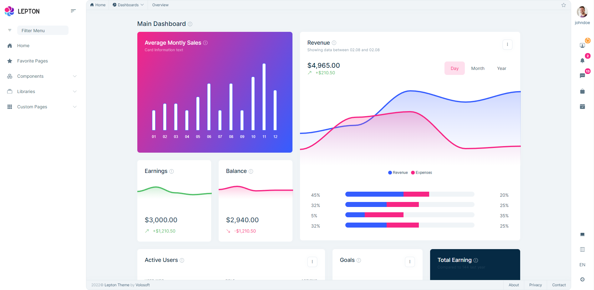
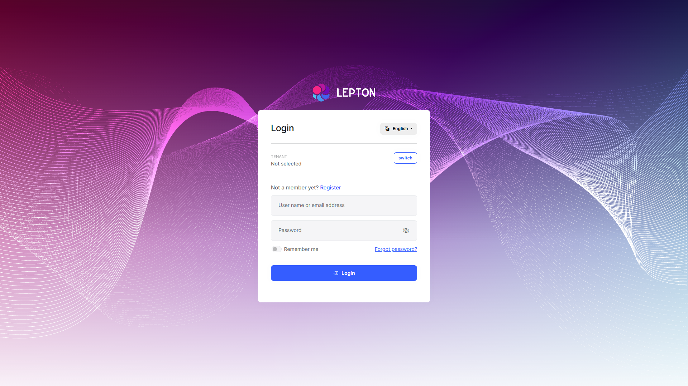
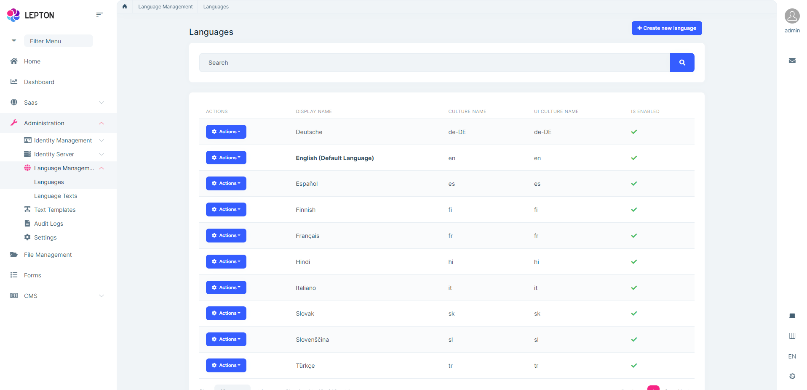
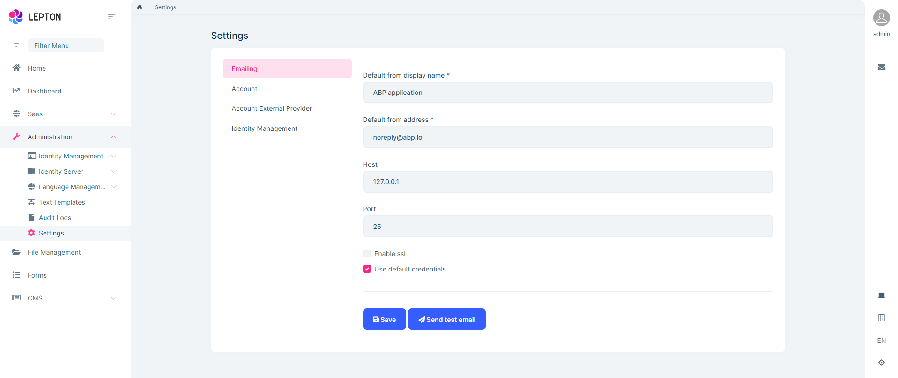

# LeptonX Theme Module

> You must have an ABP Team or a higher license to use this theme.

The LeptonX Theme is a professional theme for the ABP. 

* Check out the website of LeptonX on https://leptontheme.com/.
* Check out the live demo to see it in action. https://x.leptontheme.com/.

## Highlights

* Built on the [Bootstrap 5](https://getbootstrap.com) library.
* 100% compatible with  [Bootstrap 5](https://getbootstrap.com) HTML structure and CSS classes.
* Responsive & mobile-compatible.
* Provides different style like Dim, Dark and Light.

A screenshot from the light style of the theme:



> [See all the theme styles and create a demo to see it in action](https://abp.io/themes).

## How to Install

LeptonX Theme module is pre-installed in [the startup templates](../../get-started). So, no need to manually install it.

## Packages

This module follows the [module development best practices guide](../../framework/architecture/best-practices) and consists of several NuGet and NPM packages. See the guide if you want to understand the packages and relations between them.

### NuGet Packages

* Volo.Abp.AspNetCore.Components.Server.LeptonXTheme
* Volo.Abp.AspNetCore.Components.Web.LeptonXTheme
* Volo.Abp.AspNetCore.Components.WebAssembly.LeptonXTheme
* Volo.Abp.AspNetCore.LeptonX.Shared
* Volo.Abp.AspNetCore.Mvc.UI.Theme.LeptonX

### NPM Packages

* @volo/abp.aspnetcore.mvc.ui.theme.leptonx
* @volo/aspnetcore.components.server.leptonxtheme

#### Angular

* @volo/abp.ng.lepton-x.core
* @volo/ngx-lepton-x.core
* @volosoft/abp.ng.theme.lepton-x
* @volosoft/ngx-lepton-x

## User Interface

LeptonX Theme module doesn't provide any UI pages. It just changes the existing UI pages of an application. Here are some sample pages:

#### Login page

 

#### Languages Page



### Pages

This module doesn't define any pages.

#### Identity Module Settings UI

LeptonX Theme module adds a new tab to the Settings page to customize the behavior on runtime.



## Internals

### Settings

LeptonX Module doesn't define any settings.

### Permissions

LeptonX Module doesn't define any permissions.

### Source code

You can use the following CLI command to download the source-code:

```bash
abp get-source Volo.Abp.LeptonXTheme	
```

If you want to download the source code of the preview version, you can use the following command:

```bash
abp get-source Volo.Abp.LeptonXTheme --preview
```

> You can download the source code of a certain version by using the `--version` parameter. See the [ABP CLI documentation](../../cli/index#get-source) for other possible options.

ABP customers can also download the source code of the [https://x.leptontheme.com/](https://x.leptontheme.com/) from [https://abp.io/api/download/samples/leptonx-demo](https://abp.io/api/download/samples/leptonx-demo).

In order to understand structure of LeptonX's source code and build it from its source code, you can check [LeptonX source code documentation](source-files.md).

## LeptonX Theme Customization

You can use the following links to see the customizations for different UI types:

* [LeptonX Theme: MVC UI](mvc.md)
* [LeptonX Theme: Angular UI](angular.md)
* [LeptonX Theme: Blazor UI](blazor.md)
