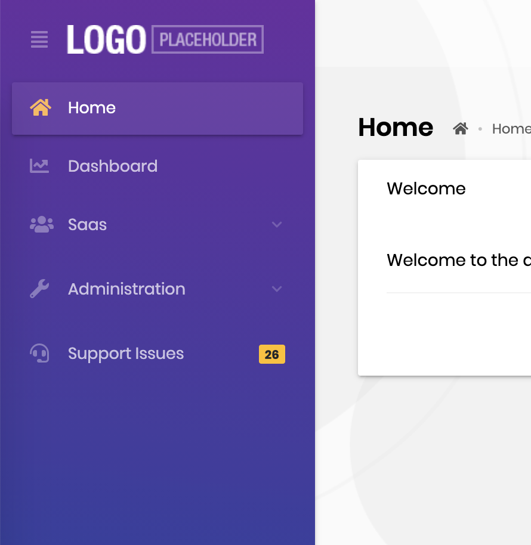
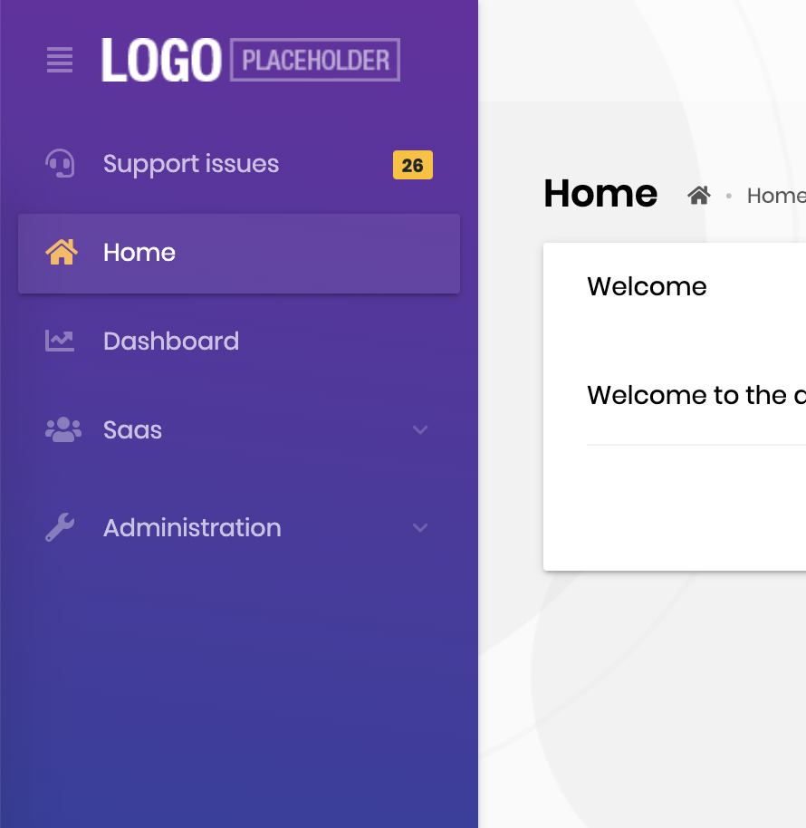
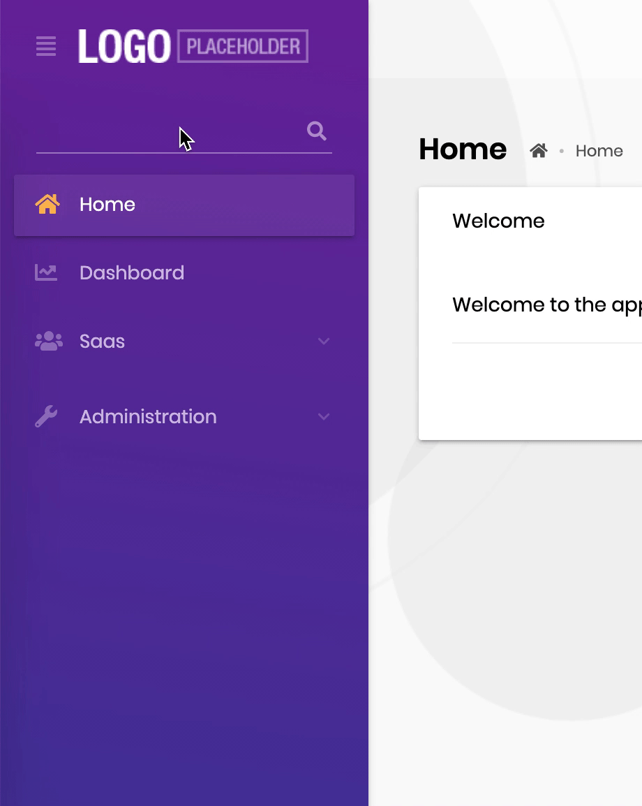
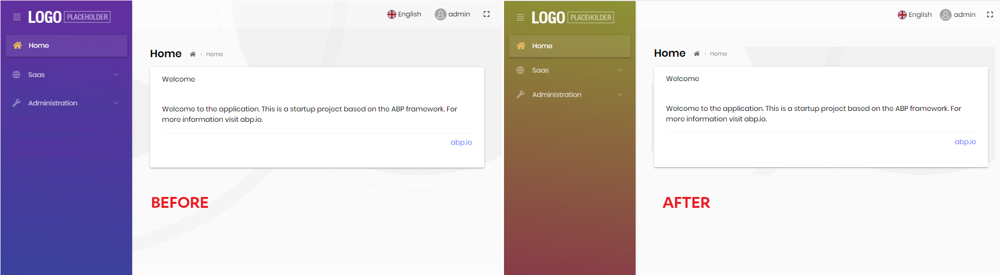

# Customize Lepton Theme with Custom CSS

````json
//[doc-params]
{
    "UI": ["MVC", "Blazor", "BlazorServer", "NG", "MAUIBlazor"]
}
````
You may want to change certain aspects of your website’s  appearance with a custom CSS (Cascading Style Sheet) file. In this document we will show you how to add a custom CSS to your ABP {{UI_Value}} solution to replace the existing Lepton Theme CSS. By adding your custom CSS, you will modify your website’s overall look.

{{if UI=="NG"}}

## Adding Custom Style

There is a `customStyle` boolean configuration in `ThemeLeptonModule`'s `forRoot` method. If this configuration is true, the style selection box is not included in the theme settings form and `ThemeLeptonModule` does not load its own styles. In this case, a custom style file must be added to the styles array in `angular.json` or must be imported by `style.scss`.

> Only angular project styles can be changed in this way. If the authorization flow is authorization code flow, MVC pages (login, profile, etc) are not affected by this change.

Custom style implementation can be done with the following steps

Set `customStyle` property to `true` where is `ThemeLeptonModule` imported with `forRoot` method. 

```javascript
// app.module.ts
ThemeLeptonModule.forRoot({
    customStyle: true
})
```

Import your style file to `src/style.scss`

```css
/* style.scss */
import 'your-custom-style';
```

Or add your style file to the `styles` arrays which in `angular.json` file 

```json
// angular.json
{
   // other configurations 
  "projects": {
    "YourProject": {
      // other configurations
      "architect": {
        "build": {
            "styles": [
              // other styles  
              "your-custom-style-file"
            ],
          },
        },
        "test": {
          "options": {
            "styles": [
               // other styles  
              "your-custom-style-file"
            ],
          }
        },
      }
    }
  }
}
```


## Inserting Custom Content To Lepton Menu

Lepton menu can take custom content both before and after the menu items displayed. In order to achieve this, pass a component as content through the parameters of `ThemeLeptonModule.forRoot` when you import the module in your root module, i.e. `AppModule`. Let's take a look at some examples.


### Placing Custom Content Before & After Menu Items

First step is to create a component which will serve as the custom content.

```js
@Component({
  template: `<a href="https://support.my-domain.com">
    <span class="lp-icon"><i class="fas fa-headset"></i></span>
    <span class="lp-text">Support Issues</span>
    <div class="d-flex justify-content-end">
      <span class="badge badge-pill badge-warning"></span>
    </div>
  </a>`,
})
export class SupportLinkComponent {
  issueCount$ = of(26); // dummy count, replace this with an actual service
}

@NgModule({
  declarations: [SupportLinkComponent],
  imports: [CommonModule],
})
export class SupportLinkModule {}
```

Now, pass this component as `contentAfterRoutes` option to `ThemeLeptonModule`.

```js
@NgModule({
  imports: [
    // other imports are removed for sake of brevity
    SupportLinkModule,
    ThemeLeptonModule.forRoot({
      contentAfterRoutes: [SupportLinkComponent],
    })
  ],
})
export class AppModule {}
```

If you start the dev server, you must see the inserted content as follows:




Placing the content before menu items is straightforward: Just replace `contentAfterRoutes` with `contentBeforeRoutes`.




### Placing a Search Input Before Menu Items

The Lepton package has a search component designed to work with the routes in the menu. You can simply import the module and pass the component as `contentBeforeRoutes` option to `ThemeLeptonModule`.

```js
import { MenuSearchComponent, MenuSearchModule } from '@volo/abp.ng.theme.lepton/extensions';

@NgModule({
  imports: [
    // other imports are removed for sake of brevity

    MenuSearchModule.forRoot({
      limit: 3 // search result limit (default: Infinity)
    }),
    ThemeLeptonModule.forRoot({
      contentBeforeRoutes: [MenuSearchComponent],
    })
  ],
})
export class AppModule {}
```

Here is how the search input works:



Please note that the **search component** filters only the routes and cannot hide custom 

{{else}}

> Be aware that custom CSS must contain all the styles that Lepton Theme uses. If you just want to overwrite some styles, you can use {{if UI== "Blazor"}}`global.css`{{else}}`global-styles.css`{{end}} in the `wwwroot` folder of your web project.


## How to Add a Custom CSS?

### Download Lepton Theme Source-Code

Download the Lepton Theme source-code to retrieve the existing CSS files. To do this create a new folder named as `LeptonTheme` and run the following ABP CLI command inside the `LeptonTheme` folder:

```bash
abp get-source Volo.LeptonTheme
```


### Copy to Your Project

In the following folder, you will find all the Lepton CSS files. 

```bash
src\Volo.Abp.AspNetCore.Mvc.UI.Theme.Lepton\Themes\Lepton\Global\styles
```

The default theme uses `Lepton6.css`.  
Create a folder named `styles` under the `wwwroot`folder of your web project.  
Copy `Lepton6.css` to the `wwwroot/styles`  folder and rename it to `custom.css`.

### Customize the CSS

Open `custom.css` and find the `.lp-opened-sidebar` style.
Comment out the existing background style and add the following background style which changes the main menu's background color.

```css
 background: linear-gradient(7deg, #9f3049, #84a21f);
```


### Set the Style Path

Add the following code to the {{if UI== "MVC"}} `ConfigureServices` in the  `YourProjectWebModule.cs` {{end}}{{if UI== "BlazorServer"}} `ConfigureServices` in the `YourProjectBlazorModule` {{end}}{{if UI== "Blazor"}}`wwwroot/appsettings.json` file{{end}}.

{{if UI== "MVC"}}
```csharp
Configure<LeptonThemeOptions>(options =>
{
    options.StylePath = "/styles/custom.css";
});
```
{{end}}

{{if UI== "BlazorServer"}}
```csharp
Configure<<Volo.Abp.AspNetCore.Components.Web.LeptonTheme.LeptonThemeOptions>(options =>
{
    options.StylePath = "/styles/custom.css";
});
```
{{end}}

{{if UI== "Blazor"}}

```json
  "AbpCli": {
    "Bundle": {
      "Mode": "BundleAndMinify",
      "Name": "global",
      "Parameters": {
        "LeptonTheme.StylePath": "styles/custom.css"
      }
    }
  }
```

Run the following ABP CLI command to bundle the `custom.css`

```bash
abp bundle
```

{{end}}


### Run the Web Project

The main menu's background color changed. With this approach, you can change your website’s overall look.



{{end}}