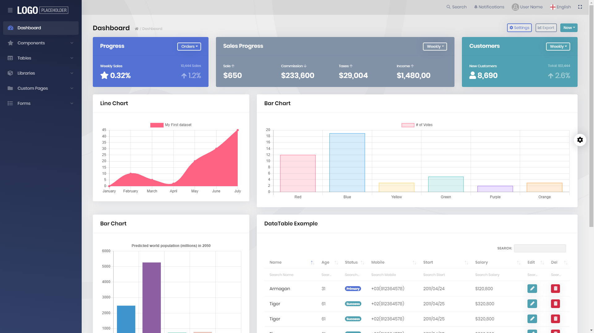
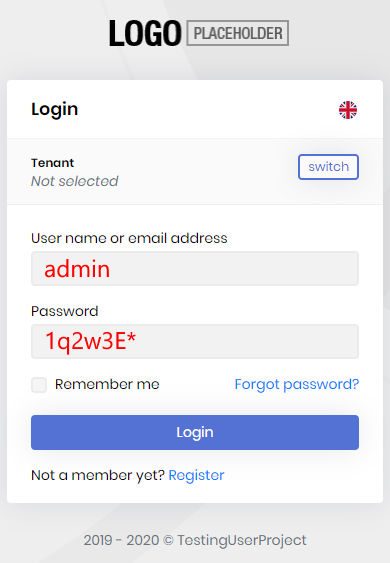
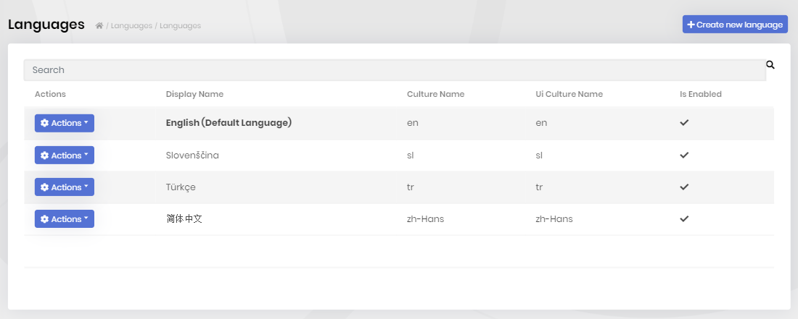
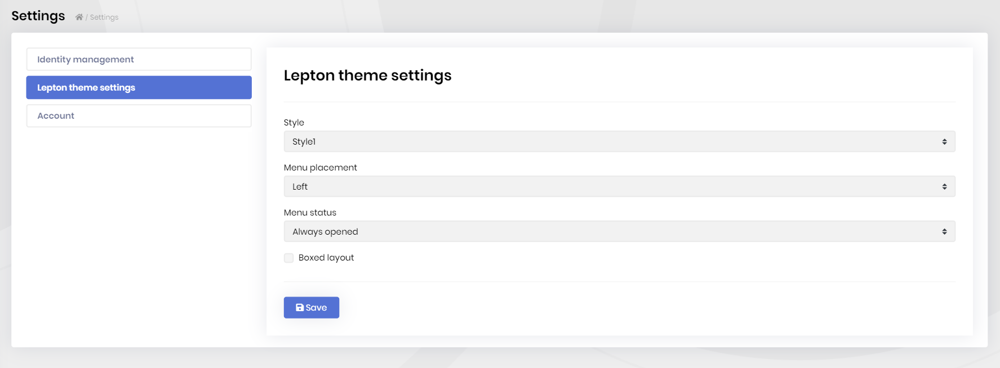

# Lepton Theme Module

> You must have an ABP Team or a higher license to use this theme.

The Lepton Theme is a professional theme for the ABP.

* Built on the [Bootstrap 5](https://getbootstrap.com) library.
* 100% compatible with  [Bootstrap 5](https://getbootstrap.com) HTML structure and CSS classes
* Responsive & mobile-compatible.
* Provides different styles like Material, Dark, Light.
* Provides styles for [Datatables](https://datatables.net).

A screenshot from the light style of the theme:



> [See all the theme styles and create a demo to see it in action](https://abp.io/themes).

## How to Install

Lepton Theme module can be pre-installed to [the startup templates](../../get-started), if you specify the theme as **LeptonTheme** (see the [CLI documentation](../../cli/index.md)). So, no need to manually install it.

## Packages

This module follows the [module development best practices guide](https://docs.abp.io/en/abp/latest/Best-Practices/Index) and consists of several NuGet and NPM packages. See the guide if you want to understand the packages and relations between them.

### NuGet Packages

* Volo.Abp.LeptonTheme.Management.Domain.Shared
* Volo.Abp.LeptonTheme.Management.Domain
* Volo.Abp.LeptonTheme.Management.Application.Contracts
* Volo.Abp.LeptonTheme.Management.Application
* Volo.Abp.LeptonTheme.Management.HttpApi
* Volo.Abp.LeptonTheme.Management.HttpApi.Client
* Volo.Abp.LeptonTheme.Management.Web
* Volo.Abp.AspNetCore.Mvc.UI.Theme.Lepton

### NPM Packages

* @volo/abp.ng.theme.lepton

## User Interface

Lepton Theme module doesn't provide any UI pages. It just changes the existing UI pages of an application. Here are some sample pages:

#### Login page

 

#### Languages Page



### Pages

This module doesn't define any pages.

#### Identity Module Settings UI

Lepton Theme module adds a new tab to the Settings page to customize the behavior on runtime.



## Internals

### Settings

See the `LeptonThemeSettingNames` class members for all settings defined for this module.

### Permissions

See the `LeptonThemeManagementPermissions` class members for all permissions defined for this module.

### Source code

To download the source-code of the Lepton Theme use the following CLI command:

```bash
abp get-source Volo.Abp.LeptonTheme # for new ABP CLI
```

If you are using the old ABP CLI, you can use the following command:

```bash
abp get-source Volo.LeptonTheme
```

## Lepton Theme Customization

Checkout how to customize the Lepton Theme to change your website’s overall look.

* [Customizing Lepton Theme for Angular](customizing-lepton-theme.md?UI=NG)
* [Customizing Lepton Theme for MVC](customizing-lepton-theme.md?UI=MVC)
* [Customizing Lepton Theme for Blazor](customizing-lepton-theme.md?UI=Blazor)
* [Customizing Lepton Theme for Blazor Server](customizing-lepton-theme.md?UI=BlazorServer)
