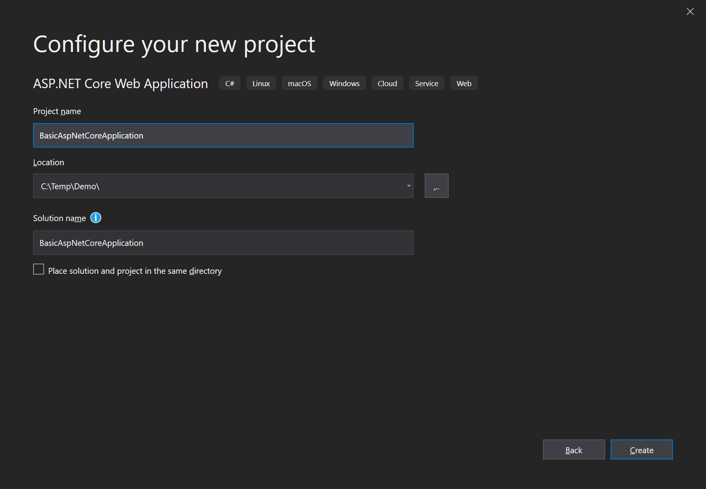
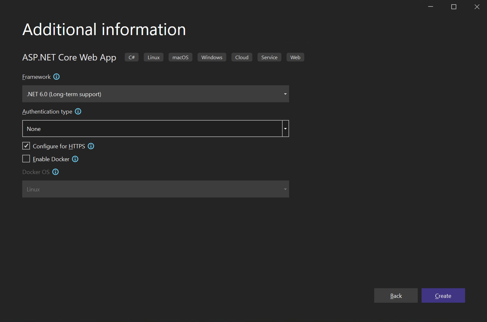

# Empezando con ABP y una Aplicacion AspNet Core MVC Web

Este tutorial explica como empezar una aplicacion ABP desde cero usando las dependencias minimas. Uno generalmente desea
empezar con la **[plantilla de inicio](Getting-Started-AspNetCore-MVC-Template.md)**.

## Crea un Proyecto Nuevo

1. Crea una Aplicacion Web AspNet Core nueva usando Visual Studio 2022 (17.0.0+):


2. Configura el nuevo proyecto:



3. Presione el boton Create:



## Instale el paquete Volo.Abp.AspNetCore.Mvc

Volo.Abp.AspNetCore.Mvc es el paquete de integracion con AspNet Core MVC para ABP. Siendo asi, instalalo en su proyecto:

````
Install-Package Volo.Abp.AspNetCore.Mvc
````

## Crea el primer modulo ABP

ABP es un marco de referencia modular y require una clase de **inicio (raíz) tipo modulo** derivada de ``AbpModule``:

````C#
using Microsoft.AspNetCore.Builder;
using Microsoft.Extensions.Hosting;
using Volo.Abp;
using Volo.Abp.AspNetCore.Mvc;
using Volo.Abp.Modularity;

namespace BasicAspNetCoreApplication
{
    [DependsOn(typeof(AbpAspNetCoreMvcModule))]
    public class AppModule : AbpModule
    {
        public override void OnApplicationInitialization(ApplicationInitializationContext context)
        {
            var app = context.GetApplicationBuilder();
            var env = context.GetEnvironment();

            // Configura la canalización de peticiones HTTP.
            if (env.IsDevelopment())
            {
                app.UseExceptionHandler("/Error");
                // El valor por defecto de HSTS es 30 dias. Debes cambiar esto en ambientes productivos. Referencia https://aka.ms/aspnetcore-hsts.
                app.UseHsts();
            }

            app.UseHttpsRedirection();
            app.UseStaticFiles();
            app.UseRouting();
            app.UseConfiguredEndpoints();
        }
    }
}
````

``AppModule`` es un buen nombre para el modulo de inicio de una aplicacion.

Los paquetes de ABP definen clases de tipo modulo y cada modulo puede depender de otro.
En el codigo anterior, el ``AppModule`` depende de el modulo ``AbpAspNetCoreMvcModule`` (definido por el paquete [Volo.Abp.AspNetCore.Mvc](https://www.nuget.org/packages/Volo.Abp.AspNetCore.Mvc)). Es comun agregar el atributo ``DependsOn`` despues de instalar un paquete ABP nuevo.

En vez de la clase de inicion Startup, estamos configurando una canalizacion de ASP.NET Core en este modulo.

## La clase Program

El proximo paso es modificar la clase Program para integrate el sistema de modulos ABP:

````C#
using BasicAspNetCoreApplication;

var builder = WebApplication.CreateBuilder(args);

await builder.Services.AddApplicationAsync<AppModule>();

var app = builder.Build();

await app.InitializeApplicationAsync();
await app.RunAsync();
````

``builder.Services.AddApplicationAsync<AppModule>();`` Agrega todos los servicios definidos en todos los modulos empezando desde ``AppModule``.

``app.InitializeApplicationAsync()`` inicializa y empieza la aplicacion.

## Ejecutar la Aplicación

Es todo! Ejecuta la aplicación, debe funcionar como esperado.

## Uso de Autofac como Marco de Inyección de Dependencia

Mientras el sistema de Inyección de Dependencia de ASP.NET Core es suficiente para requerimientos basico, [Autofac](https://autofac.org/) proporciona características avanzadas como Inyección de Propiedades e Intercepcion de Metodos, los cuales son necesarios para que ABP pueda llevar a cabo funciones avanzadas.

El acto de remplazar el sistema DI de ASP.NET Core por Autofac e integrarlo con ABP es facil.

1. Instala el paquete [Volo.Abp.Autofac](https://www.nuget.org/packages/Volo.Abp.Autofac)

````
Install-Package Volo.Abp.Autofac
````

2. Agrega la dependencia sobre el modulo ``AbpAutofacModule``

````C#
[DependsOn(typeof(AbpAspNetCoreMvcModule))]
[DependsOn(typeof(AbpAutofacModule))] //Agrega la dependencia sobre el modulo ABP Autofac
public class AppModule : AbpModule
{
    ...
}
````

3. Actualiza `Program.cs` para que use Autofac:

````C#
using BasicAspNetCoreApplication;

var builder = WebApplication.CreateBuilder(args);

builder.Host.UseAutofac();  //Agrega esta linea

await builder.Services.AddApplicationAsync<AppModule>();

var app = builder.Build();

await app.InitializeApplicationAsync();
await app.RunAsync();
````

## Codigo fuente

 Obten el codigo fuente del ejemplo creado en este tutorial de [aqui](https://github.com/abpframework/abp-samples/tree/master/BasicAspNetCoreApplication).
