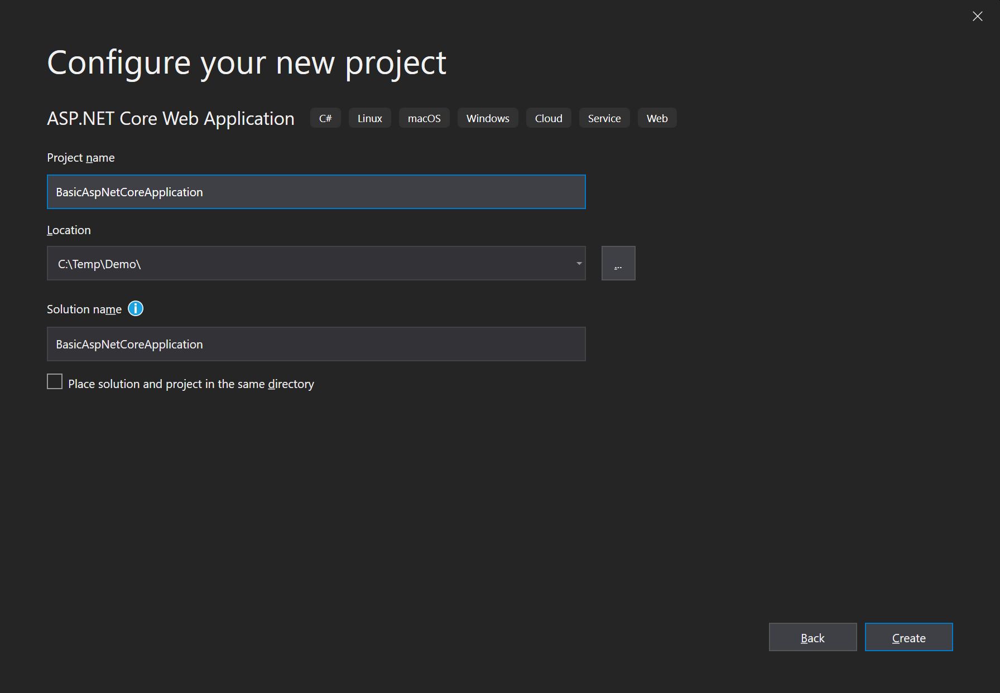

<div dir="rtl">
# شروع به کار با یک برنامه وب ABP و AspNet Core MVC

این آموزش نحوه شروع ABP را از ابتدا با حداقل وابستگی ها توضیح می دهد. شما معمولاً می خواهید با **[قالب راه اندازی](Getting-Started-AspNetCore-MVC-Template.md)** شروع کنید

## شروع کار با New Project

1. یک AspNet Core Web Application جدید با Visual Studio 2022 (17.0.0+):


2. پروژه جدید خود را پیکربندی کنید:



3. دکمه ایجاد را فشار دهید:


## نصب Volo.Abp.AspNetCore.Mvc پکیج

پکیج Volo.Abp.AspNetCore.Mvc یک AspNet Core MVC integration package برای ABP. میباشد پس آنرا نصب کنید:

````
Install-Package Volo.Abp.AspNetCore.Mvc
````

## ایجاد اولین ماژول ABP 

به یاد داشته باشید که ABP یک فریم ورک ماژولار میباشد که به کلاس پدر  **startup (root) module** احتیاج دارد ``AbpModule``:

````C#
using Microsoft.AspNetCore.Builder;
using Microsoft.Extensions.Hosting;
using Volo.Abp;
using Volo.Abp.AspNetCore.Mvc;
using Volo.Abp.Modularity;

namespace BasicAspNetCoreApplication
{
    [DependsOn(typeof(AbpAspNetCoreMvcModule))]
    public class AppModule : AbpModule
    {
        public override void OnApplicationInitialization(ApplicationInitializationContext context)
        {
            var app = context.GetApplicationBuilder();
            var env = context.GetEnvironment();

            // Configure the HTTP request pipeline.
            if (env.IsDevelopment())
            {
                app.UseExceptionHandler("/Error");
                // The default HSTS value is 30 days. You may want to change this for production scenarios, see https://aka.ms/aspnetcore-hsts.
                app.UseHsts();
            }

            app.UseHttpsRedirection();
            app.UseStaticFiles();
            app.UseRouting();
            app.UseConfiguredEndpoints();
        }
    }
}
````

``AppModule`` نام خوبی برای ماژول راه اندازی برای یک برنامه کاربردی است.

بسته های ABP کلاس های ماژول را تعریف می کنند و یک ماژول می تواند به دیگری وابسته باشد. در کد بالا ``AppModule`` وابسته به ``AbpAspNetCoreMvcModule`` (موجود در [Volo.Abp.AspNetCore.Mvc](https://www.nuget.org/packages/Volo.Abp.AspNetCore.Mvc) میباشد). بدیهی است که از کلمه ``DependsOn`` بعد از نصب یک ABP NuGet package استفاده شود.

به جای کلاس Startup، ما یک پایپ لاین ASP.NET Core را در این کلاس ماژول پیکربندی می کنیم.

## کلاس Program

مرحله بعدی اصلاح کلاس Program برای ادغام با سیستم ماژول ABP است:

````C#
using BasicAspNetCoreApplication;

var builder = WebApplication.CreateBuilder(args);

builder.Services.ReplaceConfiguration(builder.Configuration);

builder.Services.AddApplication<AppModule>();

var app = builder.Build();

app.InitializeApplication();

app.Run();
````

``builder.Services.AddApplication<AppModule>();`` تمام خدمات تعریف شده در همه ماژول ها را اضافه می کند ``AppModule``.

``app.InitializeApplication()`` برنامه را راه اندازی می کند و شروع می کند.

## برنامه را اجرا کنید!

همین! برنامه را اجرا کنید، همانطور که انتظار می رود کار می کند.

## استفاده از Autofac به عنوان سیستم Dependency Injection Framework

در حالی که سیستم Asp Net Core Dependency Injection (DI) برای نیازهای اولیه مناسب است, [Autofac](https://autofac.org/) ویژگی‌های پیشرفته‌ای مانند Property Injection و Method Interception را ارائه می‌کند که توسط ABP برای انجام ویژگی‌های چارچوب برنامه کاربردی پیشرفته مورد نیاز است.

جایگزینی سیستم Asp Net Core DI توسط Autofac و ادغام با ABP بسیار آسان است.

1. نصب [Volo.Abp.Autofac](https://www.nuget.org/packages/Volo.Abp.Autofac) 

````
Install-Package Volo.Abp.Autofac
````

2. اضافه کردن ``AbpAutofacModule`` وابستگی

````C#
[DependsOn(typeof(AbpAspNetCoreMvcModule))]
[DependsOn(typeof(AbpAutofacModule))] //Add dependency to ABP Autofac module
public class AppModule : AbpModule
{
    ...
}
````

3. تنظیمات `Program.cs` جهت استفاده از Autofac:

````C#
using BasicAspNetCoreApplication;

var builder = WebApplication.CreateBuilder(args);

builder.Host.UseAutofac();  //Add this line

builder.Services.ReplaceConfiguration(builder.Configuration);

builder.Services.AddApplication<AppModule>();

var app = builder.Build();

app.InitializeApplication();

app.Run();

````

## کد منبع

کد منبع پروژه نمونه ایجاد شده در این آموزش را از [اینجا](https://github.com/abpframework/abp-samples/tree/master/BasicAspNetCoreApplication).

</div>