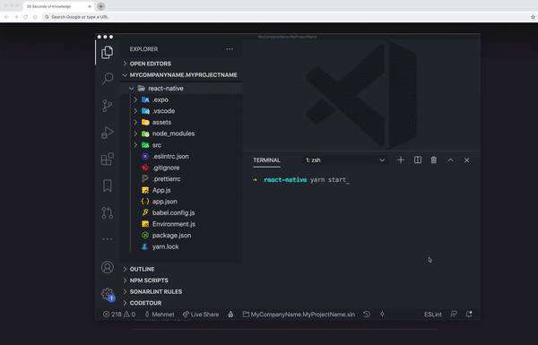
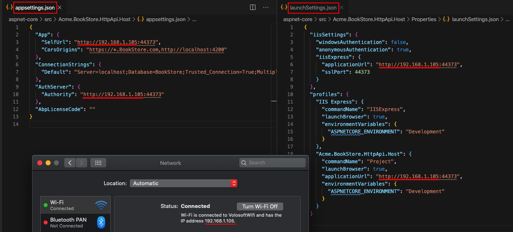
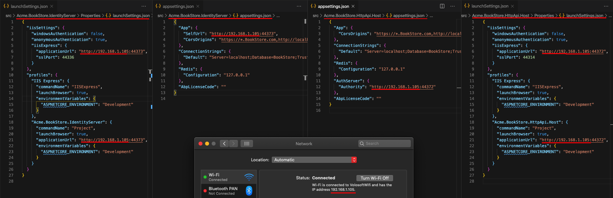
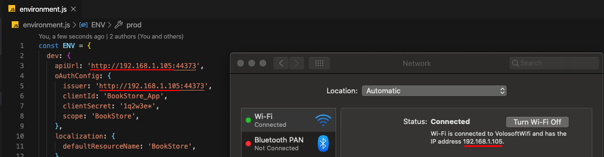
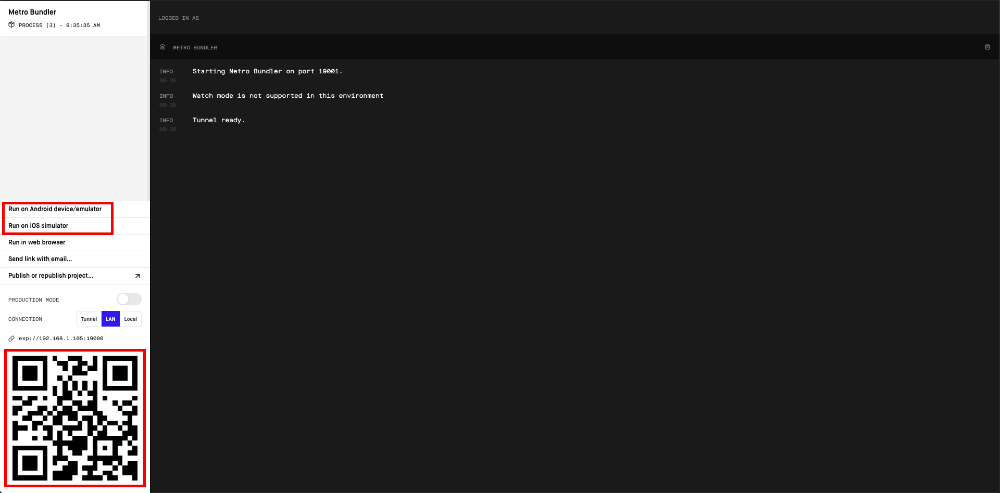
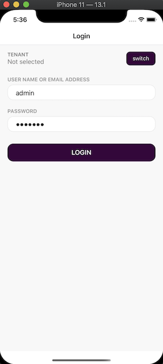

<div dir="rtl">
# آغاز کار با React Native

````json
//[doc-params]
{
    "Tiered": ["No", "Yes"]
}
````

فریم ورک ABP امکانات جهت ایجاد [React Native](https://reactnative.dev/) برای ساخت نرم افزار های مبتنی بر تلفن همراه را میدهد و میتواند **با زیر ساخت بک اند تعامل داشته باشد**.



## آماده سازی محیط توسعه

لطفاً مراحل زیر را دنبال کنید تا محیط توسعه خود را برای React Native آماده کنید.

1. **نصب Node.js:** با استفاده از [Node.js](https://nodejs.org/en/download/) و نصب نسخه مناسب Node.js v12 یا v14 بر روی سیستم عامل. و یا با استفاده از [NVM](https://github.com/nvm-sh/nvm) میتوانید نسخه های مختلفی از Node.js بر روی سیستم خود داشته باشید.
2. **[انتخابی] نصب Yarn:** میتوانید از Yarn نسخه ۱ استفاده کنید ولی دقت داشته باشید که نسخه ۲ نباید نصب شود. [صفحه مربوط به نصب](https://classic.yarnpkg.com/en/docs/install). Yarn v1 در مقایسه با npm v6 و پایین‌تر، تجربه توسعه‌دهنده بهتری را ارائه می‌دهد. می توانید این مرحله را رها کنید و به جای آن با npm که در Node.js داخلی است کار کنید.
3. **[انتخابی] نصب VS Code:** [VS Code](https://code.visualstudio.com/) is یک IDE رایگان و منبع باز که به طور یکپارچه با TypeScript کار می کند. اگرچه می توانید از هر IDE از جمله Visual Studio یا Rider استفاده کنید، VS Code به احتمال زیاد بهترین تجربه توسعه دهنده را در مورد پروژه های React Native ارائه می دهد.
4. **یک شبیه ساز نصب کنید:** برنامه های React Native برای اجرا بر روی سیستم عامل شما به یک شبیه ساز اندروید یا یک شبیه ساز iOS نیاز دارند. میتوانید [Android Studio Emulator](https://docs.expo.io/workflow/android-simulator/) و یا [iOS Simulator](https://docs.expo.io/workflow/ios-simulator/) را در سایت expo.io مطالعه نمایید و کاربرد آنها را بفهمید.


## چگونه یک پروژه جدید React Native را شروع کنیم

شما چندین گزینه برای شروع یک پروژه جدید React Native دارید که با ABP کار می کند:

### 1. استفاده از ABP CLI

استفاده از ABP CLI احتمالا راحت ترین و منعطف ترین راه برای شروع راه حل ABP با برنامه React Native است. [ABP CLI را نصب کرده](CLI.md) و دستور زیر را در ترمینال خود اجرا کنید:

```shell
abp new MyCompanyName.MyProjectName -csf -u <angular or mvc> -m react-native
```

> برای مشاهده گزینه های بیشتر در CLI، لطفاً از [راهنمای CLI](CLI.md) دیدن کنید.

این دستور یک سلوشن با **Angular** یا **MVC** (بستگی به انتخاب شما دارد)، یک **.NET Core** و یک پروژه **React Native** را در آن آماده می کند.

### 2. دانلود مستقیم

همچنین میتوانید [با استفاده از سایت به راحتی ABP.io](https://abp.io/get-started) یک نسخه بدون نیاز به کامند لاین دانلود و راه اندازی نمایید.

لطفا موارد زیر را انجام دهید:

1. روی تب "دانلود مستقیم" کلیک کنید.
2. فرم کوتاه پروژه خود را پر کنید.
3. بر روی دکمه "Create now" کلیک کنید.

and a customized download will start in a few seconds.

## نحوه پیکربندی و اجرای Backend

> برنامه React Native به گواهی HTTPS .NET که به طور خودکار تولید می شود اعتماد ندارد. در طول توسعه باید از **HTTP** استفاده کنید.

یک برنامه React Native که روی شبیه‌ساز اندروید یا تلفن فیزیکی اجرا می‌شود **نمی‌تواند به backend** در "localhost" متصل شود. برای رفع این مشکل، لازم است برنامه Backend را روی **آدرس IP محلی** خود اجرا کنید.

{{ if Tiered == "No"}}


* ابتدا `appsettings.json` را در `HttpApi.Host` باز کنید. آدرس `localhost` مربوط به `SelfUrl` و `Authority` وجود دارد را با IP address جایگزین نمایید.
* فایل `launchSettings.json` در `HttpApi.Host/Properties` باز کنید. و آدرس `localhost` که در `applicationUrl` وجود دارد با IP address جایگزین نمایید.

{{ else if Tiered == "Yes" }}



* ابتدا `appsettings.json` را در `.IdentityServer` باز کنید. آدرس `localhost` مربوط به `SelfUrl` را با آدرس لوکال جایگزین نمایید IP address.
* فایل `launchSettings.json` در `.IdentityServer/Properties` باز کنید. و آدرس `localhost` موجود در `applicationUrl` را با IP address محلی خود جایگزین نمایید.
* ابتدا `appsettings.json` را در `.HttpApi.Host` باز کنید. آدرس `localhost` موجود در `Authority` را با IP address محلی خود جایگزین نمایید.
* ابتدا `launchSettings.json` در `.HttpApi.Host/Properties` باز کرده. و آدرس `localhost` موجود در `applicationUrl` را با IP address محلی خود جایگزین نمایید.

{{ end }}

برنامه Backend را همانطور که در [توضیحات این مستند](Getting-Started.md) آمده است اجرا نمایید.


## نحوه پیکربندی و اجرای React Native Application

1. ابتدا اطمینان داشته باشید که [database migration کامل شده باشد](./Getting-Started?UI=NG&DB=EF&Tiered=No#create-the-database) و همچنین [API اجرا و راه اندازی شده](./Getting-Started?UI=NG&DB=EF&Tiered=No#run-the-application).
2. پوشه `react-native` را باز کرده و `yarn` یا `npm install` اجرا نمایید.
3. فایل `Environment.js` در پوشه `react-native` باز کرده و آدرس `localhost` موجود در `apiUrl` و `issuer` را با آدرس خود جایگزین نمایید همانند تصویر زیر:



{{ if Tiered == "Yes" }}

> اطمینان حاصل کنید که `issuer` با آدرس `.IdentityServer` همخانی داشته باشد, `apiUrl` به آدرس مربوط به `.HttpApi.Host` و یا `.Web` همخانی داشته باشد.

{{else}}

> اطمینان حاصل کنید که `issuer` و `apiUrl` با آدرس مربوط به `.HttpApi.Host` و `.Web` همخانی داشته باشد.

{{ end }}

4. دستور `yarn start` یا `npm start`. اجرا کرده و منتظر اکسبو باشید. Expo CLI صفحه مدیریت را در آدرس `http://localhost:19002` اجرا خواهد نمود.

> برنامه React Native با استفاده از [Expo](https://expo.io/) تولید شد. Expo مجموعه‌ای از ابزارهایی است که پیرامون React Native ساخته شده‌اند تا به شما کمک کنند تا به سرعت یک برنامه را راه‌اندازی کنید و در عین حال ویژگی‌های زیادی دارد.



در رابط مدیریتی فوق، می توانید برنامه را با شبیه ساز اندروید، شبیه ساز iOS یا یک گوشی فیزیکی با اسکن کد QR با [Expo Client](https://expo.io/tools#client) استفاده نمایید.



کلمه **admin** به عنوان نام کاربری و **1q2w3E*** به عنوان رمز ورود استفاده نمایید

برنامه در حال اجرا است. شما می توانید به توسعه برنامه خود بر اساس این قالب راه اندازی ادامه دهید.


## اطلاعات بیشتر

* [ساختار پروژه React Native](./Startup-Templates/Application#react-native)
</div>